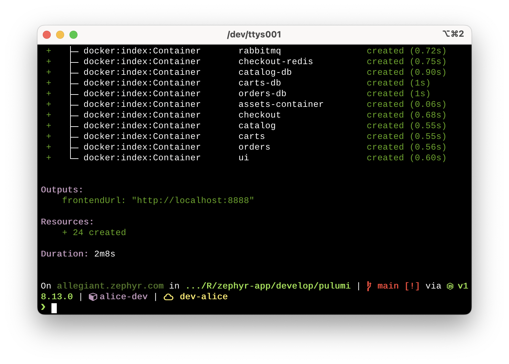
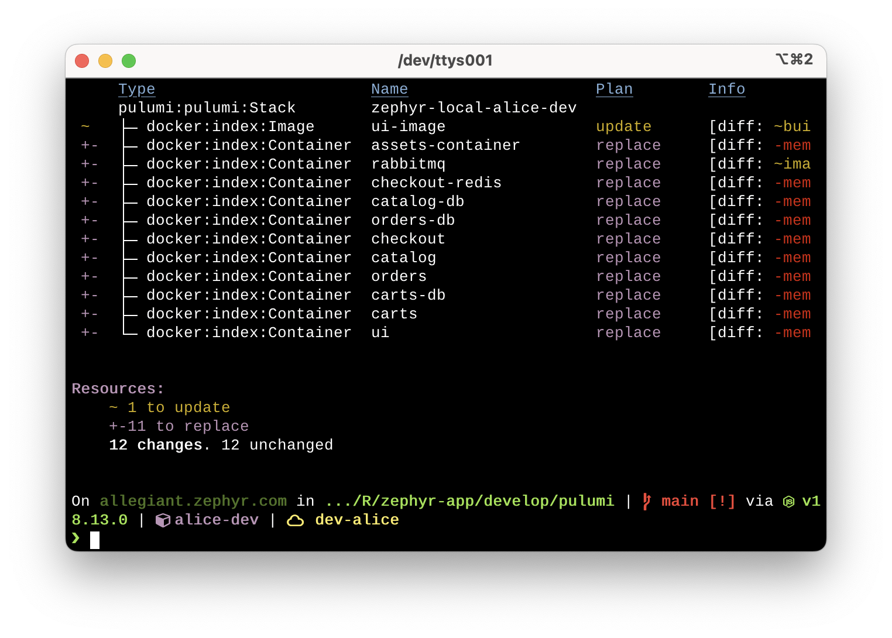
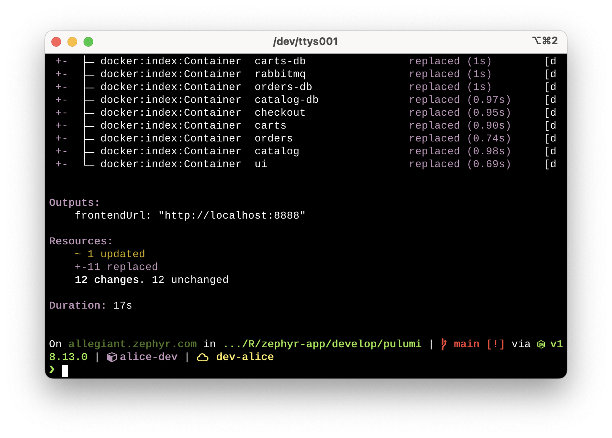

If you've been following along with our [IaC Recommended Practices series](https://www.pulumi.com/blog/iac-recommended-practices-code-organization-and-stacks/), then you're already familiar with Zephyr Archaeotech Emporium, the fictional company at the center of the series. Today, you'll get an inside look at how Zephyr starts using Pulumi for locally testing the application code for their online store and accelerating the inner dev loop for their development team.

<!--more-->

In the event you're not familiar with the term "inner dev loop," it's used to describe the iterative code/build/test loop that every developer goes through to write code and verify that it works _before_ they push their code to version control to be reviewed and merged. Speeding up the inner dev loop makes it possible for developers to iterate on their code more quickly, reducing the time spent waiting on tools or environments.

Structured as a conversation between two employees at Zephyr---Alice, a developer on the team for Zephyr's online store application, and Bob, a member of Zephyr's platform engineering team---this post shows one way to use Pulumi to help accelerate the inner dev loop. Let's listen in...

## Listening in at Zephyr HQ

In a conversation at Zephyr HQ between Bob and Alice one day, Bob commented, "I'm really enjoying Pulumi. It's nice for the platform team to be able to use TypeScript to define all the infrastructure we need."

"Or to deploy our application onto that infrastructure," Alice responded. "I just wish there was a way to speed up testing changes to our code."

"Do you mean testing the Pulumi code?"

"No, no, I was talking about our application code---the code for the online store."

"Oh, what's wrong with the current way it's handled? Is there something we can do better?"

Alice paused. "Well, don't get me wrong, the way we use [per-developer stacks](/blog/iac-recommended-practices-developer-stacks-git-branches/) makes it super easy for me to deploy an entire copy of our environment. The problem is that...well, it takes a fair amount of time to create all the AWS stuff. Sometimes I just need something faster, just to test some quick changes to the code before deploying the app to my dev stack."

Bob nodded thoughtfully. "I see. You know, Pulumi has a Docker provider; in fact, they recently released [a new version of their Docker provider](/blog/build-images-50x-faster-docker-v4/)."

Alice's eyes lit up. "So, you mean I can automate my local Docker instance using Pulumi?"

"Yeah, why?"

Alice smiled. "I have an idea."

## Using Pulumi for the inner dev loop

A couple days later, Alice contacted Bob and said, "I want to show you what I've come up with."

{}
To see the code that Alice created for local testing of the Zephyr online store with Pulumi, visit [the zephyr-app repository](https://github.com/pulumi/zephyr-app/) and look at the [`blog/inner-dev-loop`](https://github.com/pulumi/zephyr-app/tree/blog/inner-dev-loop/) branch.
{}

When Bob met up with Alice, Alice showed him a TypeScript program she'd written with Pulumi's Docker provider that automates building and deploying the Zephyr online store to a local Docker daemon.

"With this code," Alice explains, "I can just run `pulumi up` and it will deploy the entire Zephyr online store locally, all in just a few minutes. Here, let me just run `pulumi up` real quick."

"But why use this instead of Docker Compose?"

"Oh, there's absolutely nothing wrong with Docker Compose; it's a great tool!" Alice replied. "But this allows me to work with TypeScript, and to build logic into my Pulumi program. Like this feature here---I can specify whether I want to build a container, or use the released version of a container."

"See, at the top I have the Pulumi program check for a configuration value that I set using `pulumi config set`. If the value isn't set, it defaults to `build`."

```typescript
// Get configuration values
const config = new pulumi.Config();
const srcRepoPath = config.get("srcRepoPath") || "../..";
const assetsFlag = config.get("assetsFlag") || "build";
const cartsFlag = config.get("cartsFlag") || "build";
const catalogFlag = config.get("catalogFlag") || "build";
const checkoutFlag = config.get("checkoutFlag") || "build";
const ordersFlag = config.get("ordersFlag") || "build";
```

"There's one for each service in the online store?" Bob asked.

"Right, except for the UI service, which is always built. This is so I can independently test changes to only a specific service. Farther down, the Pulumi code checks for this value and then either builds the container---pulling in whatever changes I've made---or uses an already released version of the container."

```typescript
// Build the assets image or pull remote image, depending on value of assetsFlag
var assetsImageRef: pulumi.Input<string>;
if (assetsFlag == "build") {
    const assetsImage = new docker.Image("assets-image", {
        build: {
            context: `${srcRepoPath}/src/assets`,
            dockerfile: `${srcRepoPath}/src/assets/Dockerfile`,
            platform: imagePlatform,
        },
        imageName: "zephyr-assets:latest",
        skipPush: true,
    }, { retainOnDelete: true });
    assetsImageRef = assetsImage.id;
} else {
    const assetsRegistryImage = docker.getRegistryImage({
        name: "public.ecr.aws/aws-containers/retail-store-sample-assets:0.2.0",
    });
    const assetsRemoteImage = new docker.RemoteImage("assets-image", {
        name: assetsRegistryImage.then(assetsRegistryImage => assetsRegistryImage.name),
        pullTriggers: [assetsRegistryImage.then(assetsRegistryImage => assetsRegistryImage.sha256Digest)],
    }, { retainOnDelete: true });
    assetsImageRef = assetsRemoteImage.repoDigest;
};
```

{}
You can see that the released container image is hard-coded in this example. You could also pass this in as a configuration value to allow the Pulumi program to more easily account for new releases.
{}

"By setting the flag for the assets service to `build` and all the other services to something else---the code only builds if the value is set to `build`---then I can isolate changes made to that service for testing, to be sure I haven't broken something elsewhere."

"That seems useful."

"Indeed! And you can see here that we are building a Docker network for these containers; this is what enables connectivity between the various parts of the online store when it's running locally via Docker."

```typescript
// Create a network
const network = new docker.Network("network", {
    name: "zephyr-net",
});

// Create an assets container
const assetsContainer = new docker.Container("assets-container", {
    capabilities: {
        drops: ["ALL"],
    },
    envs: [
        "PORT=8080",
    ],
    hostname: "assets",
    image: assetsImageRef,
    memory: 64,
    name: "assets",
    networksAdvanced: [
        {
            name: network.name,
        },
    ],
    restart: "always",
});
```

Bob nodded. "Yep, this all makes sense. Interesting, I hadn't really considered Pulumi for this particular use case. Usually when folks mention Pulumi the first thought in my head is provisioning cloud infrastructure."

"Oh, certainly, and it works really well for that---but it also works really well for this case, too."

"And since we are already using Pulumi for deploying to Kubernetes in test and production, then this brings some consistency across environments. It's just a `pulumi up` regardless of whether you're running the app locally or publishing to a Kubernetes cluster in your per-developer stack, the test stack, or even the prod stack."

"Exactly. Oh, look here. It's done. Looks like it took just over two minutes, and now our online store app is available at this URL on `localhost`."



"That's pretty fast."

Alice nodded. "Yeah, a lot faster than waiting on a Kubernetes cluster to provision. We still need to run this in our dev stacks to be sure that it runs in an environment that closely mirrors production, but for quick feedback on changes I make this is very useful for me as a developer."

"So if you make a change to the code and want to see the results, what's that look like?"

"Here, let's do it real quick." Alice switches to her code editor, makes a few changes, and then flips back to the terminal. "I'll run a `pulumi preview` so you can see what it's going to do."



Alice pointed to the terminal output. "Here, Pulumi has recognized that the source code for this container has changed, and so it is replacing the container image, and restarting all the containers. Let me run `pulumi up`."

Bob watches as the operation completes in about 17 seconds.



"Wow, that's really fast!"

"Exactly, Bob. That's what makes using Pulumi for this use case so helpful. While it doesn't eliminate the need for our per-developer stacks, it gives developers a way to quickly see changes we're making to the source code in very little time. When we are satisfied that the changes are working as we expect, then we can deploy to our dev stack to be sure that the changes are ready to work their way to production."

## Try this out yourself

Now that you've seen how Alice uses Pulumi to streamline testing the Zephyr online store's application code locally, feel free to try this out yourself! The code that you saw in this blog post is available [in the `zephyr-app` repository on GitHub](https://github.com/pulumi/zephyr-app/). Just select the [`blog/inner-dev-loop`](https://github.com/pulumi/zephyr-app/tree/blog/inner-dev-loop/) branch and go to the `develop/pulumi` folder.
