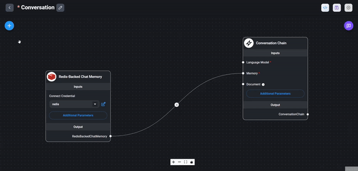
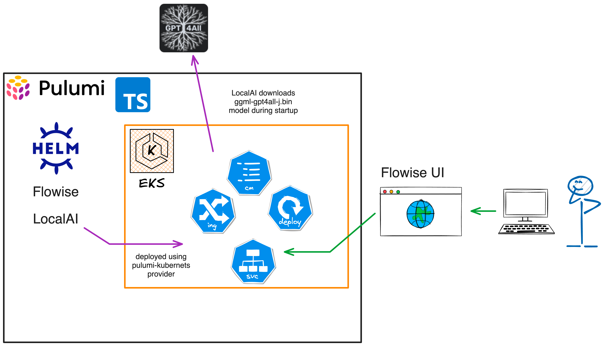
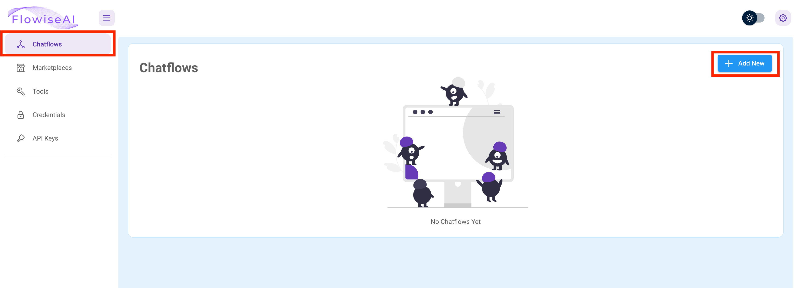
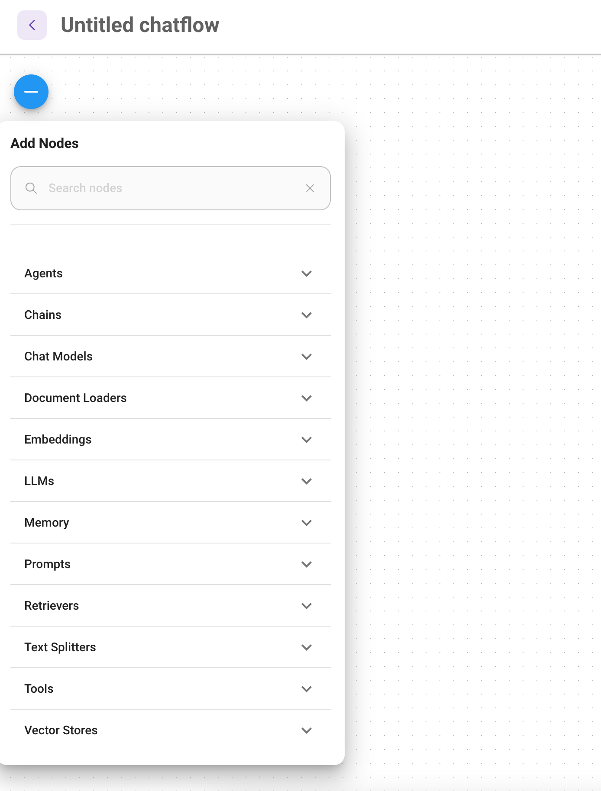
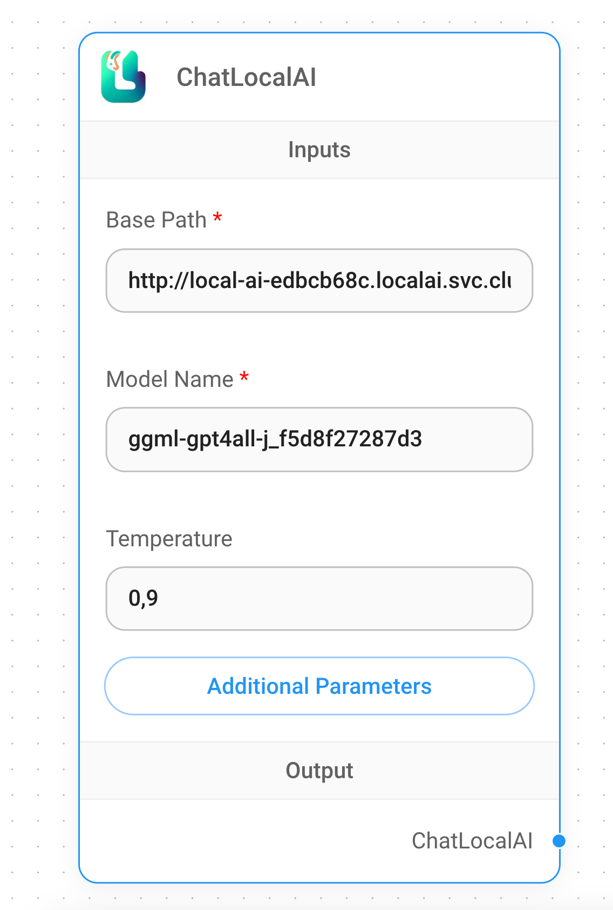
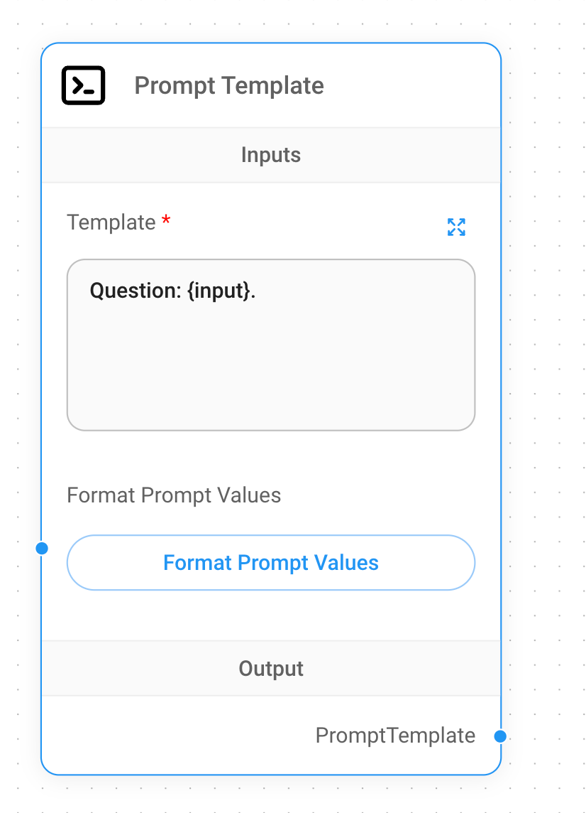
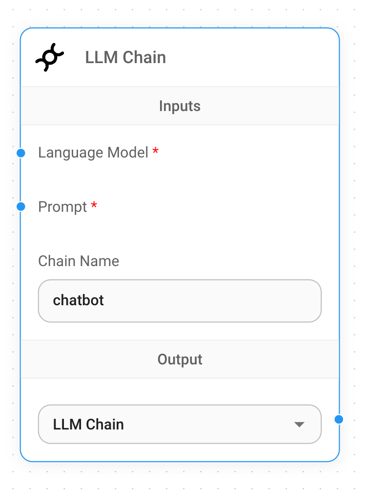
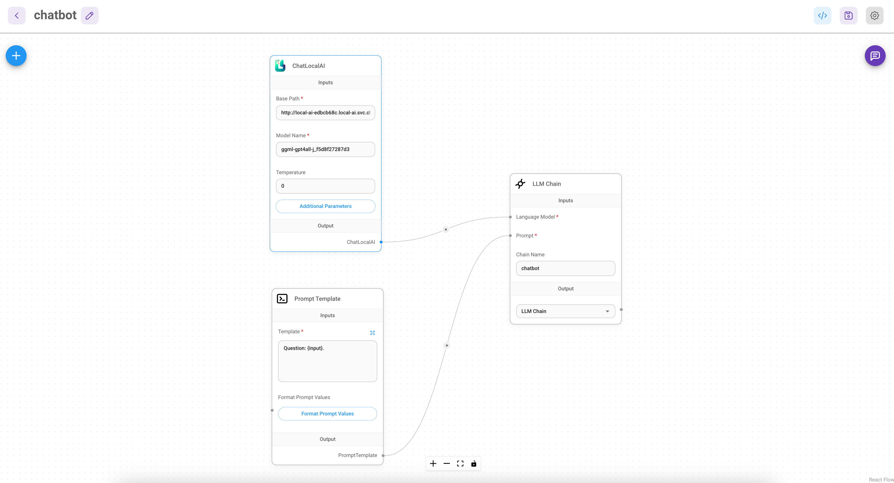
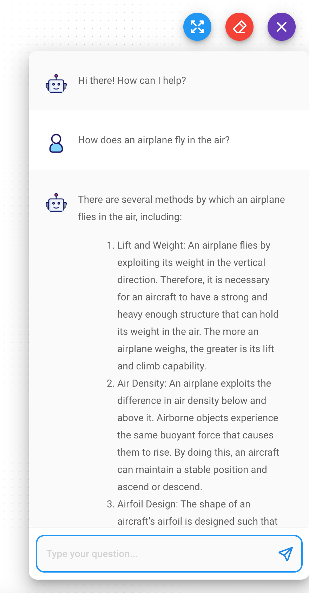
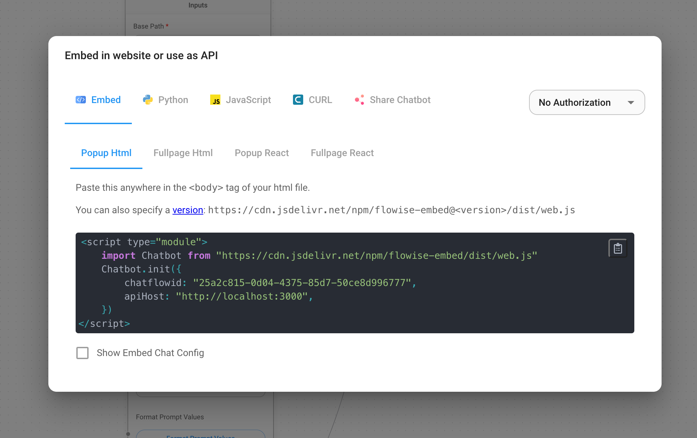

In a previous [blog post](/blog/easy-ai-apps-with-langserve-and-pulumi) from me, we discussed how easy it is to build
your [🦜️🔗 LangChain](https://github.com/langchain-ai/langchain) LLM application and use [🦜️🏓
LangServe](https://github.com/langchain-ai/langserve) and Pulumi to deploy it on an AWS Fargate cluster. We even went a
step further and deployed a Pinecone index,
all in a few lines of [Pulumi](https://www.pulumi.com/) code, to provide a vector store for our LLM application.

Let me walk you this time a different path on creating a LLM applications. This LLM-powered
application is using [Flowise](https://flowiseai.com/), a low-code/node drag & drop tool to visualize and build our LLM
application and LocalAI.
[LocalAI](https://localai.io/) is a local inference engine that allows us to run LLMs locally or on-prem with consumer
grade hardware.
Everything will be deployed on an [AWS](https://aws.amazon.com/) EKS cluster using Pulumi and TypeScript.

## What is Flowise?



Flowise is an open-source low-code/node tool for developers to build customized LLM orchestration workflows and AI
agents. The low-code approach helps developers to cut down on the time and effort required to build LLM applications by
delivering quick iterations to from testing to production. In Flowise nodes are referred to as integrations, and you can
build a customized LLM orchestration flow, chatbot, or AI agent by dragging and dropping these integrations. There are
plenty of ready-to-use integrations available in Flowise, like LangChain or [LlamaIndex](https://www.llamaindex.ai/).

## What is LocalAI?


LocalAI is a free and Open Source alternative to OpenAI. It acts as a drop-in replacement for OpenAI's REST API that is
fully compatible with the OpenAI API specifications for local inference. It allows you to run LLMs, generate images, or
audio locally or on-prem with consumer grade hardware supporting multiple model families and architectures. And the
clue: It does not require a GPU, it runs on CPU only (optional GPU acceleration is still available).

Once LocalAI loaded the model the first time, it keeps it in memory for faster inference. It does not shell-out, but use
bindings to the model for faster inference and better performance. It is a great way to test and benchmark different
models directly on your local machine or on-prem. Additionally, you are not sending your data to a third-party service,
which may contain sensitive information. This is a big advantage, especially in large enterprises or in the public
sector where data privacy is a big concern.

## Getting Started

Covered a lot of the basics, but let's get started with the real thing. To quickly get started, you can use the example
project from the Pulumi examples repository.

The AWS architecture of the example project is as follows:



The Pulumi AWS architecture consists of the following resources:

- An EKS cluster with a managed node group.
- [EBS volume](https://docs.aws.amazon.com/AWSEC2/latest/UserGuide/ebs-volumes.html) support for the [EKS](https://aws.amazon.com/eks/) cluster to store the downloaded LocalAI models.
- Deployment of the Helm chart for Flowise and LocalAI.
- A VPC, two subnets in different availability zones, and an internet gateway, and security groups for the EKS cluster.

As programming language, I will use TypeScript, but you can use any other language supported by Pulumi. Rewriting the
example code should be straightforward. Feel free to reach out to us if you need help.

### Create a Flowise Chatbot

Our first Flowise workflow will be a simple chatbot. This simple LLM chain will be stateless (no memory) with a prompt
template and our LocalAI LLM model attached.

#### Deploy the Infrastructure with Pulumi

First clone the [example repository](https://github.com/pulumi/examples/), and head to the `aws-ts-localai-flowise`
directory:

```bash
git clone https://github.com/pulumi/examples.git
cd examples/aws-ts-localai-flowise
```

To deploy the infrastructure with Pulumi, you can use the following command:

```shell
pulumi login # if you haven't logged in yet
pulumi up
```

Next to the definition of the AWS EKS cluster, the Pulumi program uses the `pulumi-kubernetes` provider to deploy the
Helms charts for Flowise and LocalAI.

```typescript
// imports omitted for brevity
import * as k8s from "@pulumi/kubernetes";

// code omitted for brevity

// Manually creation of the Kubernetes provider, with the kubeconfig from the EKS cluster and the enableServerSideApply set to true
const provider = new k8s.Provider("k8s", {
    kubeconfig: cluster.kubeconfigJson,
    enableServerSideApply: true,
});

// Deploy the Helm charts for LocalAI
const localai = new k8s.helm.v3.Release("local-ai", {
    chart: "local-ai",
    version: "3.2.0",
    repositoryOpts: {
        repo: "https://go-skynet.github.io/helm-charts",
    },
    forceUpdate: true,
    namespace: "local-ai",
    createNamespace: true,
    values: {
        deployment: {
            image: {
                repository: "quay.io/go-skynet/local-ai",
                tag: "latest",
            },
            env: {
                debug: "true",
                context_size: 512,
                modelsPath: "/models",
            },
        }, resources: {
            requests: {
                cpu: "8",
                memory: "32Gi",
            },
        },
        models: {
            list: [
                {
                    url: "https://gpt4all.io/models/ggml-gpt4all-j.bin",
                    name: "ggml-gpt4all-j",
                },
            ],
        },
        persistence: {
            models: {
                size: "50Gi",
                storageClass: "gp2",
                accessModes: "ReadWriteOnce",
            },
            output: {
                size: "10Gi",
                storageClass: "gp2",
                accessModes: "ReadWriteOnce",

            },
        },
    },
}, {
    provider: provider,
});

// Deploy the Helm charts for Flowise
const flowise = new k8s.helm.v3.Release("flowise", {
    chart: "flowise",
    version: "2.5.0",
    repositoryOpts: {
        repo: "https://cowboysysop.github.io/charts/",
    },
    namespace: "flowise",
    createNamespace: true,
}, {
    provider: provider,
});
```

Depending on your AWS region, the deployment can take a few minutes. Once the deployment is complete, you will have
access to `kubeconfig` file to access the EKS cluster for the next steps.

To retrieve the kubeconfig file, you can use the following command:

```shell
pulumi stack output kubeconfig --show-secrets > kubeconfig.yaml
```

Now you can use the `kubeconfig.yaml` file either with `kubectl` or with the `KUBECONFIG` environment variable to access
the EKS cluster.

{}
As we are not using a load balancer, we will use the `kubectl port-forward` command to access the Flowise UI. The
command is:

```shell
kubectl port-forward svc/$(kubectl get svc -n flowise | grep flowise | awk '{print $1}') 3000:3000 -n flowise
```

{}

#### Start modeling the Chatbot with Flowise

Open the Flowise UI in your browser with the following URL: [http://localhost:3000](http://localhost:3000) and click
the `Chartflows` menu item in the left sidebar. And then click the blue button `+ Add New`



This should open a new window where you can drag and drop the nodes to the main window. To display
the available nodes, click the `+` button on the left.



First we add our LocalAI node to the chartflow. Look under `Chat Models` for the ChatLocalAI node and drag it to the
main canvas.

Fill out the form with the following values:



- Base Path: This should be name ouf your `LocalAI` Kubernetes service. You can find it with the following command:

  ```shell
  kubectl get svc -n local-ai
  ```

  And should be in the form of `http://<svc-name>.local-ai.svc.cluster.local:80`

- Model Name: The name of the model you want to use. You can find the available models with the following command:

  ```shell
  kubectl exec -it $(kubectl get pods -n local-ai | grep local-ai | awk '{print $1}') -n local-ai -- curl http://localhost:8080/models | jq '.data[0].id'
  ```

  This will return the name of the model you can use. For example `ggml-gpt4all-j_f5d8f27287d3`

- Temperature: The temperature of the model. This is a float value between 0 and 1. The higher the value, the more
  creative the model will be. The lower the value, the more conservative the model will be. Keep the default value of
  `0.9` for now.

Now we can add the next node to our workflow. Search for `Prompt Template` and drag this node to the main canvas as
well. You can fill out the `Template` field with the following value:

```text
Question: {input}.
```



As a last step we need to add the `LLM Chain` node to the workflow. Head over to the `Chains` section of our nodes
menu and drag the `LLM Chain` node to the main canvas. Give the chain a name `chatbot`.



This done, we can start to connect different nodes to each other. Start with the `Prompt` and `Language Model` nodes by
dragging the arrow from the `Language Model` dot to the `ChatLocalAI` node. Same for the `Prompt` dot to
the `Prompt Template` node.



Now we can save the chartflow and test it. Click the `Save` icon in the top right corner and then click the `Dialog`
button to display the chatbot. You can now test the chatbot by typing a question in the input field and see the
response. In my case, I asked the chatbot `How does an airplane fly in the air?` and got the following response:

```text
There are several methods by which an airplane flies in the air, including:

Lift and Weight: An airplane flies by exploiting its weight in the vertical direction. Therefore, it is necessary for an aircraft to have a strong and heavy enough structure that can hold its weight in the air. The more an airplane weighs, the greater is its lift and climb capability.
Air Density: An airplane exploits the difference in air density below and above it. Airborne objects experience the same buoyant force that causes them to rise. By doing this, an aircraft can maintain a stable position and ascend or descend.
Airfoil Design: The shape of an aircraft’s airfoil is designed such that it allows for the efficient and effective generation of lift force. The shape, thickness and angle control the air flow over the wings of an aircraft.
Control Arm: The control bar controls the angle of attack, pitch and yaw control. By moving the bar, pilots can change and adjust these features of the aircraft.
Propulsion Systems: An airplane requires propulsion systems to provide the thrust needed for takeoff, climb and movement through the air. Engines such as piston, turbojet, diesel engine or rocket engines are commonly used. The combustion process in these systems produces heat, which provides thrust.
Radio Communication: Aircraft can communicate with air traffic control in real-time, allowing pilots and air traffic controllers to coordinate their actions. This communication is essential for safe and efficient air travel.
```



Go ahead and test your chatbot with different questions! It is a great way to test different LLM models and see how they
behave.

#### Expose the Chatbot via API

If you want to expose the chatbot workflow via API or SDK, you can use Flowise for this as well. Flowise provides a REST
API for this purpose. Head in your workflow view to the top right corner and click the `</>` button. This will open a
new dialog with all the different methods you can use. This range from embedding the chatbot in your website to using to
directly call the REST API.



There is even the option to enable authorization for the REST API. This is a great way to secure your chatbot and only
allow authorized users to access it.

#### Housekeeping

If you want to destroy the stack, you can use the following command:

```shell
pulumi destroy
```

The Pulumi CLI will ask you to confirm the changes, and if you are happy with the changes, you can confirm them by
typing `yes` and all the resources will be deleted.

## In Conclusion

In this blog post, we have seen how easy it is to build a LLM application with Flowise and LocalAI without the need to
use any code. This is a great way to quickly prototype and test different LLM models and workflows. We have also seen
how easy it is to deploy the infrastructure with Pulumi and how easy it is to destroy the stack if we don't need it
anymore.

{}

Want to get hands on with LangServe and walk through it live? We have two upcoming dates for a workshop focused on
LangChain and LangServe!

- [Deploying LangChain Applications on AWS with Pulumi](https://www.pulumi.com/resources/deploying-langchain-applications-on-aws-with-pulumi)
  on March 14, 2024
- [Deploying LangChain Applications on AWS with Pulumi](https://www.pulumi.com/resources/deploying-langchain-apps-on-aws-with-pulumi)
  again on April 17, 2024

{}

As always, we welcome your feedback and contributions in
the [Pulumi Community Slack](https://slack.pulumi.com/), [GitHub repository,](https://github.com/pulumi/pulumi)
and [Pulumi Community Discussions](https://github.com/pulumi/pulumi/discussions).

New to Pulumi? Signing up is easy and free. [Get started today](/docs/get-started/)!

Happy AI building!
