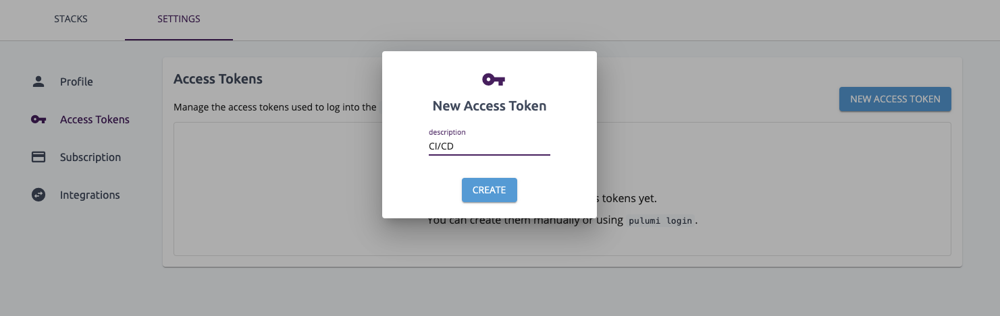

Continuous delivery requires providing highly sensitive credentials to your deployment pipeline. Understanding the risks, mitigations, and best practices for handling those credentials can be difficult. In this guide, we describe the best practices for providing AWS credentials to a CI/CD system and to securely automate updating your cloud infrastructure using Pulumi.

<!--more-->

You’ve heard about *Infrastructure as Code* and decided to try your hand at using Pulumi to manage cloud infrastructure using real programming languages. Naturally, you’re curious and eager to start updating your cloud infrastructure in your CI/CD pipeline – but then panic hits. Is updating your cloud infrastructure secure? If you start doing cloud deployments in your CI/CD system, doesn’t that mean you need to give it your production credentials? Aren’t those the most sensitive things your company has?

Take a deep breath. It’s going to be OK. You can securely provide AWS credentials to your CI/CD system and practice continuous delivery. This post covers all the things you need to know to do it.

The goal of this article is to have a clear understanding of how to properly use Pulumi to update AWS infrastructure within a hosted CI/CD service like [CircleCI](https://circleci.com), [GitLab CI](https://about.gitlab.com/product/continuous-integration/), or [Travis CI](https://travis-ci.org).

> **NOTE:** These recommendations do not apply if you are running your own CI/CD system within your AWS account, e.g., running a Jenkins server on an EC2 instance or using [AWS CodeDeploy](https://aws.amazon.com/codedeploy/). AWS provides recommended methods to [assume IAM Roles from applications running on an EC2 instance](https://docs.aws.amazon.com/IAM/latest/UserGuide/id_roles_use_switch-role-ec2.html). In that case, refer to the documentation specific to your CI/CD system for how to handle AWS credentials.

Depending on your specific environment, needs, and constraints, there may be a better approach for you to take. These recommendations describe a general “one-size fits most” approach that requires a minimal amount of work to configure and maintain.

The approach includes the following:

- Create a dedicated IAM User for your CI/CD
- Provide the IAM User’s credentials to your CI/CD system
- Automate rotating and revoking that user’s credentials
- During deployments, exchange the IAM User credentials for more privileged IAM Role credentials

The process may sound complicated, but we’ll cover each step in detail.  We’ll point out additional ways to enhance your security, such as using Pulumi’s support for client-side encryption to limit access to sensitive information.

## Create a dedicated IAM User for your CI/CD

The first step for securely automating CI/CD on AWS is to create a dedicated IAM User for use in your CI/CD pipelines.

By default, a new IAM User does not have any permissions associated with it, meaning it can only authenticate itself with its access key and secret. Let’s walk through how to grant this IAM User the permissions necessary to update your cloud infrastructure later. For now, we limit this user to have as little access as possible.

The following code snippet shows how to create an IAM User specifically for your CI/CD jobs. 

```ts
// First create the user
// ... probably want to give it a name and tag, right?
const user = new aws.iam.User("cicdUser", {
    name: "cicd-bot",
    tags: {
        "purpose": "Account for performing deployments for jobs running on <your CI/CD service>",
    },
);
```

Next, create a role policy to attach the IAM user to grant them permissions through the `sts:AssumeRole` action.

```ts
const role = new aws.iam.Role("cicdRole", {
    assumeRolePolicy: JSON.stringify({
        Version: "2012-10-17",
        Statement: [{
            Action: "sts:AssumeRole",
            Principal: {
                Service: "ec2.amazonaws.com"
            },
            Effect: "Allow",
            Sid: ""
        }]
    })
});

const policy = new aws.iam.Policy("cicdPolicy", {
    policy: JSON.stringify({
        Version: "2012-10-17",
        Statement: [{
            Action: [
              "ec2:Describe*"
            ],
            Effect: "Allow",
            Resource: "*"
        }]
    })
});

const rolePolicyAttachment = new aws.iam.RolePolicyAttachment("myrolepolicyattachment", {
    role: role,
    policyArn: policy.arn
});
```

AWS recommends that role policies are attached to groups and not users.

```ts
// Create a group
const group = new aws.iam.Group("cicdBots");

// Attach the policy
const policyAttachment = new aws.iam.PolicyAttachment("cicdPolicyAttachment", {
    users: [user],
    groups: [group],
    roles: [role],
    policyArn: policy.arn
});
```

### Isolating with Different Accounts

A common and recommended practice is to use multiple AWS accounts to isolate resources and users from one another. For example, if your testing and production environments are in different AWS accounts, it would be difficult for a severe bug in the testing environment to harm your customer data.

It isn't a requirement that the IAM User that deploys your infrastructure is in the same AWS account that the cloud resources are located in. For example, it is possible for the IAM User in your "testing" account to perform a deployment of the application housed in your "production" environment. Keep this in mind as we configure this IAM User and later grant them IAM Roles to perform cloud deployments. 

## Provide that IAM user’s credentials to your CI/CD system

Now that we have created an IAM user account, we need to give those credentials to the CI/CD system so they can be used to make changes to infrastructure as needed.

We need to take great caution here. [AWS’s documentation](https://docs.aws.amazon.com/IAM/latest/UserGuide/id_credentials_access-keys.html) states, **“Do not provide your access keys to a third party.”**

Providing AWS access keys to any system is dangerous because of the risk that a bad actor could acquire those keys to do something nefarious. Even if you do trust your CI/CD service provider to store these credentials properly, the keys could be inadvertently exposed in debugging output, system logs, or some other place they could be disclosed.

However, if you want to automate changes to your AWS infrastructure from a 3rd party CI/CD service, you must provide those credentials. The next step is to take the credentials for the IAM user we created earlier, and enter those into your CI/CD system so that they are available during the next build. Here is where security best practices come into play.

If we do need to provide credentials to a 3rd party, rather than hoping it will be 100% secure forever (which is impossible), we can instead make those credentials volatile. If we regularly invalidate and rotate the credentials given supplied to CI/CD system, we can dramatically reduce the impact of any accidental disclosure. Since even if the IAM User’s credentials were leaked, by the time they were discovered and used, they would no longer be valid. We’ll go into how to manage key rotation shortly.

### Properly Storing Credentials

While key rotation may thwart a compromised credential, we still need to take precautions to ensure that they are correctly stored.

Your CI/CD provider likely has built-in support for handling “secrets” or “secure variables.” Typically these are user-supplied configuration values that are write-only and only accessible by the CI/CD worker jobs at runtime. For example, Travis CI has [encrypted environment variables](https://circleci.com/docs/2.0/env-vars/#overview) or [secure environment variables](https://circleci.com/docs/2.0/env-vars/#overview) in CircleCI.

## Automate Rotating and Revoking those Credentials

When a CI/CD system has access to an IAM User’s AWS credentials, we need to take steps to rotate those credentials regularly, even if we trust the CI/CD provider to secure them properly.

This is one of the advantages of running your CI/CD system within your AWS account. If your deployment workers are EC2 instances, you wouldn’t need to share IAM User credentials. The EC2 instances [can be configured to assume an IAM Role](https://aws.amazon.com/blogs/security/new-attach-an-aws-iam-role-to-an-existing-amazon-ec2-instance-by-using-the-aws-cli/). The details about how IAM Roles are a more secure alternative to IAM User credentials are covered in the next section.

“Just create a new IAM User credential, log into the CI/CD system, and then update the job’s settings” sounds simple enough. But it’s likely going to be tedious, and if you need to repeat the process for dozens if not hundreds of CI/CD pipelines, you need a better solution. Unless you start with an automated approach for key rotation, you are unlikely to add one later.

The AWS security blog describes how to [rotate access keys for IAM Users](https://aws.amazon.com/blogs/security/how-to-rotate-access-keys-for-iam-users/).

1. Create a second access key in addition to the one in use.
1. Update all your applications to use the new access key and validate that the applications are working.
1. Change the state of the previous access key to inactive.
1. Validate that your applications are still working as expected.
1. Delete the inactive access key.

## During deployments, exchange the IAM user credentials for a more privileged IAM role

Now that we have a regularly rotated, low-privileged credential to use during deployments, the next step is to use “assume role” to exchange those IAM User credentials for an IAM Role credential. This doesn't sound very clear at first. Why exchange one credential for another? Why not just use the same credentials? In other words, what is an IAM Role, and why is this so much better than an IAM User? 

The IAM Role has the minimum permisions needed tp access the required APIs in you production account to deploy your Pulumi program. The credentials used to assume an IAM Role are only valid for a short period (minutes to hours). After a fixed duration, there is no threat if disclosed.

Earlier, we mitigated potentially exposing IAM User credentials by using our CI/CD provider’s ability to store secret values and automatically rotating credentials. Using the IAM Role credentials adds another layer of security, but within the context of the machine itself during the deployment.

### What about your Pulumi Credentials?

So far, we’ve written extensively about securing AWS access tokens, but aren’t Pulumi credentials sensitive as well? And wouldn’t they need to be secure?

Yes. Though as much as we like to think our product provides information that eases deployments, understanding the history, state, and topology of your cloud resources is not as important as having access to your cloud resources themselves.

You’ll want to follow the same approach we described for AWS credentials with your Pulumi Access tokens. We support revoking those credentials in the Pulumi UI, and you'll want to recreate and rotate them regularly as well.

It’s best practice to store them using AWS SecretsManager to [load and store those credentials](https://aws.amazon.com/secrets-manager/).

Here is an example for reading/writing a Pulumi Access Token from AWS Secrets Manager. The example, of course, assumes that the current AWS credentials (e.g., the result of IAM User assume-role into the more privileged IAM Role account) can read the secret from the secrets manager. Create an access token using the Pulumi console and copy it to a file.



```bash
# On developer machine
# Obtain new access token and store in a file locally
# Store in AWS Secrets Manager
$ echo "pul-1234567890abcdefegh" > pulumi-token.txt
$ aws secretsmanager create-secret --name MyPulumiSecret --description "Pulumi Access Token" --secret-string file://pulumi-token.txt
```

You can retrieve the Pulumi Access Token during the CI/CD job and set it as an environmental variable. The AWS Secrets Manager returns a JSON file, and the token must be extracted from it.

```bash
# Read the value using the AWS CLI, extract value with jq, and set PULUMI_ACCESS_TOKEN
$ export PULUMI_ACCESS_TOKEN=$(aws secretsmanager get-secret-value --secret-id MyPulumiSecret --version-stage AWSCURRENT | jq -r '.SecretString')
```

## Conclusion

These practices can secure your credentials on a managed CI/CD such as Travis CI or CircleCI. In a future post, we'll work through a complete example that demonstrates these practices in action. Stay tuned, but in the meantime, you can read about [Pulumi's approach to continuous delivery]().