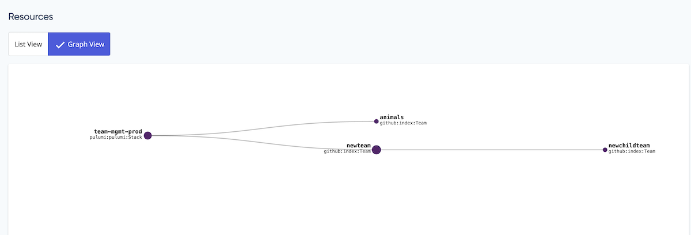

Ah, GitHub. The home of all developers. The place where we share code. The world’s most awkward social media site. The secret LinkedIn for techies. The tool we use for company org structure, work planning, code ownership, and permissions…

Wait.

That’s quite a lot.

GitHub is good at many things, but a full-on organization management tool it is not.

Have you ever needed your manager to manually enable admin permission on a repo for you?  
Or have you needed to page the CEO to add you to a team, because your manager was out that day?  
Have you ever wondered who is on what team? Or which team owns a repo?  
What if you change teams, or a team changes names? A reorg happens, and the “platform-integrations” team is no more, but we still need to call it that on GitHub because it is the team with all the repository accesses?

When I joined Pulumi in 2021, all of the above happened to me within my first few weeks.

We at Pulumi wanted to reduce this kind of management friction, and we decided to solve it the Pulumi way: with declarative infrastructure using the [Pulumi GitHub provider](https://github.com/pulumi/pulumi-github).

<!--more-->

## The Goal

First, we set a few ground rules. We decided that administrative privileges over Pulumi's GitHub repositories should flow as follows:

1. An employee is part of one or more GitHub teams.
2. Teams have appropriately scoped permissions over each repository they own.
3. Any Pulumi employee should be able to request code repository access in an official way.

Additionally, any current team membership and repository access should not be disrupted during development of this tool.

## Getting Started

Create a new Pulumi program:

```bash
$ pulumi new go
This command will walk you through creating a new Pulumi project.

Enter a value or leave blank to accept the (default), and press <ENTER>.
Press ^C at any time to quit.

project name: (team-management)
project description: (A minimal Go Pulumi program)
Created project 'team-management'

Please enter your desired stack name.
To create a stack in an organization, use the format <org-name>/<stack-name> (e.g. `acmecorp/dev`).
stack name: (dev) pulumi/prod
Created stack 'prod'

Installing dependencies...

go: downloading github.com/pulumi/pulumi/sdk/v3 v3.26.1
Finished installing dependencies

Your new project is ready to go! ✨

To perform an initial deployment, run 'pulumi up'

$ ls
Pulumi.yaml go.mod  go.sum  main.go
```

We now have a pulumi project YAML configuration file and the beginnings of a small Go program all set up.

According to the [provider configuration documentation](), we need to add a properly scoped token, as well as set "pulumi" as our GitHub organization owner.

<!--  -->

```bash
$ export GITHUB_TOKEN=YYYYYYYYYYYYYY
$ export GITHUB_OWNER=pulumi
```

## Capturing Current State of Resources

Now, Pulumi is _great_ at creating new infrastructure from scratch via code. But this wasn’t a from-scratch situation. We had to migrate existing resources---GitHub teams---to Pulumi, without disrupting anyone’s access.

Enter [Pulumi Import]().

What Pulumi Import does, in a nutshell, is find existing infrastructure by unique ID (in the GitHub provider’s case, the team ID), and add them to a Pulumi Stack. You can find the specific import instructions on the registry documentation for each resource. In this case we want the [GitHub import instructions]().

```bash
$ pulumi import github:index/team:Team animals 1234567
Previewing import (pulumi/prod)

     Type                  Name                Plan
     pulumi:pulumi:Stack   team-mgmt-prod
 =   └─ github:index:Team  animals             import

Resources:
    = 1 to import
    12 unchanged

Do you want to perform this import?  yes
Importing (pulumi/prod)

     Type                  Name                Status
     pulumi:pulumi:Stack   team-mgmt-prod
 =   └─ github:index:Team  animals             imported

Resources:
    = 1 imported
    1 unchanged
```

Now that we have imported the `Team` resource, it is part of our Pulumi Stack. But it is not part of our `main.go` program yet. Helpfully, Pulumi Import replies with sample code on how to add the imported resource to your Pulumi program, in the language you selected for your project:

```bash
Please copy the following code into your Pulumi application. Not doing so will cause Pulumi to report that an update will happen on the next update command.

Please note that the imported resources are marked as protected. To destroy them you will need to remove the `protect` option and run `pulumi update` *before* the destroy will take effect.


package main

import (
    "github.com/pulumi/pulumi-github/sdk/v4/go/github"
    "github.com/pulumi/pulumi/sdk/v3/go/pulumi"
)

func main() {
    pulumi.Run(func(ctx *pulumi.Context) error {
        _, err := github.NewTeam(ctx, "animals", &github.TeamArgs{
            CreateDefaultMaintainer: pulumi.Bool(false),
            Description:             pulumi.String("should get imported"),
            Name:                    pulumi.String("animals"),
            Privacy:                 pulumi.String("closed"),
        }, pulumi.Protect(true))
        if err != nil {
            return err
        }
        return nil
    })
}
```

After adding the team to `main.go` as suggested, this is the output of `pulumi preview`:

```bash
Previewing update (pulumi/prod)

     Type                   Name                 Plan       Info
     pulumi:pulumi:Stack    team-mgmt-prod

Resources:
    2 unchanged
```

Since `pulumi preview` shows no changes, we now know that our code reflects the existing infrastructure. It’s a bit funny to think about your program working well when it does nothing, but this was a huge first step in preserving existing infrastructure and ensuring all of our coworkers could continue their daily work uninterrupted!

To finish up, we [unprotect the resource]():

```bash
$ pulumi state unprotect 'urn:pulumi:prod::team-mgmt::github:index/team:Team::animals'
```

## Creating Configuration

Next, we import the remaining teams and refactor the code to handle multiple teams at once. This is also the time to write our organization structure into a YAML configuration file.

```yaml
---
org: "pulumi-demo--org"
teams:
 - name: "animals"
   slug: "animals"
   description: "A team in charge of animals"
 - name: "newteam"
   slug: "newteam"
   description: "I am a new team"
```

We then read this information into a Go struct with the necessary properties to pass into the Pulumi provider.

```go
type Team struct {
  Name         string `yaml:"name"`
  Description  string `yaml:"description"`
  Slug         string   `yaml:"slug"`
}
type Organization struct {
  Org   string `yaml:"org"`
  Teams []Team `yaml:"teams"`
}

func main() {
  pulumi.Run(func(ctx *pulumi.Context) error {

//import accurate team info from yaml
orgFilePath, err := filepath.Abs("./org.yaml")
if err != nil {
  return err
}
yamlFile, err := ioutil.ReadFile(orgFilePath)
if err != nil {
  return err
}
var org Organization
err = yaml.Unmarshal(yamlFile, &org)
if err != nil {
  return err
}

for _, team := range org.Teams {
    ghTeam, err := github.NewTeam(ctx, team.Slug, &github.TeamArgs{
        Description: pulumi.String(team.Description),
        Name:        pulumi.String(team.Name),
        Privacy:     pulumi.String("closed"),
}, pulumi.Protect(false))
if err != nil {
fmt.Println("encountered error creating new Pulumi GitHub team: ", team.Name)
  return err
}
     return nil
  })
}
```

Notice how the GitHub provider allows us to use team names to create teams. In contrast, team IDs are only needed for importing to the Stack, not for maintaining state.

## Relationships Are Hard

The next step involved a lot of thinking about team memberships and team nesting. [GitHub allows teams to be nested](https://docs.github.com/en/organizations/organizing-members-into-teams/requesting-to-add-a-child-team). This groups teams by area of responsibility but also allows for certain properties, such as permissions, to be inherited by subteams.

```bash
Parent Team                           Parent
                                        |
                            -------------------------
                            |                       |
Child Teams               Child1                  Child2
(inherit all permissions)
```

To establish this relationship, we set a [ParentTeamId]() on child teams. First off, we add a new field to our Teams struct:

```go
type Team struct {
  Name         string `yaml:"name"`
  Description  string `yaml:"description"`
  Slug         string   `yaml:"slug"`
  ParentTeamId int
  Teams        []Team   `yaml:"teams"`
}
```

Here is where things get a little tricky. Any GitHub Team can have subteams, but not every Team has a parent Team. We also did not want to have to hardcode GitHub Team IDs into our configuration files. We needed to meet the following requirements:

1. Create a parent team, using a team name.
2. Obtain its team ID.
3. Create any child teams, also using a team name.
4. Write the parent team’s ID into the `ParentTeamId field` of each child team.
5. Do all of the above in a single `pulumi up`.

This is where maintaining infrastructure with Pulumi truly shines. In our code, we can use [Pulumi Apply]() to hold on to the promise of a parent team ID, and pass this promise into the appropriate field:

```go
func setupTeams(ctx *pulumi.Context, parentTeam *Team) error {

// set up parent team, i.e. engineering
  ghParentTeam, err := github.NewTeam(ctx, parentTeam.Slug, &github.TeamArgs{
     Description: pulumi.String(parentTeam.Description),
     Name:        pulumi.String(parentTeam.Name),
     Privacy:     pulumi.String("closed"),
  }, pulumi.Protect(false))
  if err != nil {
     fmt.Println("encountered error creating new Pulumi github team: ", parentTeam.Name)
     return err
  }

//set up nested teams
  for _, childTeam := range parentTeam.Teams {
     // set each child team's parent team ID to the current team ID
     ghChildTeam, err := github.NewTeam(ctx, childTeam.Slug, &github.TeamArgs{
        Description: pulumi.String(childTeam.Description),
        Name:        pulumi.String(childTeam.Name),
        Privacy:     pulumi.String("closed"),
        ParentTeamId: ghParentTeam.ID().ApplyT(func(id interface{}) int {
        // we need to re-cast id as an int so we can then transform it into a pulumi.IntOutput, which can be used to set the ParentTeamId.
           x := fmt.Sprintf("%v", id)
           y, _ := strconv.Atoi(x)
           return y
        }).(pulumi.IntOutput),
     }, pulumi.Protect(false))
     if err != nil {
        fmt.Println("encountered error creating new Pulumi github team: ", childTeam.Name)
        return err
     }
  }
  return nil
}
```

Running this as part of `main.go` will result in beautifully nested teams on the GitHub UI. But with Pulumi, we can do even better. We can set [`pulumi.Parent()`]() on the child teams:

```go
for _, childTeam := range parentTeam.Teams {
    ghChildTeam, err := github.NewTeam(ctx, childTeam.Slug, &github.TeamArgs{#...},
    pulumi.Protect(false),
    pulumi.Parent(ghParentTeam))
    #...
}
```

With this, we can see the relationship between the resources on `pulumi up`:

```bash
Updating (prod)

     Type                     Name            Status
     pulumi:pulumi:Stack      team-mgmt-prod
 +   └─ github:index:Team     newteam         created
 +      └─ github:index:Team  newchildteam    created
Resources:
    + 2 created
2 unchanged
```

Which will be reflected on the Pulumi Stack’s Graph View in the Pulumi Service:



Adding this relationship to Pulumi is mostly a visual nicety in our case; however, certain Pulumi properties get inherited in a helpful way. Note that on GitHub, it is possible to create multiple layers of teams, whereas the example code in this blog post only shows a single layer of subteam structure. We are small enough at Pulumi to not need more, but you may want to expand on the solution if you do.

## Adding People

Next, teams should have members! Let’s add them to the YAML config:

```yaml
org: "pulumi-demo-org"
teams:
 - name: "animals"
   slug: "animals"
   description: "A team in charge of animals"
   members:
     - username: "platypus"
     - username: "owlcat"
```

A [`TeamMembership` in GitHub]() is a cross reference between a `Team` and a `User`. Fortunately these do not need to be explicitly imported, as they are merely establishing relationships between GitHub Users and Teams. We can add `TeamMemberships` to the Stack with a `Members` struct, a new `Members[]` field on the `Team` struct, and an extra function. Again, Pulumi lets us use the promised output of the team ID to set the `TeamId` field in the `TeamMembership`:

```go
type Team struct {
  Name         string `yaml:"name"`
  Description  string `yaml:"description"`
  ParentTeamId int
  Teams        []Team   `yaml:"teams"`
  Slug         string   `yaml:"slug"`
  Members      []Member `yaml:"members"`
}

type Member struct {
  UserName string `yaml:"username"`
  Role     string `yaml:"role"`
}

#...

func addMembers(ctx *pulumi.Context, members []Member, team *github.Team, teamName string) error {
  for _, member := range members {
     // unique name for TeamMembership
     utmName := teamName + "-" + member.UserName
     _, err := github.NewTeamMembership(ctx, utmName, &github.TeamMembershipArgs{
        TeamId:   team.ID(),
        Username: pulumi.String(member.UserName),
     })
     if err != nil {
        return err
     }
  }
  return nil
}
```

Running `pulumi up`:

```bash
Updating (prod)

     Type                            Name                      Status
     pulumi:pulumi:Stack             team-mgmt-prod
 +   ├─ github:index:TeamMembership  animals-owlcat            created
 +   └─ github:index:TeamMembership  animals-platypus          created

Resources:
    + 2 created
    4 unchanged
```

Alright! So now we have

1. Imported existing teams to a Pulumi Stack to track and organize all GitHub teams from a central repository, and
2. Added team members to teams.

That’s pretty great so far! While there are many org chart tools, what makes this one useful to us is that we can declare the desired org state in a config file, and then let Pulumi figure out what changes should be applied. Let’s automate that!

## Add CI

In order for this tool to be used by everyone, we keep code and configuration in a GitHub repository. We can use [Pulumi’s GitHub Action]() to run a `pulumi preview` on a pull request, and a `pulumi up` on merge to main.

Here’s what that looks like on the pull request:

```yaml
name: Pull Request preview
on:
 pull_request:
 workflow_dispatch:

env:
 AWS_REGION: us-west-2
 GITHUB_TOKEN: ${{ secrets.PULUMI_GITHUB_TOKEN }}
 PULUMI_ACCESS_TOKEN: ${{ secrets.PULUMI_ACCESS_TOKEN }}
 GITHUB_OWNER: pulumi

jobs:
 pull-request:
   runs-on: ubuntu-latest
   name: Preview
   steps:
     - uses: actions/checkout@v2
     - name: Install Go
       uses: actions/setup-go@v2
       with:
         go-version: 1.17
     - name: Build Binary
       run: |
         go mod tidy
         go build main.go
     - name: Pulumi Preview
       uses: pulumi/actions@v3
       with:
         command: preview
         refresh: true
         stack-name: pulumi/prod
         comment-on-pr: true
```

And the `pulumi up` on merge to main:

```yaml
name: Update
on:
 push:
   branches:
     - "main"
 workflow_dispatch:

env:
 AWS_REGION: us-west-2
 GITHUB_TOKEN: ${{ secrets.PULUMI_GITHUB_TOKEN }}
 PULUMI_ACCESS_TOKEN: ${{ secrets.PULUMI_ACCESS_TOKEN }}
 GITHUB_OWNER: pulumi

jobs:
 main:
   runs-on: ubuntu-latest
   name: Update
   steps:
     - uses: actions/checkout@v2
     - name: Install Go
       uses: actions/setup-go@v2
       with:
         go-version: 1.17
     - name: Build Binary
       run: |
         go mod tidy
         go build main.go
     - name: Pulumi update
       uses: pulumi/actions@v3
       with:
         command: up
         refresh: true
         stack-name: pulumi/prod
```

Note that we are calling `refresh: true` in both Workflows, which uses [Pulumi Refresh]() to make sure that the existing GitHub resources are aligned with the resource state in our Stack.

Now, anyone with access to the GitHub management repo can:

- Create, re-parent, delete, or rename teams and re-create any memberships via pull request to the config file.
- Add and remove team members via pull request.
- Audit and explicitly maintain org structure via git history and review processes.

But of course… there’s more!

## Managing Permissions

The next step involved a lot of thinking about repository permissions and permission access.

Shortly after I joined Pulumi, my team was combined with another team. They brought along all of their repositories---none of which I had access to. Moreover, all of our team names were outdated. I could rename the teams using `pulumi-github`… but I could not transfer all of the repository access we all needed to our new team. Yet.

On GitHub, parent teams pass permissions down to child teams. But what if we wanted permissions to be more granular?

Here's where [`TeamRepositories`]() come in. A `TeamRepository` has three fields: a team ID, a repository name, and a permission. Just like `TeamMemberships`, this resource is a link between a `Team` and a `Repository` and does not need to be imported.

We gave each team their own config file with permission levels listing repository names:

```yaml
team: "animals"
permissions:
 - role: "admin"
   repos:
     - "capybaras"
     - "owls"
 - role: "maintain"
   repos:
 - role: "push"
   repos:
 - role: "read"
   repos:
```

This can be read into our Pulumi program as follows:

```go
// TeamPermissions describes a github team and the levels of permissions available (i.e. admin, maintain)
type TeamPermissions struct {
  TeamName    string       `yaml:"team-name"`
  Permissions []Permission `yaml:"permissions"`
}

// Permission is a single permission and a list of repos with that permission.
type Permission struct {
  Role  string   `yaml:"role"`
  Repos []string `yaml:"repos"`
}

#...

func setupTeamRepos(ctx *pulumi.Context, team *github.Team, teamName string) error {

  repoFilePath, err := filepath.Abs("./team-repos/" + teamName + ".yaml")
  if err != nil {
     fmt.Println(err.Error())
     return err
  }
  yamlFile, err := ioutil.ReadFile(repoFilePath)
  if err != nil {
     return err
  }

  var teamPerms TeamPermissions
  err = yaml.Unmarshal(yamlFile, &teamPerms)
  if err != nil {
     return err
  }
  for _, permission := range teamPerms.Permissions {
     for _, repo := range permission.Repos {
        _, err := github.NewTeamRepository(ctx, fmt.Sprintf("%s-%s-%s", repo, teamName, permission.Role), &github.TeamRepositoryArgs{
           Permission: pulumi.String(permission.Role),
           Repository: pulumi.String(repo),
           TeamId:     team.ID(),
        })

        if err != nil {
           return err
        }
     }
  }
  return nil
}
```

And the output of running `pulumi up`:

```bash
Updating (prod)

     Type                            Name                      Status
     pulumi:pulumi:Stack             team-mgmt-prod
 +   ├─ github:index:TeamRepository  owls-animals-admin        created
 +   ├─ github:index:TeamRepository  capybaras-animals-admin   created


Resources:
    + 2 created
    2 changes. 4 unchanged
```

With this addition, we can now combine teams with zero access disruptions as follows:

1. Create the new team in the org config.
2. Create a TeamRepository config for the new team with desired permission levels.
3. Open a pull request and let CI and Pulumi do the rest.

Now we can develop standards around repository permissions based on teams’ roles and areas of responsibility, and we have tooling in place that can maintain these standards for everyone in the org to see. In fact, we can standardize the meaning of “code ownership” via access levels in this way---one centralized management location rather than asking your grandboss to dig through the UI for you.

## Future challenges

We want to automate some of these steps: adding new teammates to the org should also automatically add them to this repository so they can self-serve their onboarding and see Pulumi work in action!

To prevent state drift, we will run a regular reconciliation job in CI.

Of course, we will add other Pulumi providers on top of this org structure so we can sync our other tooling.
