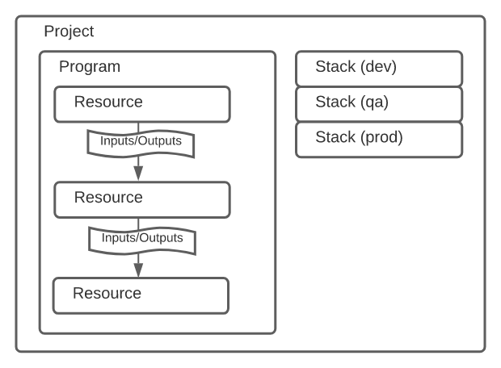
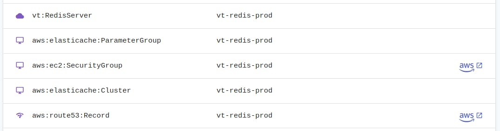
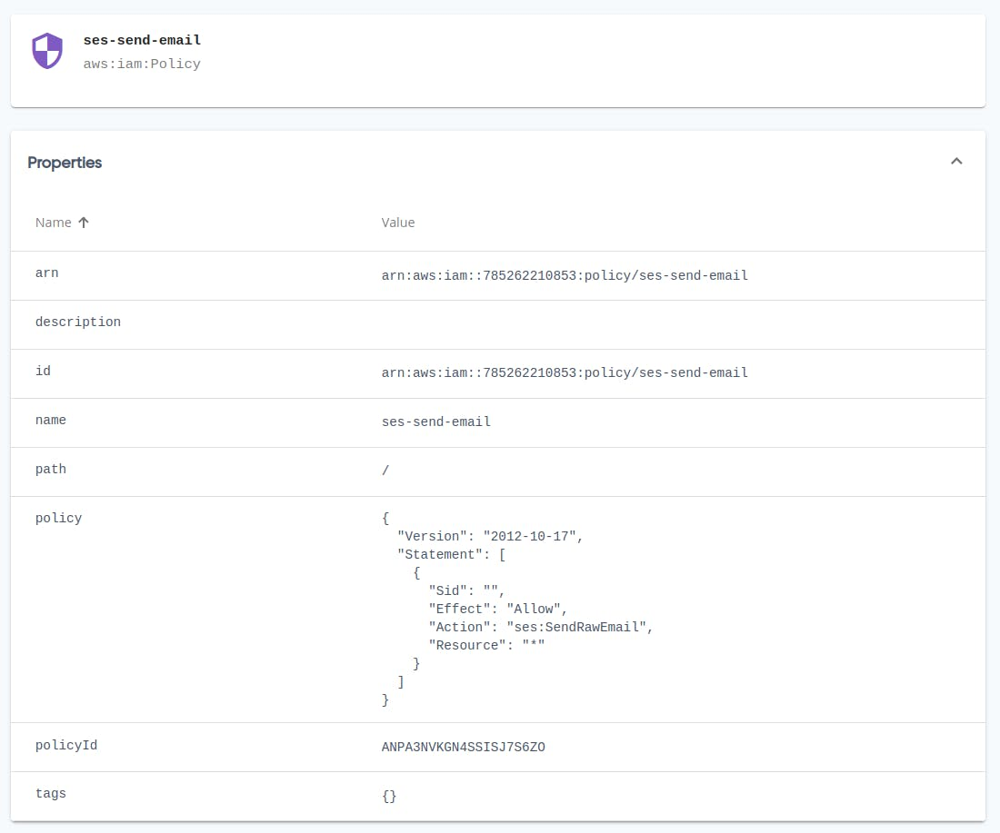
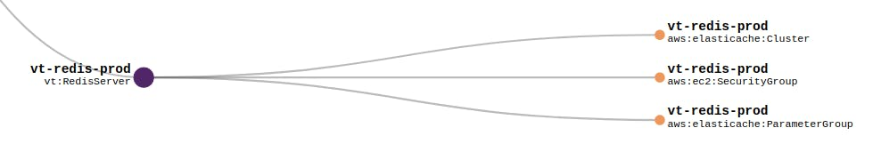
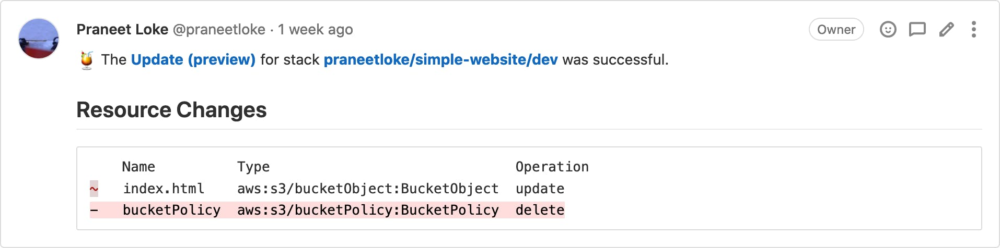

Pulumi community member [Erik Näslund](https://blog.ekik.org/) shares his thoughts on how to migrate from Terraform to Pulumi. Read on to learn all the details of his experience!

<!--more-->

I've been using [Terraform](https://www.terraform.io/) for a couple of years and overall I've been quite happy with it. However there's a few things that started to bother me more and more recently.

Terraform uses a language called Hashicorp HCL to define the infrastructure. It's a relatively simple declarative language, but it's something I had to learn along the way. Just like any language it has it's little quirks, and I often found myself spending more time than I wanted to figure out how to do certain things. As I'm doing all the infrastructure myself I really wanted to be able to use a language I'm familiar with, to make things simple.

I had written my own [Terraform modules](https://www.terraform.io/docs/language/modules/develop/index.html) to organize my code. Modules are a great help when it comes to organizing your code in a logical way, and I strongly recommend it if you haven't tried using them already. However, after using it for a while I realized that the Terraform [type system](https://www.terraform.io/docs/language/expressions/types.html) left something to be desired. There are a few basic types available, but not much more than that. This caused bad "micro interactions" between me and Terraform. It was commonplace for me to submit an MR to my Gitlab CI where I passed in a security group *name* instead of an *arn* or *id*.

The third and perhaps most important point is that I think a custom language like HCL is the wrong way to go long term. Don't get me wrong - I love the people at Hashicorp and I'm forever grateful for Terraform because it's the first product that made me enjoy writing IaC. That being said, I think it's a better choice to write libraries for existing languages, instead of trying to create a configuration language of your own. There's a lot of constructs that I'm used to having in Python that I sorely miss having available in Terraform. In my opinion there's no reason to develop your own configuration language since it's a time consuming task, and I don't find it better than a general purpose language anyways.

### Why did I choose Pulumi?

I have this thing called "Fun time Friday" where I spend the first half day on Fridays exploring new things I've heard about. Most of the things I look at during that time end up being scrapped, and there's zero pressure to push things into production.

However after exploring Pulumi I felt that it might be significantly better for me than Terraform. I decided to take a day to see if I could migrate my infrastructure.

Could I have used something else, like [AWS CDK](https://aws.amazon.com/cdk/)? I most probably could. The nice thing about running a company of one is that there's no need for analysis paralysis! At this point I believed that Pulumi was a better choice for me than Terraform, so I went for it.

Personally I struggle a bit with CDK being mostly Amazon-centric. I sometimes use my IaC to configure things outside of AWS as well. The other issue for me is that CDK by default uses AWS CloudFormation to provision resources. I've been bitten a few times by CF. Some times it's been because of buggy behavior, e.g. a stack that refused to terminate. Other times it's been the fact that CF often lags behind in capabilities, so it's common to have to wait a few months for a new feature to be usable through CF.

Sure, I could use [CDK for Terraform](https://www.hashicorp.com/blog/cdk-for-terraform-enabling-python-and-typescript-support) to have CDK genererate Terraform HCL for me. However, now we're quickly getting away from the simple system I wanted in the first place.

Apologies to those of you who are screaming *"FFS - CDK is the best thing ever!"* at your monitors right now. You might be 100% right! From what I've seen CDK seems pretty awesome for the most part. I didn't end up with Pulumi because CDK seemed bad. I ended up with Pulumi because it seemed like a slightly better fit for my needs :).

### Pulumi in 3 minutes

You might already know a bit of Pulumi, but here's a very quick overview plus some advice on where to go from here.



- Pulumi allows you to write your IaC using TypeScript, Javascript, Python, Go or C#.
- You define *resources* which have *inputs* and *outputs*. As an example, a resource could be an RDS database Instance. One of it's inputs would be the database version to use. One of the outputs would be the hostname / address of the server.
- The outputs are lazily evaluated, and their exact value is often not known until after you've executed your code. I.e. you wouldn't have the `db_instance.address` until the instance had been created. Think of outputs as promises / futures.
- You can use [component resources](https://www.pulumi.com/docs/intro/concepts/resources/#components) to group your resources into logical groups - similar to how Terraform modules work. If you don't do this there's a high risk you'll end up with a very messy setup further down the line.
- Read Pulumi's own [overview](https://www.pulumi.com/docs/intro/concepts/) and [naming](https://www.pulumi.com/docs/intro/concepts/resources/#autonaming) docs before attempting to use Pulumi yourself. I'd say that's the most important bit to know about.
- Pulumi are using the [open core](https://en.wikipedia.org/wiki/Open-core_model) model where most features are free, but some extra goodies are on a paid tier. You can use the open source version and do state management yourself, but you miss out on certain features.

So what does Pulumi code look like? Below is a minimal extract of some of the Python code I've written (slightly altered).

```python
# __main__.py
...
prod_redis_server = RedisServer(
    identifier='redis-prod',
    route53_zone=example_com_route53_zone,
    route53_name='redis-prod.example.com',
    security_groups=[my_ecs_service.task_security_group]
)
...

# components/redis_server.py
class RedisServer(ComponentResource):
    def __init__(
        self,
        identifier: str,
        route53_zone: aws.route53.Zone,  # Route53 Zome where the DNS record will be created.
        route53_name: str,  # Full DNS name of the CNAME record, e.g. 'redis.example.com'.
        security_groups: List[aws.ec2.SecurityGroup],  # Security groups which should be granted access to the server.
        opts=None
    ):
        super().__init__('vt:RedisServer', identifier, None, opts)

        # Prefix with `self.` if you want to access the security group from outside this component.
        security_group = aws.ec2.SecurityGroup(
            identifier,
            ingress=[
                aws.ec2.SecurityGroupIngressArgs(
                    from_port=6379,
                    to_port=6379,
                    protocol='tcp',
                    security_groups=[sg.id for sg in security_groups],
                )
            ],
            opts=ResourceOptions(parent=self),
        )

        # Create all the other sub resources needed.
        ...

```

As you can see it's really simple and clean for me to set up a Redis server now.

There's also the fact that I can use the Pulumi Console (web interface) to check the state of my infrastructure really quickly. I found myself doing this instead of logging in to the AWS console or using the AWS cli.





### How I went about the migration

After reading the [migration guide](https://www.pulumi.com/docs/guides/adopting/from_terraform/) I immediately tried out what seemed to be the obvious option - [tf2pulumi](https://www.pulumi.com/tf2pulumi/). This is supposed to be able to convert Terraform code directly to Pulumi. In my case it simply errored out and was not able to convert my Terraform code. To be fair my TF code was using slightly more "advanced" features like custom written modules, so it wasn't the easiest thing to handle for tf2pulumi. I recommend you try it out, because it sounds great in theory. However it wasn't an option for me, so I had to go for a more manual approach. In retrospect I'm actually quite happy I did, because it gave me the opportunity to organise my code in a way that I preferred.

Don't worry though - "manual" imports using Pulumi is still rather easy to perform, albeit a bit time consuming. Here's how I did it.

I started by testing out the [AWS getting started guide](https://www.pulumi.com/docs/get-started/aws/) to get a feel for how Pulumi worked. This was a great move and I recommend everyone else to do the same.

I was then ready to start importing my existing resources. The general workflow was to look at my existing Terraform code, rewrite it using Pulumi, and then import the existing resources. It was a bit time consuming in the beginning, but I got a lot faster at it after a few hours.

Since Pulumi starts out "empty" you can rewrite and import a piece at a time. I'd recommend doing this because you will most probably do some mistakes initially, and it's good to get early feedback.

You can check the [API reference](https://www.pulumi.com/docs/reference/pkg/aws/s3/bucket/) for details on how to import each specific resource. The instructions on how to do it is usually at the bottom of the reference page for each resource type.

Once I had everything migrated to Pulumi I set up a Gitlab CI/CD flow which allowed me to preview and apply the infrastructure changes. Up until then I'd been doing it locally from my own computer. If possible, I recommend doing it that way. The extra time taken by involving a separate CI/CD pipeline would make your migration take a lot longer. It's perfectly fine when everything is done and dusted, however when learning Pulumi you'll often need to use the `pulumi` command to look at the resources.

### Issues, workarounds and general tips

#### Use component resources to group resources

When your infrastructure starts growing it becomes hard to manage unless you group your resources. Pulumi's solution to this are the so called [component resources](https://www.pulumi.com/docs/intro/concepts/resources/#components). They are "logical components" which you define yourself.

```shell
$ pulumi stack
...
─ vt:RedisServer                                                          vt-redis-prod
    │  ├─ aws:elasticache/parameterGroup:ParameterGroup                        vt-redis-prod
    │  ├─ aws:ec2/securityGroup:SecurityGroup                                  vt-redis-prod
    │  └─ aws:elasticache/cluster:Cluster                                      vt-redis-prod
...

```

As you can see I've defined a component called "vt:RedisServer" which I use to group all the resources associated with my Redis server. You'll get a graph representation of your whole infrastructure in the [Pulumi Web Console](https://www.pulumi.com/docs/intro/console/) .



It might seem like a small thing, but it *really* helps to have a logical grouping of your resources as your infrastructure grows. It also help because you can suddenly decide which resources your component exposes and which ones are "internal" to the component. Check out the code sample from earlier in the article to see how to do this using `self.`.

#### Importing a resource that has a parent was a bit confusing at first

Each resource in pulumi has a globally unique [URN](https://www.pulumi.com/docs/intro/concepts/resources/#urns). You can show the URNs for the infrastructure you've codeified in pulumi by issuing `pulumi stack --show-urns`

```shell
$ pulumi stack --show-urns
...
├─ vt:RedisServer                                                          vt-redis-prod
    │  │  URN: urn:pulumi:prod::VT::vt:RedisServer::vt-redis-prod
    │  ├─ aws:elasticache/parameterGroup:ParameterGroup                        vt-redis-prod
    │  │     URN: urn:pulumi:prod::VT::vt:RedisServer$aws:elasticache/parameterGroup:ParameterGroup::vt-redis-prod
    │  ├─ aws:ec2/securityGroup:SecurityGroup                                  vt-redis-prod
    │  │     URN: urn:pulumi:prod::VT::vt:RedisServer$aws:ec2/securityGroup:SecurityGroup::vt-redis-prod
    │  └─ aws:elasticache/cluster:Cluster                                      vt-redis-prod
    │        URN: urn:pulumi:prod::VT::vt:RedisServer$aws:elasticache/cluster:Cluster::vt-redis-prod
...

```

Let's have a look at one of the URNs in more detail, shall we?

```shell
urn:pulumi:prod::VT::vt:RedisServer$aws:elasticache/parameterGroup:ParameterGroup::vt-redis-prod

```

- stack name: prod
- project name: VT
- parent resource type: vt:RedisServer
- resource type: aws:elasticache/parameterGroup:ParameterGroup
- resource name: vt-redis-prod

All URNs need to be unique, which means every resource of the same type, with the same parent (in the same stack and project) needs to have a unique resource name.

Normally I would have written and imported my parameter group definition something like this:

```python
# components/redis_server.py
class RedisServer(ComponentResource):
    """
    Redis server running on ElastiCache (single node).
    """
    def __init__(self, identifier: str, opts=None):
        super().__init__('vt:RedisServer', identifier, None, opts)

        ...

       parameter_group = aws.elasticache.ParameterGroup(
            identifier,
            name=identifier,
            family='redis6.x',
            opts=ResourceOptions(parent=self),
        )

# __main__.py
vt_prod_redis_server = RedisServer(
    identifier='vt-redis-prod'
)

```

And I would then try to import it like this:

```text
# Executing the import (THIS WON'T WORK, DON'T TRY IT)
pulumi import\
    aws:elasticache/parameterGroup:ParameterGroup\
    vt-redis-prod\
    vt-redis-prod

```

The first `vt-redis-prod` in the command above is the *identifier* used by the `aws.elasticache.ParameterGroup`. This is actually called "resource name" using Pulumi-speak. I prefer to call it identifier in my own code though, because "resource name" is too similar to the actual name it has to AWS for my liking.

The second `vt-redis-prod` is the actual name of my parameter group on AWS (remember we're importing existing stuff).

However, the above won't work for one simple reason - the URN won't match because we haven't told Pulumi that this parameter group resource we're importing is a child of our `RedisServer` component. What's the solution? Pretty simple, but somewhat obscure at the same time:

```text
# Executing the import (the right way)
pulumi import\
    --parent vt_prod_redis_server=urn:pulumi:prod::VT::vt:RedisServer::vt-redis-prod\
    aws:elasticache/parameterGroup:ParameterGroup\
    vt-redis-prod\
    vt-redis-prod

```

You tell Pulumi about the parent by using the `--parent` argument (this is the simple part). The *parent* argument is a key=value pair, and the key is actually the *python variable name* you've used in your code. If you scroll back up you can see that I stored my RedisServer instance in a variable called `vt_prod_redis_server`. This part took longer than I'd like to admit for me to figure out.

The value is the URN of the parent component, which you can get with `pulumi stack --show-urns`.

#### You can't import a child without having the parent in place first

That last one was a bit heavy, let's take a breather and go for something a bit simpler!

When importing a child component you need to import the parent first. If you simply run `pulumi up` it will try to import all your resources all at once, and it won't work because the parent haven't been created yet.

Instead simply do this first to update just a single resource:

```shell
$ pulumi up --target urn:pulumi:prod::VT::vt:RedisServer::vt-redis-prod

```

This will cause my *vt-redis-prod* resource to be created in the Pulumi state. Nothing actually happens on AWS since it's just a logical component. Once this is done you'll be able to import all of it's child resources as you saw above.

## Writing IAM (JSON) policies with Pulumi outputs

Imagine having an IAM policy that referenced an ECR repository, just as an example. You might want the policy to grant access only to that particular ECR repository. You might be temped to try something like this:

```json
aws.iam.Policy(
    ...
    policy=json.dumps({
        'Version': '2012-10-17',
        'Statement': [
            {
                'Sid': '1',
                'Effect': 'Allow',
                'Action': [
                    'ecr:GetAuthorizationToken',
                    ...
                ],
                'Resource': ecr_repository.arn
            }
        ]
    }))

```

While this might look sensible, it won't quite work. Remember early on I sad that Pulumi outputs are *futures*, and not variables whose values you can access just like that. If you did like the example above your policy would just end up with something similar to `'Resource': <Pulumi.Output(...)>` in it. Not quite what we wanted.

Instead we have to tell Pulumi to resolve these futures, so we get the actual *value* for them, like this:

```json
aws.iam.Policy(
    ...
    policy=ecr_repository.arn.apply(lambda arn: json.dumps({
        'Version': '2012-10-17',
        'Statement': [
            {
                'Sid': '1',
                'Effect': 'Allow',
                'Action': [
                    'ecr:GetAuthorizationToken',
                    ...
                ],
                'Resource': arn
            }
        ]
    }))

```

If you have more than one Output you need to access you can use `Output.all`, like this:

```json
policy=(
    Output.all(origin_access_identity.iam_arn, self.s3_bucket.arn)
    .apply(
        lambda args: json.dumps({
            'Version': '2008-10-17',
            'Id': 'PolicyForCloudFrontPrivateContent',
            'Statement': [
                {
                    'Sid': '1',
                    'Effect': 'Allow',
                    'Principal': {
                        'AWS': args[0]
                    },
                    'Action': 's3:GetObject',
                    'Resource': f'{args[1]}/*'
                }
            ]
        })
    )
)

```

The `.apply` method can also be useful for troubleshooting when you need to access the particular value of an output.

This might seem tricky at first, but digest this for a bit, then have a look at the docs for [Inputs and Outputs](https://www.pulumi.com/docs/intro/concepts/inputs-outputs/) and I'm sure it'll all make sense.

### Don't name resources unless you really have to

Pulumi is pretty smart when it comes to naming the actual resources on AWS. If you don't specify a `name` when creating a resource Pulumi will use the identifier and [append a hex character suffix](https://www.pulumi.com/docs/support/faq/#why-do-resource-names-have-random-hex-character-suffixes) .

This gives two great advantages. The first is that you can have multiple stacks next to each other, e.g. a "review" and a "production" environment. If you hard coded the names this wouldn't be possible.

The second advantage is that it makes replacement of resources much easier. If you hard code the name you leave Pulumi no choice but to tear down the existing resource before creating the replacement one. This makes a big difference if you are to perform a version update of one of your dependencies. In case you allow Pulumi to handle the naming it can create the new resource before terminating the previous one. This coupled with a DNS entry update can make for updates with virtually zero downtime.

Since I imported existing resources I had to keep hard coded names in a few places. However I've taken the time to get rid of the hard coding as much as possible since then.

### Integrating with CI/CD (Gitlab)

I use Gitlab for my Ci/CD, and I'm really happy with it. Let me show you what my very simple Pulumi pipeline looks like right now:

```yaml
stages:
  - build

preview:
  stage: build
  image:
    name: pulumi/pulumi-python:3.2.1  # Choose the right image for your language
    entrypoint: [""]  # This is important for things to work
  script:
    - pulumi stack select prod
    - pulumi preview --color always --diff  # I added '--diff' to always see more details
  only:
    - merge_requests  # Only run the preview on merge requests

update:
  stage: build
  image:
    name: pulumi/pulumi-python:3.2.1
    entrypoint: [""]
  script:
    - pulumi stack select prod
    - pulumi update --color always --diff --yes  # Answer "yes" when asking to apply the changes
  only:
    - master  # Only run the update on the master branch (post merge)

```

As you can see my pipeline is very simple for this little project which is still in an Alpha phase. There's just the "production" environment, and changes are automatically applied once the MR is merged.

You'll have to make use of your gitlab-fu (or other-ci-cd-fu) to adapt this to your own needs. Read the [docs from Pulumi](https://www.pulumi.com/docs/guides/continuous-delivery/) to get started. It's usually very simple and straight forward!

I did things quite differently from what's described in the Pulumi docs. I used the ready made image from Docker Hub, while they build their own. I did this to make the whole pipeline quicker. It seems to work really well so far, and I haven't found any downsides to my approach (yet).

### I couldn't get the Gitlab integration webhooks to work

You are normally able to have Pulumi post a report of the planned changes [attached to your merge request](https://www.pulumi.com/docs/guides/continuous-delivery/gitlab-app/) .



However I couldn't make this work because of authentication issues. With the help of their support (which was excellent btw) we figured out that it was related to the fact that I was using [Gitlab groups](https://docs.gitlab.com/ee/user/group/) to organise my repositories.

As things stand right now you have to create a Pulumi Organization for each Gitlab Group. There's a bit of an issue with Pulumi's pricing right now, because the only way to be able to get more than 1 organisation is to go for their enterprise plan.

I think Pulumi will be fixing this in one way or another in the future. For now I'm still pretty happy just checking my changes from the Gitlab job output.

### What's the verdict?

So I've been using Pulumi for a few weeks now, and here are my impressions.

It's really fast compared to Terraform. I didn't even expect this one, but for some reason Pulumi manages to at least "feel" a lot faster. I haven't done any measurements to verify this, but it definitely feels much faster.

Their documentation is really good, although it took me a bit to learn to navigate it.

Having type annotations is great! This makes it a lot more friendly to work with as a developer. No more passing around just plain strings in your code. However the type annotations doesn't quite work in PyCharm because of how the Pulumi code is written. I consider this a PyCharm bug though, and I expect it to be fixed in the future. For now I can simply *ctrl+b* the class in question, and read the type annotations from the source code.

The Pulumi (Web) Console is a neat way to look at your infrastructure. I know there are similar solutions for Terraform, but I hadn't used them personally.

The developer ergonomics are great. Using your language of choice helps a lot. When running a company of one, like myself, it's really important to limit the number of things you need to learn as much as possible. While HCL is simple it's yet another language to remember. If you're working at a larger company it's a great way to encourage developers to do more infrastructure work.

Pulumi is an open core type product, and you will have to pay to access the features on the higher tiers. Their current plans are very fairly priced. I myself is using the free community plan, which works great for me. There's obviously the risk that they will remove the free plan in the future. However even if that happens I could either pay the fee, or transfer to state storage to AWS S3, and retain most of the product functionality. This feels like an acceptable level of risk for me.

My goal was to do the whole migration in one day. In reality it ended up being closer to two days. However, given that I learned Pulumi and migrated ~130 resources in that amount of time I'd say that Pulumi is quite easy to get started with.

All in all, I'm very happy with making the transition to Pulumi! I became way more productive managing my infrastructure. At the same time I ended up enjoying the work of doing so a lot more - which is really important too.
***
*This article was originally posted at [https://blog.ekik.org/my-experience-migrating-my-infrastructure-from-terraform-to-pulumi](https://blog.ekik.org/my-experience-migrating-my-infrastructure-from-terraform-to-pulumi). Reposted here with permission.*
