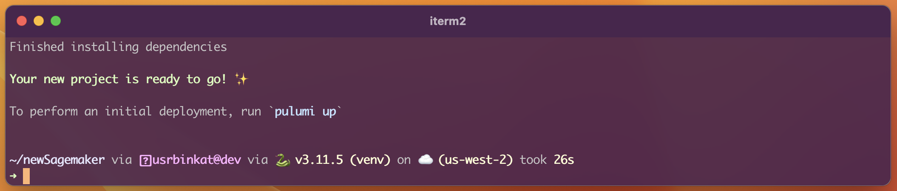

[Pulumi CLI]:/docs/install/
[Pulumi Account]:https://app.pulumi.com/signup
[Pulumi Template]:/blog/how-to-create-and-share-a-pulumi-template
[Pulumi Templates]:/blog/how-to-create-and-share-a-pulumi-template
[Pulumi Python]:https://www.pulumi.com/docs/reference/pkg/python/pulumi
[Infrastructure as Code]:https://www.pulumi.com/what-is/what-is-infrastructure-as-code
[IaC]:https://www.pulumi.com/what-is/what-is-infrastructure-as-code
[AWS IAM Roles]:/registry/packages/aws/api-docs/iam/role
[Amazon SageMaker Model Endpoint]:/registry/packages/aws/api-docs/SageMaker/model
[Amazon CloudWatch alarms]:/registry/packages/aws/api-docs/cloudwatch/metricalarm
[Pulumi project and stack]:/docs/using-pulumi/organizing-projects-stacks/
[Pulumi Cloud]:https://www.pulumi.com/product/pulumi-cloud
[Pulumi state]:https://www.pulumi.com/docs/concepts/state
[Python Virtual Environment]:/docs/languages-sdks/python/#virtual-environments
[venv]:/docs/languages-sdks/python/#virtual-environments

[Python]:https://www.python.org
[Python3]:https://www.python.org/downloads
[natural language prompt]:https://en.wikipedia.org/wiki/Prompt_engineering
[Meta AI LlaMa 2]:https://ai.meta.com/llama
[Hugging Face]:https://huggingface.co
[NousResearch/Llama-2-7b-chat-hf]:https://huggingface.co/NousResearch/Llama-2-7b-chat-hf
[AWS CLI]:https://docs.aws.amazon.com/cli/latest/userguide/getting-started-install.html
[AWS Credentials]:https://docs.aws.amazon.com/cli/latest/userguide/cli-chap-authentication.html
[Amazon SageMaker]:https://aws.amazon.com/pm/SageMaker
[tremendous value]:https://blogs.nvidia.com/blog/2023/01/26/what-are-large-language-models-used-for
[Large Language Models]:https://en.wikipedia.org/wiki/Large_language_model
[LLM]:https://en.wikipedia.org/wiki/Large_language_model
Welcome to another installment of [Pulumi Python] #MLOpsChallenge!

In this short tutorial we will deploy a publicly available [Meta AI LlaMa 2] based model from [Hugging Face], on [Amazon SageMaker]. Then we will test it with a [natural language prompt] using a short [Python] script.

It may be tempting to dismiss AI as yet another over hyped and complicated technology, but is it really? What if you could start using this cutting edge technology without the stress? AI/ML models, including [Large Language Models] (LLM) like what we will demonstrate today, offer [tremendous value] to organizations, but only if AI/ML platform resources can be reliably, easily, and cost effectively provisioned and put to work. By utilizing [Infrastructure as Code] (IaC) written as [Pulumi Python] programs, machine learning operations teams benefit from [IaC] making deploying AI applications the easiest part of your AI/ML journey. Benefits of [Pulumi Python] based [IaC] for your AI/ML projects include:

1. Easily create AI/ML infrastructure, together with other supporting infrastructure _in the same Pulumi program_
2. [Pulumi templates] enhance the infrastructure as code (IaC) development experience by providing a pre-written code framework designed to help you bootstrap new Pulumi projects quickly.
3. Cloud orchestration written in programming languages like [Python] which is already well known and practiced in the AI/ML industry.

## Pulumi makes AI/ML Easy?

For this exercise we will deploy a [Pulumi Template] from scratch. Starting from the `pulumi new` command, we will initialize a new [Pulumi project and stack]. This will provide everything required to deploy our chosen Hugging Face model as an [Amazon SageMaker Model Endpoint]

You can use the `SageMaker-aws-python` template as a working Python starting point for your own Amazon SageMaker deployments, and customize the model you use, SageMaker configuration, and CloudWatch integration as well, just to scratch the surface. Your only limits are your imagination.

Now let's look at what the `SageMaker-aws-python` template will deploy in this tutorial:

* [AWS IAM Roles]
* [Amazon CloudWatch alarms]
* [Amazon SageMaker Model Endpoint]
* A [Meta AI LlaMa 2] based LLM ([NousResearch/Llama-2-7b-chat-hf]) from [Hugging Face]

## Requirements

* [Python3] (3.9+)
* [Pulumi CLI]
* [Pulumi Account]
* [AWS CLI]
* [AWS Credentials] (pre-configured)

## Instructions

### 1. Login to Pulumi Cloud and initialize stack

Let's begin by logging into [Pulumi Cloud]:

```bash
# There are many ways to store Pulumi state, here we use Pulumi Cloud
# Other state backends include S3, local file, and more
pulumi login
```

> If you're unsure of which [Pulumi state] backend you're using, you can check by running `pulumi whoami` (or `pulumi whoami -v` for more info).

### 2. Prepare a new Pulumi project

Here we create our new Pulumi project directory and populate it from the `SageMaker-aws-python` [Pulumi template](https://github.com/pulumi/templates)

```bash
# Create a new directory & change directories into it
mkdir newSageMaker && cd newSageMaker

# Start your project from the SageMaker-aws-python template
# Follow along with the prompts to create your new project and initialize a stack
pulumi new SageMaker-aws-python
```

While creating a new project from the `SageMaker-aws-python` Pulumi template, you will be prompted for a [project](https://www.pulumi.com/docs/concepts/projects/) name, description, [stack](https://www.pulumi.com/docs/concepts/stack/) name, and Amazon Web Service [Region](https://aws.amazon.com/about-aws/global-infrastructure/regions_az/). You can proceed with defaults, or supply your own.

After responding to all prompts, the `pulumi new` command will proceed to setup a [Python Virtual Environment] (venv) and download all dependencies into the [venv].




### 3. Deploy your model as a new SageMaker endpoint

This step may take between 10 and 20 minutes while Amazon builds your infrastructure and deploys the configured model. You can follow along in the console as resources are provisioned, or open the link displayed in terminal to view the deployment status and other stack information in Pulumi Cloud.

```bash
pulumi up
```


### 4. Try your new SageMaker endpoint

Once your stack has finished deploying, use this rudimentary Python snippet to test the deployed SageMaker endpoint.

> NOTE: Notice that we are using `us-east-1` in this script. Be sure to change the region in Python to match the region you deployed the SageMaker endpoint into.

First, save the following python snippet as `test.py`:

```python
import json, boto3, argparse

def main(endpoint_name):
    client = boto3.client('SageMaker-runtime', region_name='us-east-1')
    payload = json.dumps({"inputs": "In 3 words, name the biggest mountain on earth?"})
    response = client.invoke_endpoint(EndpointName=endpoint_name, ContentType="application/json", Body=payload)
    print("Response:", json.loads(response['Body'].read().decode()))

if __name__ == "__main__":
    parser = argparse.ArgumentParser()
    parser.add_argument("endpoint_name")
    main(parser.parse_args().endpoint_name)
```

Once you have the `test.py` script created, source the Python virtual environment named `venv` (created automatically by Pulumi) and run the script using the name of your new endpoint, taken directly from the Pulumi stack output:

```bash
# Source the venv
# On Linux & MacOS
source venv/bin/activate

# Execute test.py
python3 test.py $(pulumi stack output EndpointName)
```


### 5. Cleanup all resources

Finally, when you're finished with testing your Hugging Face model on SageMaker, you can easily clean up un-used resources with one easy command.

```bash
pulumi destroy
```

## Conclusion

To recap, in a few commands, we created a new Pulumi Python project from a ready-to-roll template, deployed an LLM endpoint on Amazon SageMaker, and tested it with a short Python script to generate a response from our model!

AI and ML is rapidly becoming a necessity with every new day. It may appear daunting or out of reach at first glance, but with the power of IaC written as Pulumi Python programs, getting started has never been easier.

If you followed along then tell us how it worked out for you! We would love to know what you are looking forward to, or if you have ideas for future installments of the Pulumi Python #MLOpsChallenge series!

Join us on [Twitter](https://twitter.com/pulumicorp), and on the [Pulumi Community Slack](https://slack.pulumi.com) to decide what #MLOpsChallenge we take on next!