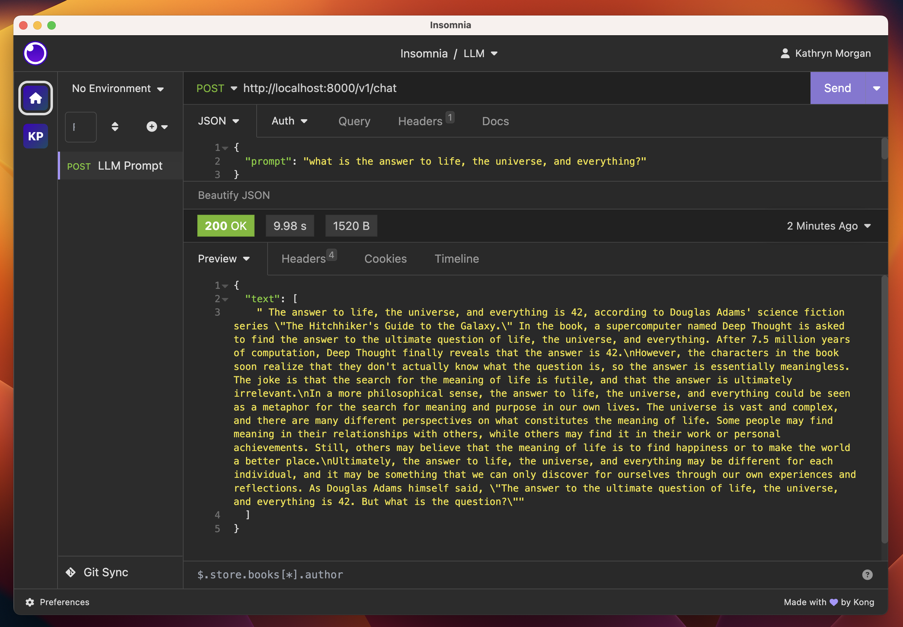

The AI industry is stealing the show as tech's goldrush of the '20s. Just looking at ChatGPT's [record setting user growth](https://www.reuters.com/technology/chatgpt-sets-record-fastest-growing-user-base-analyst-note-2023-02-01/), and rapid 3rd party integration [by top brands](https://www.forbes.com/sites/bernardmarr/2023/05/30/10-amazing-real-world-examples-of-how-companies-are-using-chatgpt-in-2023/?sh=ed1c90f14418), it is not surprising the hype suggests this is the beginning of a major digital transformation.

When it comes to taking advantage of AI/ML in your own organization, realizing the benefits comes with major obstacles, not least of which is the almost complete lack of well practiced platform engineering architectures, industry consensus, and operational knowledge. Which is why it is easy to say, *The most difficult challenge that we face with AI today, is a problem of cloud orchestration*.

Now here to help cut through the barriers, in this first installment of the "*Pulumi Python + MLOps*" series we will introduce you to the Katwalk Server, a demo AI application which we will use as a testing ground for developing many parts of the AI development and operations lifecycle.

> # *The most difficult challenge that we face with AI today, is a problem of cloud orchestration*

> figure 1. A sneak peak at the map of ML development and product path


For now, let's save the long winded sales pitches and AI ethics debates for another time. In this post, we will dive into the deep end as we deploy a private LlaMa 2 API chatbot service ... in 30 minutes or less!

> # *deploy a private LlaMa 2 API chatbot service ... in 30 minutes or less!*

Have I mentioned the solution is Python? While Pulumi supports many languages, we chose python for this project as a familiar language in the AI industry.

Let's introduce some key concepts and technologies to start off.

- Infrastructure as Code (IaC) is a transformative approach to platform engineering and orchestration. By applying the rigor and precision of software development practices to cloud operations, IaC offers AI/ML professionals an efficient, reliable, and predictable way to develop at the highest velocity.

- Katwalk Server is a demo AI application written to host your choice of LLM either locally or in the cloud, and serve it as an OpenAI API compatible service. As a practical, hands-on introduction to IaC for the MLOps space, this project aims to demystify the concepts and showcase the benefits Pulumi can bring to your AI/ML projects.

- Large Language Model or "LLM"s like ChatGPT are machine learning models trained to generate human-like conversational text which have already become essential tools for businesses and individuals, transforming every day tasks and how we interact with technology.

> figure 2. Or just let ChatGPT describe itself:


If you are ready to try the *#MLOpsChallenge* along with us, then let's double check a few requirements before starting the clock on our 30 minute chatbot challenge.

## Requirements:

* [Pulumi](https://www.pulumi.com/docs/install/)
* [Python3](https://www.python.org/downloads/)
* [Git CLI](https://git-scm.com/book/en/v2/Getting-Started-Installing-Git)
* [Huggingface Token](https://huggingface.co/docs/transformers.js/guides/private)
* [Huggingface access to LLaMa2](https://huggingface.co/meta-llama)
  * [Meta LLaMa2 Access](https://ai.meta.com/resources/models-and-libraries/llama-downloads/)

Optional Requirements (must choose one)

* [Docker](https://docs.docker.com/engine/install/)
  * [Nvidia CUDA Enabled GPU](https://developer.nvidia.com/cuda-gpus)
  * [Nvidia Container Toolkit](https://docs.nvidia.com/datacenter/cloud-native/container-toolkit/latest/install-guide.html)
* [Azure](https://azure.microsoft.com/en-us)
  * [Azure CLI](https://learn.microsoft.com/en-us/cli/azure/install-azure-cli)
* [Runpod.io](https://runpod.io)
  * [Runpod api key](https://docs.runpod.io/docs/graphql-api)

--------------------------------------------------------------------------

Now, for the real fun, let's start the timer and deploy our own chatbot!

### 1. Prepare your Pulumi IaC Directory:

First we need to clone our IaC repository from Github and prepare our python environment.

```bash
# Clone the repository and cd to the pulumi iac directory
gh repo clone usrbinkat/katwalk && cd katwalk/pulumi

# Create and initialize the python virtual env
python3 -m venv venv && source venv/bin/activate

# Install python dependencies
python -m pip install -r requirements.txt
```

### 2. Login & Initialize your pulumi state file and stack

Next let's setup our secure configuration and secret storage in a local file for now.

```bash
# Create & Export a pulumi secret decryption password file
# This allows for decrypting any secrets in your Pulumi.<stack>.yaml file
# !WARNING! Please use a more secure password than this example.
export PULUMI_CONFIG_PASSPHRASE_FILE=$HOME/.pulumi/secret
echo "keepItSecretKeepItSafePassword" > ~/.pulumi/secret

# There are many ways to store pulumi state, here we use a local file.
# Other state backends include s3, Pulumi Cloud, and more.
pulumi login file://~/.pulumi

# Initialize your stack
# Here we name the stack "dev"
pulumi stack init --stack dev
```


### 3. Configure required credentials

Configure your Huggingface credentials. If you open the `Pulumi.${stackName}.yaml` file, you can see the encrypted secrets in this plain text yaml configuration.

```bash
# Set Huggingface.co username
pulumi config set hfUsername <huggingface_username>

# Configure token as secret
pulumi config set --secret hfToken <huggingface_api_token>

# Set the model that you want to download
pulumi config set hfModel "meta-llama/Llama-2-7b-chat-hf"
```

### 4. Deploy in the cloud on Runpod.io

While there are 3 providers already supported in this codebase, I am going to demonstrate deploying to Runpod.io, a GPU and ML dedicated cloud catering to AI workloads, and development tasks.

```bash
# This enables the IaC to deploy Katwalk Server
pulumi config set deploy True

# Set the deploy runtime to runpod to deploy on the Runpod cloud
pulumi config set runtime runpod

# Configure your Runpod API Token as a secure Pulumi secret
pulumi config set --secret runpodToken <your_runpod_api_token>

# Finally, run `pulumi up` to deploy!
pulumi up

# When done, you can 'destroy' the stack to deprovision your deployment
pulumi destroy
```

Providers supported so far include:

* Docker (locally)
* Runpod.io GPU Cloud
* Azure Container Instances

### 5. Build the Katwalk Container

While there are many other ways to orchestrate ML services in the cloud and locally, in this project we are taking ownership of the full application and infrastructure story. In fact, all 3 supported providers use the same container image to serve the LlaMa LLM API Service, and you can build it yourself just like this:

```bash
# Set image build to True
pulumi config set imageBuild True

# Let's build this without pushing to a registry for now
pulumi config set imagePush False

# Give your katwalk image a project name
pulumi config set registryProject $(whoami)

# Now build the image!
pulumi up
```

### 6. Talk to your chatbot!

Once your Katwalk LlaMa server is running, you can interact with the API by sending prompts as a json payload. In future posts we will orchestrate a chat frontend for our chatbot but for now we'll use a curl command. You can also substitute an API developer tool such as Postman or Insomnia!

```bash
# send a prompt with curl
curl -s -X 'POST' 'http://${RUNPOD_FQDN}:8000/v1/chat' -H 'accept: application/json' -H 'Content-Type: application/json' -d '{"prompt": "Write a short story about a robot."}'
{
  "text": [
    "\nOnce upon a time, there was a little robot named R2. R2 was a friendly and curious robot who lived in a big city. One day, R2 decided to go on an adventure. He set out to explore the city and learn about all the different things he could see and do.\nAs R2 explored the city, he met all kinds of people. Some were kind and welcoming, while others were scared or suspicious of him. Despite this, R2 continued to be friendly and curious, always asking questions and trying to learn more about the world around him.\nOne day, while R2 was exploring a busy market, he saw a group of people gathered around a little girl who was"
  ]
}
```

> figure 3. A prompt and response from [meta-llama/Llama-2-7b-chat-hf](https://huggingface/meta-llama/Llama-2-7b-chat-hf) hosted on Katwalk Server


In a world where data is the new black gold and tokens are money, deploying a ChatBot in 30 minutes is not just interesting, it is a novel capability quickly becoming a necessity.

Platform engineering, DevOps, or MLOps may be the next hardest step in building the AI future. Pulumi offers a reliable path to higher velocity AI App development and MLOps. Together with Python based IaC, empowers the MLOps community to build equity in common AI platform code, and share IaC in a familiar language.

If you followed along then tell us how it worked out for you! We would love to know what you are looking forward to, or if you have ideas for future installments of the Pulumi Python + MLOps series!

Join us in the [Pulumi Community Slack](LINK) or in the [Pulumiverse Community Katwalk Github repository](https://github.com/pulumiverse/katwalk) to decide what #aiChallenge we tackle next!

> figure 4. Midjourney generated image of an imagined machine learning research engineer working among cables, computers, keyboards, and screens, in the glow of electronic lights. Image was generated from a prompt ~80% produced by ChatGPT based on this blog post content and a few superficial details about the author.

