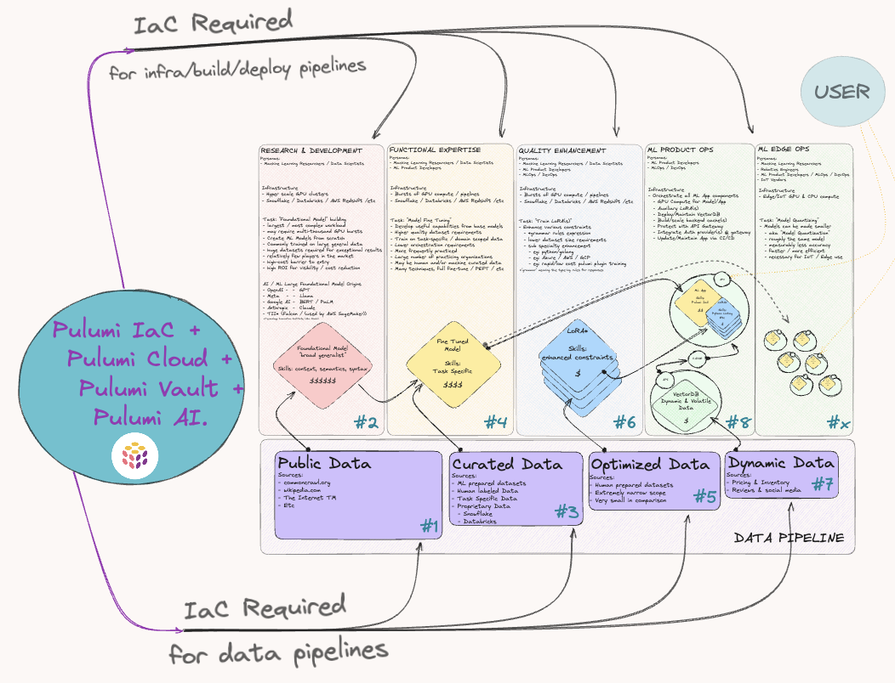
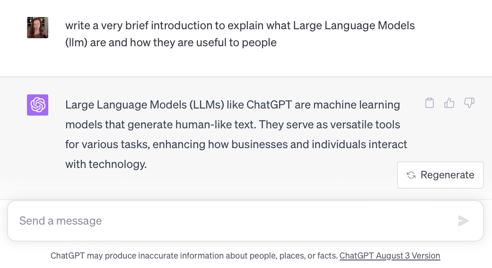

The AI industry is stealing the show as tech's goldrush of the '20s. Just looking at ChatGPT's [record setting user growth](https://www.reuters.com/technology/chatgpt-sets-record-fastest-growing-user-base-analyst-note-2023-02-01/), and rapid 3rd party integration [by top brands](https://www.forbes.com/sites/bernardmarr/2023/05/30/10-amazing-real-world-examples-of-how-companies-are-using-chatgpt-in-2023/?sh=ed1c90f14418), it is not surprising the hype suggests this is the beginning of a major digital transformation.

However, using AI/ML in your own products has some major challenges and obstacles. Below is a diagram of the end to end workflow of building and using an AI model:  preparing the data, training a model, fine-tuning a model, hosting and running a model, building a backend service to serve the model, and building the user interface that interacts with the model. Most AI engineers are only involved in a few steps of the process. However, there is one challenge that is common across the entire workflow:  creating and managing the cloud infrastructure is hard.

> Figure 1. A sneak peak at the map of ML development and product path


Training a model requires spinning up hyper scale GPU clusters. Preparing and consuming the training or fine-tuning data requires managing data warehouses and buckets of object storage. Building an AI backend service requires packaging the model, deploying and scaling the model across compute infrastructure, creating and managing the network infrastructure like load balancing, and managing the vector databases. Building great frontend user experiences requires provisioning and managing CDNs and web application services. Suffice to say:  *The most difficult challenge that we face with AI today is a problem of cloud orchestration*.

Most of this cloud orchestration today is done manually or with complex scripts. This is usually fraught with errors and simply doesn't scale. Too much time is spent making cloud infrastructure work instead of focusing on actual AI/ML tasks. Infrastructure as code (IaC) is a key component to solving the cloud orchestration challenge present in AI/ML. By applying the rigor and precision of software development practices to cloud operations, IaC offers AI/ML professionals an efficient, reliable, and predictable way to develop at the highest velocity. Pulumi is an open source infrastructure as code platform that allows engineers to use any programming languages, including Python, to provision and manage AI infrastructure.

This blog post is the first installment of a series on *AI Infrastructure as Python*. We will start this journey with building an AI backend service for a chatbot. In this post, we will deploy a LLM model behind an API backend running on compute infrastructure in the cloud. This entire infrastructure pipeline will be deployed using IaC written in Python. The series will follow this AI backend service through its evolution into a robust and resilient cloud native service.

> # *The most difficult challenge that we face with AI today is a problem of cloud orchestration*

Before we get into the details of using Pulumi to deploy a private LlaMa 2 API chatbot service---in 30 minutes or less, of course---let's start with some quick terminology/context:

- Katwalk Server is a demo AI application written to host your choice of LLM either locally or in the cloud, and serve it as an OpenAI API compatible service. As a practical, hands-on introduction to IaC for the MLOps space, this project aims to demystify the concepts and showcase the benefits Pulumi can bring to your AI/ML projects.
- Large Language Models or LLMs (like ChatGPT) are machine learning models trained to generate human-like conversational text which have already become essential tools for businesses and individuals, transforming every day tasks and how we interact with technology.
- [LlaMa](https://ai.meta.com/llama/) is an LLM created by Meta, available for free for research and commercial use.

> Figure 2. Or just let ChatGPT describe itself


## Deploy a private LlaMa 2 API chatbot service ... in 30 minutes or less!

If you are ready to try the *#MLOpsChallenge* along with us, then let's double check a few requirements before starting the clock on our 30 minute chatbot challenge. While Pulumi supports many languages, we chose Python for this project, as Python is a familiar language in the AI industry.

### Requirements

* [Pulumi CLI](https://www.pulumi.com/docs/install/)
* [Pulumi account and access token](https://app.pulumi.com/signup)
* [Python3 (3.11+)](https://www.python.org/downloads/)
* [Git CLI](https://git-scm.com/book/en/v2/Getting-Started-Installing-Git)
* [Huggingface Token](https://huggingface.co/docs/transformers.js/guides/private)
* [Huggingface access to LLaMa2](https://huggingface.co/meta-llama)
  * [Meta LLaMa2 Access](https://ai.meta.com/resources/models-and-libraries/llama-downloads/)

Choose one of the following deployment platforms. (You can actually choose more than one, if you'd like!)

* [Docker](https://docs.docker.com/engine/install/)
  * [Nvidia CUDA Enabled GPU](https://developer.nvidia.com/cuda-gpus)
  * [Nvidia Container Toolkit](https://docs.nvidia.com/datacenter/cloud-native/container-toolkit/latest/install-guide.html)
* [Azure](https://azure.microsoft.com/en-us)
  * [Azure CLI](https://learn.microsoft.com/en-us/cli/azure/install-azure-cli)
* [Runpod.io](https://runpod.io)
  * [Runpod api key](https://docs.runpod.io/docs/graphql-api)

Now, for the real fun, let's start the timer and deploy our own chatbot! Note that the instructions below are for Runpod; instructions for the other two deployment platforms are found in [the GitHub repository](https://github.com/pulumiverse/katwalk).

### 1. Prepare your Pulumi IaC directory

First we need to clone our IaC repository from GitHub and prepare our Python environment.

```bash
# Clone the repository and cd to the pulumi iac directory
git clone https://github.com/pulumiverse/katwalk && cd katwalk/pulumi

# Create and initialize the python virtual env
python3 -m venv venv && source venv/bin/activate

# Install python dependencies
python3 -m pip install -r requirements.txt
```

### 2. Login to Pulumi Cloud and initialize stack

Next, let's setup our state and secrets store in Pulumi Cloud.

```bash
# There are many ways to store Pulumi state, here we use Pulumi Cloud
# Other state backends include S3, local file, and more
pulumi login

# Initialize your stack
# Here we name the stack "dev"
pulumi stack init --stack dev
```

### 3. Configure required credentials

Configure your Huggingface credentials. If you open the `Pulumi.${stackName}.yaml` file, you can see the encrypted secrets in this plain text YAML configuration.

```bash
# Set Huggingface.co username
pulumi config set hfUsername <huggingface_username>

# Configure token as secret
pulumi config set --secret hfToken <huggingface_api_token>

# Set the model that you want to download
pulumi config set hfModel "meta-llama/Llama-2-7b-chat-hf"
```

### 4. Deploy in the cloud on Runpod.io

While there are three providers already supported in this codebase, this post illustrates deploying to Runpod.io, a GPU and ML dedicated cloud catering to AI workloads and development tasks.

```bash
# This enables the IaC to deploy Katwalk Server
pulumi config set deploy True

# Set the deploy runtime to runpod to deploy on the Runpod cloud
pulumi config set runtime runpod

# Configure your Runpod API Token as a secure Pulumi secret
# API token available at https://www.runpod.io/console/user/settings
pulumi config set --secret runpodToken <your_runpod_api_token>

# Finally, run `pulumi up` to deploy!
pulumi up

# When done, you can 'destroy' the stack to deprovision your deployment
pulumi destroy
```

There's currently [a bug](https://github.com/pulumiverse/katwalk/issues/9) in the code that does not return the fully-qualified domain name (FQDN) from Runpod for your chatbot instance. To get the FQDN (referenced later in this post as `RUNPOD_FQDN`), you'll need to log into Runpod and [retrieve that information](https://www.runpod.io/console/pods).

### 5. Build the Katwalk container

While there are many other ways to orchestrate ML services in the cloud and locally, in this project we are taking ownership of the full application and infrastructure story. In fact, all three supported providers use the same container image to serve the LlaMa LLM API Service, and you can build it yourself just like this:

```bash
# Set image build to True
pulumi config set imageBuild True

# Let's build this without pushing to a registry for now
pulumi config set imagePush False

# Give your katwalk image a project name
pulumi config set registryProject $(whoami)

# Now build the image!
pulumi up
```

### 6. Talk to your chatbot!

Once your Katwalk LlaMa server is running, you can interact with the API by sending prompts as a JSON payload. In future posts we will orchestrate a chat frontend for our chatbot but for now we'll use a `curl` command. You can also substitute an API developer tool such as [Postman](https://www.postman.com/) or [Insomnia](https://insomnia.rest/)!

```bash
# send a prompt with curl
curl -s -X 'POST' 'http://${RUNPOD_FQDN}/v1/chat' -H 'accept: application/json' -H 'Content-Type: application/json' -d '{"prompt": "Write a short story about a robot."}'
{
  "text": [
    "\nOnce upon a time, there was a little robot named R2. R2 was a friendly and curious robot who lived in a big city. One day, R2 decided to go on an adventure. He set out to explore the city and learn about all the different things he could see and do.\nAs R2 explored the city, he met all kinds of people. Some were kind and welcoming, while others were scared or suspicious of him. Despite this, R2 continued to be friendly and curious, always asking questions and trying to learn more about the world around him.\nOne day, while R2 was exploring a busy market, he saw a group of people gathered around a little girl who was"
  ]
}
```

> Figure 3. A prompt and response from [meta-llama/Llama-2-7b-chat-hf](https://huggingface/meta-llama/Llama-2-7b-chat-hf) hosted on Katwalk Server


In a world where "data is the new black gold" and tokens are money, deploying a chatbot in 30 minutes is not just interesting, it is a novel capability quickly becoming a necessity.

Platform engineering, DevOps, or MLOps may be the next hardest step in building the AI future. Pulumi offers a reliable path to higher velocity AI App development and MLOps. Together with Python-based IaC, it empowers the MLOps community to build equity in common AI platform code, and share IaC in a familiar language.

If you followed along then tell us how it worked out for you! We would love to know what you are looking forward to, or if you have ideas for future installments of the Pulumi Python + MLOps series!

Join us in the [Pulumi Community Slack](https://slack.pulumi.com) or in the [Pulumiverse Community Katwalk Github repository](https://github.com/pulumiverse/katwalk) to decide what #aiChallenge we tackle next!

> Figure 4. Midjourney generated image of an imagined machine learning research engineer working among cables, computers, keyboards, and screens, in the glow of electronic lights. Image was generated from a prompt ~80% produced by ChatGPT based on this blog post content and a few superficial details about the author

