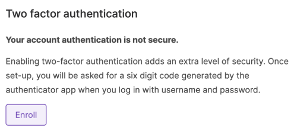
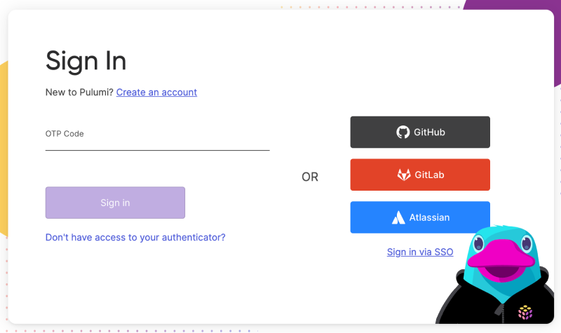

We are excited to announce that all users of Pulumi Cloud can now secure their account with multi-factor authentication (MFA). By requiring an additional verification step during the login process, MFA shields against unauthorized access, reducing the risk of breaches. This feature aligns with our commitment to providing robust security measures for our users. As an organization administrator, you can further protect your organization by having your members enable MFA.
<!--more-->

### How to set it up

Let's walk through the steps to enable MFA on your account:

1. Click on your account avatar in the top right corner
2. Navigate to Account Settings
3. Scroll to the MFA section
4. Press Enroll
    
5. Use your authenticator application of choice to scan the QR code or paste the code
6. On your next login, you will be prompted for a passcode:
    

You are enrolled! When signing in you will now be asked for a one-time passcode.

### Limitations

Initially, MFA in Pulumi Cloud will support TOTP (time-based one-time passwords) and it will only be available for Pulumi Cloud-backed users. Users authenticating with a third party (such as GitHub or GitLab) will need to use MFA through those providers at this time. Some other future improvements we are considering and will prioritize based on feedback we hear from customers are extending support for WebAuthN/passkeys, Duo, SMS/Email OTP and admins enforcing MFA for their entire organization.

### Wrapping it up

We're committed to continually evolving our services to meet the needs of our diverse and growing user base. Stay tuned for more updates and features as we progress on this journey together.
