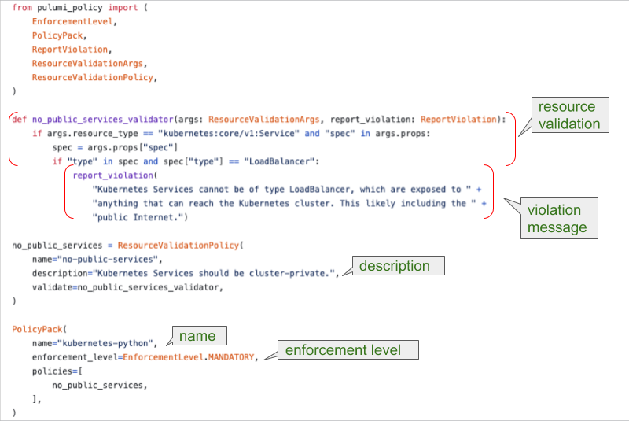

Policies protect your infrastructure by controlling access, set limits that reduce the blast radius of an incident, and manage infrastructure operations. Policies are commonly created through a form on a cloud provider's administrative console, making replicating or versioning the policy more difficult. With Policy as Code, you can apply software engineering practices such as automated testing, deployment, and version control when creating policies.

CrossGuard is Pulumi's Policy as Code solution that lets you create, verify, apply, and enforce policies. Policies are standalone packages that can be run against any Pulumi stack. That means your policies are language agnostic and work with any language supported by Pulumi. Policy Packages are policy bundles that evaluate every resource in your stack, whether deployed in AWS, Azure, Google Cloud, or Kubernetes.

<!--more-->

The key features of CrossGuard are:

- Policy SDK for coding custom policies using TypeScript/JavaScript or Python
- Validating infrastructure before deployment by verifying it locally
- Policy Packs for enforcing best practices for security, reliability, and cost
- Validating all the infrastructure deployed by an organization.

Whether you create policies for a single project or across your organization, CrossGuard enforces best practices for cost, compliance, security, and team practices.

## Parts of a policy

A policy is made up of the following parts:

- a name
- a description
- an enforcement level
- a resource validation
- a message to report the violation



Policies enforce a specific logic. In the example above, Kubernetes can't expose services to the Internet. We accomplish this by not allowing a `spec` to create LoadBalancer when a service is declared. Policies are checked during `pulumi preview` and during `pulumi update` to enforce defined restrictions.

There are two types of policies, a `ResourceValidationPolicy` that validates a particular resource in a stack, and a  `StackValidationPolicy` that validates the stack as a whole. When CrossGuard calls a `ResourceValidationPolicy`, it checks each resource in the stack. These checks are before a resource is created and blocks any resources that fail the policy logic.

A `StackValidationPolicy` is run against the entire stack, requiring all the resources to be created and registered. Resources that fail validation will be blocked from being created or modified during `pulumi up`. Out of compliance resources will fail during preview or update, and we recommend running `pulumi preview` to catch these resources. Stack validation policies inspect multiple resources at once. This lets you validate resources dependent on other resources, such as a database that requires persistent storage.

Now that we understand how CrossGuard works. let's look at examples for several cloud providers and Kubernetes.

## Examples

The following examples are a common scenario showing how to prevent access to data in AWS, Azure, Google Cloud Platform, and Kubernetes using either TypeScript or Python to create policies. You can try out any of these policies by creating a new directory and running `pulumi policy new`, e.g.:

```bash
$ mkdir az-python-storage-policy && cd az-python-storage-policy
$ pulumi policy new azure-python
```

### AWS


{}

```typescript
import * as aws from "@pulumi/aws";
import { PolicyPack, ReportViolation, validateResourceOfType } from "@pulumi/policy";

new PolicyPack("policy-pack-typescript", {
    policies: [{
        name: "s3-no-public-read",
        description: "Prohibits setting the publicRead or publicReadWrite permission on AWS S3 buckets.",
        enforcementLevel: "mandatory",
        validateResource: validateResourceOfType(aws.s3.Bucket, (bucket, args, reportViolation) => {
            if (bucket.acl === "public-read" || bucket.acl === "public-read-write") {
                reportViolation(
                    "You cannot set public-read or public-read-write on an S3 bucket. " +
                    "Read more about ACLs here: https://docs.aws.amazon.com/AmazonS3/latest/dev/acl-overview.html");
            }
        }),
    }],
});
```

{}
{}

```python
from pulumi_policy import (
    EnforcementLevel,
    PolicyPack,
    ReportViolation,
    ResourceValidationArgs,
    ResourceValidationPolicy,
)

def s3_no_public_read_validator(args: ResourceValidationArgs, report_violation: ReportViolation):
    if args.resource_type == "aws:s3/bucket:Bucket" and "acl" in args.props:
        acl = args.props["acl"]
        if acl == "public-read" or acl == "public-read-write":
            report_violation(
                "You cannot set public-read or public-read-write on an S3 bucket. " +
                "Read more about ACLs here: https://docs.aws.amazon.com/AmazonS3/latest/dev/acl-overview.html")

s3_no_public_read = ResourceValidationPolicy(
    name="s3-no-public-read",
    description="Prohibits setting the publicRead or publicReadWrite permission on AWS S3 buckets.",
    validate=s3_no_public_read_validator,
)

PolicyPack(
    name="aws-python",
    enforcement_level=EnforcementLevel.MANDATORY,
    policies=[
        s3_no_public_read,
    ],
)
```

{}


### Azure


{}

```typescript
import * as azure from "@pulumi/azure";
import { PolicyPack, validateResourceOfType } from "@pulumi/policy";

new PolicyPack("azure-typescript", {
    policies: [{
        name: "storage-container-no-public-read",
        description: "Prohibits setting the public permission on Azure Storage Blob Containers.",
        enforcementLevel: "mandatory",
        validateResource: validateResourceOfType(azure.storage.Container, (container, args, reportViolation) => {
            if (container.containerAccessType === "blob" || container.containerAccessType === "container") {
                reportViolation(
                    "Azure Storage Container must not have blob or container access set. " +
                    "Read more about read access here: " +
                    "https://docs.microsoft.com/en-us/azure/storage/blobs/storage-manage-access-to-resources");
            }
        }),
    }],
});
```

{}
{}

```python
from pulumi_policy import (
    EnforcementLevel,
    PolicyPack,
    ReportViolation,
    ResourceValidationArgs,
    ResourceValidationPolicy,
)

def storage_container_no_public_read_validator(args: ResourceValidationArgs, report_violation: ReportViolation):
    if args.resource_type == "azure:storage/container:Container" and "containerAccessType" in args.props:
        access_type = args.props["containerAccessType"]
        if access_type == "blob" or access_type == "container":
            report_violation(
                "Azure Storage Container must not have blob or container access set. " +
                "Read more about read access here: " +
                "https://docs.microsoft.com/en-us/azure/storage/blobs/storage-manage-access-to-resources")

storage_container_no_public_read = ResourceValidationPolicy(
    name="storage-container-no-public-read",
    description="Prohibits setting the public permission on Azure Storage Blob Containers.",
    validate=storage_container_no_public_read_validator,
)

PolicyPack(
    name="azure-python",
    enforcement_level=EnforcementLevel.MANDATORY,
    policies=[
        storage_container_no_public_read,
    ],
)
```

{}


### Google Cloud


{}

```typescript
import * as gcp from "@pulumi/gcp";
import { PolicyPack, validateResourceOfType } from "@pulumi/policy";

new PolicyPack("gcp-typescript", {
    policies: [{
        name: "storage-bucket-no-public-read",
        description: "Prohibits setting the publicRead or publicReadWrite permission on GCP Storage buckets.",
        enforcementLevel: "mandatory",
        validateResource: validateResourceOfType(gcp.storage.BucketACL, (acl, args, reportViolation) => {
            if (acl.predefinedAcl === "public-read" || acl.predefinedAcl === "public-read-write") {
                reportViolation("Storage buckets acl cannot be set to public-read or public-read-write.");
            }
        }),
    }],
});
```

{}
{}

```python
from pulumi_policy import (
    EnforcementLevel,
    PolicyPack,
    ReportViolation,
    ResourceValidationArgs,
    ResourceValidationPolicy,
)

def storage_bucket_no_public_read_validator(args: ResourceValidationArgs, report_violation: ReportViolation):
    if args.resource_type == "gcp:storage/bucketACL:BucketACL" and "predefinedAcl" in args.props:
        acl = args.props["predefinedAcl"]
        if acl == "public-read" or acl == "public-read-write":
            report_violation("Storage buckets acl cannot be set to public-read or public-read-write.")

storage_bucket_no_public_read = ResourceValidationPolicy(
    name="storage-bucket-no-public-read",
    description="Prohibits setting the publicRead or publicReadWrite permission on GCP Storage buckets.",
    validate=storage_bucket_no_public_read_validator,
)

PolicyPack(
    name="gcp-python",
    enforcement_level=EnforcementLevel.MANDATORY,
    policies=[
        storage_bucket_no_public_read,
    ],
)
```

{}


### Kubernetes


{}

```typescript
import * as k8s from "@pulumi/kubernetes";
import { PolicyPack, validateResourceOfType } from "@pulumi/policy";

new PolicyPack("kubernetes-typescript", {
    policies: [{
        name: "no-public-services",
        description: "Kubernetes Services should be cluster-private.",
        enforcementLevel: "mandatory",
        validateResource: validateResourceOfType(k8s.core.v1.Service, (svc, args, reportViolation) => {
            if (svc.spec && svc.spec.type === "LoadBalancer") {
                reportViolation("Kubernetes Services cannot be of type LoadBalancer, which are exposed to " +
                    "anything that can reach the Kubernetes cluster. This likely including the " +
                    "public Internet.");
            }
        }),
    }],
});
```

{}
{}

```python
from pulumi_policy import (
    EnforcementLevel,
    PolicyPack,
    ReportViolation,
    ResourceValidationArgs,
    ResourceValidationPolicy,
)

def no_public_services_validator(args: ResourceValidationArgs, report_violation: ReportViolation):
    if args.resource_type == "kubernetes:core/v1:Service" and "spec" in args.props:
        spec = args.props["spec"]
        if "type" in spec and spec["type"] == "LoadBalancer":
            report_violation(
                "Kubernetes Services cannot be of type LoadBalancer, which are exposed to " +
                "anything that can reach the Kubernetes cluster. This likely including the " +
                "public Internet.")

no_public_services = ResourceValidationPolicy(
    name="no-public-services",
    description="Kubernetes Services should be cluster-private.",
    validate=no_public_services_validator,
)

PolicyPack(
    name="kubernetes-python",
    enforcement_level=EnforcementLevel.MANDATORY,
    policies=[
        no_public_services,
    ],
)
```

{}


## All Clouds and all resources

Policy as Code is a powerful tool for protecting and managing your infrastructure. As you can see, Pulumi supports policies for all resources on all clouds. We have examples and articles to get you started with Policy as Code.

- [Policy Pack Examples](https://github.com/pulumi/examples/tree/master/policy-packs)
- [Get Started with Policy as Code]()
- [New Policy as Code Capabilities with CrossGuard]()
- [Automatically Enforcing AWS Resource Tagging Policies]()
- [Manage Any Infrastructure with Policy as Code]()
- [Enforcing Different Kinds of Policies for Cloud Resources]()
- [Running AWS IAM Access Analyzer at Deployment Time]()
- [Authoring CrossGuard Policy with Open Policy Agent (OPA)]()
