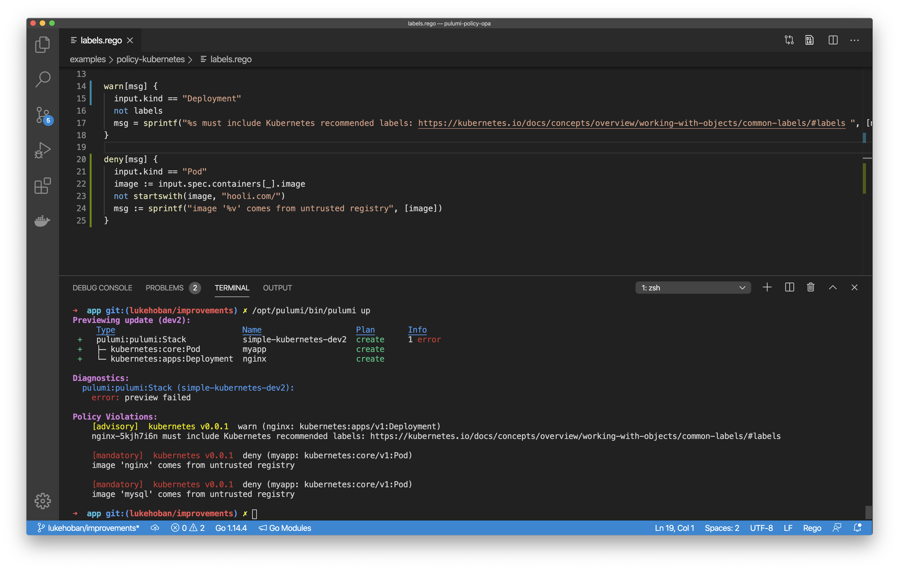

Today, we’re excited to [announce](https://info.pulumi.com/press-release/kubernetes) several new open source projects that advance Pulumi’s Kubernetes support.  These projects and features have been developed while helping leading cloud native engineering teams like Snowflake, Lemonade, and Mercedes-Benz go into production with Kubernetes, and include new deployment automation options, improved ecosystem integrations, and tools to make it easier than ever to adopt Pulumi for new and existing projects.

<!--more-->

These new capabilities include:

* A new in-cluster **Pulumi Kubernetes Operator** provides a Kubernetes-native GitOps experience for managing infrastructure on any cloud or Kubernetes cluster.
* A **`kube2pulumi`** tool for converting YAML manifests to Pulumi Python, TypeScript, Go, or .NET brings Pulumi’s software engineering capabilities for Infrastructure-as-Code to bear on complex Kubernetes applications.
* Support for authoring **Open Policy Agent (OPA)-based policies in Pulumi's CrossGuard policy-as-code framework** and enforcing rules across an organization.
* A **`crd2pulumi`** tool to create strongly-typed APIs for any Kubernetes CRD, making it easy to leverage the full ecosystem of API extensions in the Cloud Native community.

Along with additional significant new features launched in the last few months:

* A **Pulumi plugin for Spinnaker** enabling teams to use the same cloud native continuous delivery platform for both application and infrastructure deployments.
* Support for deploying **Helm 3** and **Kustomize** as part of Pulumi programs using the core Pulumi Kubernetes library.

Whether you are designing your cloud native delivery platform, looking to enforce policy across cloud infrastructure and Kubernetes, or looking to bring robust software engineering practices to your Kubernetes workloads, these features continue to make Pulumi [a better way to Kubernetes]()!

## Pulumi + Kubernetes

Pulumi is an Infrastructure as Code platform designed from the ground up for the modern cloud. That means deep support for containers, serverless, and Kubernetes, using your favorite programming languages to define, test, and manage your cloud infrastructure. Pulumi supports easy provisioning of Kubernetes clusters in many different managed platforms, including AWS, Azure, GCP, Digital Ocean, Rancher, Linode, and Civo. Additionally, Pulumi can manage resources inside a Kubernetes cluster using the same powerful tools, replacing the need for brittle and unscalable YAML configuration. Best of all, Pulumi combines these into a single cohesive programming model across your cloud infrastructure in managed cloud services *and* in Kubernetes.

Kubernetes has been at the center of many Pulumi-enabled cloud modernization projects, including provisioning managed Kubernetes clusters, connecting them to supporting cloud infrastructure, enabling platform teams to configure and manage platforms on top of Kubernetes, and allowing teams to replace unmaintainable piles of YAML with code and software-based deployment processes. Hundreds of modern cloud engineering teams have been able to accelerate the move to the cloud and Kubernetes thanks to Pulumi.

Let's take a look now at each of the new Pulumi superpowers for working with Kubernetes!

## Pulumi Kubernetes Operator

Pulumi integrates into [more than a dozen CI/CD and delivery systems](), automating the delivery of cloud infrastructure changes to AWS, Azure, GCP, Kubernetes, and more. This includes traditional CI tools like [Jenkins](), managed CI/CD platforms like Azure DevOps, and cloud native continuous delivery platforms like [Spinnaker]() (see below for more details!). At the same time, we have heard feedback from Pulumi users looking to automate their delivery processes inside Kubernetes using a GitOps approach to delivery - both for Kubernetes workloads and for cloud infrastructure in any Pulumi-supported Cloud Provider in the [Registry]().

We’re excited to announce the new [pulumi-kubernetes-operator](https://github.com/pulumi/pulumi-kubernetes-operator) open source project which provides a new Kubernetes-native option for infrastructure delivery. The Pulumi Kubernetes Operator allows you to specify the cloud infrastructure to deploy using a new `Stack` CustomResource in your Kubernetes cluster. The operator continuously drives the state of your cloud resources to align with the specified Stack. Stack resources can point at any Pulumi program in any Git repository, and use that program to define the desired state of the infrastructure. These stacks provide the full flexibility of Pulumi, including the ability to enforce policy using CrossGuard policy-as-code coupled with the benefits of the declarative Kubernetes resource model. You can create these Stack resources in normal Kubernetes YAML, or use Pulumi to manage the Kubernetes resources as well!


Creating a Stack is simple: provide the stack name, project repo, and a commit (support for branches coming soon!), and the operator starts driving toward the specified state. Stacks can be used directly, or as part of higher-level abstractions to manage your infrastructure and applications. The [Pulumi Console]() augments these capabilities by providing visibility into the updates, resources under management, and policy enforcement of your stacks.

```yaml
apiVersion: pulumi.com/v1alpha1
kind: Stack
metadata:
  name: s3-bucket-stack
spec:
  stack: acmecorp/s3-op-project/dev
  projectRepo: https://github.com/joeduffy/test-s3-op-project
  commit: cc5442870f1195216d6bc340c14f8ae7d28cf3e2
  config:
    aws:region: us-east-2
  initOnCreate: true
  accessTokenSecret: pulumi-api-secret
  envSecrets:
    - pulumi-aws-secrets
```

## Pulumi Spinnaker Plugin

Many teams using Spinnaker have asked about automating the delivery of their cloud infrastructure changes using Pulumi through the same great continuous delivery platform that Spinnaker offers for application deployments.  As launch partners for the new Spinnaker Plugin model announced in June, Pulumi and Spinnaker worked closely together to deliver complete support for Pulumi inside the Spinnaker continuous deployment platform.  

You can check out the Pulumi Spinnaker integration in this presentation from Spinnaker Live and in the [Spinnaker guide]() in the Pulumi docs.



## YAML to Pulumi

Kubernetes YAML offers a simple lowest-common-denominator approach for authoring configuration to apply to a Kubernetes cluster. But it is cumbersome to manage and difficult to scale as the complexity of the Kubernetes infrastructure and workloads increases. Pulumi provides a compelling solution to manage that complexity - apply the software engineering benefits of your favorite programming language - including Python, TypeScript, .NET, and Go! Using these languages to manage Kubernetes infrastructure provides useful abstraction (reusable functions and classes), simple configuration (parameters and interfaces), strong typing and tooling (IDEs, error checking as you type), and testing (bring your favorite unit testing framework).

With today’s release of [`kube2pulumi`](https://github.com/pulumi/kube2pulumi), it’s easier than ever to get all of these benefits by migrating your existing Kubernetes YAML (or JSON) into Pulumi code in Python, TypeScript, .NET or Go. The complete Kubernetes API surface area is available from Pulumi, so the code generated by `kube2pulumi` supports every feature of Kubernetes you might be using today. Convert one resource or an entire directory of manifests at a time! Once converted, deploy to your cluster with a simple `pulumi up`.

Your existing YAML:

```yaml
apiVersion: v1
kind: Namespace
metadata:
  name: foo
```

Becomes strongly-typed code in Pulumi:



{}

```typescript
import * as pulumi from "@pulumi/pulumi";
import * as kubernetes from "@pulumi/kubernetes";

const fooNamespace = new kubernetes.core.v1.Namespace("fooNamespace", {
    metadata: {
        name: "foo",
    },
});
```

{}

{}

```python
import pulumi
import pulumi_kubernetes as kubernetes

foo_namespace = kubernetes.core.v1.Namespace("fooNamespace",
    metadata={
        "name": "foo",
    })
```

{}

{}

```csharp
using Pulumi;
using Kubernetes = Pulumi.Kubernetes;

class MyStack : Stack
{
    public MyStack()
    {
        var fooNamespace = new Kubernetes.Core.V1.Namespace("fooNamespace", new Kubernetes.Types.Inputs.Core.V1.NamespaceArgs
        {
            Metadata = new Kubernetes.Types.Inputs.Meta.V1.ObjectMetaArgs
            {
                Name = "foo",
            },
        });
    }

}
```

{}

{}

```go
package main

import (
        corev1 "github.com/pulumi/pulumi-kubernetes/sdk/v2/go/kubernetes/core/v1"
        metav1 "github.com/pulumi/pulumi-kubernetes/sdk/v2/go/kubernetes/meta/v1"
        "github.com/pulumi/pulumi/sdk/v2/go/pulumi"
)

func main() {
        pulumi.Run(func(ctx *pulumi.Context) error {
                _, err := corev1.NewNamespace(ctx, "fooNamespace", &corev1.NamespaceArgs{
                        Metadata: &metav1.ObjectMetaArgs{
                                Name: pulumi.String("foo"),
                        },
                })
                if err != nil {
                        return err
                }
                return nil
        })
}
```

{}



And best of all - you can try it out yourself at [pulumi.com/kube2pulumi]() to see how easy it is to bring your Kubernetes YAML to Pulumi!

[]()

## Strongly-Typed Kubernetes CRDs

As the Kubernetes ecosystem grows, projects across the Cloud Native landscape build powerful new extensions on top of the core Kubernetes resource model via [CustomResources](https://kubernetes.io/docs/concepts/extend-kubernetes/api-extension/custom-resources/). These Custom Resources extend the Kubernetes API to provide first-class support for everything from Service Meshes to Storage extensions to Observability infrastructure and much more (including the Pulumi Kubernetes Operator!). While Pulumi offers a strongly-typed API for 100% of the core Kubernetes API, so far it has only exposed these extensions via the weakly-typed and general-purpose `CustomResource` API in Kubernetes.

Today’s launch of the [`crd2pulumi`](https://github.com/pulumi/pulumi-kubernetes/tree/master/provider/cmd/crd2pulumi) tool brings the same rich support for strongly-typed APIs in TypeScript and Go (Python and .NET coming soon!) to all of these extensions. Users can generate a strongly-typed programming language API directly from the Custom Resource Definition’s OpenAPI spec, and regenerate it if and when that spec is updated. Any code using the CRD benefits from IDE tooling, strong typing, and the ease of creating new custom abstractions. These benefits become more pronounced as the complexity of the infrastructure managed by the custom resource increases. Many CRDs encourage design patterns involving fine-grained and frequently-updated resource definitions, and Pulumi’s modern infrastructure as code approach greatly simplifies managing an ever-growing ecosystem of new APIs.

For example, the commonly used [cert-manager](https://cert-manager.io/docs/installation/kubernetes/) CRD extends Kubernetes with the ability to easily configure Certificate Authorities and request certificates. After generating API wrappers with `crd2pulumi`, users can interact with the Cert Manager API from code:




{}

```typescript
import * as certificates from "./certificates"

// Register the Certificate CRD.
new certificates.CertificateDefinition("certificate");

// Instantiate a Certificate resource.
new certificates.v1beta1.Certificate("example-cert", {
    metadata: {
        name: "example-com",
    },
    spec: {
        secretName: "example-com-tls",
        duration: "2160h",
        renewBefore: "360h",
        commonName: "example.com",
        dnsNames: [
            "example.com",
            "www.example.com",
        ],
        issuerRef: {
            name: "ca-issuer",
            kind: "Issuer",
        }
    }
});
```

{}

{}

{}
Coming soon along with overall [improved Python typing support](https://github.com/pulumi/pulumi/issues/3771)!
{}

{}

{}

{}
Coming soon!
{}

{}

{}

```go
package main

import (
	certv1b1 "goexample/certificates/v1beta1"

	metav1 "github.com/pulumi/pulumi-kubernetes/sdk/v2/go/kubernetes/meta/v1"
	"github.com/pulumi/pulumi-kubernetes/sdk/v2/go/kubernetes/yaml"
	"github.com/pulumi/pulumi/sdk/v2/go/pulumi"
)

func main() {
	pulumi.Run(func(ctx *pulumi.Context) error {

		// Register the Certificate CRD.
        _, err := yaml.NewConfigFile(ctx, "my-certificate-definition",
			&yaml.ConfigFileArgs{
				File: "certificate.yaml",
			},
		)
		if err != nil {
			return err
		}

		// Instantiate a Certificate resource.
        _, err = certv1b1.NewCertificate(ctx, "example-cert", &certv1b1.CertificateArgs{
			Metadata: &metav1.ObjectMetaArgs{
				Name: pulumi.String("example-com"),
			},
			Spec: certv1b1.CertificateSpecArgs{
				SecretName:  pulumi.String("example-com-tls"),
				Duration:    pulumi.String("2160h"),
				RenewBefore: pulumi.String("360h"),
				CommonName:  pulumi.String("example.com"),
				DnsNames: pulumi.StringArray{
					pulumi.String("example.com"),
					pulumi.String("www.example.com"),
				},
				IssuerRef: certv1b1.CertificateSpecIssuerRefArgs{
					Name: pulumi.String("ca-issuer"),
					Kind: pulumi.String("Issuer"),
				},
			},
		})
		if err != nil {
			return err
		}

		return nil
	})
}
```

{}



## OPA support in Pulumi CrossGuard Policy-as-Code

Pulumi’s [CrossGuard]() policy-as-code framework enforces policy across all your modern cloud infrastructure and/or in Kubernetes - using the full expressiveness of rich programming languages. It is deeply integrated into the deployment process to ensure that policy violations are identified *before* infrastructure is deployed instead of minutes or hours after changes are made.

Today’s release of [Open Policy Agent](https://www.openpolicyagent.org/) (OPA) support in Pulumi policy-as-code extends the existing support for TypeScript and Python to include OPA’s `.rego` language and runtime for declarative policy specification. As an emerging standard for cloud native policy, OPA is already used across a wide variety of cloud native technologies, and can now also be leveraged to author policies to run in Pulumi’s policy model across any cloud or Kubernetes.

OPA-based rules can be authored using Pulumi’s rich resource model (top pane) and enforced as part of deployments to any infrastructure (bottom pane).



And as part of Pulumi’s support for organizational enforcement of policy, OPA-based policy can be enforced across all infrastructure deployments in your organization (including across different clouds and in Kubernetes clusters).


## Helm 3 and Kustomize

Pulumi's Kubernetes support has long included support for both defining Kubernetes resources directly in your Pulumi program, as well as using Pulumi to deploy Kubernetes resources from existing YAML or Helm. With a wealth of existing YAML and Helm content out in the ecosystem, these features have been used heavily by cloud engineering teams to deploy critical Kubernetes platform services and application logic into their Kubernetes clusters.  

Over the last few months, we've extended this support in two key ways. We added support for Helm 3, giving Pulumi programs access to the new generation of Helm Charts. And we [added support for Kustomize](), so that the same `kustomizations` that are supported by `kubectl` can also be deployed natively with Pulumi. Together these two enhancement ensure that Pulumi users have full access to the incredible ecosystem of content available for Kubernetes.


## Conclusion

We’re incredibly excited about today’s new features and the opportunity to deepen Pulumi’s support for Kubernetes and the Cloud Native ecosystem. The Pulumi Kubernetes Operator unlocks exciting new approaches to cloud native infrastructure delivery. The `kube2pulumi` tool makes it easier than ever to migrate from cumbersome YAML to expressive code. Strongly-typed CRDs bring the richness of Pulumi to the entire Cloud Native ecosystem of extensions to the Kubernetes platform. And OPA support in Pulumi policy-as-code brings cloud native policy authoring with OPA into the Pulumi Modern Infrastructure-as-Code world.

It’s never been a more exciting time to get started with Pulumi and Kubernetes for your next modern cloud project.  Check out the new features or the Pulumi Kubernetes [Getting Started]() today.  

You can learn more about each of the new capabilities in their corresponding project documentation:

* [Pulumi Kubernetes Operator](https://github.com/pulumi/pulumi-kubernetes-operator)
* [Strongly-typed CRDs](https://github.com/pulumi/pulumi-kubernetes/tree/master/provider/cmd/crd2pulumi)
* [kube2pulumi](https://github.com/pulumi/kube2pulumi)
* [OPA for Pulumi CrossGuard](https://github.com/pulumi/pulumi-policy-opa)
* [Spinnaker Pulumi Plugin]()
* [Helm 3 and Kustomize]()
