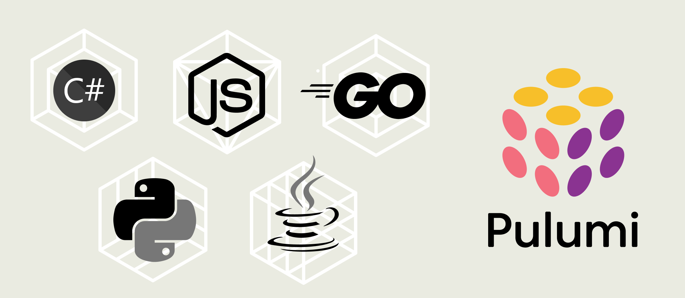

Every experienced tech professional I know has a programming language they love. But is it the syntax and symbols that make it so loveable? Not really. It's the community and package ecosystem surrounding the language that makes a real impact on your heart... and on your productivity!<!--more--> If we look at some of the biggest success stories in tech --- Python, Node.js, Ruby, Perl, and Go --- the common thread between all of them is an extensive ecosystem of packages, libraries, modules (or whatever you decide to call them…  ahem, Gems?!). A great language will allow you to build anything you can imagine, but a great ecosystem will have already written it for you, and made it available in a convenient to install-and-use package.



One of the amazing things about Pulumi is that it is built around general-purpose programming languages, and that means your Pulumi programs have access to the entire ecosystem of packages that come with each language. This is a stark difference between Pulumi and other infrastructure automation tools that use proprietary domain-specific languages with not much in the way of community around them. Some tools might allow you to write custom code, but they certainly don’t make it convenient, and still… you have to write it yourself, which just adds so much overhead to a project where your core concern isn’t writing that custom function, but rather shipping your own product on the infrastructure you are trying to automate.

The flexibility that Pulumi gives you, and the access to these powerful libraries of code, means your productivity can skyrocket when you get to write in your favorite language, using your preferred tools and the package ecosystem you already know, love, and rely on every day.

Let’s have a look at a concrete example where this package ecosystem can get you out of a tough spot.

## Use Case: Determining S3 MIME types on-the-fly

A popular example of cloud infrastructure automation is creating an S3 bucket and pushing some files to it. This is a common task that many of us have had to do, and most infrastructure-automation tools have a way to accomplish this. 

Here’s our public answer for [how to do that in Pulumi][s3-bucket-example]: 



{}

```typescript
import * as pulumi from '@pulumi/pulumi';
import * as aws from '@pulumi/aws';
import * as fs from 'fs';

// Create an S3 bucket where we will upload the file.
const bucket = new aws.s3.Bucket("my-bucket", {
    // You can apply additional bucket settings here.
});

const filePath = "path/to/your/local/file.ext"; // Replace with the path to the file you want to upload

// Read the contents of the file to be uploaded to S3.
const fileContents = fs.readFileSync(filePath, {encoding: 'utf-8'});

// Upload the file to the S3 bucket.
const bucketObject = new aws.s3.BucketObject("my-bucket-object", {
    bucket: bucket, // Reference to the bucket created above.
    key: "file.ext", // This will be the file's name in the bucket.
    content: fileContents, // Contents of the file.
    contentType: "text/plain", // MIME-type of the file. Adjust if you upload a different type of file.
});

// Export the name of the bucket
export const bucketName = bucket.id;

// Export the URL of the file in the S3 bucket
export const objectUrl = pulumi.interpolate`s3://${bucket.id}/${bucketObject.key}`;
```

{}

{}

```python
import pulumi
import pulumi_aws as aws

# Create an S3 bucket
bucket = aws.s3.Bucket('my-bucket')

# The path to the file to upload to S3
file_path = "path/to/your/local/file.ext"  # Replace with the path to the file you want to upload

# Read the contents of the file to be uploaded to S3.
with open(file_path, 'rb') as file:
    file_contents = file.read()

# Upload the file to the S3 bucket
bucket_object = aws.s3.BucketObject('my-bucket-object',
                                bucket=bucket.id, # Reference to the bucket created above.
                                key='file.ext',  # This will be the file's name in the bucket.
                                content=file_contents,
                                content_type='text/plain')  # MIME-type of the file. Adjust if you upload a different type of file.

# Export the name of the bucket
pulumi.export('bucket_name', bucket.id)

# Export the URL of the file in the S3 bucket
pulumi.export('object_url', pulumi.Output.concat('s3://', bucket.id, '/', bucket_object.key))
```

{}


However, something that stands out as a weak link here is the line:



{}

```typescript
contentType: "text/plain", // MIME-type of the file. Adjust if you upload a different type of file.
```

{}

{}

```python
content_type='text/plain')  # MIME-type of the file. Adjust if you upload a different type of file.
```
{}

Yeah, hard-coding the MIME type for every file I need to upload is a not going to scale. In fact, I’m probably going to get a random directory full of files I need to iterate over, each with different file types, and it will change every time it runs, and we won’t know what type of file it is ahead of time.

Packages to the rescue!! Turns out that determining the MIME type of a file in TypeScript only involves importing a community-created [`mime-types`][npm-mimetypes] [library][python-mimetypes] and a single function call to guess the mimetype:



{}

```typescript
import * as mime from 'mime-types'

// Detect the MIME type of the file
const mimeType = mime.lookup('path/to/your/local/file.ext');

```
{}

{}

```python
import mimetypes

# Detect the MIME type of the file
mime_type, _ = mimetypes.guess_type('path/to/your/local/file.ext')
```

{}

So, to work that into our Pulumi program from above, we only need to make a few small edits:



{}

```typescript {hl_lines=[4,21]}
import * as pulumi from '@pulumi/pulumi';
import * as aws from '@pulumi/aws';
import * as fs from 'fs';
import * as mime from `mime-types’;

// Create an S3 bucket where we will upload the file.
const bucket = new aws.s3.Bucket("my-bucket", {
    // You can apply additional bucket settings here.
});

const filePath = "path/to/your/local/file.ext"; // Replace with the path to the file you want to upload

// Read the contents of the file to be uploaded to S3.
const fileContents = fs.readFileSync(filePath, {encoding: 'utf-8'});

// Upload the file to the S3 bucket.
const bucketObject = new aws.s3.BucketObject("my-bucket-object", {
    bucket: bucket, // Reference to the bucket created above.
    key: "file.txt", // This will be the file's name in the bucket.
    content: fileContents, // Contents of the file.
    contentType: mime.lookup(filePath) || "application/octet-stream", // MIME-type of the file
});

// Export the name of the bucket
export const bucketName = bucket.id;

// Export the URL of the file in the S3 bucket
export const objectUrl = pulumi.interpolate`s3://${bucket.id}/${bucketObject.key}`;
```

{}

{}

```python {hl_lines=[3,16,23]}
import pulumi
import pulumi_aws as aws
import mimetypes

# Create an S3 bucket
bucket = aws.s3.Bucket('my-bucket')

# The path to the file to upload to S3
file_path = "path/to/your/local/file.ext"  # Replace with the path to the file you want to upload

# Read the contents of the file to be uploaded to S3.
with open(file_path, 'rb') as file:
    file_contents = file.read()

# Detect the MIME type of the file
mime_type, _ = mimetypes.guess_type(file_path)

# Upload the file to the S3 bucket
bucket_object = aws.s3.BucketObject('my-bucket-object',
                                bucket=bucket.id, # Reference to the bucket created above.
                                key='file.ext',  # This will be the file's name in the bucket.
                                content=file_contents,
                                content_type=mime_type or 'application/octet-stream') # MIME-type of the file

# Export the name of the bucket
pulumi.export('bucket_name', bucket.id)

# Export the URL of the file in the S3 bucket
pulumi.export('object_url', pulumi.Output.concat('s3://', bucket.id, '/', bucket_object.key))
```

{}

Well that was pretty straightforward, wasn't it? Trying to do this in [another tool][terraform-mime-example] might take all day to figure out the right way to implement it, but in Pulumi it worked exactly like you would expect it to, in no time at all.

It's a real game-changer when you can just quickly grab something complicated like MIME typing from a package. But when you can't, you're going to be stuck figuring out how to write that functionality yourself, from scratch, using things like Bash and primitive data types, and then find yourself copy-pasting that stuff all over the place. All the while fully aware of how much time you're wasting by having to do so. That's a real pain! It's the kind of pain most people managing infrastructure have been through before.

## The possibilities are endless

What other packages can you imagine using in your infrastructure solutions? Maybe you could use the [`text-to-image`][npm-text-to-image] library to [generate an image badge for your website][cnunciato-image-badge-example]? Maybe use the [`crypto`][nodejs-crypto-module] module to encrypt a file before uploading it to S3? Or possibly using [`octokit`][npm-octokit] to check on the state of something in git before taking the next step in your automation?

Whatever you can do with code in your favorite language, you can do in Pulumi as part of your infrastructure automation. I’m not saying you should use [`cowsay`][npm-cowsay] to generate custom [MOTD][wiki-motd] banners for your ssh logins, I’m just saying you _could_.

[s3-bucket-example]: https://www.pulumi.com/ai/answers/fZ6JumwyAXHcXys5tFFkqq/uploading-files-to-amazon-s3-using-typescript
[npm-mimetypes]: https://www.npmjs.com/package/mime-types
[npm-text-to-image]: https://www.npmjs.com/package/text-to-image
[cnunciato-image-badge-example]: https://gist.github.com/cnunciato/2461f87e59b3b50c14cbefc33b91738e
[npm-cowsay]: https://www.npmjs.com/package/cowsay
[wiki-motd]: https://en.wikipedia.org/wiki/Message_of_the_day
[npm-octokit]: https://www.npmjs.com/package/octokit
[nodejs-crypto-module]: https://nodejs.org/api/crypto.html#crypto
[terraform-mime-example]: https://engineering.statefarm.com/blog/terraform-s3-upload-with-mime/
[python-mimetypes]: https://docs.python.org/3/library/mimetypes.html
