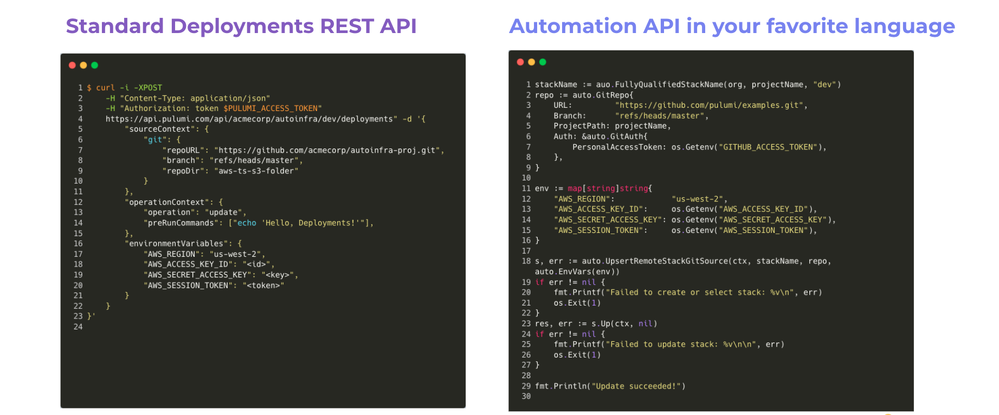
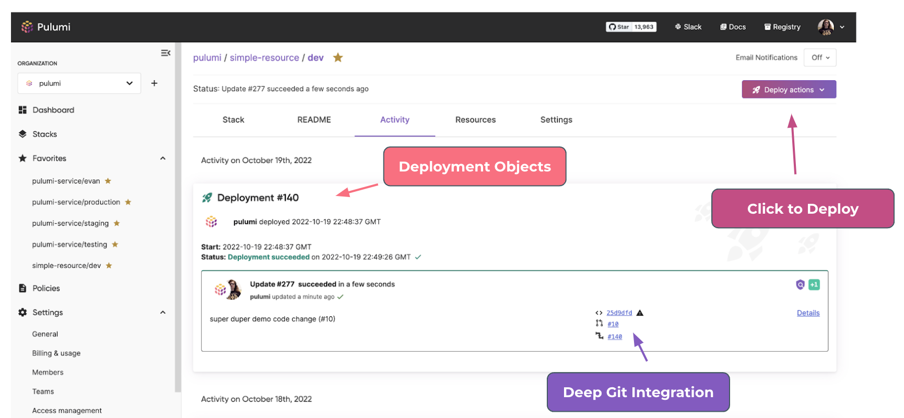
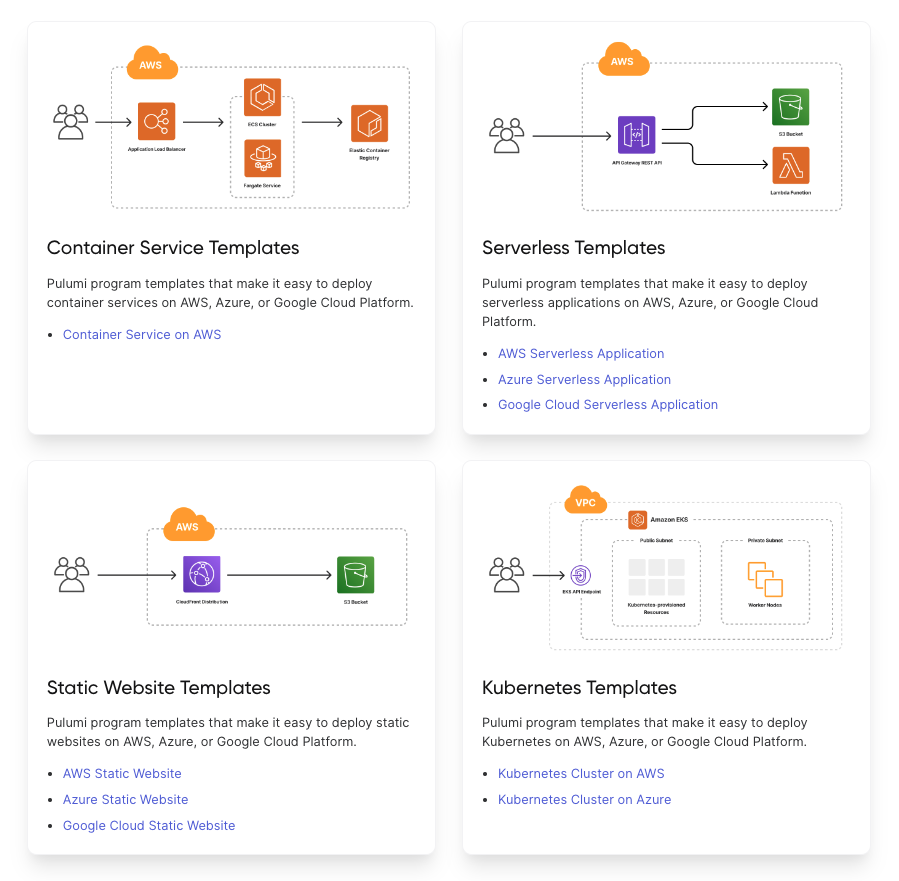

Our mission at Pulumi is to enable teams to scale up what they can build in the cloud.  Scale up the sophistication and value of their cloud infrastructure investments through software engineering practices.  Scale up the automation around delivering cloud infrastructure with software instead of just humans.  And scale up the number of developers who can directly benefit from the rich cloud platform capabilities being built by central platform teams in every organization today.

As part of [Pulumi Cloud Engineering Days 2022](https://www.pulumi.com/cloud-engineering-days/) today we are announcing a set of important new advancements in the Pulumi platform which are all designed to help organizations scale with their infrastructure as code needs.

<!--more-->

* __Pulumi Deployments__:  The Pulumi Service now supports executing infrastructure deployments as a managed service, driven by click-to-deploy in the Console, Git push-to-deploy from GitHub, programmatic deployments via the Pulumi Service REST API as well as automation via the Pulumi Automation API.  Pulumi Deployments enables organizations to scale up their infrastructure automation.

* __Pulumi YAML GA__: In addition to supporting rich general purpose programming languages like TypeScript, Python, Go, .NET and Java, Pulumi added support last May for Pulumi YAML as a simple, declarative interface for accessing the full breadth of the Pulumi Universal Infrastructure as Code platform.  Pulumi YAML is now Generally Available as part of its 1.0 release, enabling *everyone* in an organization to use Pulumi to manage cloud infrastructure.

* __Architecture Templates__:  New templates providing architecture-specific starting points for the most common infrastructure as code use cases - Containerized Services, Kubernetes Clusters, Serverless Applications, Static Websites and Virtual Machines - available across all major cloud platforms and supported languages.

* __Project Level Configuration__: As cloud infrastructure projects grow in complexity, Pulumi provides many tools to manage the complexity of the software that defines these projects. But the configuration of that software also grows in complexity.  New support for Project-Level Configuration across all Pulumi languages makes it easier to manage complex configuration as cloud projects scale up.

You can check out the [Cloud Engineering Days 2022 Keynote](https://www.pulumi.com/cloud-engineering-days/) to learn more about all of these features, or [get started with Pulumi](https://www.pulumi.com/docs/get-started/) today!

## Pulumi Deployments

We launched the Pulumi Automation API [two years ago](https://www.pulumi.com/blog/automation-api/) to enable organizations to build their own automated systems using the Pulumi Infrastructure as Code engine.  Over the last two years, we’ve seen incredible adoption of Automation API, with millions of infrastructure updates driven by Automation API, and usage in everything from CI systems, to CLI tools, to self-service provisioning platforms, to complex deployment orchestration software.

> To scale up how we deploy and manage cloud infrastructure and ultimately unlock the cloud’s value and agility, we believe it will be critical to build software systems around our Infrastructure as Code platforms - systems that scale with software, not just humans.

Today, we are taking the next step in this journey with the introduction of Pulumi Deployments to the Pulumi Service.  With Pulumi Deployments, you can run a Pulumi infrastructure as code action (a preview, update, destroy or refresh) inside Pulumi’s managed service.  Pulumi provides scalability, observability and security for deployments.

Pulumi Deployments are exposed as a new fundamental capability of the service via the [Pulumi Service REST API](https://www.pulumi.com/docs/pulumi-cloud/cloud-rest-api/).  They are also now supported in Automation API as a new kind of `Remote` workspace that can be used in building your own custom infrastructure automation software.



We’ve also used Pulumi Deployments to build new features in the Pulumi Service console, including the ability to click to deploy infrastructure or to set up Git push to deploy workflows that trigger previews on GitHub PR commits and updates on merges to a tracking branch.  This provides a simple point-and-click interface to ensure that any Pulumi user can benefit from continuous delivery of infrastructure changes.



Of course, because Pulumi Deployments exposes a convenient programmatic API, you can build your own automation on top of this.  In our Pulumi Deploy Demos, we have examples of building Drift Detection automation, Time-to-live self-destruct stacks, per-PR environments and more.

Pulumi Deployments is available in preview now, and you can [signup to get access](/product/pulumi-deployments) today. Pulumi Deployments is free while in preview.  We can’t wait to see what you’ll build on top of Pulumi Deployments! 🚀

👉 Read more in the [Pulumi Deployments blog post](https://www.pulumi.com/blog/pulumi-deployments/).

## Pulumi YAML

We introduced Pulumi YAML last May as a simple declarative interface to the full breadth of the Pulumi platform, ideal for smaller scale use cases and composition of higher level component building blocks. Developers who may not have been ready to learn or adopt a full blown language for their cloud infrastructure can use YAML to get started.

> Our goal has always been to offer the broadest range of programming language options to empower every cloud builder so that they could benefit from the best of Pulumi’s Universal Infrastructure as Code platform.

Pulumi YAML makes it easy to compose any of the tens-of-thousands of resources available to the Pulumi Universal Infrastructure as Code platform, including mixtures of raw cloud resources (like an AWS Lambda Function below) and higher level components authored in other rich Pulumi languages (like the `aws-apigateway` packages high level `RestAPI` below).

```yaml
name: serverlessapp
runtime: yaml
config:
  roleArn:
    type: string
resources:
  fn:
    type: aws:lambda:Function
    properties:
      runtime: python3.9
      handler: handler.handler
      role: ${roleArn}
      code:
        fn::fileArchive: ./function
  api:
    type: aws-apigateway:RestAPI
    properties:
      routes:
      - path: /
        localPath: www
      - path: /date
        method: GET
        eventHandler: ${fn}
outputs:
  url: ${api.url}
```

Pulumi YAML is the only declarative Infrastructure as Code language that supports `convert` - the ability to convert a YAML program into a program in any other Pulumi language (TypeScript, Python, Go, .NET and Java). If the complexity of a project ever grows beyond what YAML can comfortably express, you can seamlessly adopt another richer language to continue to scale.

```console
pulumi convert  --language python
```

With the Pulumi YAML GA, we’ve made dozens of improvements to Pulumi YAML.  Richer type checking and error reporting makes Pulumi YAML easy to get started with.  And IDE integration for VS Code and Emacs makes Pulumi YAML even more productive to work with day-to-day:

👉 Read more in the [Pulumi YAML GA blog post](https://www.pulumi.com/blog/pulumi-yaml-ga/).

## Architecture Templates

The new Pulumi Architecture Templates offer the easiest way to get started with a complete working piece of infrastructure for one of the most common Infrastructure as Code use cases.  Each architecture template is short (~100 lines of code), builds a deployable infrastructure project out of the box, is easy to customize, uses a mix of raw cloud resources and Pulumi components to operate at the right level of abstraction for the use case, and comes with useful documentation.

The initial set of architecture templates support common infrastructure as code use cases across AWS, Azure, Google Cloud and Kubernetes, and in all supported Pulumi languages.



For example, the AWS Containerized Service template provides this starting point, which builds and deploys a local container-based application into a set of managed infrastructure in AWS using ECS, ALB, ECR and IAM resources:

```py
from pulumi import Config, Output, export
import pulumi_aws as aws
import pulumi_awsx as awsx

config = Config()
container_port = config.get_int("containerPort", 80)
cpu = config.get_int("cpu", 512)
memory = config.get_int("memory", 128)

# An ECS cluster to deploy into
cluster = aws.ecs.Cluster("cluster")

# An ALB to serve the container endpoint to the internet
loadbalancer = awsx.lb.ApplicationLoadBalancer("loadbalancer")

# An ECR repository to store our application's container image
repo = awsx.ecr.Repository("repo")

# Build and publish our application's container image from ./app to the ECR repository
image = awsx.ecr.Image(
    "image",
    repository_url=repo.url,
    path="./app")

# Deploy an ECS Service on Fargate to host the application container
service = awsx.ecs.FargateService(
    "service",
    cluster=cluster.arn,
    task_definition_args=awsx.ecs.FargateServiceTaskDefinitionArgs(
        container=awsx.ecs.TaskDefinitionContainerDefinitionArgs(
            image=image.image_uri,
            cpu=cpu,
            memory=memory,
            essential=True,
            port_mappings=[awsx.ecs.TaskDefinitionPortMappingArgs(
                container_port=container_port,
                target_group=loadbalancer.default_target_group,
            )],
        ),
    ))

# The URL at which the container's HTTP endpoint will be available
export("url", Output.concat("http://", loadbalancer.load_balancer.dns_name))
```

Pulumi Architecture Templates build on Pulumi’s support for creating your own templates. Pulumi programs can be templated by users to create their own starting points for cloud infrastructure projects using `pulumi new`.  You can [build your own templates and Deploy with Pulumi buttons](https://www.pulumi.com/docs/pulumi-cloud/pulumi-button/) to create similar architecture templates within your own team and organization.

👉 Read more in the [Pulumi Architecture Templates blog post](https://www.pulumi.com/blog/intro-architecture-templates/).

## Project Level Configuration

On top of support for defining infrastructure as code using traditional programming languages, Pulumi has always offered a rich configuration system for specifying inputs to a program which might differ between instances of that program (“stacks”) - for example, across the dev, staging and prod environments, or across regional deployments, of what is logically the “same” infrastructure definition.  Configuration in Pulumi has so far only been provided at the stack level - each stack provides the complete set of configuration needed to specify how that instance of the Pulumi program will be parameterized.

With the latest Pulumi release, we are excited to be adding Project Level Configuration to Pulumi as well.  With project-level configuration, you can specify the configuration needed for each stack once, inside the project file.  This specification can offer default values across all stacks, types to enforce validation of values used in each stack, descriptions, and enforcement that certain properties must be secret.

```yaml
name: baseinfra
runtime: python
config:
    vm-count:
        type: integer
        description: the number of virtual machines to create
        default: 2
    subnets:
        type: array
        description: an array of subnets to create
        items:
            type: string
    vaultKey:
        type: string
        description: which vault key to use for this stack
        secret: true
```

This is the first step in our broader goals to bring Hierarchical Configuration to Pulumi, avoiding unnecessary copy/paste, simple abstraction of configuration data, and rich validation and contextual user interface support across all aspects of config in the Pulumi experience.

👉 Read more in the [Project Level Configuration blog post](https://www.pulumi.com/blog/project-config-mvp/).

## Conclusion

Pulumi helps cloud engineering teams scale up what they can accomplish in the cloud.  Today, we announced a collection of new features and enhancements that advance that platform and help you scale your cloud infrastructure teams. These features give platform team new powers to scale up what they can accomplish.

Check out the launch blog posts for each of the new features, [sign up](/product/pulumi-deployments) for access to Pulumi Deployments, or just dive right in and [get started with Pulumi](https://www.pulumi.com/docs/get-started/) today!

* [Pulumi Deployments](https://www.pulumi.com/blog/pulumi-deployments/)
* [Pulumi YAML GA](https://www.pulumi.com/blog/pulumi-yaml-ga/)
* [Architecture Templates](https://www.pulumi.com/blog/intro-architecture-templates/)
* [Project-Level Configuration](https://www.pulumi.com/blog/project-config-mvp/)
