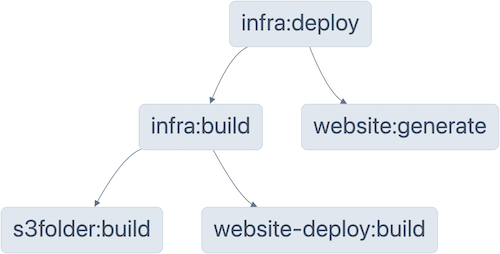

This post shows how to can build a seamless development workflow by integrating Pulumi code level abstractions, such as [Component Resources](https://www.pulumi.com/docs/concepts/resources/components/), with a build system like [Nx](https://nx.dev). Component resources let us create reusable components that manage logical groupings of resources. With modern monorepo tooling, and our recent improvements to make Pulumi aware of monorepo setups, we can colocate these reusable components, Pulumi infrastructure programs, and application code all in one monorepo, and have Nx manage the build and deploy-time dependencies for us.

<!--more-->

We will walk through an example project that deploys a website built with [Astro](https://astro.build) to AWS S3. The complete code can be found at [pulumi/examples/nx-monorepo](https://github.com/pulumi/examples/tree/master/nx-monorepo).

Our example monorepo has the following structure:

- [website](https://github.com/pulumi/examples/tree/master/nx-monorepo/website): A website built with [Astro](https://astro.build).
- [components/s3folder](https://github.com/pulumi/examples/blob/master/nx-monorepo/components/s3folder/index.ts): A component resource that manages a S3 bucket and its access policies.
- [components/website-deploy](https://github.com/pulumi/examples/blob/master/nx-monorepo/components/website-deploy/index.ts): A component resource resource that manages files in a S3 bucket
- [infra](https://github.com/pulumi/examples/blob/master/nx-monorepo/infra/index.ts): A Pulumi program that uses the `s3folder` and `website-deploy` component resources to deploy the generated `website`.

By using [npm workspaces](https://docs.npmjs.com/cli/v10/using-npm/workspaces) we can have multiple npm packages managed from a singular top-level package. Npm will take care of installing the dependencies for all our packages and enables packages within the monorepo to reference each other. In the [package.json](https://github.com/pulumi/examples/blob/master/nx-monorepo/package.json) at the root of the monorepo we setup the workspaces matching our folder structure. [Yarn workspaces](https://classic.yarnpkg.com/lang/en/docs/workspaces/) work similarly and are fully supported by Pulumi.

```json
// package.json
{
  ...
  "workspaces": [
    "components/*",
    "infra",
    "website"
  ]
}
```

## TypeScript

Pulumi has builtin TypeScript support and compiles your code on the fly without manual build-step, however this is currently limited to TypeScript 3.8. We are working on providing more choice here, but in the mean time Nx makes it easy to add a build-step to compile code using any version of TypeScript. For this example we are using the latest and greatest, TypeScript 5.4.

## Declaring Dependencies

If we were to manually build and deploy the code in our monorepo, we would have to run the following steps:

1. Run `astro build` to  generate the HTML output that we want to deploy.
2. Run `npm run build` for `s3folder` and `website-deploy`.
3. Run `npm run build` for `infra` afterwards, since this imports `s3folder` and `website-deploy`.
4. Run `pulumi up` to deploy our website.

Instead of running these steps manually, we will leverage Nx's task running mechanism, which can be made aware of the dependencies between the packages in the monorepo. This ensures we don't accidentally forget a step. On top of that, Nx provides caching, so we also avoid re-running unnecessary tasks on subsequent runs.

Because we are using npm workspaces, Nx can understand the dependencies declared in the `package.json` for each of the packages in our monorepo. For example in [infra/package.json](https://github.com/pulumi/examples/blob/master/nx-monorepo/infra/package.json) we declare that we depend on `s3folder`, `website` and `website-deploy`.
We also let Nx know that the `deploy` target in the `infra` package depends on the build step, and the HTML generation step of the `website` package:

```json
// infra/package.json
{
    "name": "infra",
    "dependencies": {
        "@pulumi/pulumi": "latest",
        "s3folder": "*",
        "website-deploy": "*",
        "website": "*"
    },
    "scripts": {
        "build": "tsc",
        "deploy": "pulumi up --stack dev"
    },
    "nx": {
        "targets": {
            "deploy": {
                "cache": true,
                "dependsOn": [
                    "build",
                    "website:generate"
                ]
            }
        }
    }
}
```

In [nx.json](https://github.com/pulumi/examples/blob/master/nx-monorepo/nx.json) we let Nx know that each package's build-step depends on its dependencies' build-steps. With that Nx now knows that in order build `infra`, it first needs to build its dependencies.

```json
// nx.json
{
  "extends": "nx/presets/npm.json",
  "$schema": "./node_modules/nx/schemas/nx-schema.json",
  "targetDefaults": {
    "build": {
      "cache": true,
      "dependsOn": [
        "^build"
      ]
    }
  }
}
```

The full dependency graph, as understood by Nx, can be visualized by running `npx nx deploy infra --graph`.



## Walkthrough

Now that we have taught Nx all about the dependencies in our monorepo, we can run `npx nx deploy infra` and Nx will run all the required steps in the correct order, using parallelism where possible.

```
  ✔    4/4 dependent project tasks succeeded [0 read from cache]

  Hint: you can run the command with --verbose to see the full dependent project outputs

————————————————————————————————————————————————————————————————————————————————

> nx run infra:build

> infra@1.0.0 build
> tsc

> nx run infra:deploy

> infra@1.0.0 deploy
> pulumi up --stack dev

The stack 'dev' does not exist.

If you would like to create this stack now, please press <ENTER>, otherwise press ^C:
Created stack 'dev'
Previewing update (dev)

View in Browser (Ctrl+O): https://app.pulumi.com/julienp/nx-monorepo/dev/previews/fc7630fd-7dc4-4c7e-baa0-3d6e014fc90a

     Type                                  Name                 Plan
 +   pulumi:pulumi:Stack                   nx-monorepo-dev      create
 +   ├─ pulumi:examples:WebsiteDeploy      my-website           create
 +   │  └─ aws:s3:BucketObject             index.html           create
 +   └─ pulumi:examples:S3Folder           my-folder            create
 +      ├─ aws:s3:Bucket                   my-folder            create
 +      ├─ aws:s3:BucketPublicAccessBlock  public-access-block  create
 +      └─ aws:s3:BucketPolicy             bucketPolicy         create

Outputs:
    websiteUrl: output<string>

Resources:
    + 7 to create

Do you want to perform this update? yes
Updating (dev)

...
NX   Successfully ran target deploy for project infra and 4 tasks it depends on (27s)
```

The output tells us that Nx found the 4 dependant tasks for the `deploy` task of the `infra` package and ran them successfully.

If we now run `npx nx deploy infra` again we can see Nx's caching mechanism in action. Nx notices that there are no code changes to the `infra` package, and that none of its dependencies have changed either, so it just replays the output from the previous run.

```
  ✔    3/3 dependent project tasks succeeded [3 read from cache]

  Hint: you can run the command with --verbose to see the full dependent project outputs

————————————————————————————————————————————————————————————————————————————————

>nx run infra:build  [existing outputs match the cache, left as is]

> infra@1.0.0 build
> tsc

> nx run infra:deploy  [existing outputs match the cache, left as is]

> infra@1.0.0 deploy
> pulumi up --stack dev

Previewing update (dev)

...

 NX   Successfully ran target deploy for project infra and 4 tasks it depends on (29ms)

Nx read the output from the cache instead of running the command for 5 out of 5 tasks.
```

Now let's create a new page in our website by adding a markdown file in the `src/pages` folder.

```bash
echo "Hello, World!" > website/src/pages/hello.md
```

When we run `npx nx deploy infra` again, Nx notices that there is a change to the website and reruns the HTML generation step. Since one of the dependencies of `infra` has now changed, the stack is re-deployed.

```
  ✔    2/2 dependent project tasks succeeded [2 read from cache]

  Hint: you can run the command with --verbose to see the full dependent project outputs

————————————————————————————————————————————————————————————————————————————————

> nx run infra:build

> infra@1.0.0 build
> tsc

> nx run infra:deploy

> infra@1.0.0 deploy
> pulumi up --stack dev

Previewing update (dev)

View in Browser (Ctrl+O): https://app.pulumi.com/v-julien-pulumi-corp/nx-monorepo/dev/previews/8d9db825-77e1-4d1a-8f9b-8279481e7e40

     Type                              Name              Plan
     pulumi:pulumi:Stack               nx-monorepo-dev
     └─ pulumi:examples:WebsiteDeploy  my-website
 +      └─ aws:s3:BucketObject         hello/index.html  create

Resources:
    + 1 to create
    8 unchanged

Do you want to perform this update? yes
Updating (dev)
...

 NX   Successfully ran target deploy for project infra and 4 tasks it depends on (19s)

Nx read the output from the cache instead of running the command for 2 out of 5 tasks.
```

We can see that Nx used the cached results for 2 of our tasks, `s3folder` and `website-deploy` didn't change, so Nx skips rebuilding them. Nx also ran the other 3 tasks to generate the website's HTML, building the infra package and finally deploying the infra package.

## Conclusion

In this post we've shown how we can combine Pulumi's code level abstractions with a build system to create a seamless developer workflow. By using a monorepo we can colocate our reusable components with the Pulumi programs that use the components, as well as our application code. Tools like Nx allow us to intelligently manage the dependencies between the packages in the monorepo, ensuring we are always deploying the correct version of the code.
