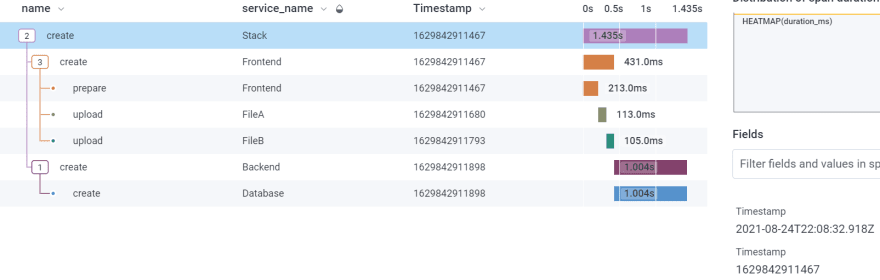
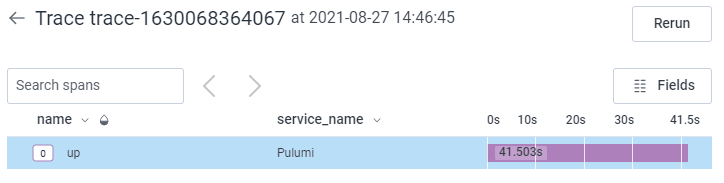
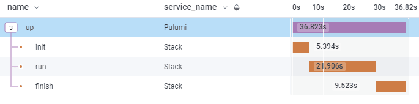
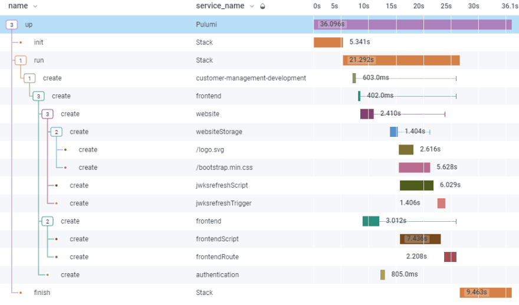

Pulumi community member [Kay Plößer](https://kay.is/) spent some time digging into setting up observability of a Pulumi deployment using [Honeycomb](https://www.honeycomb.io/). Read more to find out all the details on configuring Honeycomb and Pulumi together, with a side dish of [Automation API]()!

<!--more-->
***
Last few weeks, I procrastinated doing real product-related things with setting up monitoring for my infrastructure deployment.

I'm using [@pulumidev](https://dev.to/pulumidev), a cloud-provider independent IaC framework that allows me to define my infrastructure in TypeScript and use whatever provider I need.

I read something about [Honeycomb's](https://www.honeycomb.io/) observability approach to monitoring, and it got me thinking about my deployment code. Later, it will probably run with something like GitHub Actions, so it's not on my machine when it executes. This means I need some insights in case things go wrong. But it would also be good to see how the deployment behaves over time. How do new resources affect deployment durations etc.?

This is what a trace could look like in Honeycomb:

[](./example-trace.png)

Why not setting things up before I move deployment from my development machine to the cloud?

This article will show you how to make your Pulumi deployment observable with [@honeycomb_io](https://dev.to/honeycomb_io)

## Prerequisites

- [Node.js](https://nodejs.org/en/)
- [A Pulumi account](https://www.pulumi.com/)
- [The Pulumi CLI](https://www.pulumi.com/docs/get-started/install/)
- A Pulumi stack
- [A Honeycomb account](https://www.honeycomb.io/)

## The Pulumi Automation-API

This API is a programmatical interface to the Pulumi CLI. Think Puppeteer for Pulumi instead of Chrome.

Since it controls the CLI, it can do everything the CLI can and more.

For our use case, we need information about which resource is deployed to tell Honeycomb about it, and it will create nice trace graphs for us.

To run a `pulumi up` command with the automation API, we need the following code:

```javascript
const { LocalWorkspace } = require("@pulumi/pulumi/automation")

const main = async () => {
  const stack = await LocalWorkspace.createOrSelectStack({
    stackName: "development",
    workDir: ".",
  })
  await stack.up()
}

main()

```

The `@pulumi/pulumi` package already includes the automation API, so it's the only one we need.

We use the `LocalWorkspace` object to load our stack. This leaves the wholes stack intact; we can still deploy/destroy it with the CLI.

Then we call `stack.up()` and wait. The outputs generated from the API aren't as pretty as the ones from the CLI, but they contain the same information.

Also, the `up` command of the API allows us to catch all events that are happening during the deployment. This is the data we're after.

## The Deployment Events

The `up` method of the `stack` object takes a config object. We can use the `onEvent` attribute to listen to all the changes.

```javascript
stack.up({
  onEvent: (event) => {
    console.log(event)
  },
})

```

Here we log out every event. If we look at the output, we notice there are different types of events.

-The `preludeEvent` fires at the start with information about the stack config.
-The `resourcePreEvent` fires before a resource is deployed, and the `resOutputsEvent` fires after it has been deployed.
-The `diagnosticEvent` contains eventual errors that could happen.
-The `summaryEvent` includes info about what has been done and if e everything was successful.

The event structure is a bit strange. The events don't have a type attribute we could `switch` over, but an attribute called like the type of the event.

The following code shows how to get the right event, and where the data hides in that event:

```javascript
onEvent: (event) => {
  if (event["preludeEvent"] !== undefined)
    return console.log(event.preludeEvent.config)

  if (event["resourcePreEvent"] !== undefined)
    return console.log(event.resourcePreEvent.metadata)

  if (event["resOutputsEvent"] !== undefined)
    return console.log(event.resOutputsEvent.metadata)

  if (event["diagnosticEvent"] !== undefined)
    return console.log(event.diagnosticEvent)

  if (event["summaryEvent"] !== undefined)
    return console.log(event.summaryEvent)
},

```

If we run things like this, we get all the information we need to send to Honeycomb. The next step is to tell Honeycomb what's up.

## Sending Data to Honeycomb

Honeycomb provides us with two libraries. The [Node.js Beeline](https://docs.honeycomb.io/getting-data-in/javascript/beeline-nodejs/) and [Libhoney](https://docs.honeycomb.io/getting-data-in/javascript/libhoney/).

Libhoney is a low-level Honeycomb client that allows sending raw events to their service API. The Beeline is an abstraction on top of Libhoney to help with instrumentation and traces.

Usually, it would be best if you used the Beeline because it's easy to set up and works with Node.js's internal HTTP module and the Express framework out of the box.

In this case, we aren't building an HTTP server, so the Beelines instrumentation doesn't help much.

So for our deployment example, I will stick to Libhoney.

## Honeycomb Events & Traces

Honeycomb uses events to figure out what's happening in your system. Suppose the events have special attributes, like `trace.trace_id` and `trace.span_id`, Honeycomb can correlate them. This way, it can tell you things like, "The trace for your request took 300ms and consisted of 100ms authentication and 200ms database access."

So you can pump all your information to Honeycomb via events. Sometimes it doesn't need to be correlated; you only want to tell Honeycomb that your server uses 20% of memory. But in our case, we want to tie up all events related to one deployment into a trace, so we can figure out what we deploy, how long it takes, and if something goes wrong, what resource was responsible.

## Linking up Pulumi & Honeycomb

We need to initialize Libhoney and send the correct "Honeycomb event" for every "Pulumi event."

But let's start with getting one event into Honeycomb: the `pulumi up` event.

```javascript
const Libhoney = require("libhoney")
const { LocalWorkspace } = require("@pulumi/pulumi/automation")

const hny = new Libhoney({
  writeKey: "<HONEYCOMB_API_KEY>",
  dataset: "example-iac",
})

const id = (name) => `${name}-${Date.now()}`

const traceId = id`trace`
const rootSpanId = id`trace-root-span`
const startTimestamp = Date.now()

const main = async () => {
  const stack = await LocalWorkspace.createOrSelectStack({
    stackName: "development",
    workDir: ".",
  })
  await stack.up({
    onEvent: (event) => {},
  })
}

main().then(() => {
  hny.sendNow({
    name: "up",
    service_name: "Pulumi",
    "trace.trace_id": traceId,
    "trace.span_id": rootSpanId,
    duration_ms: Date.now() - startTimestamp,
  })
})

```

We define a `traceId`, a `rootSpanId`, and a `startTimestamp` at the beginning, and then we send it off when everything is done.

An event with `trace.trace_id` will be grouped up with all other events with the same trace ID. In this case, we only have one event.

The `name` is usually the action you perform and want to measure, and the `service_name` is, well, the service that performs this action. In this case, we run `pulumi up`.

In the end, we also send a `duration_ms` attribute to track how long things take.

The result will look like this:

[](./trace-result.png)

Not very interesting, but at least we know it run without crashing and how long it took.

## Getting More Details

The next step is to get the details. What were the config parameters? How long did different parts of the deployment take?

For this, we need to look into two events, the `preludeEvent` and the `summaryEvent`.

Until now, we only send one Honeycomb event for the Pulumi up command.

Now, we will send three events for the stack.

- The `init` event will contain the time it took to get to the actual deployment of resources and the config parameters of the stack
- The `run` event will contain the duration all resources took to do their thing.
- The `finish` event will contain the duration of shutting down the automation API and the summary data.

Let's look at the updated example code:

```javascript
...

const traceId = id`trace`
const rootSpanId = id`trace`
const startTimestamp = Date.now()
let stackFinishStartTimestamp

const main = async () => {
  const initStartTimestamp = Date.now()
  const runStackSpanId = id`stack`
  let stackRunStartTimestamp

  const stack = await LocalWorkspace.createOrSelectStack({
    stackName: "development",
    workDir: ".",
  })
  await stack.up({
    onEvent: (event) => {
      if (event["preludeEvent"] !== undefined) {
        const hnyEvent = hny.newEvent()
        hnyEvent.timestamp = new Date(initStartTimestamp)
        hnyEvent.add({
          name: "init",
          service_name: "Stack",
          "trace.trace_id": traceId,
          "trace.parent_id": rootSpanId,
          "trace.span_id": id`stack`,
          duration_ms: Date.now() - initStartTimestamp,
          ...event.preludeEvent.config,
        })
        hnyEvent.send()
        stackRunStartTimestamp = Date.now()
        return
      }

      if (event["summaryEvent"] !== undefined) {
        const hnyEvent = hny.newEvent()
        hnyEvent.timestamp = new Date(stackRunStartTimestamp)
        hnyEvent.add({
          name: "run",
          service_name: "Stack",
          "trace.trace_id": traceId,
          "trace.parent_id": rootSpanId,
          "trace.span_id": runStackSpanId,
          duration_ms: Date.now() - stackRunStartTimestamp,
        })
        hnyEvent.send()
        stackFinishStartTimestamp = Date.now()
        return
      }
    },
  })
}

main().then(() => {
  let hnyEvent = hny.newEvent()
  hnyEvent.timestamp = new Date(stackFinishStartTimestamp)
  hnyEvent.add({
    name: "finish",
    service_name: "Stack",
    "trace.trace_id": traceId,
    "trace.parent_id": rootSpanId,
    "trace.span_id": id`stack`,
    duration_ms: Date.now() - stackFinishStartTimestamp,
  })
  hnyEvent.send()

  hnyEvent = hny.newEvent()
  hnyEvent.timestamp = new Date(startTimestamp)
  hnyEvent.add({
    name: "up",
    service_name: "Pulumi",
    "trace.trace_id": traceId,
    "trace.span_id": rootSpanId,
    duration_ms: Date.now() - startTimestamp,
  })
  hnyEvent.send()
})

```

First, we need to sprinkle variables on the code that capture the start times of our three events.

The `init` event starts before the call to the up command and takes until the `preludeEvent` is fired by the automation API.

The `run` event starts right after the `init` event finishes and takes until the `summaryEvent` fires.

The `finish` event starts right after `run` finishes and stops right before the parent event for Pulumi up is finished.

These events all get the `trace.parent_id` of the Pulumi up event, so they get nested in the Honeycomb view later.

Also, the `init` event gets the `event.preludeEvent.config` object, so we can see how the stack was configured inside Honeycomb.

If we run that example, we should see something like this:

[](./second-result.png)

## Getting Resource Deployment Durations

The resources have additional details for us. As a `name` for the event, we will use the operation (create, update, delete) and as `service_name` we use the name of the resource in the Pulumi definition.

To get the parent of a resource, we have to save the URNs of every resource for later. But since we have to keep the start times anyway, we can do this in one step when the `resourcePreEvent` is fired.

Let's look at the example code. This time I removed some boilerplate code and the other events to make things a bit more readable.

```javascript
const main = async () => {
  // ...

  const resourceSpans = new Map()

  // ...

  await stack.up({
    onEvent: (event) => {
      // ...

      if (event["resourcePreEvent"] !== undefined) {
        const { metadata } = event.resourcePreEvent
        resourceSpans.set(metadata.urn, {
          spanId: id`span`,
          startTimestamp: Date.now(),
        })
        return
      }

      if (event["resOutputsEvent"] !== undefined) {
        const { metadata } = event.resOutputsEvent

        const serviceName = metadata.urn.split("::")[3]
        const { spanId, startTimestamp } = resourceSpans.get(metadata.urn)
        const parentUrn = metadata.new?.parent ?? metadata.old?.parent
        const parentId = resourceSpans.get(parentUrn)?.spanId ?? runStackSpanId

        const hnyEvent = hny.newEvent()
        hnyEvent.timestamp = new Date(startTimestamp)
        hnyEvent.add({
          name: metadata.op,
          service_name: serviceName,
          "trace.trace_id": traceId,
          "trace.parent_id": parentId,
          "trace.span_id": spanId,
          duration_ms: Date.now() - startTimestamp,
        })

        if (metadata.op === "update")
          hnyEvent.addField("diffs", metadata.diffs.join(", "))

        hnyEvent.send()
        return
      }

      // ...
    },
  })
}

```

So, what's going on here?

First, the resources are deployed by their hierarchy, but siblings can be deployed in a different order. That's why we need to save their `spanId` and `startTimestamp` when we get a `resourcePreEvent`.

I used a `Map` for this and keyed it with the URN of the resource because URNs are used for parent-child relationships and are part of all events we care about here.

Later, when the `resOutputsEvent` fires, it's time to wrap it all up and send it to Honeycomb.

The event has the URN to find the related `spanId` and `startTimestamp`. We can also use the URN in the parent attribute of our resource to fetch the `spanId` of our resource's parent. This way, our spans are correctly nested in Honeycomb later.

If the operation for the resource is an `update`, we also add the `diffs` to that event. This way, we can see in Honeycomb what inputs have changed since the last deployment.

The final trace should look a bit like this:

[](./final-trace.png)

## Getting Errors

The last step, getting deployment errors, I leave as an exercise for the reader.

But I'll give you a few hints!

First, the interesting event is the `diagnosticEvent`, which comes with a `severity` and `message` attribute. If you only need errors, you have to filter out `debug` and `info` severity.

Also, the event includes an `urn` that can be used to correlate the error to a Honeycomb span later (`resourceSpans` etc.). If the errors isn't related to an URN, you can simply use the run stack event as target.

If you add an `error` field to a Honeycomb event, it will automatically counted to your errors in Honeycomb.

## Summary

IaC observability becomes rather simple when using Pulumi and Honeycomb.

Pulumi's automation API allows us to control the CLI with JavaScript, and Honeycomb's Libhoney is low-level enough to instrument every part of our deployment process.

This way we can keep track which resources are slowing our deployment down, or which was responsible for a failed deployment.
