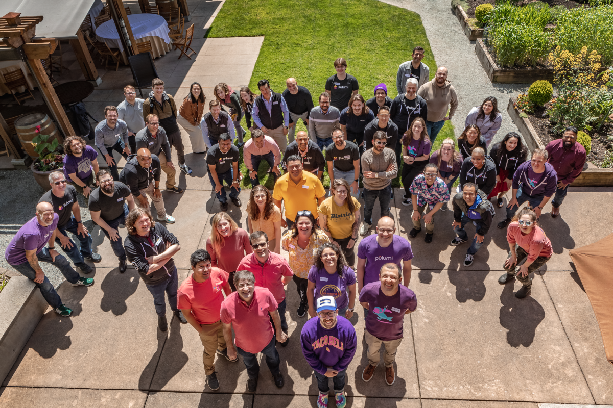

We've been hard at work and are having the biggest month ever at Pulumi. That includes two new products, Pulumi ESC and Pulumi for Platform Teams, and news of our Series C. That's a boatload of fresh infrastructure as code innovation. And October isn't even over yet!

<!--more-->

## Two New Products!

Here's a recap of the news:

[**Pulumi ESC**](/product/esc) is a new approach to cloud environments, secrets, and configuration. It works for applications and infrastructure and cuts down on sprawl while making everything more secure. This tech spans developer desktop scenarios and scales up beyond 1,000s of environments. Read the [overview](/product/esc), [blog](/blog/environments-secrets-configurations-management), or [get started with the docs](/docs/pulumi-cloud/esc). Oh, and don't forget to [star the GitHub repo](https://github.com/pulumi/esc)!

[**Pulumi for Platform Teams**](/product/internal-developer-platforms) takes what we’ve learned working with over 2,000 customers and 150,000 end users, many building internal developer platforms, and provides common patterns and practices right out of the box. This includes a developer portal, a Backstage plugin, advanced deployment workflows, and the ability to report on and automatically remediate compliance policies. Read the [overview](/product/internal-developer-platforms), [blog](/blog/building-developer-portals), or [get started with the docs](/docs/pulumi-cloud/developer-portals).

{}
**Can we help you build an internal cloud platform?** Although the new capabilities are easy to use, we're happy to give you a demo, discuss architecture, or even help you build out your internal platform. [Get in touch](/contact).
{}

These launches build on our "multi-product" momentum from our [**Pulumi Insights**](/product/pulumi-insights) product launch earlier this year. Insights applies the power of generative AI to all things cloud giving you an intelligent interface to your infrastructure. We are taking infrastructure as code to many new places. We've processed over 130,000 prompts since launch --- it's free to use, so [give it a try today](/ai)!

## Series C Fundraise

Last but not least, we announced our [**Series C**](/blog/series-c). This fundraise will enable us to keep building an incredible team and reimagining how developers and infrastructure teams program the cloud. We’re hiring and have endless fun hard/problems ahead  [check out and apply to the open positions here](/careers).

## Let Us Know What You Think

We can't wait to hear what you think. [Get Started with Pulumi](/start), [join our Community Slack](https://slack.pulumi.com), and let us know how you're using these new capabilities and any feedback you have.

From the entire Pulumi team, thank you!

