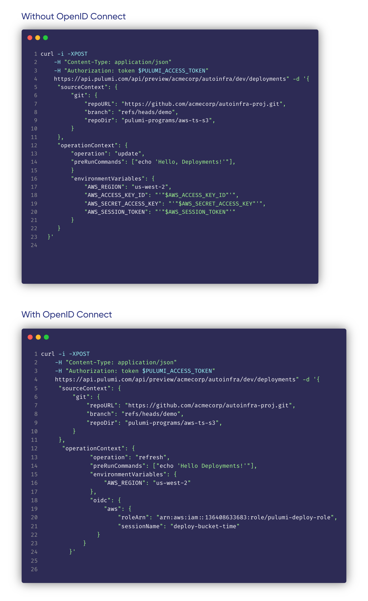
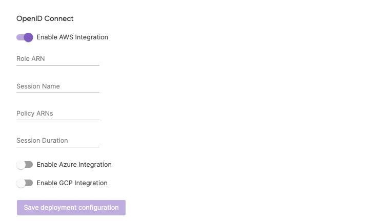
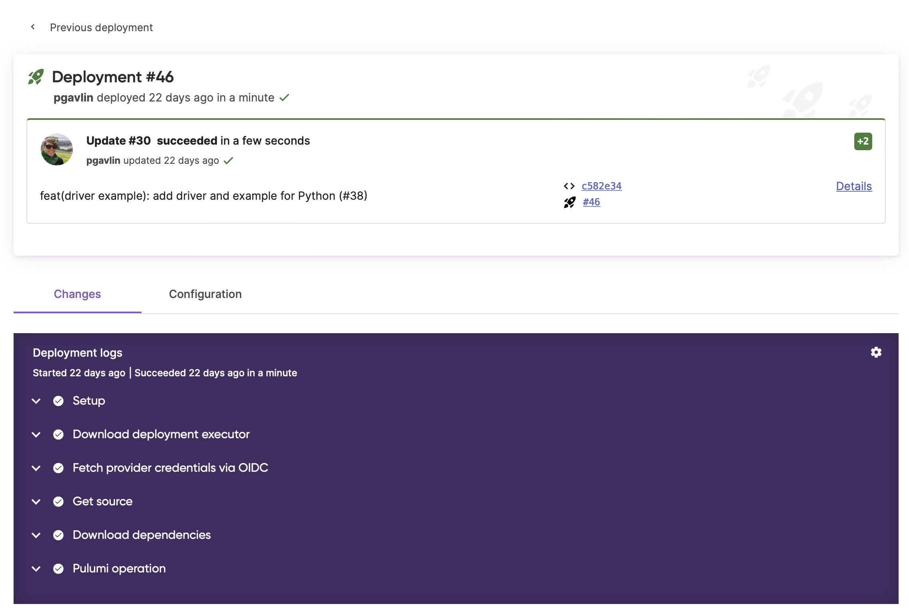

After [launching Pulumi Deployments](/blog/pulumi-deployments) a few months ago and receiving a ton of community feedback (thank you!) today we are launching an integration with OpenID Connect (OIDC) to enable temporary credentials and granular access controls. We would like to thank GitHub user [eriklz](https://github.com/eriklz) for creating the [original request](https://github.com/pulumi/service-requests/issues/144) for this functionality.

<!--more-->

[OpenID Connect (OIDC)](https://openid.net/connect) is an identity layer built on top of the OAuth 2.0 framework. It allows third-party applications to verify the identity of the end-user and to obtain basic user profile information. OIDC uses JSON web tokens (JWTs), which you can obtain using flows conforming to the OAuth 2.0 specifications.

## Overview

The main benefits of using the OIDC integration for Pulumi Deployments are as follows:

1. **Temporary credentials**: You can move away from long term credentials within your organization to leverage temporary credentials that are generated every time a deployment runs. The Pulumi Service issues a new OIDC token that is limited to that deployment. This token is used to obtain cloud credentials that automatically expire, meaning you do not need to store sensitive credentials that are reused with each deployment.
2. **Granular access control**: The OIDC token generated by the Pulumi Service contains detailed information about the deployment with which it is associated. In AWS for example, you can configure our OIDC integration to only use temporary credentials if that token is associated with a particular Pulumi stack or Pulumi organization. This enables you to follow the principle of least privilege access and scope access down to only what is needed.
For AWS, Azure, and GCP, Pulumi Deployments can automatically exchange its OIDC token for temporary credentials and make those credentials available to providers. For advanced scenarios or other cloud providers, the OIDC token can be manually exchanged for credentials by the user.
## Setup

### Calling the Deployments REST API

You can call the [Deployments REST API](/docs/reference/deployments-rest-api) and use OIDC instead of cloud secrets. Here is an example of how that might look:

### Enabling OIDC for your Stack for Git Push to Deploy

In order to use the Git Push to Deploy and Click to Deploy features in the Pulumi Service console you will need to enable OIDC for your stack in the console. In order to enable it you will need to be an admin of your Pulumi organization.

1. Navigate to your stack in the Pulumi Console.
2. Open the stack’s “Settings” tab.
3. Choose the “Deploy” panel.
4. Under the “OpenID Connect” header, toggle to your cloud provider
5. Follow the cloud provider specific docs below
   1. [Configuring OIDC for AWS](/docs/guides/oidc/provider/aws/)
   2. [Configuring OIDC for Azure](/docs/guides/oidc/provider/azure/)
   3. [Configuring OIDC for GCP](/docs/guides/oidc/provider/gcp/)

### Viewing Deployment logs

Once OIDC is set up you will see a new step in your Deployment logs "Fetch credentials via OIDC"

### Getting access to Pulumi Deployments

Pulumi Deployments is available in preview today. Deployments are free during the preview, with usage-based pricing to come. Check out these resources to get started today:

- [Request access](/product/pulumi-deployments) to the Pulumi Deployments preview
- [Pulumi Deployments examples repo](https://github.com/pulumi/deploy-demos)
- [Pulumi Deployments documentation](/docs/pulumi-cloud/deployments/)
- [Pulumi Deployments REST API documentation](/docs/pulumi-cloud/deployments/api/)
- [Automation API examples](https://github.com/pulumi/automation-api-examples)

Please submit an issue in the [Pulumi Service Requests repo](https://github.com/pulumi/service-requests) if you have feature requests for the Pulumi Service or join our [Slack channel](https://pulumi-community.slack.com)(#pulumi-deployments) if you have questions.

🚀🚀🚀 Happy building! 🚀🚀🚀
