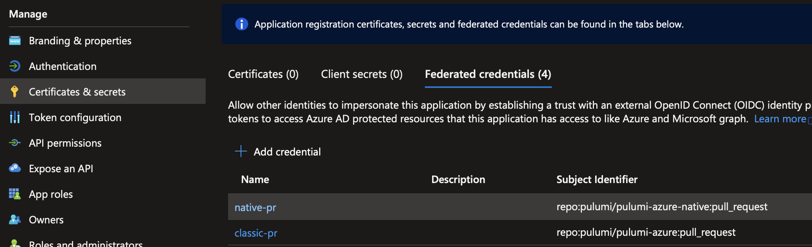

We are happy to announce the delivery of Azure OIDC authentication, one of the [most requested features](https://github.com/pulumi/pulumi-azure-native/issues/1324) for the [Pulumi Azure Native Provider](https://www.pulumi.com/registry/packages/azure-native/). With the v1.100.0 release, OpenID Connect (OIDC) authentication is now fully supported in both the Azure Native and [Azure Classic](https://www.pulumi.com/registry/packages/azure/) providers. Let’s dig in to learn what it is, how it works, and why it’s useful.

<!--more-->

{}
[Pulumi announced OIDC support for Deployments](https://www.pulumi.com/blog/oidc-blog/) in January. This article is about the same OIDC protocol, used to authenticate your Pulumi program with Azure instead of Pulumi Deployments.
{}

## The What and Why of OIDC

OIDC stands for OpenID Connect, a standardized protocol for federated identity. This means that if you maintain an identity with two service providers, you can tell one of them to trust the other. Then, you can use credentials for the trusted service to get credentials for the other.

As an example, we’ll use a Pulumi program running in CI on GitHub Workflows, creating Azure resources. Without OIDC, this program would need a secret to authenticate with Azure - a client secret or a certificate. With OIDC, your program doesn't need a secret. It can send its GitHub token to Azure instead.  Based on the trust relationship between the two, Azure will exchange the GitHub token for an Azure token.

Secrets need to be safeguarded, rotated, and possibly revoked. If you’ve ever managed a system, whether production or CI/CD, the possibility of managing fewer secrets will be enticing. So how do we go about implementing this?

## Enabling OIDC

There are two parts to enabling your Pulumi program to authenticate via OIDC. One is establishing the trust relationship between Azure and the other service that’s involved, like GitHub. This is a one-time operation. The second one is providing your program with the necessary configuration to perform the OIDC token exchange at runtime.

Fortunately, Microsoft has the first step covered with their [establishing the trust relationship guide](https://learn.microsoft.com/en-us/azure/active-directory/workload-identities/workload-identity-federation-create-trust?pivots=identity-wif-apps-methods-azp). The idea is that an Active Directory app registration holds the necessary federated credentials. Your program will then use this app’s tenant id to request the token exchange. The setup depends on whether you run on GitHub Actions, Kubernetes, or other providers.

On to the second step, configuring your Pulumi program. First, tell the Pulumi provider to use OIDC by setting the environment variable `ARM_USE_OIDC` or the Pulumi configuration `azure-native:useOidc` to true. Next, you’re in luck if your program runs on GitHub Actions: you're done. GitHub exports the necessary values in form of variables that Pulumi understands.

{}
For GitHub, pay close attention to the “entity type” of your Azure Active Directory credential as documented in the Azure guide. It can be a Git branch or tag, a pull request, or an environment as specified in the GitHub workflow. When your Action requests the OIDC token exchange, one of these needs to match exactly. This means that the only way to configure OIDC authentication for all branches or tags is to use environments in your workflows.
{}

For other providers, you need to provide your Pulumi program with two more settings. Environment variable `ARM_OIDC_REQUEST_TOKEN` or configuration `azure-native:oidcRequestToken` is your provider’s token to exchange for an Azure token. `ARM_OIDC_REQUEST_URL` or `azure-native:oidcRequestUrl` is the URL to contact to initiate the token exchange.

## A complete example

Let’s take a look at how the CI end-to-end tests of the Pulumi Azure Native provider are set up.

### Configuration

First, we have an Active Directory App creatively named oidc-test. We simply copy its client and tenant ids and set them in the CI workflow, along with our subscription:

```
env:
  ARM_CLIENT_ID: 11223344-****-****-****-************ [redacted]
  ARM_SUBSCRIPTION_ID: 55667788-****-****-****-************ [redacted]
  ARM_TENANT_ID: 99aabbcc-****-****-****-************ [redacted]
  ARM_USE_OIDC=true
```

Note how there is no secret or certificate present.

We also give the required permissions to the workflow step where the authentication happens:

```
permissions:
  id-token: write  # required for OIDC auth
```

In Azure, we added the required credentials to the Active Directory App. You'll find this under “Certificates & secrets” -> “Federated credentials” on the app’s page. Let’s look at two of the credentials. Both enable OIDC for all pull requests on the repository, one for each Azure provider.



### End to End Flow

Now, when our GitHub workflow for CI tests runs, the Azure provider knows to authenticate via OIDC because `ARM_USE_OIDC` is set. It performs the following steps:

1. Call GitHub's OIDC provider, found at the URL that GitHub [automatically exports](https://docs.github.com/en/actions/deployment/security-hardening-your-deployments/about-security-hardening-with-openid-connect#updating-your-actions-for-oidc) as `ACTIONS_ID_TOKEN_REQUEST_URL`. For authentication, it includes a token GitHub generates for each workflow run and exports as `ACTIONS_ID_TOKEN_REQUEST_TOKEN`. The response is an OIDC token in form of a JSON Web Token (JWT).
2. Send the OIDC token to Azure's Active Directory endpoint. Include the client and tenant ids of our Active Directory App that we configured via `ARM_CLIENT_ID` and `ARM_TENANT_ID`. Active Directory looks up the trust relationship we configured and validates the token, and responds with a valid access token for Azure.
3. The Pulumi provider can now access Azure resources.

That’s it! Your CI job now runs without maintaining an Azure secret in GitHub, or wherever your Pulumi program runs.

## Wrapping up

This article only demonstrated the basics. You can also [customize your OIDC token's claims](https://docs.github.com/en/actions/deployment/security-hardening-your-deployments/about-security-hardening-with-openid-connect#customizing-the-token-claims) to control access to Azure in a more fine-grained manner.

I hope this helps you simplify your Azure authentication. Please try it out and let us know if you hit any issues in the [Pulumi Community Slack](https://slack.pulumi.com/?_gl=1*1vur1o*_ga*MTk2MzcxMzEwMC4xNjgwMTI4NTk3*_ga_FQHG5CVY2D*MTY4NDI2OTA4OC45Mi4xLjE2ODQyNjkxMDkuMzkuMC4w)!
