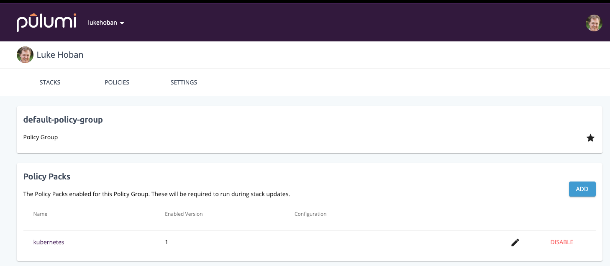
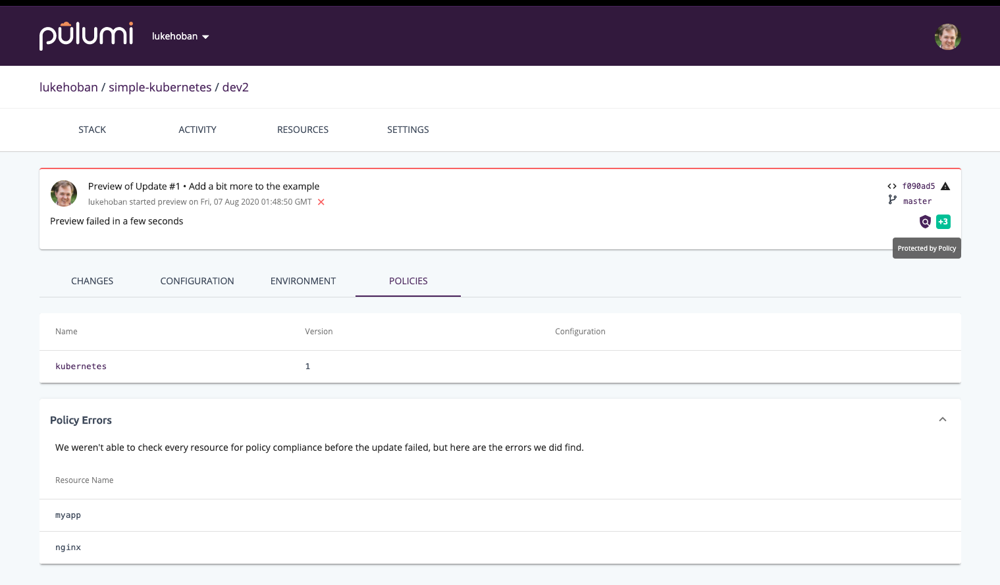
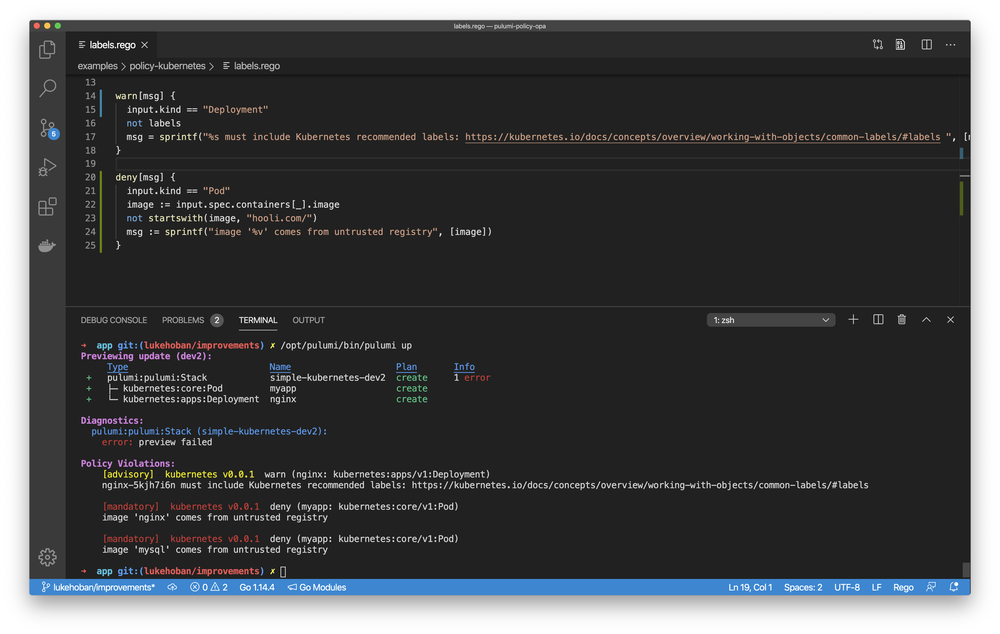

We're excited to announce the addition of Open Policy Agent (OPA) Rego language support to Pulumi's CrossGuard policy-as-code framework. This enables Pulumi CrossGuard policy to be authored in either JavaScript/TypeScript/Python or in the popular Rego language using OPA.

Pulumi's CrossGuard policy-as-code framework provides the ability to author, apply and enforce policy directly as part of your Pulumi deployments. With the new support for OPA Rego, CrossGuard supports a broad spectrum of policy authoring options, from expressive imperative languages to a popular industry-standard declarative policy language.

OPA-based rules for CrossGuard get all the core benefits of Pulumi's policy-as-code framework - policies can be run on previews to get warnings about errors before you even deploy, policies can produce either advisory or mandatory recommendations allowing flexibility in flagging and enforcing policy violations, and policies can be applied and enforced across an entire organization through the Pulumi Service.

<!--more-->

## What is Pulumi CrossGuard?

Pulumi [CrossGuard](https://www.pulumi.com/docs/guides/crossguard/) is a policy-as-code framework for enforcing policy across Pulumi infrastructure deployments on any cloud or in Kubernetes. CrossGuard can be used to enforce policy for compliance, security, best practices or cost control.

Pulumi's web console offers tools to manage and enforce CrossGuard policy across your organization, ensuring that every infrastructure project is held to a high bar on policy compliance.

CrossGuard policy is enforced during previews, ensuring that policy violations are found during development, not just at deployment time. At deployment, policies are enforced on each resource immediately before changes to that resource are applied. As a result, any change that would violate policy is rejected before being applied to your target cloud or Kubernetes environments.

## What is OPA?

[Open Policy Agent](https://www.openpolicyagent.org/) (OPA) provides policy-based control for cloud native environments. OPA provides a single authoring language (Rego) and policy runtime, which can be used to enforce policy in a wide variety of environments including Kubernetes, Envoy, Terraform Kafka, SQL, Linux - and now Pulumi!

The [Rego language](https://www.openpolicyagent.org/docs/latest/policy-language/) is declarative, easy to use, and expressive - along with good integration in tools like Visual Studio Code.

## Using OPA with Pulumi CrossGuard

To get started with OPA and CrossGuard, start by downloading and installing Pulumi, then get the OPA plugin with:

```
$ pulumi plugin install analyzer policy-opa v0.0.2
[analyzer plugin policy-opa-0.0.2] installing
Downloading plugin: 6.11 MiB / 6.11 MiB [===========================] 100.00% 0s
Moving plugin... done.
```

You are now ready to apply OPA-based policies to your Pulumi deployments. Create a folder for your policies named `policy-kubernetes` and place two files in it - `PulumiPolicy.yaml` and `kubernetes.rego`.

Your `PulumiPolicy.yaml` should look like this. Note that it specifies the runtime to use for the policy rules is `opa`.

```yaml
description: A minimal Policy Pack for Kubernetes using OPA.
runtime: opa
```

Your `kubernetes.rego` should look like this.

```rego
package kubernetes

name = input.metadata.name

labels {
    input.metadata.labels["app.kubernetes.io/name"]
    input.metadata.labels["app.kubernetes.io/instance"]
    input.metadata.labels["app.kubernetes.io/version"]
    input.metadata.labels["app.kubernetes.io/component"]
    input.metadata.labels["app.kubernetes.io/part-of"]
    input.metadata.labels["app.kubernetes.io/managed-by"]
}

deny[msg] {
  input.kind = "Deployment"
  not labels
  msg = sprintf("%s must include Kubernetes recommended labels: https://kubernetes.io/docs/concepts/overview/working-with-objects/common-labels/#labels ", [name])
}
```

The rule above uses the standard OPA Rego language to express a rule that enforces that any `Deployment` resource in Kubernetes must have a set of defined labels applied to it. All OPA rules used in Pulumi will be applied to an `input` object, which is a JSON representation of the resource inputs for the Pulumi resource being validated. In particular, for a Kubernetes `Deployment` resource, this will have top level `kind`, `apiVersion`, `metadata`, and `spec` fields which can be used to query aspects of the resource for policy enforcement.

To test our rule, we can create a new Pulumi Kubernetes project and deploy it with the policy enforced.

First we create a new project `kubeapp` in a sibling folder:

```
$ cd .. && mkdir kubeapp && cd kubeapp
$ pulumi new kubernetes-typescript
```

This will create a project that deploys a single Kubernetes `Deployment` (but without our required labels!).

```ts
import * as k8s from "@pulumi/kubernetes";
import * as kx from "@pulumi/kubernetesx";

const appLabels = { app: "nginx" };
const deployment = new k8s.apps.v1.Deployment("nginx", {
    spec: {
        selector: { matchLabels: appLabels },
        replicas: 1,
        template: {
            metadata: { labels: appLabels },
            spec: { containers: [{ name: "nginx", image: "nginx" }] }
        }
    }
});
export const name = deployment.metadata.name;
```

We can deploy this to any Kubernetes cluster (configure your `kubectl` context locally to point at the desired cluster) with our policy applied with:

```
$ pulumi up --policy-pack ../policy-kubernetes
Previewing update (dev):
     Type                           Name                   Plan       Info
 +   pulumi:pulumi:Stack            simple-kubernetes-dev  create     1 error
 +   └─ kubernetes:apps:Deployment  nginx                  create

Diagnostics:
  pulumi:pulumi:Stack (simple-kubernetes-dev):
    error: preview failed

Policy Violations:
    [mandatory]  kubernetes v0.0.1  deny (nginx: kubernetes:apps/v1:Deployment)
    nginx-me0llhgr must include Kubernetes recommended labels: https://kubernetes.io/docs/concepts/overview/working-with-objects/common-labels/#labels
```

Note that the preview fails because the policy was violated, preventing me from deploying this resource to my cluster!

The policy defined above has a "mandatory" policy, defined in OPA with `deny`. We can also define "advisory" policies using `warn` rules. For example, if we changed our policy from `deny` to `warn` and rerun - we will see the preview succeed:

```
$ pulumi up --policy-pack ../policy-kubernetes
Previewing update (dev2):
     Type                           Name                    Plan
 +   pulumi:pulumi:Stack            simple-kubernetes-dev2  create
 +   └─ kubernetes:apps:Deployment  nginx                   create

Policy Violations:
    [advisory]  kubernetes v0.0.1  warn (nginx: kubernetes:apps/v1:Deployment)
    nginx-ylgvoqpk must include Kubernetes recommended labels: https://kubernetes.io/docs/concepts/overview/working-with-objects/common-labels/#labels
```

In the previous examples, we manually applied our policy to our deployment with the `--policy-pack` option.  But we can also publish our policy pack to the Pulumi Service and configure it to be enforced across our organization.  To do, go back to the policy folder and run `pulumi policy publish`.

```
$ cd ../policy-kubernetes
$ pulumi policy publish
Obtaining policy metadata from policy plugin
Compressing policy pack
Uploading policy pack to Pulumi service
Publishing "kubernetes" to "lukehoban"
Published as version 2

Permalink: https://app.pulumi.com/lukehoban/policypacks/kubernetes/2
```

You can now navigate into the Pulumi Console and configure the new policy to be part of the "default" policy pack (or create a new one), and applied to all stacks in your Organization (or select specify stacks to enforce the policy on).



We can now run our deployment without the `--policy-pack` argument and our policy will still be enforced on this deployment (and any others done by any other users in our organization)!

```
$ pulumi up
Previewing update (dev2):
Installing policy pack kubernetes 2...
Finished installing policy pack

     Type                           Name                    Plan
 +   pulumi:pulumi:Stack            simple-kubernetes-dev2  create
 +   └─ kubernetes:apps:Deployment  nginx                   create

Policy Violations:
    [advisory]  kubernetes v0.0.1  warn (nginx: kubernetes:apps/v1:Deployment)
    nginx-q4ilsuqq must include Kubernetes recommended labels: https://kubernetes.io/docs/concepts/overview/working-with-objects/common-labels/#labels

Do you want to perform this update? yes
Updating (dev2):
     Type                           Name                    Status
 +   pulumi:pulumi:Stack            simple-kubernetes-dev2  created
 +   └─ kubernetes:apps:Deployment  nginx                   created

Policy Violations:
    [advisory]  kubernetes v0.0.1  warn (nginx: kubernetes:apps/v1:Deployment)
    nginx-6ooayw4j must include Kubernetes recommended labels: https://kubernetes.io/docs/concepts/overview/working-with-objects/common-labels/#labels

Outputs:
    name: "nginx-6ooayw4j"

Permalink: https://app.pulumi.com/lukehoban/simple-kubernetes/dev2/updates/1
```

We can now navigate to the URL for our update and see that the policy was enforced. Note the badge showing that this deployment was protected by policy enforcement and the list of policy violations.



## Using OPA Rego with Pulumi

OPA-based rules are easy to write for Pulumi. The `input` object represents each individual resource that will be deployed by Pulumi, and the rules are applied independently to each Pulumi resource when it is deployed. The schema for each resource is the same as the properties available when defining the resource. Critically, although we highlighted Kubernetes above, Pulumi's resource model spans any cloud or Kubernetes, with providers for more than 50 Cloud and SaaS platforms available. And OPA-based rules can target any or all of these in a single deployment.

For example - the policy file above could be expanded to include:

```rego
# Enforce that AWS EC2 Instance public IP is not enabled
warn[msg] {
  input.associatePublicIpAddress
  msg := "Associating public IP addresses is discouraged"
}

# Enforce that Kubernetes Pod images must be published by `hooli.com`
deny[msg] {
  input.kind == "Pod"
  image := input.spec.containers[_].image
  not startswith(image, "hooli.com/")
  msg := sprintf("image '%v' comes from untrusted registry", [image])
}
```

With support in Visual Studio Code, authoring both your infrastructure and policy in a rich IDE using Pulumi is also possible.



## Conclusion

OPA support in Pulumi CrossGuard enables authoring cloud infrastructure policy using a familiar and popular policy authoring language while leveraging Pulumi's CrossGuard platform for policy enforcement from development to production. Along with existing support for TypeScript, JavaScript and Python - Pulumi CrossGuard offers a great breadth of authoring languages to meet the needs of any infrastructure team.

Check out the open source [pulumi-policy-opa](https://github.com/pulumi/pulumi-policy-opa) project to learn more about the OPA integration with CrossGuard. And [get started]() with Pulumi for your modern cloud infrastructure and policy today.
