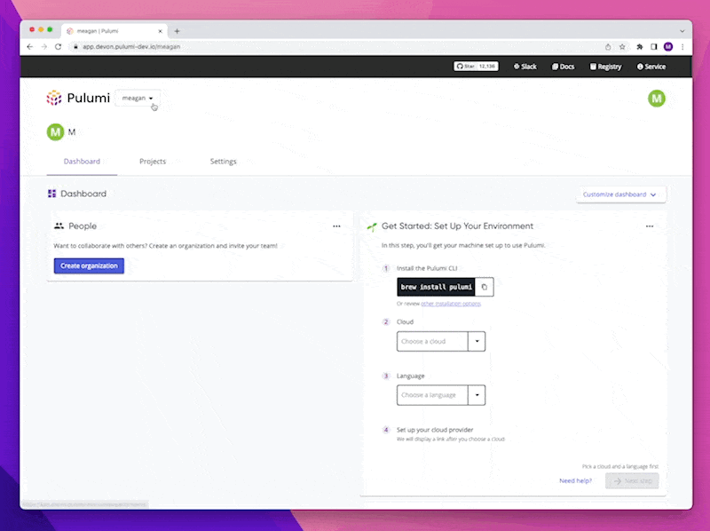
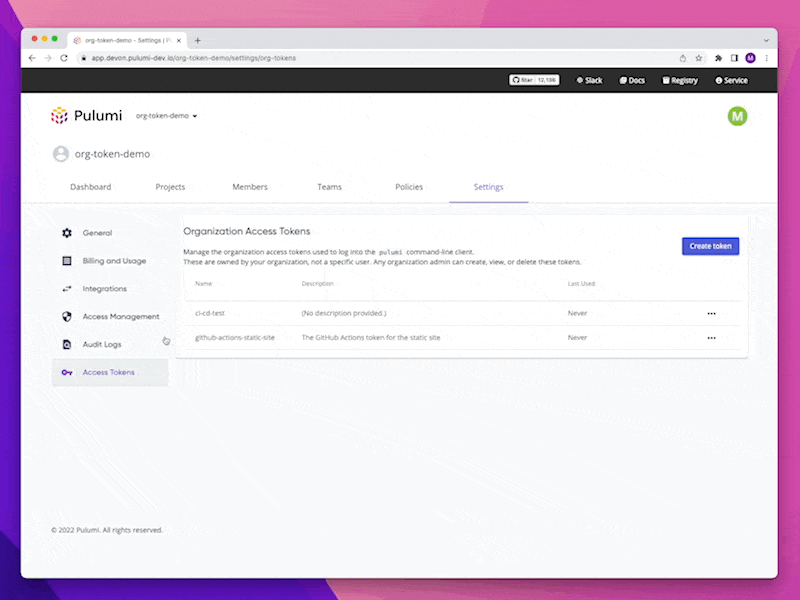

As enterprise adoption of the Pulumi Service has grown 350% over the last year, we've seen a strong customer demand for tools to manage automated Pulumi use cases such as CI/CD and Automation API at scale. Today we are launching Organization Access Tokens to empower our largest customers to manage automated workloads in a secure and collaborative manner.
<!--more-->
Enterprise and Business Critical customers of the Pulumi Service can now create Access Tokens tied to their Pulumi Organization. In addition to creating and managing Access Tokens tied to a user’s access (Personal Access Tokens), customers can utilize Organization Access Tokens, tokens which are not tied to a specific user. This feature is particularly useful for:

  1. Enterprise customers using SSO/SAML/SCIM, as it enables them to create Pulumi Service tokens not tied to identities within their identity provider (IdP)
  2. Garnering programmatic access for continuous integration and continuous delivery (CI/CD) tools and other automated processes

We're excited to deliver one of the most [requested features from the community](https://github.com/pulumi/service-requests/issues/16) and a top ask from some of the largest customers using the Pulumi Service. The need to use Personal Access Tokens to manage automation and organization-specific resources can lead to some friction. When a user is deprovisioned or otherwise leaves the organization, their tokens in use no longer grant access and pipelines can become broken. Additionally, since Personal Access Tokens grant access to all resources and organizations they have access to, using personal tokens in organization automation pipelines leads to the pipeline having more privileged access than is necessary. We want to enable our customers to use the principle of least privilege. At launch, Organization Access Tokens will have write permissions to stacks in an Organization. We plan to continue to expand options for scoping this access based on feedback from our customers.

See below what the experience looks like in the Pulumi Service:

Users can now create an Organization Access Token in the Pulumi Service, give it a unique human-readable name (i.e. jenkins-ci-dev) and then use it to gain access to their Pulumi Service Organization. Only Organization Admins can create and manage Organization Access Tokens. As a security consideration for our customers, Organization Access Tokens cannot create other Organization Access Tokens. When a token is created they are provided a one-time token value. These tokens can only be deleted as an explicit action, either by clicking a button in the console or calling an API to delete the token. Creating or deleting an Organization Access Token will be logged as an event in the [Audit Logs]().

To determine which actions have been taken by which Organization Access Tokens, and to give greater clarity into specifically which tokens are conducting what operations, we have expanded Audit Log events to include information about the Organization Access Token that took the action. As an organization can have multiple Organization Access Tokens, this is a necessary step to ensure that accurate auditing can be done in the event that a token is compromised or is being used maliciously.

See below how Organization Access Tokens appears in Audit Logs:

Learn more about using this feature in our [Access Token documentation]().

Let's explore how one of our customers is adopting Organization Access Tokens in the Pulumi Service. [Fauna](https://fauna.com/), a Pulumi customer, is a distributed document relational database, delivered as a Cloud API. A native serverless architecture means no operations are required. Developers choose Fauna to build new applications faster and confidently scale existing ones across regions and the globe.

Previously, Fauna created a user on the Pulumi Service under a shared email account and generated a Personal Access Token for that account to manage their organization wide access. This worked well as it meant the access token was not tied to a specific user. However, when they migrated to using the Pulumi Service single sign-on (SSO) for their Organization, this approach no longer worked since all Pulumi users were now attached to their SSO provider. “This will immediately solve the issues we have. This is an improvement over the process we’re using today,” said Ben Cohen, Software Engineer at Fauna.

This feature is available to all Enterprise and Business Critical customers today, as well as on our 14-day trial. You can [start a trial](https://app.pulumi.com/site/trial) or [Contact Us]() about the Pulumi Service Enterprise Edition and Business Critical Edition to take it for a spin!
