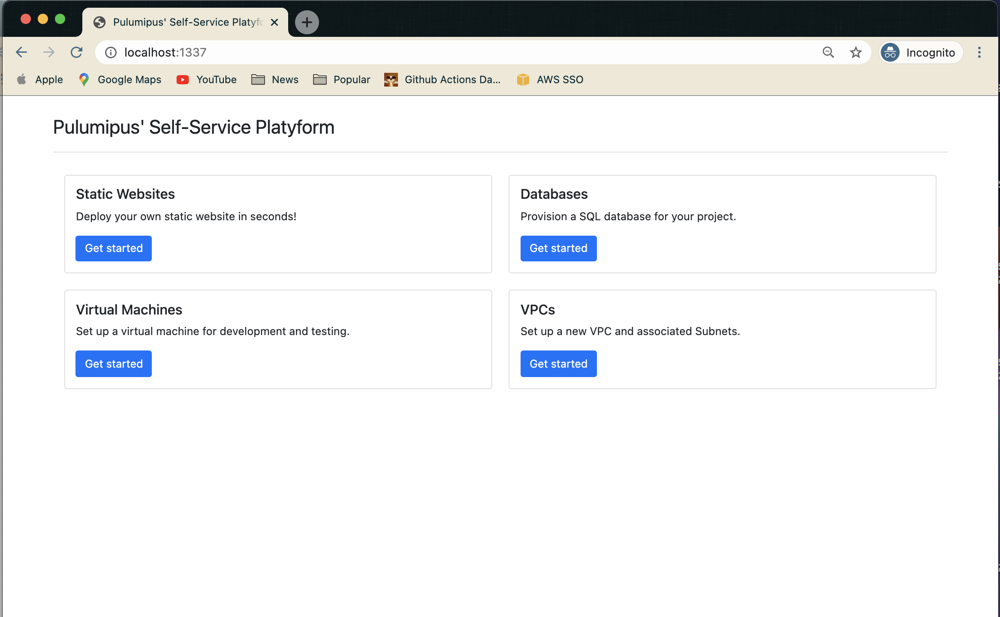

Using Pulumi is more than just writing code and components. In addition to common software development practices, there are also a number of success patterns related to how your company or team builds and deploys Pulumi programs to successfully build, deploy, and manage your infrastructure and applications. In this continuation of a series, I will explore one of these patterns - using the Pulumi [Automation API](https://www.pulumi.com/docs/guides/automation-api/) to create a developer portal.

<!--more-->

It is becoming more and more common to consider building out centralized web-based "portals" for developers (and other team members) to provision the infrastructure that their services and applications require. In many ways, the pattern of a developer portal takes portions of both the [Single Infra Repo](/blog/organizational-patterns-infra-repo/) and [Automation Team](/blog/organizational-patterns-automation-team/) patterns covered in previous posts. The difference is that the developer portal is a single, centralized web application that can be used by multiple teams and organizations to provision infrastructure and applications, rather than writing the Pulumi programs themselves.

Depending upon the needs of the various teams, the developer portal could include options to deploy virtual machines into the cloud of their choice (or the organization's standard cloud; perhaps the choice isn't...a choice!), to provision cloud resources such as virtual networks, security groups, database instances, or even deployments to a kubernetes cluster.

Generally speaking, the developer portal is created and maintained by a central platform team. This is the team who knows the success patterns/standards that are employed by the organization, and can implement these patterns in the developer portal. The platform team is also responsible for maintaining the infrastructure that the developer portal requires.

One of the great advantages of providing a single portal for provisioning these resources is that all the "other stuff" that is often required (besides the resources from the hyperscaler) can be handled by the developer portal. For example, if the  portal is used to provision a virtual machine, the code behind it can register the virtual machine with the company's infrastructure management system.

A great example of what is possible in a portal can be seen with [Komal Ali's](https://github.com/komalali/) example, the [Self Service Infrastructure Platyform](https://github.com/komalali/self-service-platyform). This is example code only, but it shows some of the capabilities of a developer portal.



In the example, the web portal is created using a combination of Python, Flask and Jinja templates (along with the Pulumi Automation API) to provide push-button access to deploy cloud resources according to the standards and patterns of the organization. The code snippets below illustrate some of the concepts (this code is not meant to be run, but rather to illustrate the concepts - the full example code can be found at [github.com/komalali/self-service-platyform](https://github.com/komalali/self-service-platyform)).

```python
from flask import (Blueprint, current_app, request, flash,
                   redirect, url_for, render_template)

import pulumi
import pulumi_aws as aws
import pulumi.automation as auto
import os
from pathlib import Path

bp = Blueprint("virtual_machines", __name__, url_prefix="/vms")
instance_types = ['c5.xlarge', 'p2.xlarge', 'p3.2xlarge']

```

In the initial snippet above, we are setting up what we need for the Flask application, but the key items to make note of are including the `pulumi_aws` and `pulumi.automation` packages, which will be used for the cloud specific resources and automation.

```python

def create_pulumi_program(keydata: str, instance_type=str):
    ami = aws.ec2.get_ami(most_recent=True,
                          owners=["amazon"],
                          filters=[aws.GetAmiFilterArgs(name="name", values=["*amzn2-ami-minimal-hvm*"])])

    group = aws.ec2.SecurityGroup('web-secgrp',
                                  description='Enable SSH access',
                                  ingress=[aws.ec2.SecurityGroupIngressArgs(
                                      protocol='tcp',
                                      from_port=22,
                                      to_port=22,
                                      cidr_blocks=['0.0.0.0/0'],
                                  )])

```

Continuing on, we define the Pulumi program, and set up some of the standard settings that we consider our defaults and that are not selectable by the user.

```python

    server = aws.ec2.Instance('dlami-server',
                              instance_type=instance_type,
                              vpc_security_group_ids=[group.id],
                              key_name=keypair.id,
                              ami=ami.id)

    pulumi.export('public_dns', server.public_dns)

```

This final snippet is what creates the actual instance, and it exports the public DNS of the instance so that it can be accessed by the user and presented in the portal.

## Conclusion

This pattern has been implemented and deployed at many larger enterprises, where the platform team has the resources to dedicate to managing the portal as an actual product. This is a key part to remember - the developer portal is a product whose consumers are the developers and other teams in the organization, and it needs to be managed as such!

Don't forget to check out the previous two posts in this series, [Organizational Patterns - A Single Infra Repo](/blog/organizational-patterns-infra-repo/) and [Organizational Patterns - An Automation Team"](/blog/organizational-patterns-automation-team/).
