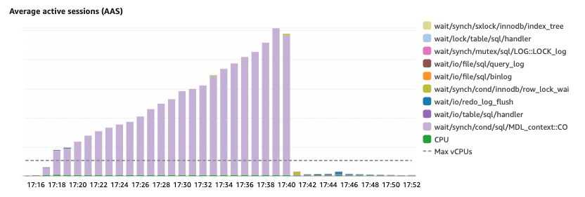

At Pulumi, we understand that Pulumi Cloud plays an important role in how our customers address their infrastructure management challenges. As a result, we strive for the highest levels of availability and performance in Pulumi Cloud. Unfortunately, on Friday, October 6, 2023, Pulumi Cloud suffered a 24 minute outage during which we failed to process 74.7% of received requests. In this post, we'd like to share our findings on the root cause of this outage, and the steps we are taking to ensure this sort of outage doesn't happen again.

<!--more-->

On October 6th at approximately 17:15 UTC we shipped a database migration modifying foreign keys on a table to our production environment, clearing it for release after testing in several non-production environments and a few rounds of peer review. However, the pre-production testing was not an adequate substitute to test the behavior of the migration when running on our production dataset under full traffic load.

Adding foreign key constraints to a table can be done “in place” [with an asterisk](https://dev.mysql.com/doc/refman/8.0/en/innodb-online-ddl-operations.html#online-ddl-foreign-key-operations). Testing and review missed that we weren’t abiding by that asterisk. The resulting table copy operation caused by the bad migration held a lock for a significant amount of time, and caused a query pileup that starved our database of all available connections.

This is the first time in six years that Pulumi has seen an outage of this scale. We are careful not to make changes to high traffic tables on the core API path responsible for handling updates and storing state. When we’ve needed to update these tables in the past, we were heedful in standing up new tables; duplicating writes; and cutting over to new tables without downtime.

During the review process, we had categorized the migration as low risk, as the affected table is low traffic relative to our other workloads (<0.2% of the traffic of our busiest table). We learned through this incident that we've arrived at a scale where a block on even a relatively low-traffic table is enough to cause writes into this table to block the entire connection pool and starve the rest of the database and API workloads.

Within three minutes of the change hitting production, our alarms alerted us to our service degradation and within five minutes, multiple team members were huddled together on an incident call. Our responders parallelized in gaining access to our production database and working to terminate the offending blocked writes that were starving other API workloads. Others assessed impact and worked on customer comms. Unfortunately, high database load also affected the responsiveness of our operational tooling. While we were preparing to execute mitigation actions, the migration completed successfully and both the database and API availability immediately and fully recovered.

But failing three quarters of our traffic for a twenty minute outage is unacceptable. A migration that caused this level of locking should not have been allowed to run. Following an internal team postmortem, we have identified improvements we will be applying to our Software Development Lifecycle to automatically and accurately assess the impact of proposed migrations, as well as to block dangerous migrations from running in production. These include:

1. New guidance, enforced by SQL linting, that migrations must always explicitly specify safe `ALGORITHM` and `LOCK` constraints.
1. Improving the fidelity of our pre-production environments to better simulate production workloads.
1. New tooling to quickly create ephemeral database performance testing environments at the click of a button. (pulumi makes this easy!)

We are also making changes to split parts of our service into different failure domains. This ensures that even if a table on a non-critical path gets blocked, we reserve connections for core workloads. We want the Pulumi Cloud to remain available to continue to save stack state from customer updates even if other parts of the service are failing.

At Pulumi, we value honesty and transparency. It’s easy to repeat the past; harder to learn from it and move past it. If Pulumi is to be the best developer tools platform on the market, that begins with how we build and operate our software. We deeply apologize to our users for the disruption in service, and we commit ourselves further in driving towards excellence - in both the features we provide and the operational standards to which we hold ourselves.

Thank you for your understanding, and for sticking with us on the road to better.
