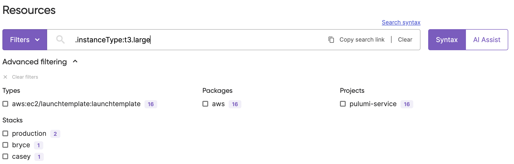

Two months ago we launched [Resource Search for Pulumi Cloud](/blog/pulumi-insights) to offer multi-cloud resource search and analytics across every cloud environment in your organization. Today, we're excited to announce that we are taking this a step further and exposing a much larger set of data to search over: resource properties.

<!--more-->

Including property names and values in your resource searches enables you to search on an even richer variety of dimensions, everything from instance type, to database version, to region and availability zone, to whether resources are open to the internet.  By searching on property data, in addition to overall resource metadata, you can craft expressive queries that serve key compliance, operational and diagnostic use cases.

Pulumi Resource Search, including the ability to search on property data, is applicable across all cloud resources, whether they reside in AWS, Google Cloud, Azure, or any of Pulumi's 100+ cloud providers. Support for querying on property data is available in the [Enterprise and Business Critical editions](/pricing) of Pulumi Cloud.

## Feature Overview

Cloud resources come with various properties that define their behavior, performance, location, and more. You can now use Pulumi Resource Search to search based on these properties in addition to other resource metadata across 100+ clouds. Whether you're trying to find resources running in a specific region, instances with a particular tag, or databases running a certain engine version, searching over properties with Pulumi Cloud streamlines and simplifies your tasks.

Using the new feature is simple and straightforward. Go to the Pulumi console, navigate to the search bar, and start typing the property you're interested in. For example, if you're searching for all AWS RDS instances running MySQL with a particular engine version, simply type `.engineVersion:5.7` and press enter.

The ability to search for resources based on their properties is a powerful tool for optimizing cloud resource management. It provides deeper insights into your infrastructure and aids in identifying resources that are misconfigured, out-of-date, or not adhering to your organization's best practices. Essentially, it's a significant step towards more proactive, informed, and efficient management of your cloud environment.Customers like Alkira, a company that reinvents networking for the cloud era, have found it to be a significant step towards more proactive, informed, and efficient management of the cloud.

> “I’m making developers at Alkira significantly more productive while also making my job easier using Pulumi’s IaC platform and features like Pulumi Insights and Deployments,” said Santosh Dornal, Head of Software Test & DevOps, Alkira. “I can get developers using IaC immediately with Pulumi Deployments and its GitHub integration, while Pulumi Insights makes it really easy to find idle developer environments that need to be shut down, which reduces our cloud costs.”

## Example queries

Before Property Search, using just Resource Search, you were able to find resources by their name, type, URN, parent, the team they are in, and so on... but today, any property on your resource will be indexed by Pulumi Cloud and searchable after each stack update. Let's walk through some examples of the types of queries you can now perform.

### AI Assist & properties

Pulumi [AI Assist](/docs/pulumi-cloud/insights/search/#ai-assist) allows you to use natural language to search for resources. AI Assist works by converting natural language to a query in our search syntax. This becomes even more valuable with property search. Resources can have dozens of properties, and remembering exactly how to search for property values can be challenging, especially when they change depending on the provider. AI Assist is going to step in so that you don’t have to remember everything.

Here is a list of example natural language queries we have seen customers use and the AI Assist output:

| Natural language                              | Query result                                                                                               |
|-----------------------------------------------|------------------------------------------------------------------------------------------------------------|
| resources tagged with stack production        | `.tags.stack:production`                                                                                   |
| resources without a tag in production         | `-tags: stack:production`                                                                                  |
| aurora engines running MySQL engine version 5 | `type:"aws:rds/cluster:Cluster" .engine:aurora .engineVersion:5`                                           |
| s3 buckets read write in production           | `type:"aws:s3/bucket:Bucket" stack:production .acl:public-read-write`                                      |
| buckets objects in all clouds                 | `type:"aws:s3/bucket:Bucket" OR type:"google:storage/bucket:Bucket" OR type:"azure:storage:BlobContainer"` |
| all resources in us east 1                    | `region:"us-east-1"`                                                                                       |
| resources with a private ip                   | `.privateIpAddress:`                                                                                       |

### Search syntax

Properties can be used in your queries by using a `.` prefix. For example, if you want to see all resources with an Instance Type property, you type in the search bar `.instanceType:`. If you want to only look at a specific value, you can search for the value behind the colon. In this case our query would become `.instanceType:t3.large`.



Here are some query examples we have seen customers use:

- `project:pulumi-service stack:staging .instanceType:`
- `type:aws:rds/cluster:Cluster .engine:aurora .engineVersion:8`
- `type:aws:s3/bucket:Bucket stack:production .acl:public-read`
- `team:data package:snowflake .availabilityZone:us-west-2a`
- `vpc created:2023-06-12 .tags.Environment:production`

### Use the REST API

In addition to searching for resources you can also export them to perform analytics: whether that is something simple like opening it in a spreadsheet or something more sophisticated, like if you want to regularly ingest it to your data warehouse. You can download a CSV from the console or get the data using the [Data Export API](/docs/pulumi-cloud/cloud-rest-api/#data-export).

But the value of Resource Search is not limited to what you do in the console and for analytics. You can also leverage the [Resource Search API](/docs/pulumi-cloud/cloud-rest-api/#resource-search) to create automation and workflows off of search results. Find below details on how to use the API.



{}

```javascript
const headers = {
  Accept: "application/json",
  Authorization: "token pul-abc123",
};

const body = await (
  await fetch("https://api.pulumi.com/api/orgs/{org}/search/resources?properties=true?query=.instanceType", {
    method: "GET",
    headers: headers,
  })
).json();

console.log(body);
```



{}

```typescript
const headers = {
  Accept: "application/json",
  Authorization: "token pul-abc123",
};

const body = await(
  await fetch("https://api.pulumi.com/api/orgs/{org}/search/resources?properties=true?query=.instanceType", {
    method: "GET",
    headers: headers,
  }),
).json();

console.log(body);
```



{}

```python
import requests
headers = {
  'Accept': 'application/json',
  'Authorization': 'token pul-abc123'
}

r = requests.get('https://api.pulumi.com/api/orgs/{org}/search/resources?properties=true?query=.instanceType', headers = headers)

print(r.json())

```



{}

```go
package main

import (
       "bytes"
       "net/http"
)

func main() {
    headers := map[string][]string{
        "Accept": []string{"application/json"},
        "Authorization": []string{"token pul-abc123"},
    }

    data := bytes.NewBuffer([]byte{jsonReq})
    req, err := http.NewRequest("GET", "https://api.pulumi.com/api/orgs/{org}/search/resources?properties=true?query=.instanceType", data)
    req.Header = headers

    client := &http.Client{}
    resp, err := client.Do(req)
    // ...
}

```



{}

```csharp
using System;
using System.Collections.Generic;
using System.Net.Http;
using System.Net.Http.Headers;
using System.Text;
using System.Threading.Tasks;
using Newtonsoft.Json;

public class HttpExample
{
    private HttpClient Client { get; set; }

    public HttpExample()
    {
      Client = new HttpClient();
    }

    public async Task MakeGetRequest()
    {
      string url = "https://api.pulumi.com/api/orgs/{org}/search/resources?properties=true?query=.instanceType";
      var result = await GetAsync(url);
    }

    /// Performs a GET Request
    public async Task GetAsync(string url)
    {
        //Start the request
        HttpResponseMessage response = await Client.GetAsync(url);

        //Validate result
        response.EnsureSuccessStatusCode();

    }

    /// Deserialize object from request response
    private async Task DeserializeObject(HttpResponseMessage response)
    {
        //Read body
        string responseBody = await response.Content.ReadAsStringAsync();

        //Deserialize Body to object
        var result = JsonConvert.DeserializeObject(responseBody);
    }
}

```



{}

```java
URL obj = new URL("https://api.pulumi.com/api/orgs/{org}/search/resources?properties=true?query=.instanceType");
HttpURLConnection con = (HttpURLConnection) obj.openConnection();
con.setRequestMethod("GET");
int responseCode = con.getResponseCode();
BufferedReader in = new BufferedReader(
    new InputStreamReader(con.getInputStream()));
String inputLine;
StringBuffer response = new StringBuffer();
while ((inputLine = in.readLine()) != null) {
    response.append(inputLine);
}
in.close();
System.out.println(response.toString());

```





## Wrapping it all up

We are excited to be extending Pulumi Resource Search with access to search over every property of your resources. We can’t wait to see what new capabilities it unlocks for your organization. As always, submit any feedback on the feature in the [Pulumi Cloud Requests](https://github.com/pulumi/pulumi-cloud-requests/issues/new?assignees=&labels=kind%2Fenhancement&projects=&template=feature-request.md) repository.

[Login to Pulumi Cloud](https://app.pulumi.com)

Happy searching!
