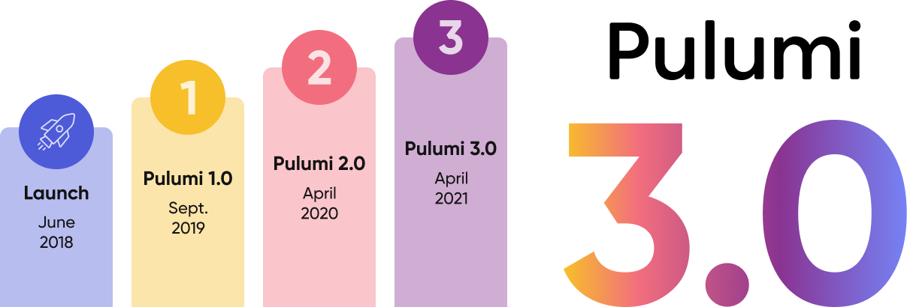

Today we’re excited to announce the availability of Pulumi 3.0, the next major version of the Pulumi open source project, and the foundation for Pulumi’s [Cloud Engineering Platform]().

Pulumi offers the most complete [infrastructure as code]() platform for building, deploying and managing modern cloud infrastructure and applications.  Pulumi enables cloud engineers to use familiar languages to describe their cloud infrastructure - bringing core software engineering tools and practices to bear on managing and getting the maximum value from their cloud platforms of choice - across dozens of cloud and SaaS providers.

Pulumi 3.0 includes dozens of significant new features and hundreds of improvements that build on this foundation.  This release includes more than 200 contributions from over 150 members of the Pulumi community, and builds on feedback from working with thousands of Pulumi users and customers over the last year.

<!--more-->



Some of the most exciting new features in this release include:

* **Pulumi Automation API**:  All the power of Pulumi, now available to embed within your own software and applications in Node.js, Python, Go and .NET - opening up a brand new wave of modern cloud infrastructure use cases, including self-service infrastructure portals, custom CLIs, and richer CI/CD workflows.
* **Native Pulumi Providers for Azure (GA) and Google Cloud (Preview)**: New providers with 100% platform coverage, same-day support for new features, and the exact same resource models defined by the cloud providers - the most complete and consistent way to manage cloud infrastructure in Azure and Google Cloud.
* **Pulumi Packages and Multi-Language Components**: Take any Pulumi components written in your language of choice, and make them available as a Pulumi Package to users in all other Pulumi languages - bringing together each of the language ecosystems Pulumi supports into a single Pulumi component ecosystem.
* **Improved Go and Python SDKs**: Updates to the core Go and Python SDKs make APIs simpler and more consistent, unlock more tooling support, and improve compile times - making it even easier to use all the benefits of your favorite programming language when building and managing cloud infrastructure.
* **New Integrations and Features in the Pulumi Service**: Alongside Pulumi 3.0, users of the Pulumi Service also now have access to new dashboards for organization-level cloud infrastructure insights, a CI/CD Assistant for easy version control and CI/CD integration with just a few clicks, and new identity, access control, and auditing capabilities.

👉 [Get started]() with Pulumi 3.0 today or check out the [Pulumi 3.0 migration guide]() to update your existing Pulumi projects to Pulumi 3.0.

## Pulumi Automation API

Pulumi’s Automation API was released in preview last year and is now GA as part of Pulumi 3.0.  It provides an API for embedding Pulumi within your own applications, and supports all Pulumi languages including TypeScript/JavaScript, Python, Go, and C#.  Instead of working with the `pulumi` CLI directly, or writing scripts to execute the CLI within your CI/CD environment, you can now build your own software solutions that build on top of Pulumi’s robust, desired state infrastructure as code deployment engine.  It’s simple to embed Pulumi in your software-defined workflows with just [a few lines of code](https://github.com/pulumi/automation-api-examples).

This opens up so many exciting new opportunities for how your team can manage cloud infrastructure; we’ve seen amazing creativity as Pulumi’s customers and communities have [created solutions]() on top of Automation API.  In addition, Pulumi Automation API powers several other new features like the [Pulumi Kubernetes Operator](), the [Pulumi GitHub Action v3](https://github.com/marketplace/actions/pulumi-cli-action), and [Concourse CI](https://github.com/ringods/pulumi-resource/) support for Pulumi.

👉 Read more in the [Pulumi Automation API]() blog post.


## Native Providers for Azure and Google Cloud

Pulumi offers packages for managing cloud infrastructure in more than 50 cloud and SaaS applications, with more than a dozen new providers added since Pulumi 2.0 including partnerships with [Civo](), [Venafi](), [Okta](), [Auth0](), [Equinix Metal](), [Spot Ocean for Azure](), and [Splunk]().

For the largest and most widely used cloud providers, we’ve created something new: Pulumi **native providers**, which give you the most complete and consistent interface for the modern cloud. These native providers are automatically generated from cloud provider APIs and resource models that are maintained directly by cloud provider service teams.  This enables native providers to offer 100% API coverage, same-day support for new features, the exact same API designed by the provider service team, and fewer bugs and reliability issues.  This makes native providers the best way to manage infrastructure in the supported cloud platforms, combining the benefits of Pulumi Infrastructure as Code with the resource models and pace of delivery of the cloud provider themselves.


Along with Pulumi 3.0, the new Azure Native provider, originally released in preview last year, is now generally available as version 1.0.  The Azure Native provider is built on top of the Azure Resource Manager REST API specifications developed and maintained by Azure service teams. It supports more than 2x the number of resources, and 3x the number of resource properties as the classic Azure provider. Azure Native also supports  every version of each resource API for maximum compatibility with your existing infrastructure.  New versions of the Azure Native provider with support for the latest features of Azure are published every night, ensuring immediate availability of new features and improvements from the Azure service teams.


Today, we’re also excited to be releasing a preview of the new Google Cloud Native provider.  This native provider offers 100% coverage of the Google Cloud platform, with 70% more resource properties supported compared to the existing provider. It also supports every version of each supported resource, including alpha, beta, and GA Google Cloud offerings.

👉 Read more in the [Pulumi Native Providers]() blog post and the [Pulumi Google Native Provider]() blog post. And of course, we haven’t forgotten AWS - an AWS Native provider is expected later this year.

## Pulumi Packages and Multi-Language Components


Pulumi Packages are the core technology that enables cloud infrastructure resource provisioning to be defined once, and made available to users in all languages supported by Pulumi. If you’ve ever used a cloud provider in Pulumi, you’ve used a Pulumi Package.  With Pulumi 3.0, we are extending Pulumi Packages to also support building and packaging [Pulumi Components](): higher-level abstractions over cloud infrastructure patterns described as normal Pulumi programs.  This makes it easy to take a Pulumi program that defines a collection of resources and turn it into something reusable: a Pulumi Package that can be published and used by all Pulumi users, across all languages supported by Pulumi.

One example of building and packaging Pulumi Components as a Pulumi Package is the [Pulumi EKS](https://github.com/pulumi/pulumi-eks/) package.  We originally released a component for easily building and managing production-ready EKS clusters nearly two years ago, but it was only available for Node.js users of Pulumi as an npm package.  This component has been incredibly popular, as it abstracts away a lot of complexity in all the moving pieces that need to be managed to stand up an EKS cluster across both AWS resources and in-cluster Kubernetes resources.  Recently, we turned this component into a Pulumi Package, making it available to users in Python, Go, and .NET as well, with just a single implementation.  Pulumi EKS is just the first example of applying this technology; there’s a lot more in the works here in the coming months!



{}

```py
import pulumi
import pulumi_eks as eks

cluster = eks.Cluster("my-cluster")

pulumi.export("kubeconfig", cluster.kubeconfig)
```

{}

{}

```go
package main

import (
	"github.com/pulumi/pulumi-eks/sdk/go/eks"
	"github.com/pulumi/pulumi/sdk/v3/go/pulumi"
)

func main() {
	pulumi.Run(func(ctx *pulumi.Context) error {
		cluster, err := eks.NewCluster(ctx, "my-cluster", nil)
		if err != nil {
			return err
		}
		ctx.Export("kubeconfig", cluster.Kubeconfig)
		return nil
	})
}
```

{}

{}

```ts
import * as eks from "@pulumi/eks";

const cluster = new eks.Cluster("my-cluster");

export const kubeconfig = cluster.kubeconfig;
```

{}

{}

```csharp
using Pulumi;
using Pulumi.Eks;

class MyStack : Stack
{
    [Output("kubeconfig")]
    public Output<object> Kubeconfig { get; set; }

    public MyStack()
    {
        var cluster = new Cluster("my-cluster");

        Kubeconfig = cluster.Kubeconfig;
    }
}
```

{}



All Pulumi packages define a common Pulumi schema, which describes the resource model the package exposes and can be used to generate language-specific SDKs and documentation. There are several different types of Pulumi Package:

* **Native Pulumi Provider Package**: Use the full features of the Pulumi resource model to create a provider for a new cloud platform. Examples: the [`kubernetes`](), [`azure-native`](), and `google-native` packages.
* **Bridged Provider Package**:  Take an existing resource provider from another supported ecosystem (like a Terraform provider), and bridge it to be exposed as a Pulumi Package.  Examples:the [`aws`](), [`tls`](), and [`cloudflare`]() packages.
* **Component Package**: Write a Pulumi Component in your language of choice and expose it to users in all languages supported by Pulumi.  Example: the [`eks`]() package.

Together, these options provide a combination of breadth and depth for the kinds of resources and components that can be exposed to Pulumi developers via Pulumi Packages.

👉 Read more in the [Pulumi Packages]() blog post.

## Improved Go and Python SDKs

Pulumi’s language SDKs bring the power of cloud infrastructure management into your language of choice in a natural and productive way, enabling you to use all of your existing software engineering knowledge and tools for your cloud infrastructure projects as well.  In Pulumi 3.0, we’ve made improvements to the Go and Python SDKs to improve developer productivity and enable additional tooling.


For Go users, Pulumi 3.0 reduces binary sizes by 4x and improves build times by up to 3x, leading to a much faster infrastructure development loop. Along with this, the Go APIs for working with Pulumi `Output` values have been simplified to provide a single way of transforming outputs instead of three different options.  This makes the Pulumi Go SDK more consistent and easier to get started with.  You can learn more about these changes in the [Pulumi 3.0 migration guide]().


For Python users, Pulumi 3.0 brings a new, more strongly typed way to provide inputs to cloud resources, ensuring that users get completion lists, type checking, documentation, and more within their IDE of choice.  Along with this, some inconsistencies in input property naming have also been removed; now, all property names follow a consistent and predictable naming convention.  You can learn more about these changes in the [Pulumi 3.0 migration guide]().


## New Integrations and Features in the Pulumi Service

In addition to the Pulumi 3.0 open source release, we’re also making available new features for users of the Pulumi Service: the simple and easy to use default backend for all Pulumi users, with additional features for teams and enterprises.

Integrating Pulumi into CI/CD systems is a key step in realizing the full benefits of modern infrastructure as code, and we’ve worked to make this easier than ever. Since 2.0, we’ve added partner integrations with [Spinnaker](), [GitHub Actions]() and [CodeFresh]() as well as a new [Pulumi Kubernetes Operator]().  In addition, we’ve introduced a new [CI/CD Assistant]() to the service to help configure version control and CI/CD integration for your Pulumi projects with just a few clicks.

For enterprise users, we’ve added several enhancements to SAML SSO and SCIM support.  Pulumi’s SSO support now works seamlessly with [Okta](https://www.pulumi.com/docs/guides/saml/okta/) (as well as Google Identity, Azure Active Directory and more), users and groups can now be synced via [SCIM support]() in your SAML provider, and new [Team Admin roles]() make team management simpler for large organizations.

Lastly, the Pulumi Service now offers a dashboard landing page which brings insights about your infrastructure front-and-center whether you are an individual user, or part of a large organization.

👉 Read more in the [Pulumi CI/CD Assistant]() blog post and the [SAML SSO and SCIM]() blog post.


## Keep exploring

Pulumi 3.0 is a significant new milestone for the Pulumi project and lays the foundations for the Pulumi Cloud Engineering Platform with support for the very best of the cloud via new Pulumi Native Providers, support for a unified ecosystem of reusable infrastructure components with Pulumi Packages, and support for a new era of cloud infrastructure management scenarios enabled by Pulumi Automation API.  Each of these is just a start: there’s so much more to come on top of these foundations and we’re excited to work with our customers and community on the next wave of innovation in Cloud Engineering!

To learn more about each of the new areas - check out these blog posts with more details:

* [Model and program the cloud with Pulumi native providers]()
* [Google Cloud Native provider: full coverage of Google Cloud]()
* [Introducing Pulumi Packages and multi-language Components]()
* [Build your perfect interface for the cloud: Automation API]()
* [Pulumi CI/CD Integration Assistant available for all plans]()
* [Easily bring your team to Pulumi with SAML SSO and SCIM]()

You can [get started]() with Pulumi 3.0 today, or check out the [Pulumi 3.0 migration guide]() to update your existing Pulumi projects to Pulumi 3.0.

We can't wait to see what you build with Pulumi 3.0!
