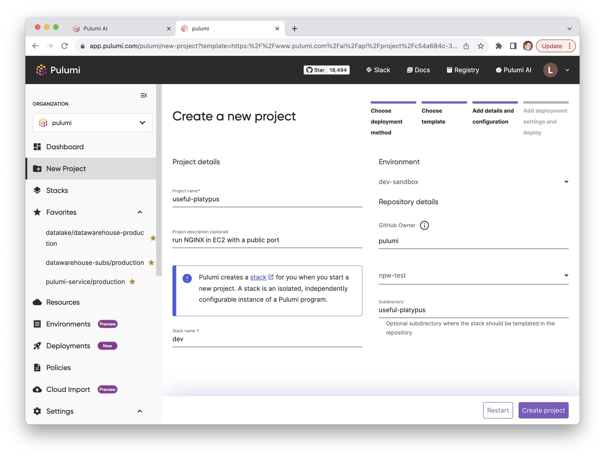
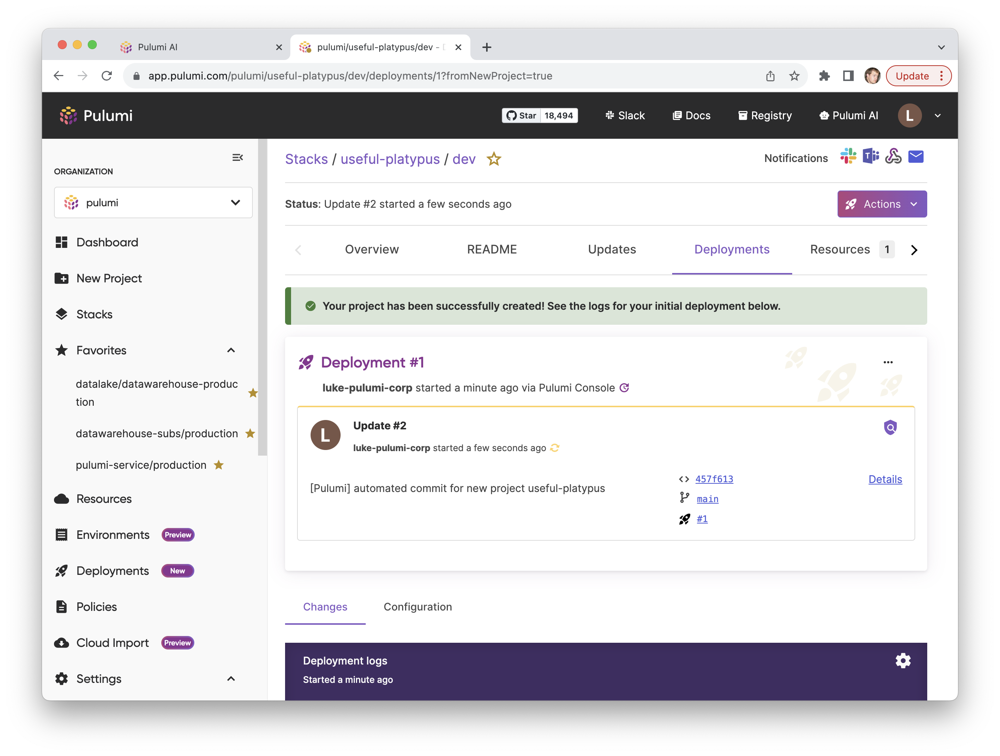
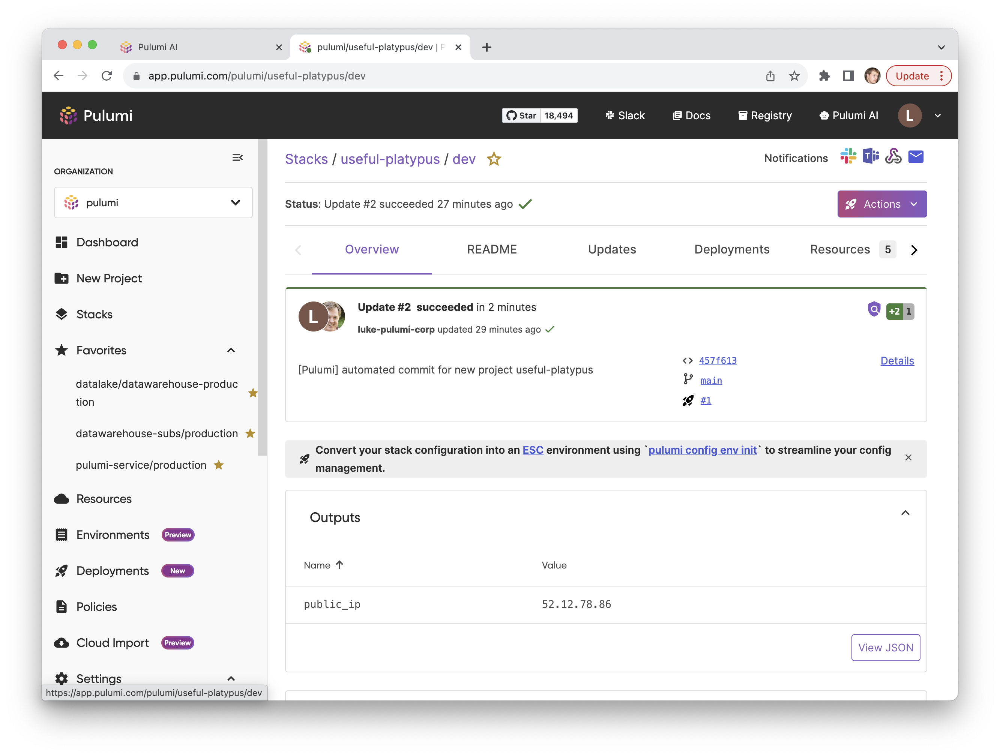
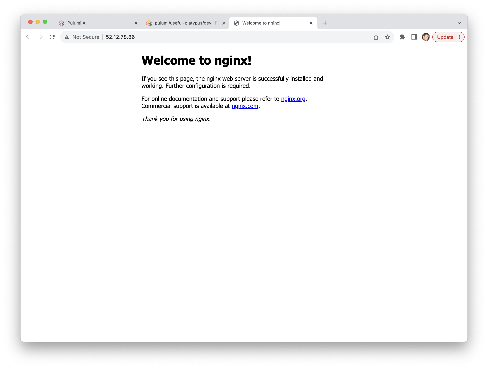

Earlier this year we launched [Pulumi AI](/ai), a purpose-built AI assistant that can create Infrastructure as Code (IaC) from natural language prompts using Pulumi.  Since launch, we’ve seen incredible adoption of Pulumi AI, with over 200,000 questions asked so far and growing fast.  Pulumi AI is popular with users new to Pulumi and/or new to the Cloud, but also heavily used by many of the most advanced IaC users and organizations to quickly discover solutions to new problems they need to solve. Over the last few months, we’ve driven major improvements to Pulumi AI through the recently launched Pulumi AI Answers pages with thousands of AI generated answers to common questions, improvements to code generation correctness and performance, and expansion of the languages supported by Pulumi AI.

Today, we are taking the next big step, introducing support for __deploying cloud infrastructure directly from Pulumi AI__.  Going from idea to running cloud infrastructure is just a natural language prompt away!

<!--more-->

This is accomplished through two new features:

* The `pulumi new` command now offers the option to provide a Pulumi AI prompt instead of selecting a template.  It then generates a template from your prompt, and lets you iterate on this before choosing to create a project and deploy it to the cloud.
* Every Pulumi AI and Pulumi AI Answers page now has a [Deploy with Pulumi](/docs/pulumi-cloud/pulumi-button/) button on it, which lets you click through a few prompts to deploy the given infrastructure into your cloud account using Pulumi Deployments and Pulumi ESC in Pulumi Cloud or the `pulumi new` command.

Check out [Pulumi AI](/ai) or `pulumi new` in the CLI today.

## Pulumi AI in Pulumi New

The `pulumi new` command is the starting point for almost every new Pulumi project today, offering users a choice from hundreds of templates across various cloud providers, languages and architectures.

Now, `pulumi new` users working with the Pulumi Cloud backend have the additional option to use Pulumi AI to generate a template on demand instead of selecting from one of the pre-defined templates.



The Pulumi AI response is streamed back directly into the CLI, and if Pulumi AI didn’t get it quite right, you can request to “revise” the question to ask Pulumi AI to adjust it’s answer with a follow-up prompt.  When the results look good, you can hit “yes” to deploy the template, generating the source code in your chosen language and installing dependencies for the target cloud providers.  With a simple `pulumi up` your new cloud infrastructure is deployed and running in the cloud.

There’s also a new --ai flag to pulumi new, so you can create a new project from an AI prompt with a command like one of the following:

* `pulumi new --ai "run NGINX in EC2 with a public port"`
* `pulumi new --ai "a static website in Azure with a CDN in front"`
* `pulumi new --ai "managed postgres database and Fargate compute for a containerized app"`

Going from natural language idea to running cloud infrastructure in just seconds!

## Deploy with Pulumi in Pulumi AI

Thousands of developers are already discovering answers to their questions via Pulumi AI, and we’ve been expanding on this with links to Pulumi AI from the Pulumi Registry API docs and with the archive of high quality questions and answers as part of [Pulumi AI Answers](/ai/answers).  To date, users have used these answers to then copy/paste code snippets into their own Pulumi programs, presenting something of a small but meaningful barrier to entry to quickly experimenting with the resulting infrastructure.

Now, every Pulumi AI and Pulumi AI Answers page includes its own Deploy with Pulumi button.  The Deploy with Pulumi button can be used along with any template or Pulumi code example to deploy that code using Pulumi Cloud via the [New Project Wizard](/docs/pulumi-cloud/developer-portals/new-project-wizard).  We’ve extended that to support deploying projects defined by a Pulumi AI answer.  This includes the code snippet, but also the project dependencies, a useful description, and language-specific project files.



Recently, we introduced many [improvements to the New Project Wizard in Pulumi Cloud](/blog/building-developer-portals/), including the ability to deploy a template with just a few clicks using Pulumi Deployments to do the deployments, the Pulumi GitHub app to template the code into a repo for you, and Pulumi ESC to provide access to short-lived credentials for your cloud environment.  Once these are configured for users in an organization, any template can be deployed via the New Project Wizard and the Deploy with Pulumi button in just a few clicks.

These same features and New Project experience are now available from every Pulumi AI page.  Let's see what that looks like.

### Deploy with Pulumi in Pulumi AI Walkthrough

After clicking on the Deploy with Pulumi button on any Pulumi AI page, you can choose the ESC Environment to use for configuration and credentials for your environment (here I use the dev-sandbox environment which provides short-lived OIDC credentials to a development sandbox AWS account), a name for your project and stack, and the repository and folder to generate the code into.

When I click Create Project, this adds the code to the repository and kicks off a Pulumi Deployments run to deploy this new infrastructure to the cloud.

A few moments later, once that deployment completes, I see I have a Pulumi stack with the expected outputs defined by the Pulumi AI answer - the IP address of the running instance in the cloud.

And navigating there shows me my new EC2 instance serving NGINX on the Internet.

We can now continue to iterate on our infrastructure by making changes in the new Git repo folder.

With just a few clicks, we went from a natural language idea to running cloud infrastructure, checked into a Git repo, with Pulumi Deployments configured!

## Looking Forward

Pulumi AI has already transformed how cloud engineers discover and solve their cloud infrastructure development problems.  And yet, we still see incredible opportunity ahead of us.  We’ve made rapid strides on improving the accuracy of AI answers, and continue to invest in further improvements.  We’ve made it significantly faster to go from idea to deployed infrastructure with the `pulumi new` and Deploy with Pulumi button integrations, but we also see the opportunity to make these experiences even more interactive going forward.  And of course, we continue to integrate Pulumi AI even more broadly throughout our product experiences, lighting up AI assistance across the cloud engineering journey.

Try it out yourself today at [pulumi.com/ai](/ai)!
