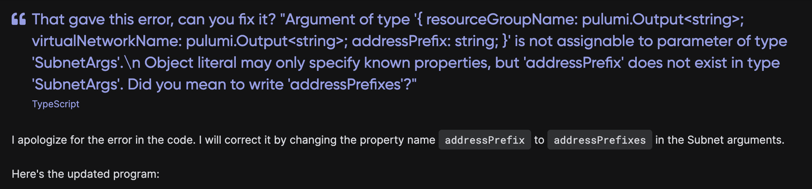
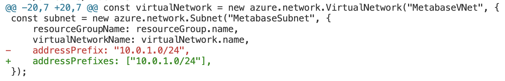
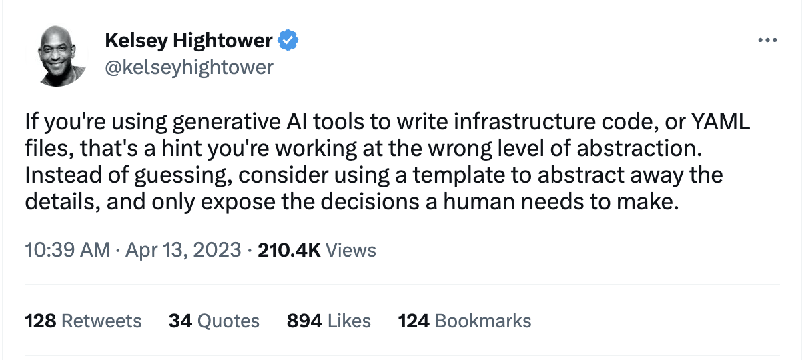

We recently released [Pulumi AI](/ai/), a purpose-built AI Assistant that can create cloud infrastructure using Pulumi. It builds on the power of Large Language Models (LLMs) and GPT to dramatically reduce the time it takes to discover, learn and use new cloud infrastructure APIs.

We’ve seen amazing engagement and stories from Pulumi users about the impact this tool has had for them over the past few weeks. In this post, we’ll dive deeper into this new technology, and share why we and so many other Pulumi users are so excited about [Pulumi AI](https://www.pulumi.com/ai/).

<!--more-->

{}
We've got a few upcoming opportunities to learn more about Pulumi Insights and Pulumi AI. Come join us!

* May 3rd: [Reddit AMA: Pulumi Insights](https://www.reddit.com/r/pulumi/comments/130b4rn/ama_with_luke_hoban_cto_on_pulumi_insightsai_at/)
* May 11th: [Workshop: Getting Started with Pulumi Insights](/resources/getting-started-with-pulumi-insights/)
* Anytime: [Pulumi Challenge: GPT Your IaC](/challenge/ai-architecture/)
{}

## Why Pulumi AI?

It’s often hard to appreciate just how large and complex modern cloud platforms have become.  Pulumi itself  supports 130 cloud providers, with many individual providers having over 1,000 resources, and many of those resources have hundreds of properties. This adds up to *millions* of configurable properties across the entire surface area!  Thank heavens Pulumi provides a consistent programming model for the community.

One of the constant challenges for teams working in the cloud is finding specific examples that cover the set of cloud infrastructure resources and configurations that they require.  By far, the most common question that we see in our [Pulumi Community Slack](https://slack.pulumi.com/) is from users looking for an example covering a specific use case -- and while many times we can point them to one of the thousands listed in our [Pulumi Examples](https://github.com/pulumi/examples) repository or enumerated in the [Pulumi Registry](/registry/), there are also times that the specific combination of technologies that a user needs have not yet been captured and stored.

Pulumi AI addresses this need in a direct way.  Instead of having to create every possible example by hand, users can just ask Pulumi AI to generate an example that suits their unique needs, no matter how specific and bespoke the request might be.

<iframe width="560" height="315" src="https://www.youtube.com/embed/xdTUEStC8I0?rel=0" title="YouTube video player" frameborder="0" allow="accelerometer; autoplay; clipboard-write; encrypted-media; gyroscope; picture-in-picture; web-share" allowfullscreen></iframe>

## Discovering, Learning, and Building with Pulumi AI

For example, suppose that I want to run Metabase on Azure.  There are a few guides that discuss this on the internet, however, it’s not immediately clear what the best compute and database options might be. Most guides only describe how to point-and-click in the Azure Portal, and several of the guides are many years old and out-of-date.  It could take hours to synthesize all the information on this subject and turn it into a working Infrastructure as Code solution with Pulumi.  Instead, I can just type "run Metabase in Azure" into Pulumi AI and get an excellent starting point in seconds:

The result from my prompt is a very good, short Pulumi program that defines all of the pieces needed to run Metabase in Azure.  Already, this has saved me time reading through content online, picking out a set of building block technologies to use, and figuring out how to connect them.

But it’s not perfect!  There may be a few errors when I copy this code into a Pulumi program.  This is where Pulumi AI’s interactive mode with memory becomes invaluable.  I can just let Pulumi AI know about the error and ask it to fix the problem.

Pulumi AI doesn’t just rename the property -- it actually recognizes that the property expects an array, and adjusts to match this requirement.

Pulumi AI can update the code for each of the three errors, iterate on the program, and ultimately complete a fully working solution in less than five minutes.  (Pulumi AI has literally saved me hours on completing this and other tasks just like it!)

The ability to interactively fine tune results to your specific needs is one of the most amazing benefits of Pulumi AI with static code examples.  If Pulumi AI does something slightly different than you want, you can ask it to change it -- and it’s still not quite right, you can change it again.  Compare this approach to finding an article on  Medium that is almost, but not quite what you want.  The difference in productivity is magical.

## Interactivity using the `pulumi-ai` CLI

The Pulumi AI website is fantastic for learning and discovery and the end result is optimized to show how Pulumi code might look. You can then take this code and deploy it using the `pulumi` CLI.  However, we can go a step further and automate this process and build infrastructure directly using natural language, without needing to write (or copy/paste) any IaC code at all.

This is what the [`pulumi-ai`](https://github.com/pulumi/pulumi-ai) CLI enables.  By combining Pulumi AI with [Pulumi Automation API](https://www.pulumi.com/automation/), the `pulumi-ai` CLI takes a natural language query, creates a Pulumi program, and automatically deploys that program using the Pulumi Automation API, showing the user all the outputs (like IP addresses, resource names, etc.).

This integration delivers an incredible experience.  With just a few words of natural language guidance, you can create cloud infrastructure, modify it, extend it, and ultimately, if you so choose see it run live on the internet.

Giving Pulumi AI the tools to build cloud infrastructure is an awesome power, and of course, with great power comes great responsibility. Use this in a development sandbox, with appropriately scoped permissions, and be sure to audit the infrastructure that is deployed.

## Is this the right level of abstraction?

It’s reasonable to ask whether Pulumi AI offers the ideal level of abstraction for AI assistance for Infrastructure as Code. Kelsey Hightower mentioned this on the day that Pulumi AI launched:

We believe that fundamentally, both code and templates, while having different use cases, are important. Giving teams working the tools to discover, learn and use cloud infrastructure APIs via IaC is an incredible productivity boost and addresses real and important needs around examples, content, and tackling cloud complexity.  At the same time, we all want to see the level of abstraction raised for cloud infrastructure.  Indeed, one of our primary goals at Pulumi since our founding has been to raise the abstraction level from raw cloud primitives to higher level components that are aligned with the needs of specific usage scenarios.

This inspires two objectives we have in developing Pulumi AI.

The first is to enable Pulumi AI to use higher-level components when available, so that it is working at the right level of abstraction for the problem at hand. Pulumi AI does this today, for example, by favoring use of the higher level `awsx` and `eks` packages over the raw primitives from the `aws` package in its output.  This ensures that Pulumi AI solves complex problems in simple and composable ways when possible, but falls down into lower level building blocks when it must.  Just like an expert (human!) Pulumi developer would do when given the same set of tasks.

The second is to avoid the need to even think about IaC during the discovery and development phase.  With the `pulumi-ai` CLI, you can iterate using only natural language, keeping your mental model abstraction out of the details, and focused only on the results - did I get the externally visible outputs I requested?

All of these are important, and each of them represents a direction of our investment in Pulumi AI.

## The Future

Pulumi AI is already offering practical value for thousands of users. We have an incredible number of opportunities to extend and apply this technology to many aspects of cloud engineering. The impact is profound today and will be even more so in the future.

We’re just getting started and hope you join us on our journey!  Experience [Pulumi AI](/ai) today and join us for one of these upcoming events to learn more:

* [Workshop: Getting Started with Pulumi Insights](/resources/getting-started-with-pulumi-insights/)
* [Reddit AMA: Pulumi Insights](https://www.reddit.com/r/pulumi/comments/130b4rn/ama_with_luke_hoban_cto_on_pulumi_insightsai_at/)
* [Pulumi Challenge: GPT Your IaC](/challenge/ai-architecture/)
