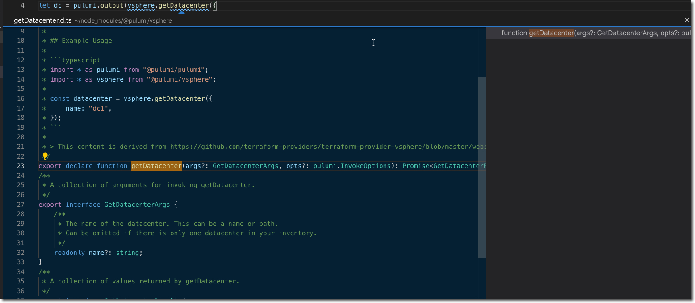

We are always excited when people join the Infrastructure as Code community and write about their experiences. Pulumi can be used for a range of common tasks such as standardizing VPC builds, building VSphere virtual machines, or deploying your infrastructure from a CI/CD pipeline. Whether it's `TypeScript`, `JavaScript`, or `Python` you can build your infrastructure with your language and tools of choice. Here are three new blog posts that show how to use Pulumi with code examples to perform these tasks.

## CircleCI on Google Kubernetes Engine (GKE)

[Angel Rivera](https://twitter.com/punkdata) shows how to set up CircleCI on GKE with a [step-by-step tutorial](https://circleci.com/blog/automate-releases-from-pipelines-using-infrastructure-as-code/). Angel demonstrates how to integrate Infrastructure as Code solutions, such as Pulumi, into CI/CD pipelines. The tutorial builds a container with a Pulumi project with a sample app written in Python that deploys Kubernetes. With Pulumi, your infrastructure is part of your CI/CD. The code for the tutorial is available on [GitHub](https://github.com/datapunkz/orb-pulumi-gcp).

## HATech Compares Pulumi to Terraform

[Jon Hathway](https://twitter.com/hatechllc) of HATech published a white paper comparing Pulumi to Terraform. Changes in Terraform prompted the comparison. Below, Jon explained why HATech is evaluating Pulumi:

> "Take for example the teams that are trying to collaborate and drive reliably deployed and maintained product innovations. Is it better to have languages that support each individual team’s needs, or is it better to have one language to support the entire workflow/pipeline?
>
> How about this thought experiment: Imagine your developers only spoke English, your QA team only spoke French, and the operations team only spoke Spanish? It would be carnage!
>
>You’d never hire that way. So why, when choosing DevOps tools, do people find it acceptable to have different languages, DSLs that only key individuals understand?”

## VMWare VSphere and Pulumi

[Cody De Arkland](https://twitter.com/Codydearkland) demonstrates how to [create a VMWare VSphere Virtual Machine](https://www.thehumblelab.com/iac-vsphere-pulumi/) by adding a ResourcePool, DataStore, NetworkStore and the virtual machine template with Pulumi. He also sets the configuration values such as DNS settings, default gateway, domain, and hostname all in code. All of this runs on the ESXi virtualization server and vCenter (which is why the Datacenter ID is needed for configuration). His example is available on [GitHub](https://github.com/codyde/pulumi-vsphere-ts). We like Cody’s caveat that his post is not an endorsement but call to explore new tools. In his conclusion, he nails home the point why Infrastructure as Code is the future of DevOps.

> “Infrastructure as Code tools like Pulumi (and others in the space, i.e. Terraform from HashiCorp) add a ton of value on top of traditional deployment methods. Being able to store your infrastructure deployments in source control (i.e. GitHub/GitLab) opens up the door to a number of collaboration concepts. When you partner this in with some form of a CI/CD tool (i.e. CircleCI) - things get really interesting. Being able to submit a PR to change an infrastructure deployment, and having something like CircleCI automatically deploy the resources when changes are merged creates a pretty powerful platform for delivering infrastructure to end-users.”

## Bloggers Welcome

If you write about your experience using Pulumi, let us know by tagging us on [Twitter](https://twitter.com/pulumicorp).
