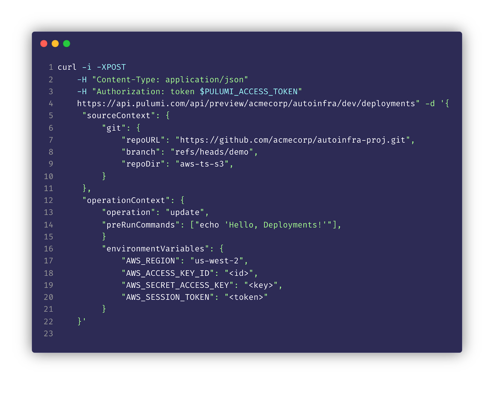

Adoption of modern cloud technologies and services is driving enormous value for organizations, but many companies are finding that deploying and managing cloud infrastructure is a bottleneck on how fast they can scale. When your tools can't keep up, scaling your cloud footprint means proportionally scaling your headcount. Things quickly fall apart as demand for cloud infrastructure often outpaces the bandwidth of infrastructure teams. This leads to slow product releases, longer lead times to get new products to market, and burned-out operational teams.

At Pulumi, we want every engineer and organization to be able to take full advantage of the cloud. The cloud should be an accelerant to your business and not a bottleneck. Today we are excited to be launching **Pulumi Deployments**, a new collection of features to power infrastructure and platform automation and unlock the scale of the cloud.

<!--more-->

With Pulumi Deployments, you can run a Pulumi infrastructure as code action (a preview, update, destroy or refresh) inside Pulumi’s managed service. Pulumi provides scalability, observability, and security for deployments. It consists of five components:

1. **The Deployments REST API** - A fully managed REST API to execute Pulumi programs with the Pulumi Service. This includes APIs to observe your deployment and all associated logs.
2. **Deployment Visualization** - A dashboard for deployment observability including deployment status, logs, and queueing via the Pulumi Service console.
3. **Click to Deploy** - Deploy infrastructure with the click of a button from the Pulumi Service console.
4. **`git push` to Deploy** - Configure automatic infrastructure deployments in response to `git push` events by installing and configuring the Pulumi GitHub App.
5. **Remote Automation API** - Our strongly typed [infrastructure orchestration technology](https://www.pulumi.com/blog/automation-api/) can now run deployments remotely in the cloud.


Both the Programmatic Deployment API and Remote Automation API are flexible building blocks that simplify the creation and management of common platform automation scenarios like multi-region deployments, drift detection, and ephemeral infrastructure. Click to Deploy and `git push` to Deploy gives your organization an out-of-the-box golden path to production. Whether you are building your internal cloud platform or using `git push` to Deploy, every deployment you schedule reaps the benefits of observability in the Pulumi Service. We’ve built an intuitive user experience that allows anyone in your organization to check deployment status, debug logs, and view deployment history.



## Automation API & Deployments - Do More with Less

Two years ago, [we released Automation API](https://www.pulumi.com/blog/automation-api/), a programmable SDK for the Pulumi engine that unlocks the full power of infrastructure as code automation. Organizations use it to do things like provisioning infrastructure at runtime for SaaS platforms and building higher-level systems that automate the full lifecycle of infrastructure management. Since then, it has performed millions of automated infrastructure updates. Analyzing our usage data, we found that organizations that center their cloud workflow around **Automation API can manage more than ten times the infrastructure per engineer as compared to traditional IaC** usage patterns.

This is our motivation for building Pulumi Deployments. We took the product lessons we learned from working hand in hand with leading SaaS and infrastructure companies building on Automation API and turned them into a fully managed service. Pulumi Deployments is the platform to power your platform. The tools that enable the giants to create and manage ten times the cloud footprint per engineer are now available to you as a fully managed service with increased scalability, reliability, and observability baked in.


## A Golden Path to Production

Out of the box Pulumi Deployments offers your cloud engineering team a turn-key infrastructure delivery workflow without writing a single line of code. Every piece of infrastructure within your organization can rely on automatic cloud delivery.

### `git push` to Deploy

Using the Pulumi Github App (GitLab, Bitbucket, and others coming soon), `git push` to Deploy enables a rich git-based workflow for safely reviewing infrastructure changes and rolling them out across environments. Opening a Pull Request on GitHub will automatically trigger a `pulumi preview` and post the results back to the PR. You can also enforce successful previews as a [check](https://docs.github.com/en/rest/checks) that gates merging.

Once your PR is reviewed and merged, a Deployment runs automatically:


Setting this up is as easy as installing the Pulumi GitHub App and selecting the repository and branch for your stack:


You can ensure that every environment and every commit is automatically validated and kept up to date with just a few clicks. GitHub integration is available today, with support for GitLab, Atlassian Bitbucket, and others coming soon.

### Click to Deploy

Sometimes infrastructure requires ad-hoc operations. You may want to run a refresh to rectify some cloud state changes:


Whatever the situation calls for, you can easily update, refresh, and modify infrastructure with the click of a button in the Pulumi Service console.

## Power-up Your Platform with The Deployments API

Both `git push` to Deploy and Click to Deploy are built on top of the Pulumi Deployments REST API, the same API that is available to you as a building block. The Deployments API is fully managed and enables you to orchestrate cloud rollouts without worrying about capacity. Let’s look at a few ways you can embed it into your custom cloud platform.

### Drift Detection

Manual edits within the AWS console can wreak havoc on your infrastructure if those changes aren’t brought back into source control. The last thing you want is to scale out a service just to have the next CI run undo that change.

You can build drift detection into your platform and get automated alerts on unexpected infrastructure changes.

```ts
aws.cloudwatch.onSchedule("drift-lambda", "cron(0/5 * * * ? *)", async() => {
    const outstandingDeployments = [];
    for(let s of stacks) {
        const url = `https://api.pulumi.com/api/stacks/${s.organization}/${s.project}/${s.stack}/deployments`;
        const response = await fetch(url, {
            method: "POST",
            headers,
            body: JSON.stringify(refreshPayload),
        });

        const deployment = await response.json();
        outstandingDeployments.push(deployment.id);
    }
})
```

This scheduled Lambda runs refresh operations through the Deployments REST API. When one of those deployments detects changes, we get notified. With platform automation that automatically and proactively detects changes, your cloud team can reduce the number of surprise incidents, freeing them up to focus on higher-leverage activities. The full source code is available for the [Drift Detection example](https://github.com/pulumi/deploy-demos/tree/main/pulumi-programs/drift-detection).

### TTL Stacks and Temporary Infrastructure

Infrastructure waste is a common problem. It’s too easy to leave development infrastructure running accidentally and end up with a huge bill. Many companies have entire teams devoted to solving this problem.

With Pulumi Webhooks and the Deployments API we can build a system for tagging and reclaiming temporary infrastructure. Anyone in your organization can create temporary infrastructure with a simple workflow:

```bash
$ pulumi stack tag set ttl 360 # this stack expires six hours after it deploys
$ pulumi up # with the `ttl` tag preset, the infrastructure will be automatically destroyed at expiration
```


After the expiration period has elapsed, a deployment will be queued and the development infrastructure is automatically destroyed. The Deployments API can be embedded into your platform to reduce cloud waste and automate cost controls. The full source code is available for the [TTL Stack Processor](https://github.com/pulumi/deploy-demos/tree/main/pulumi-programs/ttl-stacks).

### Managing Scale with Remote Automation API

With Automation API, Pulumi can be fully embedded inside your software projects to power a wide range of custom cloud infrastructure automation. Previously, Automation API could only run locally. With Remote Automation API, these same scripts can run locally while offloading deployment workloads to the cloud via the Deployments API. The infrastructure as code action (a preview, update, destroy or refresh) runs inside of our fully managed service.



{}

```typescript
const stack = await RemoteWorkspace.createOrSelectStack({
    stackName,
    url: "https://github.com/pulumi/examples.git",
    branch: "refs/heads/master",
    projectPath: project,
}, {
    envVars: {
        AWS_REGION:            "us-west-2",
        AWS_ACCESS_KEY_ID:     process.env.AWS_ACCESS_KEY_ID ?? "",
        AWS_SECRET_ACCESS_KEY: { secret: process.env.AWS_SECRET_ACCESS_KEY ?? "" },
        AWS_SESSION_TOKEN:     { secret: process.env.AWS_SESSION_TOKEN ?? "" },
    },
});

const upRes = await stack.up({ onOutput: console.log });
console.log(`url: ${upRes.outputs.websiteUrl.value}`);
```

{}

{}

```go
repo := auto.GitRepo{
    URL:         "https://github.com/pulumi/examples.git",
    Branch:      "refs/heads/master",
    ProjectPath: project,
}

env := map[string]auto.EnvVarValue{
    "AWS_REGION":            {Value: "us-west-2"},
    "AWS_ACCESS_KEY_ID":     {Value: os.Getenv("AWS_ACCESS_KEY_ID")},
    "AWS_SECRET_ACCESS_KEY": {Value: os.Getenv("AWS_SECRET_ACCESS_KEY"), Secret: true},
    "AWS_SESSION_TOKEN":     {Value: os.Getenv("AWS_SESSION_TOKEN"), Secret: true},
}

s, err := auto.UpsertRemoteStackGitSource(ctx, stackName, repo, auto.RemoteEnvVars(env))
if err != nil {
    fmt.Printf("Failed to create or select stack: %v\n", err)
    os.Exit(1)
}

res, err := s.Up(ctx, optremoteup.ProgressStreams(os.Stdout))
```

{}

{}

```python
stack = auto.create_or_select_remote_stack_git_source(
    stack_name=stack_name,
    url="https://github.com/pulumi/examples.git",
    branch="refs/heads/master",
    project_path=project,
    opts=auto.RemoteWorkspaceOptions(
        env_vars={
            "AWS_REGION":            "us-west-2",
            "AWS_ACCESS_KEY_ID":     os.environ["AWS_ACCESS_KEY_ID"],
            "AWS_SECRET_ACCESS_KEY": auto.Secret(os.environ["AWS_SECRET_ACCESS_KEY"]),
            "AWS_SESSION_TOKEN":     auto.Secret(os.environ["AWS_SESSION_TOKEN"]),
        },
    ),
)

up_res = stack.up(on_output=print)
```

{}

{}

```csharp
var stack = await RemoteWorkspace.CreateOrSelectStackAsync(new RemoteGitProgramArgs(stackName, "https://github.com/pulumi/examples.git")
{
    Branch = "refs/heads/master",
    ProjectPath = project,
    EnvironmentVariables =
    {
        { "AWS_REGION", new EnvironmentVariableValue("us-west-2") },
        { "AWS_ACCESS_KEY_ID", RequireFromEnvironment("AWS_ACCESS_KEY_ID") },
        { "AWS_SECRET_ACCESS_KEY", RequireFromEnvironment("AWS_SECRET_ACCESS_KEY", isSecret: true) },
        { "AWS_SESSION_TOKEN", RequireFromEnvironment("AWS_SESSION_TOKEN", isSecret: true) },
    },
});

var result = await stack.UpAsync(new RemoteUpOptions { OnStandardOutput = Console.WriteLine });
```

{}

{}

Multi-region infrastructure build outs become a breeze, as workloads can be easily parallelized. Now you can run thousands of updates concurrently without having to manage the compute that runs them.

## Centralized Observability

Whether you use the built-in cloud delivery workflows like Push to Deploy, or build your own custom platform with the REST API and Remote Automation API, you get full observability into every deployment. Anyone in your organization can view updates status, update logs, and the full history of deployments.


You can build platform automation without worrying about how you’ll surface the results across your product, engineering, and infrastructure teams.

## Automation Accelerates the Cloud

We’ve taken the lessons from our industry-leading customers in cloud SaaS and infrastructure and packaged them into Pulumi Deployments. This suite of tools enables you to manage and scale ten times the cloud footprint as opposed to traditional IaC usage patterns. Whether you want a turn-key delivery workflow or highly-customizable platform building blocks, there is something for your organization.

Pulumi Deployments removes the cloud as a bottleneck and unlocks it as an accelerant for your business. It is available in preview today. Deployments are free during the preview, with usage-based pricing to come. Check out these resources to get started today:

- [Request access](/product/pulumi-deployments) to the Pulumi Deployments preview
- [Pulumi Deployments examples repo](https://github.com/pulumi/deploy-demos)
- [The Pulumi Deployments demo video](https://www.youtube.com/watch?v=v48U7CNWutc&ab_channel=PulumiTV)
- [Pulumi Deployments documentation](/docs/pulumi-cloud/deployments/)
- [Pulumi Deployments REST API documentation](/docs/pulumi-cloud/deployments/api/)
- [Automation API examples](https://github.com/pulumi/automation-api-examples)

🚀🚀🚀 Happy building! 🚀🚀🚀


