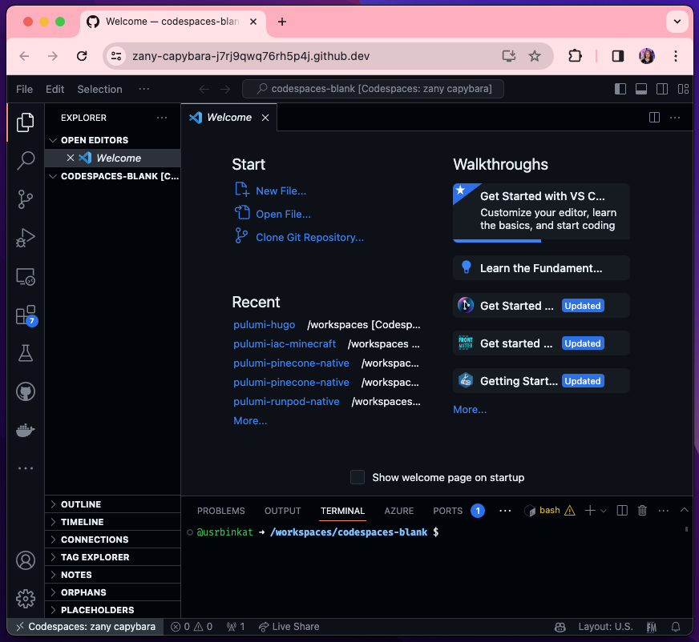
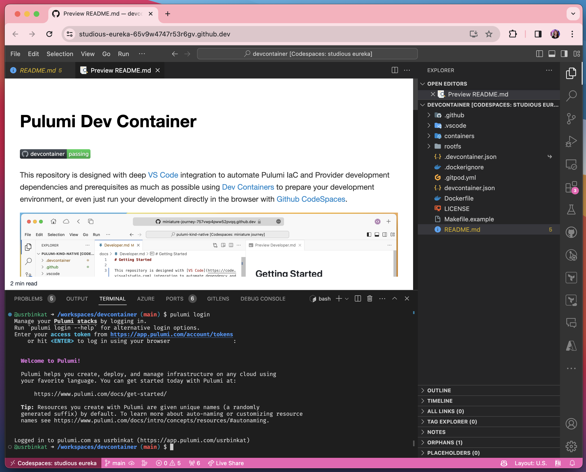
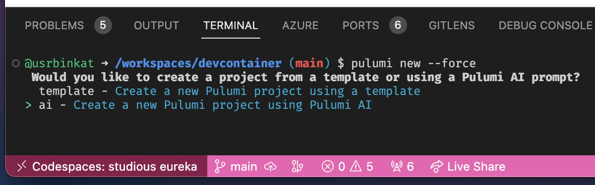
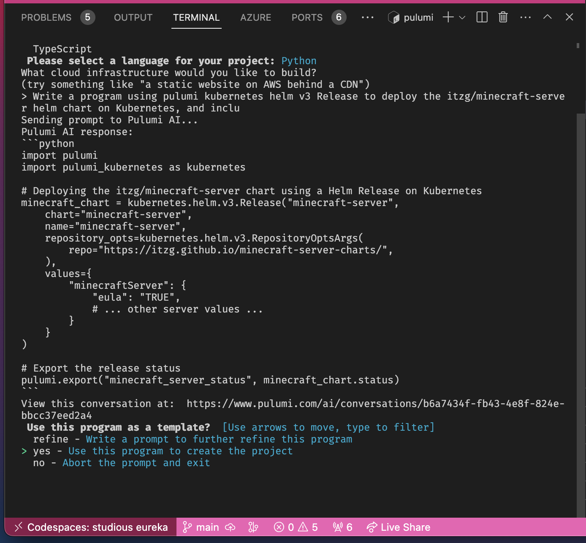
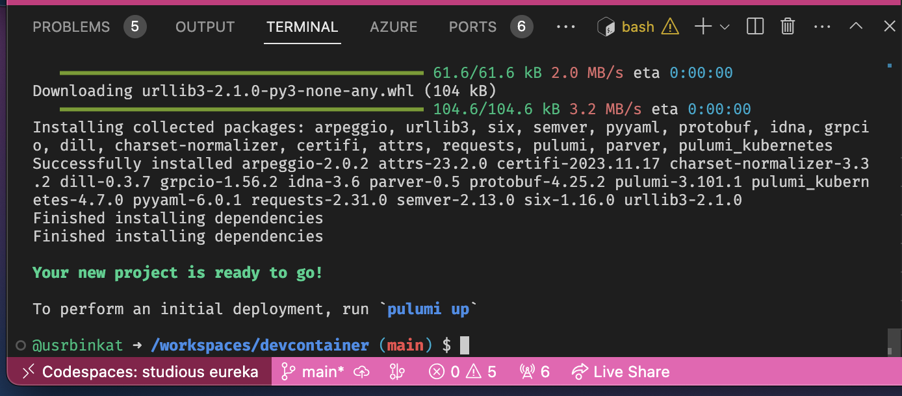

As a skeptic of "quick starts" myself, I approach most marketing promises with a measure of cautious excitement. If the great and powerful algorithm, friends, or a peer brought your attention here, then I invite you to take this one seriously.

Pulumi, with it's full support of many general purpose programming languages, can appear like a chore to get started with. The feeling can haunt seasoned developers as much as practitioners new to infrastructure code.

Finding the proverbial easy street is easier than you might believe however as you will see. The `pulumi new` developer story just gets sweeter when combined with a few other nice to have conviences for the best way of work experience.

This is a "bring your own [Github](https://github.com) login" event, so refresh that login and you will want to grab a [Pulumi Cloud](https://app.pulumi.com) login as well. With credentials in hand, you are set with everything that you need to start so let's go!

>
> Hint:
> all of the steps in this demo are ready to run yourself from the [Pulumi Devcontainer](https://github.com/pulumi/devcontainer) using just your web browser and a Github account. Even better, they are real activities that Pulumians use every day to orchestrate the cloud too!
>

<!--more-->

### Three tips to learn new technology:

When it comes to ice cream, sometimes just selecting your flavor can be too much. Similarly, when choosing where to start with cloud tooling the onset of "choice paralysis" can be chronic. Pulumi's powerful toolset is both a worthy endeavor to learn, and a rewarding challenge to master. There is no better time to learn than the present!

> "If you are short on time and have a bike, do you stop to hop on the bike, or choose to walk because there is no time to stop and get on?"

Freezing, while great for ice cream, is not quite as satisfying when building the next cloud solution, and putting it off for next week or next year can be about as useful as walking fast and pushing a perfectly good bike because there is no time to stop and get on.

How can we overcome the learning curve? Picking up and mastering a new tool can be easy if we choose to start small.

> #### Tech Learning Hacks:
>
> 🏆 Do: Start  
> 🔨 Use: Helpful Tools  
> 🥅 Make: Achievable Goals  
> 🎉 Win: Celebrate Successes

Recognizing achievable goals can be tricky when you are learning something new. Always over-estimate the complexity of each step. If you over-estimate how complicated a task might be, the biggest risk is accomplishing the goal faster than you think! Either way, the learning journey should be enjoyable and rewarding by following this rule.

Helpful tools are more abundant than ever. I recommend Pulumi as one of the most helpful tools but that is my bias showing through. Consider how intuitive, durrable, and well integrated any tool selection you make will be. Today we're using multiple features and services of both the Pulumi and Pulumi Cloud offering, as well as a demonstrating the benefits of a tightly integrated Git, Github, Devcontainers, and VSCode workflow to make light work of a traditionally considerably complicated achievement.

The resulting developer stack left me feeling like I will be successful automating anything. Be sure to share your experience with us in the [Pulumi Community Slack](https://join.slack.com/t/pulumi-community/shared_invite/zt-2amio1u4h-5Y35enT27Y0dk4N8ZYHbMg) or find us on [Twitter/X @PulumiCorp](https://twitter.com/PulumiCorp) too!

### A DevOps Journey

> The best solutions are often burried in the details. The only way to reach them is to dig.

In true DevOps fassion, development for this blog post featured a roller coaster of chronic scope creep, pushing deadlines, discovering details that scrapped the original plan, and during the final finish line approach too! The worry and doubt was palpable.

Have we taken on too much? Did project ambitions exceeded the achievable? The solution struck while on a demo hacking side quest with a friend. A single vision came into focus, tieing everything together into a simple "*Push to Start*" Pulumi developer workflow.

In this story, it took two tries to achieve the goal. Often it can take several tries. With that backstory let's begin this next learning adventure together.

### DevOps Day 0

Let's track our devops journey in typical "DevOps Day" style. Because we're [counting like computers](https://en.wikipedia.org/wiki/Zero-based_numbering#:~:text=In%20computer%20science%2C%20zero%20is,from%20zero%20rather%20than%20one.), of course we start with zero. In other words we need a goal, and we will be starting from scratch.

Day zero is going to be your design, planning, and prep phase. Sometimes this includes various stages of research, and other times it is a matter of just getting started with hands on investigation.

Every journey includes a beginning and an end. To demonstrate the Pulumi *Push to Start* developer workflow, we need a project to develop! For this adventure let's use Pulumi's [Pulumi Kubernetes Provider](https://www.pulumi.com/registry/packages/kubernetes) from the Pulumi Providers registry, which is one of our most popular providers, to deploy an app on Kubernetes.

In this case, we can practice with a new project from the [Community Engineering](https://www.pulumi.com/community/) team. The github [pulumi/devcontainer](https://github.com/pulumi/devcontainer) which is a GitHub [template repository](https://docs.github.com/en/repositories/creating-and-managing-repositories/creating-a-repository-from-a-template). This repository contains fundamentals of a new Pulumi Infrastructure as Code GitOps project. Let's begin with a quick tour of GitOps repo boilerplate.

> "*What belongs in a GitOps git repository?*"

I have seen this question raised several times the past year. Most recently it was brought up during a great customer conversation at AWS re:Invent.

Filtering through the conflicting opinions and advice about proper GitOps repo hygene, a few fundamentals remain consistent.

1. Ops Environment
   - Configuration
   - Dependencies
   - Artifacts
1. Documentation
   - Who it is for
   - What it does
   - How to Operate
   - Why it is important
1. Actions
   - Testing: Continuous Integration
   - Deployment: Continuous Deployment
   - Safety: Version Controlls

You may have assembled projects piece by piece before. In the devcontainer repo, we provide a turn key "known good" starter kit which will even be improving over time. As a community resource, we welcome bugs and contributions!

And now for the feature presentation, let's get to dev'ing!

> #### What's in a Day 0?

For this exercise, we have just a few requirements to get started.

> #### Prerequisites

Okay, even the fanciest push to start car still requires a fob, so let's cover those bases super quick.

- Web Browser
- Github Account
- 10 minutes (aprox.)

Next let's review the tools we will depend on for developing and deploying our project.

> ## Commandline Utilities:
>
> *Dependencies supplied in the Pulumi devcontainer `ghcr.io/pulumi/devcontainer`

|      Tool               | Description                      |
|:-----------------------:|:--------------------------------:|
| A Programming Language  | The code part of IaC             |
| Pulumi CLI              | Infrastructure as Code Tools     |
| Pulumi ESC              | Secrets and Configuration Store  |
| Kubectl                 | Kubernetes CLI                   |
| Direnv                  | Automated Environment Variables  |
| KinD                    | Local Kubernetes Infrastructure  |
| Github CLI              | Github & Git Repository Binaries |
| curl, jq, act, awk, etc | Other useful tools               |

## Cloud native ... cloud developer environment?

Besides our command line tools and the programming language of your choice, we need an editor to write our code with. Many practitioners are fluent with vim, emacs, others turn to editors like VSCode, IntelliJ, and others. We are going to choose the Github Codespaces VSCode IDE for it's deep integration with Github, and it's convenience of requiring nothing from the user other than a web browser to use.

If you are already familiar with Github Codespaces, then you might know what to expect next. If not, you are in for a treat, and yes that is right, we are *developing for the cloud, in the cloud, with the cloud*.

Alright, let's jump in and get started by launching a new [Github Codespaces].

  👇 Click this button to begin.👇  
[](https://bit.ly/pulumi-devcontainer)  

If you prefer a more informed approach you can launch the same codespaces by navigating to the [Pulumi Devcontainer Repository](https://github.com/pulumi/devcontainer) or you can learn more about Codespaces at this [Github Codespaces Link](https://docs.github.com/en/codespaces/overview).

Clicking the 'Open in Github Codespaces' button should take you directly into a new Codespaces session.

[Pulumi Devcontainer]:https://github.com/pulumi/devcontainer

> Note:
> This demonstration is deeply integrated into the Web based Codespaces environment offered by Github. Alternatively, VSCode also supports running Devcontainers with docker locally allowing you the benefit of [Pulumi Devcontainer](#pulumi-devcontainer) on your own hardware.
>

With a new codespaces session launched, you should see the VSCode IDE in your browser. If you are not already familiar with VSCode, you can learn more about it in the [VSCode Docs](https://code.visualstudio.com/docs).



Contratulations! Your developer environment is ready for some Pulumi action.

For our final Day 0 step, we still need to decide what app to deploy with our Infrastructure-as-Code (IaC) program.

Focusing on something fun, let's deploy Minecraft as the app for our Kubernetes exercise. It's a fun way to get started with Pulumi, a great way to show off your cloud skills to friends, and maybe even share with your favorite young  future technologists! After all, Open Source DevOps is for everyone!

## DevOps Day 1

> ### We have an environment! We have a plan!
>
> ### Now we need to code ... or do we?

Don't just take my word for it. The big brains of Pulumi's AI Engineering team have delivered a brilliant Pulumi AI. Your Pulumi IaC developer sidekick to make learning and developing Pulumi just that much easier.

> Q: What can Pulumi AI do?  
> A: Today's AI is all experimental. As an industry, we are only just beginning to discover the possibilities, but you are invited to try it yourself with the [Pulumi AI WebUI](https://www.pulumi.com/ai/) or with the `pulumi new` cli as demonstrated below.

#### `~$ pulumi new --ai`

[Pulumi AI](https://pulumi.com/ai) is available via webui much like the ChatGPT console. Besides the familiar browser based interface, Pulumi AI is also built into the `pulumi new` cli too! Now you can prompt Pulumi AI interactively from the convenience of the command line tools you will already be using, conveniently configured already in your new Codespaces IDE.

Let's try it!

### Step 1. Login to Pulumi Cloud

```bash
# First Login to Pulumi Cloud for a few features we will use in upcoming GitOps content.
pulumi login
```

### Step 2. Create a new program

```bash
# Let's create a new pulumi with the Pulumi CLI
pulumi new
```

### Step 3. YOLO for fun and profit!

Let's go all in on this one and try Pulumi AI. We can always enhance the prompt with additional dialog back and forth during the `pulumi new` chat if it doesn't meet our expectations right away.

It is good to keep in mind that even as advanced as AI is today, the practice is still very much in it's infancy. We will save more deep dives into the differences of Traditional Ops (Imperative Ops), GitOps (Automated Declarative Ops), and AI Ops (Probability Augmented GitOps) in another post, for now let's see how close the Pulumi AI can take us.



Woohoo! We selected the AI option on CLI, let's follow the user prompts and feed the AI a simple prompt of what we want our Pulumi project to create.

Let's try something like this:

```bash
Write a program using pulumi kubernetes helm v3 Release to deploy the itzg/minecraft-server helm chart on Kubernetes, and include a pulumi output to show the helm release status."
```

How did we do? Let's see what the AI came up with.



It's looking pretty good for a simple deployment. In DevOps nothing works till the CI testing turns green. Since fortune favors the bold let's proceed. For my developer workflow I ran `kind create cluster` in the Codespaces terminal. You can do the same or add your own kubeconfig to deploy on your choice of cluster.

Of course, proceed through the remaining prompts from the `pulumi new` interactive cli.



I chose Python for this project, but you can choose any of the supported languages. We can see that `pulumi new` creates a new python virtual environment for us programatically. In addition to the boilerplate supporting our new project, Pulumi AI wrote the first iteration of our Python Minecraft Deployment IaC! The next steps should be printed to screen. Assuming your kubernetes cluster kubeconfig is ready to roll we just have one step left.

Hint, this is where we get the name for our annual "[Pulumi Up](https://youtu.be/J5BudoobwgY) confrence.

> **Follow the link for the full playlist of 2023 Pulumi Up sessions**

```bash
pulumi up -y
```

## DevOps Day 2

Finally it is day two. This is the beginning of a choose-your-own-adventure wonderland and the opportunities go almost as far as your imagination. This is where we commit our code and plan our next change requests and enhancements.

We can commit this code to git. Build a Github Actions Workflow to automate the CI testing of our IaC with every git pr or commit. Once you have a production ready IaC, you can add another to deploy to production clusters. If you run `make act` you will see how comfortable testing new github actions workflows can be in the convenience of your new enhanced IDE workflow. You can see the devcontainer workflow running yourself right away by executing `make act` as a starting point.

To conclude, Pulumi is not a single tool. Pulumi is a complete cloud developer ecosystem. Together, tools, SDKs, and cloud services come together forming the most accelerated way to create your own cloud success legends.

Follow [PulumiTV](https://youtube.com/@PulumiTV) for up-coming examples built on this solution and to see how Pulumi ESC brings safety to your secrets and more.

Because no hero's journey is complete without a gruesome account of what came before, I have included many of the manual steps required to reach this state one command at a time for the ~~morbidly~~ curious as well.

> **click 'Details' to expand**

<details>

### Git Code Repository

Now create a git code repository to version control this project infrastructure code in Github.

```bash
# Authenticate with Github before proceeding.
gh auth login --web --git-protocol https --scopes "repo,gist,read:packages,admin:org,delete_repo,codespace"

# Create new Git Repository
gh repo create workshop --public \
  --gitignore Python --license apache-2.0 \
  --description "pulumi iac developer workflow workshop"

# Initialize the git repository
git clone --recurse-submodules https://github.com/${GITHUB_USER}/workshop .

# Configure `git` cli to use the `gh` cli for authentication with Github
gh auth setup-git

# Configure the username and email associated with your Github account.
git config --global user.email ${GIT_COMMITTER_EMAIL}
git config --global user.name ${GITHUB_USER}

# List files being tracked by git and their current status.
git status
```

#### Direnv: Automatic Environment Variables

Various non-secret environment variables may be worth maintaining in code locally as well. There are many ways to do this, but here we are going to use Direnv to automatically load environment variables from a .envrc file.

```bash
# Add environment variables useful during development to .envrc
cat <<EOF >> .envrc
export NO_COLOR=true
export PULUMI_HOME=\${HOME}/.pulumi
export PULUMI_SKIP_UPDATE_CHECK=true
export PULUMI_SKIP_CONFIRMATIONS=true
export KUBECONFIG=\${PWD}/.kube/config
source venv/bin/activate 2>/dev/null || true
EOF
```

Now you can enable direnv on this directory.

```bash
# Enable direnv in this directory.
direnv allow
```

> Note:
>
> Env variables shown are for educational purposes only and should be used with care.
> Read more about available Pulumi Environment variables here:
> https://www.pulumi.com/docs/cli/environment-variables

#### Pulumi Devcontainer

Now, to make sure we have all of our cli dependencies, let's grab the [Pulumi Devcontainer].

```bash
# Add the Pulumi Devcontainer git submodule
git submodule add https://github.com/pulumi/devcontainer .devcontainer
git submodule update --init --recursive .devcontainer

# Copy the devcontainer config of your choice into the top level of your project
# so it will auto select by default when you open Codespaces in the future.
cp -f .devcontainer/devcontainer.json .devcontainer.json

# Rebuild the codespaces using the newly added Pulumi Devcontainer
gh codespace rebuild --codespace ${CODESPACE_NAME}
```

#### Pulumi Cloud

Let's login to Pulumi Cloud and initialize a new ESC environment to store our environment variables, secrets, and configuration which should be preserved and distributed securely from your Pulumi Cloud account.

```bash
# Login to Pulumi Cloud
pulumi login

# Create a new ESC Environment (optionally use another already existing environment)
pulumi env init workshop
```

#### KinD: Kubernetes-in-docker

We are going to use Kubernetes to demonstrate our Pulumi IaC. Let's go ahead and create a new cluster now.

```bash
# Create the directory for your new kind kubeconfig
mkdir .kube

# Create a Kind Cluster
kind create cluster

# Let's make sure our kubeconfig works and pods are starting up
kubectl get pods -A

# Load Kubeconfig into Pulumi ESC as an encrypted secret for safe keeping.
# This is an example use case for storing kubeconfig which would not usually be practical
# for disposable kind kubernetes clusters like this however the approach is practical in many
# other scenarios which you may come across.
pulumi env set workshop secrets.kubeconfig.kind --secret "$(jq . -R -s < $KUBECONFIG)"
pulumi env set workshop files.KUBECONFIG --plaintext \${secrets.kubeconfig.kind}
```

In our environment, we maintain our secrets including api personal access tokens, kubeconfigs, and such all with Pulumi's Environments, Secrets, and Configuration cloud service.

```bash
# Load the newly updated Pulumi ESC Environment in the local shell
eval $(pulumi env open workshop --format shell)
```

#### Now let's create the deployment code!

If fortune favors the bold, let's be bold on this next step and let AI write our sample code on the fly!

As this is a "hello world" style demonstration intended to showcase the developer workflow more than any specific cloud technologies, let's deploy something fun like a Minecraft server! Be sure to watch for the video demonstration of this exercise on Pulumi's [PulumiTV](https://youtube.com/@PulumiTV) YouTube channel for an extra easter egg bonus step!

```bash
# Write a new Pulumi Python IaC program to deploy Minecraft on Kubernetes
pulumi new \
  --ai "Write a program using pulumi kubernetes helm v3 Release to deploy the itzg/minecraft-server helm chart on Kubernetes, and include a pulumi output to show the helm release status." \
  --description "A pulumi infrastructure as code (iac) program for deploying and serving minecraft on kubernetes" \
  --name "minecraft-on-kubernetes" \
  --language python \
  --stack "workshop" \
  --force \
  --dir .
```

Now let's see if our new Infrastructure as Code Pulumi Python Codebase will deploy!

```bash
# Deploy your new Pulumi IaC on Kubernetes
pulumi stack select workshop
pulumi up
```

#### Conclusion

```bash
# Check for your new Minecraft pod
kubectl get po
```

Sharing Pulumi with people is a genuine passion found among Pulumians all around the globe but we all know evidence reigns king among engineers who, like any good practitioner, expect proof. Evolving your developer workflow with Pulumi gets even better than just easy, it's remarkably powerful and ready for you to adopt in your daily workflows right away too.

Continue with me for this short "batteries included" DevOps developer experience and see how Pulumi, ESC, and Devcontainers are a cloud ops match made in heaven whether you are developing on remote infrastructures or in the comfort of your own devices. The demo app may be a bit light hearted, but the methods we use to get there are so worth it I guarantee you can come away with something new just by trying it yourself.

</details>

#### Cleanup

```bash
pulumi destroy -y --skip-preview
pulumi stack rm workshop
kind delete cluster --name kind
gh repo delete ${GITHUB_USER}/workshop
```

[Github Codespaces]:https://github.com/features/codespaces
[Github's Codespaces Console]:https://github.com/codespaces
[Pulumi Devcontainer]:https://github.com/pulumi/devcontainer
