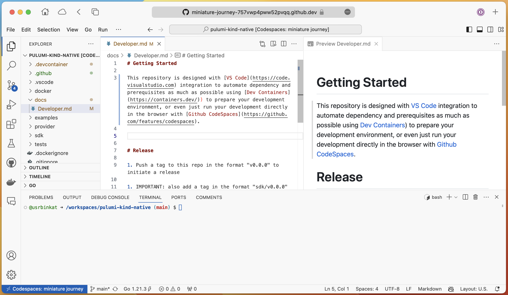

Have you ever felt like every 'get started' guide starts out with the obligatory prerequisites task list? Want to try Pulumi without the headache or just elevate your current DevOps workflow? Dive into this short "batteries included" workflow demonstration and see how Pulumi, ESC, and Devcontainers are a match made in heaven for your orchestration productivity, or share with a friend and confidently colaborate without falling into the infamous "works on my machine" cope.

<!--more-->

## Intro

Getting started with new tools and projects can be exciting and fun, however it is also common to pick up something new and feel like the getting started experience would be better if all the prerequisites and starting effort was just solved already.

In this blog post we are going to explore a few new things from Pulumi to make getting started, and even well established workflows easier to reproduce, maintain, and share with others so that you can invest brain power into getting the important things done without distractions.

## Prerequisites

Before we dive in, make sure you are prepared with the following:

- Web Browser
- Github Account
- 10 minutes (aprox.)

### Requirements

Remembering that our goal is to setup an all inclusive developer environment, let's take a moment and consider the requirements for this project.

#### Commandline Utilities:

1. Pulumi CLI
2. Pulumi ESC
3. Kubectl
4. Direnv
5. KinD
6. Github CLI
7. Git CLI
8. Other tools like jq, etc

#### Safe Secrets Handling:

- Pulumi Auth
- Github Auth
- Kubeconfig

#### Github Codespaces

Alright, let's jump in and get started by launching a new [Github Codespaces].

[](https://codespaces.new/github/codespaces-blank)

Click the button to launch a blank codespaces session that we will build a new project inside of, or create a new one directly on [Github's Codespaces Console] yourself.



> Note:
>
> This demonstration focuses on using the Web based VSCode environment offered in Github Codespaces.
> Alternatively you can skip directly to the [Pulumi Devcontainer](#pulumi-devcontainer) section to follow along in your own local VSCode editor.

#### Git Code Repository

Now create a git code repository to version control this project infrastructure code in Github.

```bash
# Authenticate with Github before proceeding.
gh auth login --scopes "repo,gist,read:packages,admin:org,delete_repo" --web

# Create new Git Repository
gh repo create workshop --public \
  --gitignore Python --license apache-2.0 \
  --description "pulumi iac developer workflow workshop"

# Initialize the git repository
git clone --recurse-submodules https://github.com/${GITHUB_USER}/workshop .

# Configure `git` cli to use the `gh` cli for authentication with Github
gh auth setup-git

# Configure the username and email associated with your Github account.
git config --global user.email ${GIT_COMMITTER_EMAIL}
git config --global user.name ${GITHUB_USER}

# List files being tracked by git and their current status.
git status
```

#### Pulumi Devcontainer

Now, to make sure we have all of our cli dependencies, let's grab the [Pulumi Devcontainer].

```bash
# Add the Pulumi Devcontainer git submodule
git submodule add https://github.com/pulumi/devcontainer .devcontainer
git submodule update --init --recursive .devcontainer

# Copy the devcontainer config of your choice into the top level of your project
# so it will auto select by default when you open Codespaces in the future.
cp -f .devcontainer/devcontainer.json .devcontainer.json

# Rebuild the codespaces using the newly added Pulumi Devcontainer
gh codespace rebuild --codespace ${CODESPACE_NAME}
```

#### Pulumi Cloud

Let's login to Pulumi Cloud and initialize a new ESC environment to store our environment variables, secrets, and configuration which should be preserved and distributed securely from your Pulumi Cloud account.

```bash
# Login to Pulumi Cloud
pulumi login

# Create a new ESC Environment (optionally use another already existing environment)
pulumi env init workshop
```

In our environment, we maintain our secrets including api personal access tokens, kubeconfigs, and such all with Pulumi's Environments, Secrets, and Configuration cloud service.

```bash
# Load the newly updated Pulumi ESC Environment in the local shell
eval $(pulumi env open workshop --format shell)
```

#### Direnv: Automatic Environment Variables

Various non-secret environment variables may be worth maintaining in code locally as well. There are many ways to do this, but here we are going to use Direnv to automatically load environment variables from a .envrc file.

```bash
# Add environment variables useful during development to .envrc
cat <<EOF >> .envrc
export NO_COLOR=true
export PULUMI_HOME=\${HOME}/.pulumi
export PULUMI_SKIP_UPDATE_CHECK=true
export PULUMI_SKIP_CONFIRMATIONS=true
export PULUMI_PYTHON_CMD=/usr/bin/python3
export KUBECONFIG=\${PWD}/.kube/config
source venv/bin/activate 2>/dev/null || true
EOF
```

Now you can enable direnv on this directory.

```bash
# Enable direnv in this directory.
direnv allow
```

> Note:
>
> Env variables shown are for educational purposes only and should be used with care.
> Read more about available Pulumi Environment variables here:
> https://www.pulumi.com/docs/cli/environment-variables

#### KinD: Kubernetes-in-docker

We are going to use Kubernetes to demonstrate our Pulumi IaC. Let's go ahead and create a new cluster now.

```bash
# Create the directory for your new kind kubeconfig
mkdir .kube

# Create a Kind Cluster
kind create cluster

# Let's make sure our kubeconfig works and pods are starting up
kubectl get pods -A

# Load Kubeconfig into Pulumi ESC as an encrypted secret for safe keeping.
# This is an example use case for storing kubeconfig which would not usually be practical
# for disposable kind kubernetes clusters like this however the approach is practical in many
# other scenarios which you may come across.
pulumi env set workshop secrets.kubeconfig.kind --secret "$(jq . -R -s < $KUBECONFIG)"
pulumi env set workshop files.KUBECONFIG --plaintext \${secrets.kubeconfig.kind}
```

#### Now let's create the deployment code!

If fortune favors the bold, let's be bold on this next step and let AI write our sample code on the fly!

As this is a "hello world" style demonstration intended to showcase the developer workflow more than any specific cloud technologies, let's deploy something fun like a Minecraft server! Be sure to watch for the video demonstration of this exercise on Pulumi's PulumiTV YouTube channel for an extra easter egg bonus step!

```bash
# Write a new Pulumi Python IaC program to deploy Minecraft on Kubernetes
pulumi new \
  --ai "Write a program using pulumi kubernetes helm v3 Release to deploy the itzg/minecraft-server helm chart on Kubernetes, and set " \
  --description "A pulumi infrastructure as code (iac) program for deploying and serving minecraft on kubernetes" \
  --name "minecraft-on-kubernetes" \
  --language python \
  --stack "workshop" \
  --force \
  --dir .;
```

Now let's see if our new Infrastructure as Code Pulumi Python Codebase will deploy!

```bash
# Deploy your new Pulumi IaC on Kubernetes
pulumi stack select workshop
pulumi up
```

#### Conclusion

```bash
# Check for your new Minecraft pod
kubectl get po
```

#### Cleanup

```bash
pulumi destroy -y --skip-preview
pulumi stack rm workshop
kind delete cluster --name kind
```

#### Videos



[Github Codespaces]:https://github.com/features/codespaces
[Github's Codespaces Console]:https://github.com/codespaces
[Pulumi Devcontainer]:https://github.com/pulumi/devcontainer
