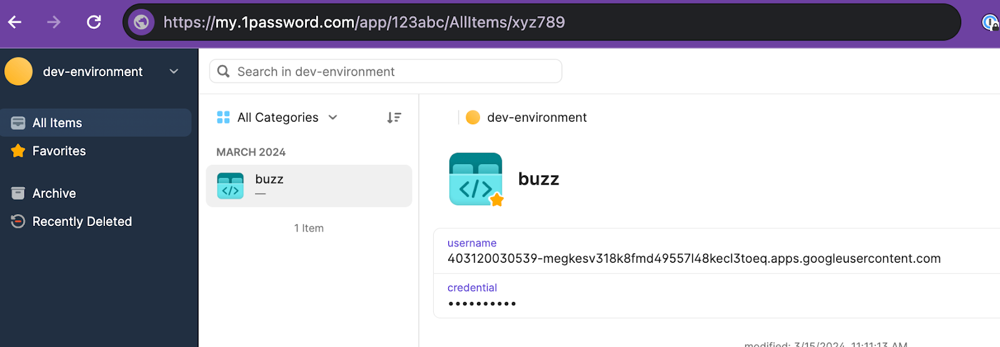
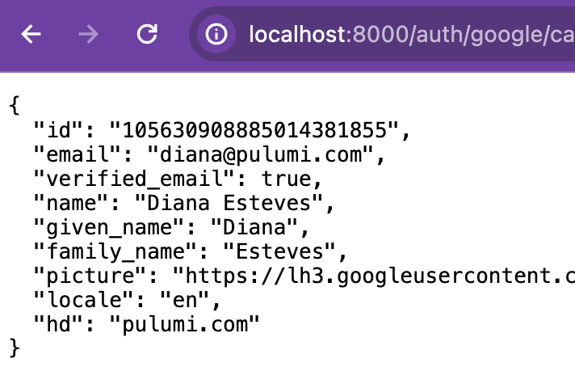
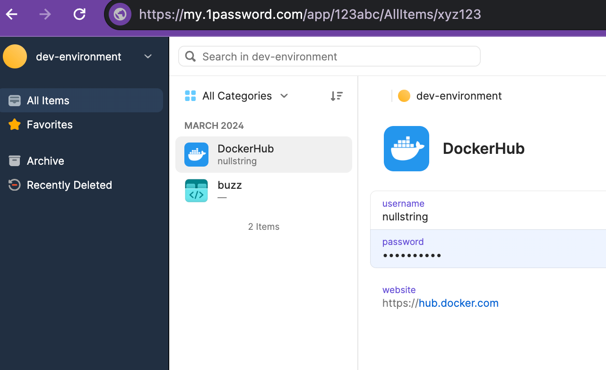

Today, we extend the capabilities of Pulumi ESC (Environments, Secrets, and Configuration) by integrating with 1Password, a developer-friendly secrets management solution.  With the new 1Password integration, developers can reference their secrets stored inside 1Password from their environments, and consume those from their infrastructure and applications directly.  That means no more need to copy/paste secrets around, no need for plain text secrets on developer machines, and easier integration of your secrets in 1Password with secrets and configuration from other systems of record!

<!--more-->

1Password support has been one of the most highly requested features since our Pulumi ESC launch last October, and we're excited to have been able to partner with the 1Password team to deliver it to ESC users.  We are also internal users of both 1Password and ESC here at Pulumi and are now happily using 1Password with ESC in our own internal infrastructure. The integration is now available to our users in public preview.

We invite developers to explore these new capabilities and experience how they can streamline their workflows. Adding 1Password to our list of supported providers aims to address the growing demand for effective secrets management in the dynamically evolving cloud environment.

## See it in action

{}
To further enrich your skills and knowledge, we invite you to register for our upcoming workshop, ["Managing team secrets with 1Password & Pulumi ESC"](https://www.pulumi.com/resources/managing-team-secrets-1password-pulumi-esc/), designed to help you start with Pulumi ESC and its integration with 1Password.
{}



In the video above,  

1. Mr. Keys generates and stores Google OAuth 2.0 Client IDs in 1Password

2. Mr. Keys configured Pulumi ESC with 1Password.

    ```yaml
    values:
      1password:
        secrets:
          fn::open::1password-secrets:
            login:
              serviceAccountToken:
                fn::secret:
                  ciphertext: ZXN*not shown*...=
            get:
              google_oauth_client_id:
                ref: "op://dev-environment/buzz/username"
              google_oauth_client_secret:
                ref: "op://dev-environment/buzz/credential"
      environmentVariables:
        GOOGLE_OAUTH_CLIENT_ID: ${1password.secrets.google_oauth_client_id}
        GOOGLE_OAUTH_CLIENT_SECRET: ${1password.secrets.google_oauth_client_secret}
    ```

3. Ms. Code tests her Golang application locally with the dynamically retrieved Google OAuth credentials.

    ```bash
    # sans secrets management, expected to fail
    $ go run main.go
    2024/03/21 14:32:09 Starting HTTP Server. Listening at ":8000"
    Missing required parameter: client_id
    Error 400: invalid_request

    # with pulumi esc + 1password integration ✨🔐✨
    $ esc run buzz-dev-environment go run main.go
    2024/03/21 14:32:09 Starting HTTP Server. Listening at ":8000"
    ```

4. Ms. Code successfully authenticates with her Google OAuth credentials.

5. At a later point, Ms. Code needs DockerHub credentials to push her image, so she asks Mr. Keys to add these. Mr. Keys stores the Docker username and personal access token in 1Password. (This part is not shown in the demo clip.)

6. Mr. Keys updates the Pulumi ESC Environment, `​​buzz-dev-environment`

    ```yaml
    values:
      1password:
        secrets:
          fn::open::1password-secrets:
            login:
              serviceAccountToken:
                fn::secret:
                  ciphertext: ZXN*not shown*...=
            get:
              google_oauth_client_id:
                ref: "op://dev-environment/buzz/username"
              google_oauth_client_secret:
                ref: "op://dev-environment/buzz/credential"
              docker_pat:
                ref: "op://dev-environment/dockerhub/password"
              docker_usr:
                ref: "op://dev-environment/dockerhub/username"
      environmentVariables:
        GOOGLE_OAUTH_CLIENT_ID: ${1password.secrets.google_oauth_client_id}
        GOOGLE_OAUTH_CLIENT_SECRET: ${1password.secrets.google_oauth_client_secret}
        DOCKER_PAT: ${1password.secrets.docker_pat}
        DOCKER_USR: ${1password.secrets.docker_usr}
    ```

7. Lastly, Ms. Code then consumes the credentials via Pulumi ESC to log in and push the image

    ```bash
    $ esc run buzz-dev-environment  -- bash -c 'echo "$DOCKER_PAT" | docker login -u $DOCKER_USR --password-stdin'
    Login Succeeded

    $ TAG="nullstring/buzz:dev"
    $ docker build . -t $TAG
    $ docker push $TAG
    ```

## Conclusion

Our collaboration with 1Password marks a significant enhancement in the flexibility and security of Pulumi ESC, empowering developers with a seamless solution for managing secrets. This partnership reiterates our commitment to providing a highly efficient, secure development environment by facilitating the integration of critical secrets directly into your projects without compromising security. For a hands-on understanding of this integration and to optimize your secret management strategies, we encourage you to delve into the detailed documentation provided for both Pulumi ESC and 1Password integration:

* Visit the [1Password CI/CD Integration page](https://developer.1password.com/docs/ci-cd/) for Pulumi ESC docs.
* Visit our [Pulumi ESC docs](https://www.pulumi.com/docs/esc/environments/ ) to learn more about Pulumi ESC and a complete list of supported providers.

Don't miss the opportunity to elevate your platform engineering skills by joining our specially curated workshop, ["Managing team secrets with 1Password & Pulumi ESC"](https://www.pulumi.com/resources/managing-team-secrets-1password-pulumi-esc/). Your journey towards streamlined, secure cloud infrastructure management begins here.
