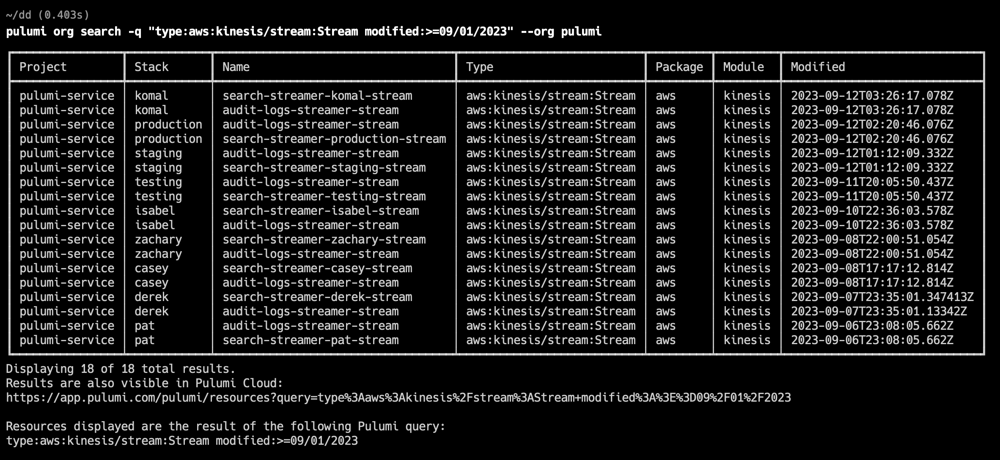
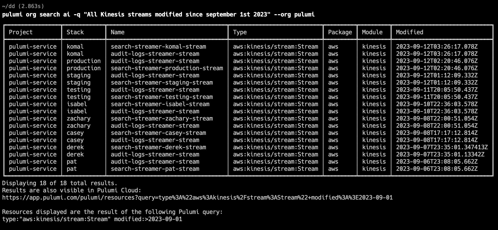
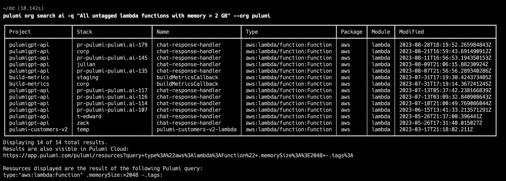
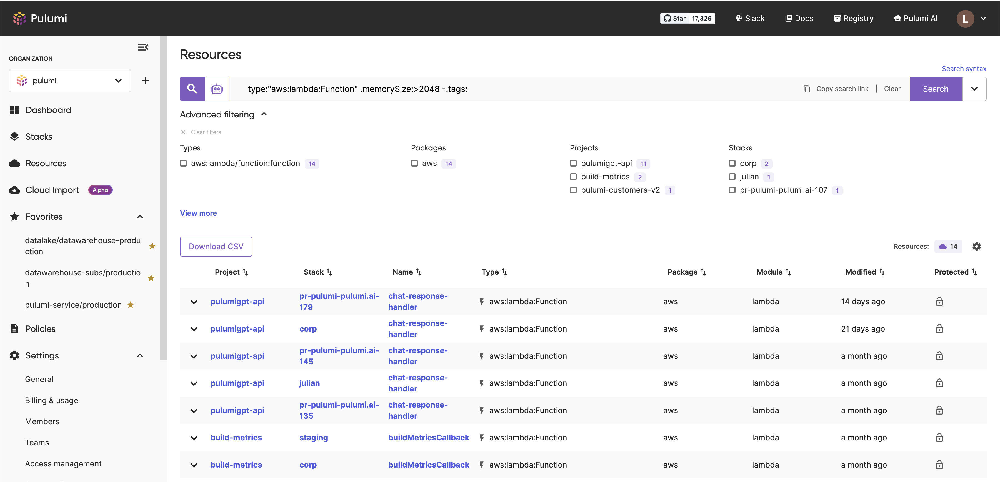

Earlier this year we introduced [Pulumi Insights](/blog/pulumi-insights/), a collection of features that bring intelligence to cloud infrastructure using Pulumi.  Two key components of that launch were [Pulumi AI](/blog/pulumi-ai/), a generative AI assistant purpose-built to create cloud infrastructure using natural language, and [Pulumi Resource Search](/blog/resource-search/), multi-cloud search and analytics across every cloud resource and environment in your organization.

Today, we are excited to bring Pulumi Insights into the `pulumi` CLI with the new `pulumi org search` and `pulumi ai` commands. These commands put AI and resource search at your finger tips right where Pulumi users spend most of their time, in the terminal iterating on their cloud infrastructure.



This release is the latest of a long list of improvements and enhancement to Pulumi Insights over the last few months, including [AI Assist for resource search](/blog/ai-assist-improvements/), [fine-grained resource property search](/blog/property-search/), [registry support in Pulumi AI](/blog/leveling-up-pulumi-ai-with-the-pulumi-registry/) and [Pulumi AI Answers](/ai/answers). We've seen incredible adoption and usage of all of these features over the last few months, and they are now easier than ever to access via the `pulumi` CLI.

## Pulumi Resource Search in the CLI

With the new `pulumi org search` command, you can search across all of the infrastructure managed by your organization (or individual account) using the same rich search syntax supported by Pulumi Resource Search in the Pulumi Console.

```bash
pulumi org search -q "type:aws:kinesis/stream:Stream modified:>=09/01/2023" --org my-org
```



If you don't know the exact search syntax for what you want to ask, you can use AI Assist, which was [recently opened up](/blog/ai-assist-improvements/) to all Pulumi organizations.  Just use `pulumi org search ai` instead!

```bash
pulumi org search ai -q "all Kinesis streams modified since September 1st 2023"  --org my-org
```

Notice that AI Assist comes up with the same query and runs it to get the same results we saw above.



These queries can also include complex logic which relies on looking at properties of resources, such as their tags.  For example:

```bash
pulumi org search ai -q "All untagged lambda functions with memory > 2 GB" --org my-org
```

AI Assist determines it should run the query `type:"aws:lambda:Function" .memorySize:>2048 -.tags:` and shows the results of that query:



The combination of rich query syntax, AI Assist and property search makes it easy and exciting to interactively find the information you are looking for about resources in your stack.

And of course, you can jump straight into the console to drill down even further into your data.



## Pulumi AI in the CLI

We've also taken our first step towards integrating Pulumi AI into the CLI.  With the `pulumi ai web` command, you can type a query in the CLI and have it launch a question into a browser window.

```bash
pulumi ai web "deploy metabase on AWS with a managed postgres database"
```

This opens a browser to [this conversation](/ai/conversations/7a4fc573-c34f-4aa7-be3a-448605f98d12?autoSubmit=true&language=TypeScript&prompt=deploy+metabase+on+AWS+in+a+container+with+a+managed+postgres+database), which walks through all the steps required to accomplish this task.


## Conclusion

With these new CLI commands, Pulumi Insights is available at your fingertips in the `pulumi` CLI.  These are just the first steps to bring search and AI into the CLI, expect to see much more in the coming months.  To learn more about the various Pulumi Insights features discussed here, check out the resources below:

* [Pulumi Insights](/docs/pulumi-cloud/insights/)
* [Pulumi AI](/ai)
* [Pulumi CLI](/docs/cli/commands/)
