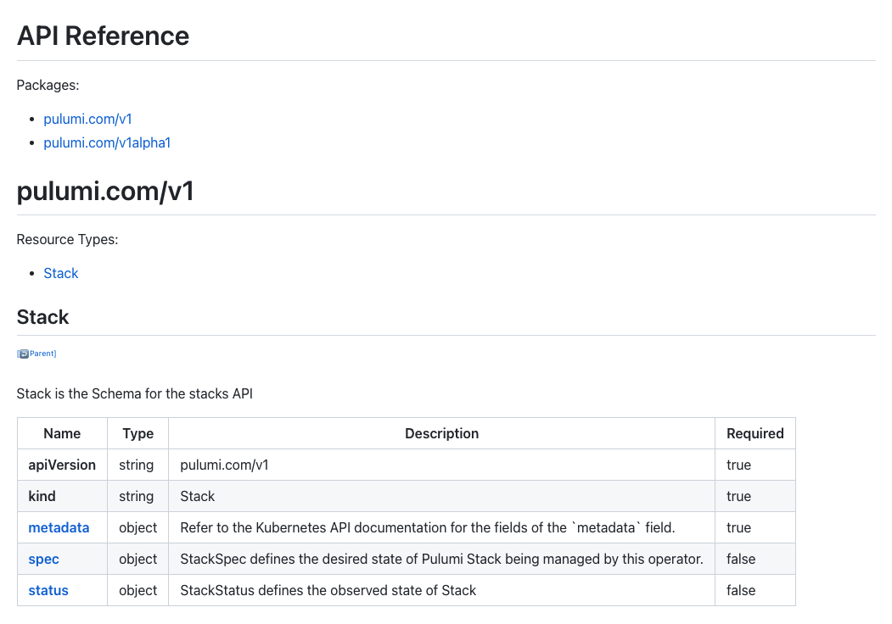

Last year we released the [Pulumi Kubernetes Operator](), a new cloud-native way to manage and deploy cloud infrastructure using Pulumi from within your Kubernetes environment. Since then, we’ve worked with many Pulumi users who have adopted the Pulumi Kubernetes Operator at increasingly larger scales and for a wide variety of use cases. Today, we’re excited to make the [1.0 release](https://github.com/pulumi/pulumi-kubernetes-operator/releases/tag/v1.0.0) of the Pulumi Kubernetes Operator available.

The Pulumi Kubernetes Operator defines a Kubernetes Custom Resource called `pulumi.com/v1/Stack`, which represents a Pulumi [stack](). The Pulumi stack can be authored in any supported Pulumi language (TypeScript, Python, Go, .NET) and can deploy and manage cloud infrastructure in any supported cloud (AWS, Azure, GCP, Kubernetes and 60+ additional cloud and SaaS providers). The Pulumi Kubernetes Operator triggers cloud deployments based on changes to the `Stack` Custom Resource or the resources it tracks.

As a result, the Pulumi Kubernetes Operator enables users to specify the desired state of their cloud infrastructure using resources managed directly in their Kubernetes cluster, which trigger creation, update and deletion of the detailed cloud infrastructure they need.

<!--more-->

For example, the following Kubernetes resource can be created to deploy a Pulumi program which provisions cloud infrastructure to manage NGINX provided in the target Git repo and commit, and future updates to the commit or config settings will deploy updates to the infrastructure.

```yaml
apiVersion: pulumi.com/v1
kind: Stack
metadata:
  name: nginx-k8s-stack-production
spec:
  stack: acmecorp/nginx/production
  projectRepo: https://github.com/acmecorp/pulumi-nginx
  commit: 2b0889718d3e63feeb6079ccd5e4488d8601e353
```

The Pulumi Kubernetes Operator can also be used along with Pulumi’s [Kubernetes provider](), which allows Pulumi programs to deploy resources to Kubernetes, either in the same cluster as the operator, or in another cluster. This can be used to package up complex Kubernetes infrastructure into more abstracted units, to mix Kubernetes and cloud infrastructure into a single unit of deployment, to define how application workloads are deployed into a cluster, or for a wide variety of additional use cases. The Pulumi Kubernetes provider has full support for the Kubernetes API available in every Pulumi language, along with newly improved support for [Helm]().

{}
We're at [KubeCon North America 2021](https://events.linuxfoundation.org/kubecon-cloudnativecon-north-america/) this week - come meet us at booth [SU8](https://events.linuxfoundation.org/wp-content/uploads/2021/10/KubeCon_NA_2021_Collateral_17x11_v2.pdf) if you are there! We also have two Kuberentes-focused webinars coming up where you can learn more about working with Pulumi and Kubernetes: [Provision, Manage and Scale Kubernetes on Any Cloud](https://get.spot.io/lp/provision-manage-scalek8s) (Oct 14th) and [From Zero to Production in Kubernetes]() (Oct 21st).
{}

## What’s New in Pulumi Kubernetes Operator 1.0?

The 1.0 release includes many significant enhancements since the initial launch, as well as scalability, performance and quality improvements.

### GitOps workflows with branch tracking and private Git repos

The operator now supports specifying a branch instead of a commit in a target Git repo. When a branch is specified, the operator will track any changes to what that branch is tracking, and trigger deployments automatically when new code is pushed. This is a "pull-based" model, where the operator watches the Git repo for changes. This ensures that the operator can be run in a private network environment that is not reachable from the internet (or via GitHub webhooks), and that the operator is fully in control of how these updates are discovered and processed.

This opens up a ton of new use cases for the Pulumi Kubernetes Operator, allowing the declarative model to be pushed from being purely within the Kubernetes resource, to allowing the exact commit to deploy to be specified in a Git repo branch. This allows infrastructure configuration to be defined once for a given environment, and then actively updated via `git push`. In this mode, the Pulumi Kubernetes Operator can be used in place of traditional CI/CD integrations or other cloud infrastructure deployment workflows.

The same stack as above can be changed to track a branch by using the `branch` option:

```yaml
apiVersion: pulumi.com/v1
kind: Stack
metadata:
  name: nginx-k8s-stack-production
spec:
  stack: acmecorp/nginx/production
  projectRepo: https://github.com/acmecorp/pulumi-nginx
  branch: refs/heads/production
```

This will watch the `production` branch of the repo for Git pushes, and then trigger updates to the `production` stack of the NGINX deployment based on the new code pushed to that branch.

To help identify what commit was last deployed when tracking a branch, the Operator publishes information about the last update under `.status.lastUpdate`, including the `lastAttemptedCommit` property and `lastSuccessfulCommit` property.

Along with support for branch tracking, the Operator also now supports access to private Git repositories, critical for deploying your production infrastructure via the Pulumi Kubernetes Operator.

### Building on the Pulumi Automation API

A couple months after we released the Pulumi Kubernetes Operator, we also released the initial version of the [Pulumi Automation API](). The Automation API provides an SDK for embedding Pulumi deployments inside your own software and systems, allowing you to build your own interfaces for managing cloud infrastructure. The design of the Automation API was heavily influenced by our experience building the Pulumi Kubernetes Operator, which was a perfect example of one of these custom interfaces - the Pulumi Kubernetes Operator embeds Pulumi deployments inside Kubernetes, offering a new interface (Kubernetes `Stack` resources) for managing cloud infrastructure.

Since then, we’ve moved the Pulumi Kubernetes Operator over to use the Pulumi Automation API, significantly reducing the size of the operator implementation, building on a robust foundation shared with dozens of other projects in the Pulumi ecosystem, and benefiting from many improvements and features added to the Pulumi Automation API. Earlier this year, the [Pulumi Automation API]() also reached GA as part of the [Pulumi 3.0]() release.

### Support for any state and secrets management backend

Pulumi supports a wide variety of state management and secrets management backends. Since the initial release of the Pulumi kubernetes Operator, we have added support for using not just the Pulumi Service backends, but also all of the other open source backend options, such as S3, Azure Blob and GCS for state storage, and KMS, KeyVault and Vault for secrets management.

```yaml
apiVersion: pulumi.com/v1
kind: Stack
metadata:
  name: s3-bucket-stack
spec:
  backend: s3://my-s3-backend
  stack: acmecorp/operator-dev
  projectRepo: https://github.com/acmecorp/pytest1
  initOnCreate: true
  branch: refs/head/master
  config:
    aws:region: us-west-2
```

### Worry-free Upgrades

The Pulumi Kubernetes Operator manages cloud infrastructure deployments which can take seconds to tens of minutes to complete. Although Pulumi ensures these deployments can be continued if interrupted, we want to ensure as little disruption to critical cloud infrastructure deployments as possible via the Operator. As a result, we have added a few key features to ensure that the Pulumi Kubernetes Operator can be safely upgraded to new versions without disrupting any deployments that are in-flight.

This includes capabilities like [Leader Election](https://sdk.operatorframework.io/docs/building-operators/golang/advanced-topics/#leader-with-lease), [Graceful Shutdown](https://pkg.go.dev/sigs.k8s.io/controller-runtime/pkg/manager#Options) and more.

### Prometheus Metrics

The Pulumi Kubernetes Operator automatically manages a lot of details of Pulumi deployments, and as a result, it’s critical to be able to get insight into the operation of the Operator. Previously, this was available either via operator logs, or via the Pulumi Console. As part of the 1.0 release, the Operator is also now exporting Prometheus-compatible metrics for `stacks_active` and `stacks_failing`. These can be used to drive reporting and other workflows inside the Kubernetes cluster.

```bash
$ kubectl port-forward service/pulumi-kubernetes-operator-metrics 8383:8383 &
$ curl -s localhost:8383/metrics | grep "stacks_active\|stacks_failing"
# HELP stacks_active Number of stacks currently tracked by the Pulumi Kubernetes Operator
# TYPE stacks_active gauge
stacks_active 2
# HELP stacks_failing Number of stacks currently registered where the last reconcile failed
# TYPE stacks_failing gauge
stacks_failing{name="stack-test-aws-s3-commit-change-5wuczx",namespace="default"} 1
```

### Documentation

We've added new documentation and enhanced existing documentation to ensure it's easy to get started with the Pulumi Kubernetes Operator.

Full `Stack` Custom Resource [API documentation](https://github.com/pulumi/pulumi-kubernetes-operator/blob/master/docs/stacks.md) is now available.  And guides for [deploying the Pulumi Kubernetes Operator](https://github.com/pulumi/pulumi-kubernetes-operator#deploy-the-operator) and [creating `Stack` resources](https://github.com/pulumi/pulumi-kubernetes-operator#deploy-the-operator) are available for use either from `kubectl`/YAML or using the Pulumi Kubernetes Provider.

[](https://github.com/pulumi/pulumi-kubernetes-operator/blob/master/docs/stacks.md)

## What’s Next

The 1.0 release of the Pulumi Kubernetes Operator is an important milestone, but there is still lots more planned to further expand the capabilities and scalability of the Operator. Some upcoming areas we’ll be investing:

* [Enable deployments to be run in separate Jobs](https://github.com/pulumi/pulumi-kubernetes-operator/issues/78)
* [Adopt new features from the the latest Operator SDK](https://github.com/pulumi/pulumi-kubernetes-operator/issues/212)
* [Publish Kubernetes events from the Operator](https://github.com/pulumi/pulumi-kubernetes-operator/issues/73)

## Conclusion

The Pulumi Kubernetes Operator is a great way to deploy and manage cloud infrastructure from within your Kubernetes environment. With the 1.0 release, we’ve added many significant enhancements, as well as scalability, performance and quality improvements. You can [get started with the Pulumi Kubernetes Operator today](). Enjoy!
