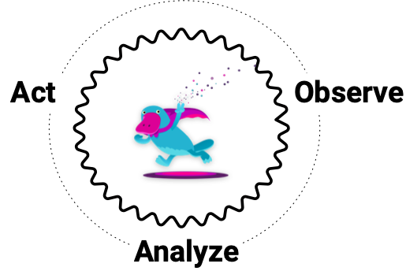
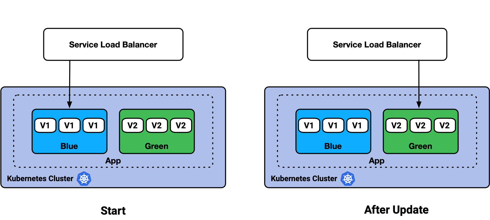

Kubernetes developers and operators work together to manage workloads
and to continuously ship software through CI/CD. These users
have an affinity for automation and pipelines, and richer integration
with Kubernetes is a growing theme across the cloud native ecosystem.

We're excited to introduce the Pulumi Kubernetes Operator: a Kubernetes
controller that deploys cloud infrastructure in Pulumi Stacks for you and your
team.

These program stacks include virtual machines, block storage,
managed Kubernetes clusters, API resources, serverless functions and more!

<!--more-->

## Overview

The [Pulumi Kubernetes Operator][pulumi-k8s-op] is an [extension pattern][k8s-ext-pattern] that
enables Kubernetes users to create a Pulumi [`Stack`][stack] as a first-class API
resource, and use the `StackController` to drive the updates of the Stack until
success.

Check out [how to deploy the operator][deploy-op] to a Kubernetes cluster using any of Pulumi's supported
languages, or through YAML manifests and `kubectl`.

You can also [get started][get-started] with Pulumi and create a new [managed Kubernetes cluster](https://www.pulumi.com/docs/tutorials/kubernetes/#clusters) on [Amazon EKS][aws-eks], [Google GKE][gcp-gke], or [Azure AKS][azure-aks] if you don't have an existing cluster.

[aws-eks]: https://aws.amazon.com/eks/
[gcp-gke]: https://cloud.google.com/kubernetes-engine
[azure-aks]: https://azure.microsoft.com/en-us/services/kubernetes-service/
[get-started]: https://www.pulumi.com/docs/get-started/kubernetes
[k8s-ext-pattern]: https://kubernetes.io/docs/concepts/extend-kubernetes/operator/
[deploy-op]: https://git.io/JJX6a

## How it Works

When the operator is deployed, the `StackController` waits for `Stack`
[CustomResources][k8s-crs] to be created, patched, or deleted in the cluster.

On these events, the Kubernetes controller invokes a reconciliation loop to process the
request until it has reached success. For Stack creation or updates, this is a
successful `pulumi up`. For deletions, it is a successful `pulumi destroy`
and `pulumi stack rm`.



[Stacks][stack] can be written in Typescript, Python, .NET, and
Go, and span cloud providers such as Amazon AWS, Google GCP, and Microsoft Azure, as
well as many [cloud native services][pulumi-providers]!

The following example showcases a typical Pulumi program in Typescript, that can be
instantiated as a Stack.

```typescript
import * as aws from "@pulumi/aws";

// Create an AWS resource (S3 Bucket)
const names = [];
for (let i = 0; i < 2; i++) {
    const bucket = new aws.s3.Bucket(`my-bucket-${i}`, {
        acl: "public-read",
    });
    names.push(bucket.id);
}

// Export the name of the buckets
export const bucketNames = names;
```

You can find [more examples][p-examples] on GitHub of the types of
infrastructure you can manage with Pulumi.

Check out [Kubernetes Controllers][k8s-cntlrs] work if you'd like to learn more.

[k8s-crs]: https://kubernetes.io/docs/concepts/extend-kubernetes/api-extension/custom-resources/
[k8s-cntlrs]: https://kubernetes.io/docs/concepts/architecture/controller/

## Creating a Pulumi Stack in Kubernetes

The `Stack` [CustomResourceDefinition (CRD)][k8s-crd] encapsulates an existing Pulumi
infrastructure project in a Git repo, a specific commit SHA to deploy, and any
additional settings to control the Pulumi update run.

These settings include your Pulumi API access token, environment variables,
config and secrets, and lifecycle controls for the update.

### Deploying an NGINX Stack on Kubernetes

Check out an example of creating a Kubernetes [NGINX Deployment][pulumi-k8s-nginx]
as a Stack by the Operator in its cluster.

Choose your preferred language below, or check out [how to create Pulumi Stacks using kubectl][stacks-use-kubectl].

[stacks-use-kubectl]: https://github.com/pulumi/pulumi-kubernetes-operator/blob/master/docs/create-stacks-using-kubectl.md
[k8s-crd]: https://kubernetes.io/docs/tasks/extend-kubernetes/custom-resources/custom-resource-definitions/


{}

```typescript
import * as pulumi from "@pulumi/pulumi";
import * as k8s from "@pulumi/kubernetes";
import * as kx from "@pulumi/kubernetesx";

// Get the Pulumi API token.
const pulumiConfig = new pulumi.Config();
const pulumiAccessToken = pulumiConfig.requireSecret("pulumiAccessToken")

// Create the API token as a Kubernetes Secret.
const accessToken = new kx.Secret("accesstoken", {
    stringData: { accessToken: pulumiAccessToken },
});

// Create an NGINX deployment in-cluster.
const mystack = new k8s.apiextensions.CustomResource("my-stack", {
    apiVersion: 'pulumi.com/v1alpha1',
    kind: 'Stack',
    spec: {
        accessTokenSecret: accessToken.metadata.name,
        stack: "<YOUR_ORG>/nginx/dev",
        initOnCreate: true,
        projectRepo: "https://github.com/metral/pulumi-nginx",
        commit: "2b0889718d3e63feeb6079ccd5e4488d8601e353",
        destroyOnFinalize: true,
    }
});
```

{}
{}

```python
import pulumi
from pulumi_kubernetes import core, apiextensions

# Get the Pulumi API token.
pulumi_config = pulumi.Config()
pulumi_access_token = pulumi_config.require_secret("pulumiAccessToken")

# Create the API token as a Kubernetes Secret.
access_token = core.v1.Secret("accesstoken", string_data={ "access_token": pulumi_access_token })

# Create an NGINX deployment in-cluster.
my_stack = apiextensions.CustomResource("my-stack",
    api_version="pulumi.com/v1alpha1",
    kind="Stack",
    spec={
        "access_token_secret": access_token.metadata["name"],
        "stack": "<YOUR_ORG>/nginx/dev",
        "init_on_create": True,
        "project_repo": "https://github.com/metral/pulumi-nginx",
        "commit": "2b0889718d3e63feeb6079ccd5e4488d8601e353",
        "destroy_on_finalize": True,
    }
)
```

{}
{}

```csharp
using Pulumi;
using Pulumi.Kubernetes.ApiExtensions;
using Pulumi.Kubernetes.Core.V1;
using Pulumi.Kubernetes.Types.Inputs.Core.V1;

class StackArgs : CustomResourceArgs
{
    [Input("spec")]
    public Input<StackSpecArgs>? Spec { get; set; }

    public StackArgs() : base("pulumi.com/v1alpha1", "Stack")
    {
    }
}

class StackSpecArgs : ResourceArgs
{
    [Input("accessTokenSecret")]
    public Input<string>? AccessTokenSecret { get; set; }

    [Input("stack")]
    public Input<string>? Stack { get; set; }

    [Input("initOnCreate")]
    public Input<bool>? InitOnCreate { get; set; }

    [Input("projectRepo")]
    public Input<string>? ProjectRepo { get; set; }

    [Input("commit")]
    public Input<string>? Commit { get; set; }

    [Input("destroyOnFinalize")]
    public Input<bool>? DestroyOnFinalize { get; set; }
}

class MyStack : Stack
{
    public MyStack()
    {
        // Get the Pulumi API token.
        var config = new Config();
        var pulumiAccessToken = config.RequireSecret("pulumiAccessToken");

        // Create the API token as a Kubernetes Secret.
        var accessToken = new Secret("accesstoken", new SecretArgs
        {
            StringData =
            {
                {"accessToken", pulumiAccessToken}
            }
        });

        // Create an NGINX deployment in-cluster.
        var myStack = new Pulumi.Kubernetes.ApiExtensions.CustomResource("nginx", new StackArgs
        {
            Spec = new StackSpecArgs
            {
                AccessTokenSecret = accessToken.Metadata.Apply(m => m.Name),
                Stack = "<YOUR_ORG>/nginx/dev",
                InitOnCreate = true,
                ProjectRepo = "https://github.com/metral/pulumi-nginx",
                Commit = "2b0889718d3e63feeb6079ccd5e4488d8601e353",
                DestroyOnFinalize = true,
            }
        });
    }
}
```

{}

{}

```go
package main

import (
    "github.com/pulumi/pulumi-kubernetes/sdk/v2/go/kubernetes"
    apiextensions "github.com/pulumi/pulumi-kubernetes/sdk/v2/go/kubernetes/apiextensions"
    corev1 "github.com/pulumi/pulumi-kubernetes/sdk/v2/go/kubernetes/core/v1"
    metav1 "github.com/pulumi/pulumi-kubernetes/sdk/v2/go/kubernetes/meta/v1"
    "github.com/pulumi/pulumi/sdk/v2/go/pulumi"
    "github.com/pulumi/pulumi/sdk/v2/go/pulumi/config"
)

func main() {
    pulumi.Run(func(ctx *pulumi.Context) error {
        // Get the Pulumi API token.
        c := config.New(ctx, "")
        pulumiAccessToken := c.Require("pulumiAccessToken")

        // Create the API token as a Kubernetes Secret.
        accessToken, err := corev1.NewSecret(ctx, "accesstoken", &corev1.SecretArgs{
            StringData: pulumi.StringMap{"accessToken": pulumi.String(pulumiAccessToken)},
        })
        if err != nil {
            return err
        }

        // Create an NGINX deployment in-cluster.
        _, err = apiextensions.NewCustomResource(ctx, "my-stack", &apiextensions.CustomResourceArgs{
            ApiVersion: pulumi.String("pulumi.com/v1alpha1"),
            Kind:       pulumi.String("Stack"),
            OtherFields: kubernetes.UntypedArgs{
                "spec": map[string]interface{}{
                    "accessTokenSecret": accessToken.Metadata.Name(),
                    "stack":             "<YOUR_ORG>/nginx/dev",
                    "initOnCreate":      true,
                    "projectRepo":       "https://github.com/metral/pulumi-nginx",
                    "commit":            "2b0889718d3e63feeb6079ccd5e4488d8601e353",
                    "destroyOnFinalize": true,
                },
            },
        }, pulumi.DependsOn([]pulumi.Resource{accessToken}))
        return err
    })
}
```

{}
{}

### Deploying an Amazon EKS Stack

Check out an example of creating a new AWS VPC and Kubernetes cluster
on [AWS EKS][pulumi-aws-eks] as a Stack by the Operator.


{}

```typescript
import * as pulumi from "@pulumi/pulumi";
import * as k8s from "@pulumi/kubernetes";
import * as kx from "@pulumi/kubernetesx";

// Get the Pulumi API token and AWS creds.
const pulumiConfig = new pulumi.Config();
const pulumiAccessToken = pulumiConfig.requireSecret("pulumiAccessToken")
const awsAccessKeyId = pulumiConfig.require("awsAccessKeyId")
const awsSecretAccessKey = pulumiConfig.requireSecret("awsSecretAccessKey")
const awsSessionToken = pulumiConfig.requireSecret("awsSessionToken")

// Create the creds as Kubernetes Secrets.
const accessToken = new kx.Secret("accesstoken", {
    stringData: { accessToken: pulumiAccessToken},
});
const awsCreds = new kx.Secret("aws-creds", {
	stringData: {
		"AWS_ACCESS_KEY_ID": awsAccessKeyId,
		"AWS_SECRET_ACCESS_KEY": awsSecretAccessKey,
		"AWS_SESSION_TOKEN": awsSessionToken,
	},
});

// Create a Kubernetes cluster on AWS EKS.
const mystack = new k8s.apiextensions.CustomResource("my-stack", {
    apiVersion: 'pulumi.com/v1alpha1',
    kind: 'Stack',
    spec: {
        stack: "<YOUR_ORG>/pulumi-aws-eks/dev",
        projectRepo: "https://github.com/metral/pulumi-aws-eks",
        commit: "fc4ab1a3e49d48cf5c764cd8cd626879a90bcc45",
        accessTokenSecret: accessToken.metadata.name,
        config: {
            "aws:region": "us-west-2",
        },
        envSecrets: [awsCreds.metadata.name],
        initOnCreate: true,
        destroyOnFinalize: true,
    }
});
```

{}
{}

```python
import pulumi
from pulumi_kubernetes import core, apiextensions

# Get the Pulumi API token.
pulumi_config = pulumi.Config()
pulumi_access_token = pulumi_config.require_secret("pulumiAccessToken")
aws_access_key_id = pulumi_config.require("awsAccessKeyId")
aws_secret_access_key = pulumi_config.require_secret("awsSecretAccessKey")
aws_session_token = pulumi_config.require_secret("awsSessionToken")

# Create the creds as Kubernetes Secrets.
access_token = core.v1.Secret("accesstoken", string_data={ "access_token": pulumi_access_token })
aws_creds = core.v1.Secret("aws-creds", string_data={
    "AWS_ACCESS_KEY_ID": aws_access_key_id,
    "AWS_SECRET_ACCESS_KEY": aws_secret_access_key,
    "AWS_SESSION_TOKEN": aws_session_token,
})

# Create a Kubernetes cluster on AWS EKS.
my_stack = apiextensions.CustomResource("my-stack",
    api_version="pulumi.com/v1alpha1",
    kind="Stack",
    spec={
        "stack": "<YOUR_ORG>/pulumi-aws-eks/dev",
        "project_repo": "https://github.com/metral/pulumi-aws-eks",
        "commit": "fc4ab1a3e49d48cf5c764cd8cd626879a90bcc45",
        "access_token_secret": access_token.metadata["name"],
        "config": {
            "aws:region": "us-west-2",
        },
        "env_secrets": [aws_creds.metadata["name"]],
        "init_on_create": True,
        "destroy_on_finalize": True,
    }
)
```

{}
{}

```csharp
using System;
using Pulumi;
using Pulumi.Kubernetes.ApiExtensions;
using Pulumi.Kubernetes.Core.V1;
using Pulumi.Kubernetes.Types.Inputs.Core.V1;

class StackArgs : CustomResourceArgs
{
    [Input("spec")]
    public Input<StackSpecArgs>? Spec { get; set; }

    public StackArgs() : base("pulumi.com/v1alpha1", "Stack")
    {
    }
}

class StackSpecArgs : ResourceArgs
{
    [Input("accessTokenSecret")]
    public Input<string>? AccessTokenSecret { get; set; }

    [Input("stack")]
    public Input<string>? Stack { get; set; }

    [Input("initOnCreate")]
    public Input<bool>? InitOnCreate { get; set; }

    [Input("projectRepo")]
    public Input<string>? ProjectRepo { get; set; }

    [Input("commit")]
    public Input<string>? Commit { get; set; }

    [Input("destroyOnFinalize")]
    public Input<bool>? DestroyOnFinalize { get; set; }

    [Input("envSecrets")]
    public InputList<String>? EnvSecrets { get; set; }

    [Input("config")]
    public InputMap<String>? Config { get; set; }
}

class MyStack : Stack
{
    public MyStack()
    {
        // Get the Pulumi API token.
        var config = new Config();
        var pulumiAccessToken = config.RequireSecret("pulumiAccessToken");
        var awsAccessKeyId = config.Require("awsAccessKeyId");
        var awsSecretAccessKey = config.RequireSecret("awsSecretAccessKey");
        var awsSessionToken = config.RequireSecret("awsSessionToken");

        // Create the creds as Kubernetes Secrets.
        var accessToken = new Secret("accesstoken", new SecretArgs
        {
            StringData =
            {
                {"accessToken", pulumiAccessToken}
            }
        });
        var awsCreds = new Secret("aws-creds", new SecretArgs
        {
            StringData =
            {
                {"AWS_ACCESS_KEY_ID", awsAccessKeyId},
                {"AWS_SECRET_ACCESS_KEY", awsSecretAccessKey},
                {"AWS_SESSION_TOKEN", awsSessionToken}
            }
        });

        // Create an Kubernetes cluster on AWS EKS.
        var myStack = new Pulumi.Kubernetes.ApiExtensions.CustomResource("my-stack", new StackArgs
        {
            Spec = new StackSpecArgs
            {
                Stack = "<YOUR_ORG>/pulumi-aws-eks/dev",
                ProjectRepo = "https://github.com/metral/pulumi-aws-eks",
                Commit = "fc4ab1a3e49d48cf5c764cd8cd626879a90bcc45",
                AccessTokenSecret = accessToken.Metadata.Apply(m => m.Name),
                Config =
                {
                    {"aws:region", "us-west-2"}
                },
                EnvSecrets = {awsCreds.Metadata.Apply(m => m.Name)},
                InitOnCreate = true,
                DestroyOnFinalize = true,
            }
        });
    }
}
```

{}

{}

```go
package main

import (
    "github.com/pulumi/pulumi-kubernetes/sdk/v2/go/kubernetes"
    apiextensions "github.com/pulumi/pulumi-kubernetes/sdk/v2/go/kubernetes/apiextensions"
    corev1 "github.com/pulumi/pulumi-kubernetes/sdk/v2/go/kubernetes/core/v1"
    metav1 "github.com/pulumi/pulumi-kubernetes/sdk/v2/go/kubernetes/meta/v1"
    "github.com/pulumi/pulumi/sdk/v2/go/pulumi"
    "github.com/pulumi/pulumi/sdk/v2/go/pulumi/config"
)

func main() {
    pulumi.Run(func(ctx *pulumi.Context) error {
        // Get the Pulumi API token and AWS creds.
        config := config.New(ctx, "")
        pulumiAccessToken := config.Require("pulumiAccessToken")
        awsAccessKeyID := config.Require("awsAccessKeyId")
        awsSecretAccessKey := config.Require("awsSecretAccessKey")
        awsSessionToken := config.Require("awsSessionToken")

        // Create the creds as Kubernetes Secrets.
        accessToken, err := corev1.NewSecret(ctx, "accesstoken", &corev1.SecretArgs{
            StringData: pulumi.StringMap{"accessToken": pulumi.String(pulumiAccessToken)},
        })
        if err != nil {
            return err
        }
        awsCreds, err := corev1.NewSecret(ctx, "aws-creds", &corev1.SecretArgs{
            StringData: pulumi.StringMap{
                "AWS_ACCESS_KEY_ID":     pulumi.String(awsAccessKeyID),
                "AWS_SECRET_ACCESS_KEY": pulumi.String(awsSecretAccessKey),
                "AWS_SESSION_TOKEN":     pulumi.String(awsSessionToken),
            },
        })
        if err != nil {
            return err
        }

        // Create an Kubernetes cluster on AWS EKS.
        _, err = apiextensions.NewCustomResource(ctx, "my-stack",
            &apiextensions.CustomResourceArgs{
                ApiVersion: pulumi.String("pulumi.com/v1alpha1"),
                Kind:       pulumi.String("Stack"),
                OtherFields: kubernetes.UntypedArgs{
                    "spec": map[string]interface{}{
                        "stack":             "<YOUR_ORG>/s3-op-project/dev",
                        "projectRepo":       "https://github.com/metral/pulumi-aws-eks",
                        "commit":            "fc4ab1a3e49d48cf5c764cd8cd626879a90bcc45",
                        "accessTokenSecret": accessToken.Metadata.Name(),
                        "config": map[string]string{
                            "aws:region": "us-west-2",
                        },
                        "envSecrets":        []interface{}{awsCreds.Metadata.Name()},
                        "initOnCreate":      true,
                        "destroyOnFinalize": true,
                    },
                },
            }, pulumi.DependsOn([]pulumi.Resource{accessToken, awsCreds}))

        return nil
    })
}
```

{}
{}

## CI/CD Scenarios

As you build out your Kubernetes workloads, you'll need to implement update strategies
to ship new software easily and reliably. Kubernetes API resources like
[Deployments][k8s-deployment] are used to model stateless apps and operate their lifecycles
e.g. recreate app replicas, or perform a rolling update.

A common approach that most teams rely on is the [Blue / Green][blue-green] deployment.
This starts with an initial version of the app, and then deploys an updated version
alongside the initial version. Once ready, traffic is switched over from the
initial version to the new version with no downtime.



In Kubernetes, Blue/Green is modeled by using a [Service][k8s-service]
that load balances and selects a set of Deployment pods labeled "blue," and then switching to a
different selection of updated, "green" pods.

Similar to the Stack CustomResources in the previous sections, we can deploy a Stack
of a [Blue/Green Kubernetes app in Pulumi][blue-green-example], and step through a sequence of its Git commits
similiar to how a CI/CD pipeline does. Additionally, we can use the [Pulumi config system][pulumi-config] to parameterize
settings and secrets on how to manage the Stack CustomResource project.

Deploying the active blue and passive green versions of the app can be done on
the example Stack with the following steps.

```bash
pulumi config set --secret pulumiAccessToken <YOUR_PULUMI_API_TOKEN>
pulumi config set stackProjectRepo https://github.com/metral/pulumi-blue-green
pulumi config set stackCommit b19759220f25476605620fdfffeface39a630246
pulumi up -y
```

After deployment, we'll test that the v1 / "blue" endpoint is live and running.
The v2 / "green" app will be on standby.

```bash
while true; do curl http://34.83.25.150:80/version ; echo; sleep 1; done

{"id":1,"content":"current"}
{"id":1,"content":"current"}
{"id":1,"content":"current"}
{"id":1,"content":"current"}
...
```

When we're ready to switch traffic, the blue/green
transition is done by updating the config to the Git new commit of the selector
swap, and running an update.

```bash
pulumi config set stackCommit f4bf2f7b54ec441d5af374933cca4ef09f2bce24
pulumi up -y
```

After a few seconds you should start seeing the generated traffic returning the
new version in a clean cut-over with no dropped packets.

```bash
...
{"id":1,"content":"current"}
{"id":1,"content":"current"}
{"id":1,"content":"current"}
{"id":2,"content":"new"}
{"id":2,"content":"new"}
{"id":2,"content":"new"}
{"id":2,"content":"new"}
...
```

Check out the [full walkthrough][blue-green-walkthrough] for a tutorial, and
the video clip below for a demo.



[blue-green-example]: https://github.com/metral/pulumi-blue-green/blob/master/index.ts
[k8s-deployment]: https://kubernetes.io/docs/concepts/workloads/controllers/deployment
[blue-green]: https://en.wikipedia.org/wiki/Blue-green_deployment
[k8s-service]: https://kubernetes.io/docs/concepts/services-networking/service
[blue-green-walkthrough]: https://github.com/pulumi/pulumi-kubernetes-operator/tree/master/examples/blue-green

## Wrap-Up

The [Pulumi Kubernetes Operator][pulumi-k8s-op] helps deploy Pulumi Stacks in
your Kubernetes cluster, and naturally fits in with your CI/CD process.

We covered examples like deploying an [NGINX Stack][pulumi-k8s-nginx] in the same cluster as the
Operator, creating a new Kubernetes cluster in an [AWS EKS Stack][pulumi-aws-eks], and how Stacks can be
abstracted for deployment strategies like Blue/Green.

There are [many more][p-examples] examples of deploying infrastructure,
containers, serverless, and Kubernetes across cloud providers and cloud native services.

## Next Steps

Check out the [GitHub repo][pulumi-k8s-op] to experiment deploying the operator
and some test Stacks.

Learn more about how [Pulumi works with Kubernetes](https://www.pulumi.com/docs/intro/cloud-providers/kubernetes/), and [Get Started](https://www.pulumi.com/docs/get-started/kubernetes/) if you're new.

You can help to shape this experience directly by
providing feedback on [GitHub](https://github.com/pulumi/pulumi-kubernetes-operator/). We love to hear from our users!

You can explore more content by checking out [PulumiTV on YouTube](http://youtube.com/pulumitv), work through
Kubernetes [tutorials](https://www.pulumi.com/docs/tutorials/kubernetes/) to dive deeper, and join the [Community Slack](https://slack.pulumi.com/) to engage
with users and the Pulumi team.

[pulumi-k8s-op]: https://github.com/pulumi/pulumi-kubernetes-operator
[pulumi-k8s-nginx]: https://github.com/metral/pulumi-nginx
[pulumi-aws-eks]: https://github.com/metral/pulumi-aws-eks
[p-examples]: https://github.com/pulumi/examples
[stack]:
[pulumi-config]:
[pulumi-providers]:
