As a customer engineer, one of the most rewarding aspects of my work is to listen to customers and our diverse community to learn and share how they succeed in their day-to-day projects.

In this 3-article mini-series, we're going to explore some of the recommended patterns used in the Pulumi community and the benefits of using those patterns. We'll kick off with all the basic patterns to get you started. Next, as you progress into cloud engineering, we'll go deeper into evolved patterns. We'll then conclude this mini-series with cloud engineering practices to augment and accelerate how you approach cloud software.

Let's dive in!

## It all starts with the cloud

Pulumi is an infrastructure-as-code tool, and it is at the center of many other services, platforms, and products. Pulumi can act as a unifying agent for many of these services, enabling users to combine multiple services seamlessly at once to create exciting and innovative platforms. In this way, Pulumi is the 'hub' connecting the diverse 'spokes' of your solution, allowing you to really get rolling.

Pulumi is predominantly used with cloud providers like Amazon Web Services (AWS), Microsoft Azure, Google Cloud Platform (GCP), and Kubernetes. But many more are available and supported in the [Registry](). At the time of this writing, Pulumi supports 52 providers.

With such an impressive ecosystem, it's quite normal to follow your vendors' best practices as they are key ingredients to your long-term success on these platforms.

Here are a few links to get you started:

* [AWS](https://aws.amazon.com/organizations/getting-started/best-practices/)
* [Azure](https://docs.microsoft.com/en-us/azure/security/fundamentals/best-practices-and-patterns)
* [GCP](https://cloud.google.com/docs/enterprise/best-practices-for-enterprise-organizations)
* [Kubernetes](https://kubernetes.io/docs/setup/best-practices/)

While these recommendations are important, you don't have to wait to adopt them all before you start using Pulumi. Rather, integrating Pulumi early in your cloud journey will empower you to implement better cloud practices with more integrated security and improved development velocity.

## First coding steps with Pulumi

When you start your journey into cloud engineering and infrastructure-as-code, you have to decide which programming language you will use. To have a smooth start with Pulumi, pick the programming language you are the most comfortable and familiar with, whether it be TypeScript, Javascript, Python, .NET, or Golang.

Of course, while the programming language used to describe your infrastructure desired state is important, so is your integrated development environment (IDE). You're going to spend most of your time in that application, so choose the one you are the most efficient with.

According to the [Stack Overflow survey](https://insights.stackoverflow.com/survey/2021#section-most-popular-technologies-integrated-development-environment) in 2021, the top 5 IDEs were:

1. Visual Studio Code (Free, Open-source)
2. Visual Studio (Free and paid)
3. Notepad++ (Free, open-source)
4. IntelliJ (Free and paid)
5. Vim (Free, open-source)

If you're unsure which IDE you should be using, here is a list of features you want to consider:

* Code completion for your preferred language
* Code syntax check and linting
* Integrated code documentation support
* Integration with your source code control workflows (git, Mercurial, SVN...)
* Plugins and extension support to augment the IDE capabilities (issues and pull request management, prettier code, themes and colors, pair programming...)

And just as with the cloud vendors, you should definitely consider the do's, don'ts, and recommended patterns for the programming language you selected. Following these best practices gives you safe guardrails and streamlines your developer experience across teams sharing the same programming language. Here's the main ones for a few languages:

* [TypeScript](https://www.typescriptlang.org/docs/handbook/declaration-files/do-s-and-don-ts.html)
* Python: [PEP 8](https://www.python.org/dev/peps/pep-0008/), [PEP 20](https://www.python.org/dev/peps/pep-0020/), and [an additional blog post](https://data-flair.training/blogs/python-best-practices/)
* [C#](https://docs.microsoft.com/en-us/dotnet/csharp/fundamentals/coding-style/coding-conventions)
* Golang: [Golang docs](https://golangdocs.com/golang-best-practices) and [a talk](https://talks.golang.org/2013/bestpractices.slide#1)

## Pulumi recommended patterns

Now we're all set, so let's dive into writing a Pulumi application.

### Give your resources a name

The first thing you'll notice when you write a Pulumi app is that every single resource must have its own name. This *Pulumi resource name*, or a logical resource name if you prefer, is used inside your stack state file to uniquely identify your resources. This name is also what you will find at first when exploring your stack resources in the Pulumi web console.

Depending on the resource type, a second name (a *cloud resource name* or a *physical resource name* if you like) may also be provided. This name will be what is used in your cloud vendor's web console. If this *cloud resource name* is unspecified, Pulumi uses the *Pulumi resource name* and appends a [random suffix]() to it to make it unique.

As a recommendation, you should use explicit names for all your *Pulumi resource names* and then let Pulumi determine what the *cloud resource names* should be. Let's explore the benefits:

* As vendors have different requirements, *cloud resource names* have different lengths and constraints. Pulumi knows this fact and will make sure the name matches the vendor requirements.
* The random suffix ensures that two stacks for the same project can be deployed without their resources colliding.
* Finally, the random suffix allows Pulumi to do **zero-downtime** resource updates. Due to the way some cloud providers work, certain updates require replacing resources rather than updating them in place. By default, Pulumi creates replacements first, then updates the existing references to them, and finally deletes the old resources.

In this example, the resource `inputBucket` only has a Pulumi resource name set whereas `outputBucket` has both the Pulumi resource name and the cloud resource name set. As a result of the lack of a cloud resource name, `inputBucketName` uses the Pulumi resource name as the base name with a random suffix. As for `outputBucketName`, the cloud resource name is set as specified by our code.

Along with this recommendation, using a unique prefix in the name of your resources is an elegant solution to identify resources across multiple projects and stacks quickly. A way to achieve this goal is to use a customer name or a project name. As [suggested](https://stackoverflow.com/a/69270933) by my colleague Mikhail, the resource name prefix may be composed of multiple values, such as `${organization}-${tenant}-${environment}-${resourceName}`.

Here are a few links to understand physical names and auto-naming a bit better:

* [Resources and auto-naming]()
* [Infrastructure as Code Resource Naming]()
* [Why do resource names have random hex character suffixes?]()

### Handling secrets securely

Deploying any infrastructure or services almost always means dealing with secrets of some form. Most often we encounter a database password, an API key, or other sensitive information.

If you've worked with other popular tools, you often have to resort to different means to securely your handle secrets. If you want to embed your secrets as part of your deployment, you may have to store your secrets in plain text in the deployment configuration files; even if you can avoid this, encrypted secrets may **still** leak as plain text values in the deployment state files.

Pulumi goes above and beyond to ensure your secrets are secret at all times. First, the Pulumi Service always transmits and stores entire state files securely. Pulumi also supports encrypting specific values as "[secrets]()" for extra protection. By default, the encryption method uses automatic, per-stack data encryption keys (DEK) provided by the Pulumi Service. This ensures your secrets are secure both in-transit and at rest, including in your stack state files. Last, Pulumi makes it easy for developers to make any variables a secret, and it's as simple as flipping the light switch.

Let's explore how [secrets]() work in Pulumi.

#### Secrets in the stack configuration file

First, using the Pulumi CLI, you can specific static values in your stack configuration file as shown. When using the option `--secret`, your secret is automatically encrypted before being stored in your stack configuration file, and the encryption key is safely stored in your Pulumi account. The encrypted value belongs to that stack only.

The benefit to this is you can **safely** store secret values and even commit them to your source code repository without risk.

In this example, we see the value stored in the stack configuration file `Pulumi.dev.yaml`. The result is a base64-encoded version of the encrypted value, which can only be decrypted in this stack.

#### Secrets, outputs, and stack state files

It's great to have a way to protect our secrets in the Pulumi stack configuration file by using string encryption. But what about revealing a secret by mistake in the stack state file, or by printing the value directly to your terminal?

This example shows you how Pulumi protects your secrets so you _never_ reveal their values.

In the code, we make 3 attempts:

* Line 9: First, we try to reveal the value using the native NodeJS function `console.log()`.
* Line 10: Second, we try to reveal the value using the Pulumi native function  `pulumi.log.info()`.
* Line 14: Finally, we try to leak the value in the stack state file.

As the animation demonstrates, our first two attempts did not reveal the value of `api_key`. Pulumi has protection mechanisms in place to prevent this from happening.

Similar to the prior example, exporting the stack state file to extract the secret value doesn't work either. The only information we see is the `ciphertext`, which is not usable.

#### Secrets and generated passwords

It's often acceptable to provide your passwords, API keys, or other sensitive information to your stack via the stack configuration file. But in other situations, it's even better to directly generate a random password as part of your Pulumi app. However, the challenge is to ensure the generated password doesn't change value when updating your stack.

In this code, we generate a password using the API [`RandomPassword`](). As you would expect because we're using Pulumi's API, Pulumi already knows that the property `dbPassword.result` is a secret and encrypts it by default.

#### From plain text to secret

Software systems often rely upon one another, and it's very common to obtain sensitive data from one system to be processed in another. With infrastructure-as-code and the commoditization of software to describe your infrastructure state, it's never been easier to connect your corporate systems with your infrastructure-as-code. However, it's important to protect this data.

With Pulumi, developers are first-class citizens as we expose useful functions like `pulumi.secret()`. As you've probably guessed already, `pulumi.secret()` has the ability to transform and protect any arbitrary data.

The code above shows how a plain text string can be converted into a secret in a single line of code. And the resulting variable `protectedSecret` has the same properties as any other secrets in your Pulumi application.

As demonstrated, your sensitive information is encrypted, and the value doesn't leak in your stack state file.

Using Pulumi and its secret management capabilities is an important step toward more secure deployments in general. But also, it enables developers to reach "zero-knowledge" of any sensitive information, effectively separating code and deployment from passwords and other sensitive information.

## Summary

For this first article, we laid down the important foundations of infrastructure-as-code. Here is a quick summary:

* Follow your vendors' best practices as early as possible.
* Choose the programming language and the IDE you're the most comfortable with.
* Give your Pulumi resources a name in Pulumi and in your cloud environment.
* Leverage Pulumi [secrets]() to protect your sensitive information during deployment.

In the next article, we'll discuss code reusability and code documentation to accelerate your developer experience. We show you how to have a multi-stack environment, protect critical resources, and more.

## Acknowledgement

Thank you to Stephanie Swenson at [Furō](https://www.furo.io/) for reviewing and suggesting many great edits in this article.

Thank you to Laura Santamaria, David Flanagan, Joe Duffy, and Luke Hoban at [Pulumi](https://www.pulumi.com/) for sharing their knowledge, reviewing, and suggesting edits in this article.
