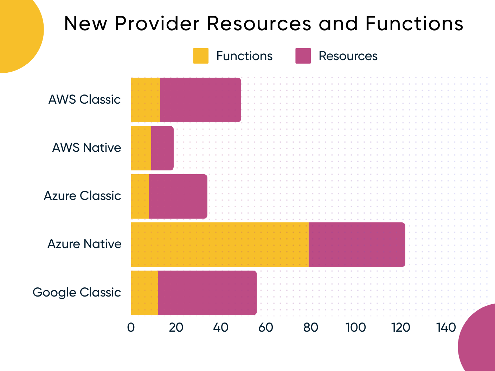
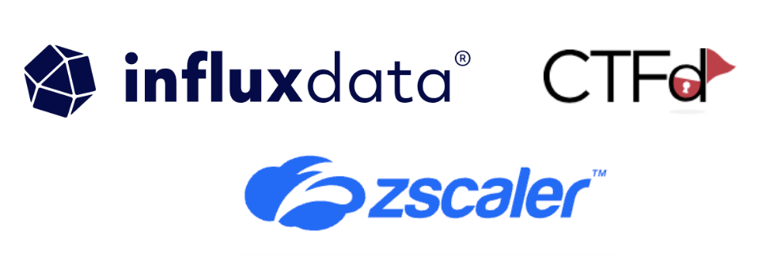

As always, we have been actively rolling out new features in response to the invaluable feedback from our ever-growing community.  We've shipped several security and usability features to [Pulumi ESC](/docs/esc) in response to feedback from our growing user base. Moreover, we've also added new enhancements to our core Platform CLI and Providers. In addition to the release notes, stay up-to-date with all things Pulumi by following the [new features blogs](/blog/tag/features) and the [pulumi/pulumi repo changelog](https://github.com/pulumi/pulumi-aws-native/releases). With so much to explore, let’s dive into the major updates across Pulumi from the past two months!

<!--more-->

- [Pulumi Cloud](#pulumi-cloud)
  - [Pulumi ESC 1Password Support](#pulumi-esc-1password-support)
  - [Pulumi ESC Key-Value Table Editor](#pulumi-esc-key-value-table-editor)
  - [Pulumi ESC YAML Code Editor Enhancements](#pulumi-esc-yaml-code-editor-enhancements)
  - [Pulumi ESC OIDC customization](#pulumi-esc-oidc-customization)
  - [Pulumi ESC Audit Logs](#pulumi-esc-audit-logs)
- [Core](#core)
  - [Dev Releases for the Pulumi CLI and SDKs](#dev-releases-for-the-pulumi-cli-and-sdks)
  - [Automation API support to install Pulumi CLI](#automation-api-support-to-install-pulumi-cli)
  - [Node.js Monorepo Support](#nodejs-monorepo-support)
- [Providers and Packages](#providers-and-packages)
  - [New Provider Resources](#new-provider-resources)
  - [New Community Providers](#new-community-providers)
  - [Pulumi Registry Documentation Update](#pulumi-registry-documentation-update)
- [AI](#ai)
  - [Pulumi AI Evolution](#pulumi-ai-evolution)
- [Wrap up](#wrap-up)

## Pulumi Cloud

### Pulumi ESC 1Password Support

In collaboration with 1Password, we've launched the [1Password provider](/docs/esc/providers/1password-secrets/) for Pulumi ESC in public preview. This feature, highly requested by our community, allows you to pull secrets and configurations stored in 1Password directly into ESC, and use them as [environment variables](/docs/esc/environments/#projecting-environment-variables) or within [Pulumi Config](/docs/esc/environments/#using-environments-with-pulumi-iac). This integration eliminates the need for manual secret copy and paste, enhancing both security and efficiency. For more details, refer to our [blog post](/blog/pulumi-esc-public-preview-for-1password-support/).



### Pulumi ESC Key-Value Table Editor

We've rolled out the [Pulumi ESC Key-Value Table Editor](/blog/esc-key-value-table-editor-launch/), offering a novel, user-friendly interface for managing secrets and configurations. This addition complements the existing YAML-based editor, providing intuitive and familiar experiences for your workflows with secrets and configurations. Table Editor supports capabilities including CRUD operations for secrets and plaintext values, secret decryption, [environment imports](/docs/esc/environments/#importing-other-environments), variable projections, and [interpolations](/docs/esc/environments/#interpolating-values).

### Pulumi ESC YAML Code Editor Enhancements

We've upgraded the Pulumi ESC YAML editor with features aimed at simplifying the environment authoring process and enhancing developer productivity. Key enhancements include auto-complete for faster coding, enhanced diagnostics offering deeper error insights, and hover documentation for easy access to information, reducing the need for context switching. Additionally, we have added support for accessing [contextual information](/docs/esc/environments/#pulumi-contextual-information) about the current user and current environments. This support can be used to fine-tune OIDC claims and enhance audit logs. For more details, check out our [blog post](/blog/esc-editor-enhancements/). 



### Pulumi ESC OIDC customization 

Pulumi ESC now offers [subject customization](/docs/pulumi-cloud/oidc/provider/azure/#subject-customization) for OIDC tokens, enhancing security across AWS, GCP and Azure by aligning federated credentials with specific identifiers. By configuring the `subjectAttributes` setting, users can include specific environment, user, and organization information in the [OIDC](/docs/pulumi-cloud/oidc/) token subject claim, offering more granular control and customization for cloud resource access. This capability is especially valuable for customers using Azure, where subject claims are required to precisely match the string specified in the policy.

### Pulumi ESC Audit Logs

Pulumi ESC now features comprehensive Audit Logs for all Create, Read, Open, Update, and Delete (CRUD) operations, strengthening your cloud security framework. This critical addition to Pulumi ESC enables organizations to closely monitor and audit their cloud infrastructure changes, ensuring enhanced oversight and security compliance. Through detailed logging, teams gain valuable insights into their operational activities, facilitating improved governance and accountability across cloud resources.

## Core

### Dev Releases for the Pulumi CLI and SDKs

We introduced [Dev Releases](/blog/introducing-dev-releases/), allowing developers to access the latest features and improvements in Pulumi's infrastructure as code tools ahead of their official release. With this initiative, we aim to engage our community and gather early feedback, enhancing the product development process. This is crucial for identifying and resolving potential issues early, contributing to a smoother transition to new releases. Dev Releases will also be at the cutting edge of Pulumi's evolving capabilities, with the latest bug fixes and features available within minutes of Pulumi developers merging. For instructions on how to use the CLI Dev releases see the [install docs](/docs/install/#installing-dev-releases), and for pre-release versions of Dev SDKs see the docs for [Node.js](/docs/languages-sdks/javascript/#dev-versions), [Python](/docs/languages-sdks/python/#dev-versions), [.NET](/docs/languages-sdks/dotnet/#dev-versions), and [Go](/docs/languages-sdks/go/#dev-versions).

### Automation API support to install Pulumi CLI 

The Pulumi Automation API now offers the functionality to install the Pulumi CLI directly through the API. This feature enables deploying programs utilizing the Automation API without the need for prior CLI installation. Explore an [example in Go](https://github.com/pulumi/automation-api-examples/tree/main/go/cli_installation) and refer to the new APIs in [Go](https://pkg.go.dev/github.com/pulumi/pulumi/sdk/v3/go/auto#InstallPulumiCommand), [Node.js](/docs/reference/pkg/nodejs/pulumi/pulumi/classes/automation.PulumiCommand.html#install), [Python](/docs/reference/pkg/python/pulumi/#pulumi.automation.PulumiCommand.install), and [.NET](https://github.com/pulumi/pulumi-dotnet/blob/edf4a5e904110f198d579d8db0b178aa9af9cdfa/sdk/Pulumi.Automation/Commands/LocalPulumiCommand.cs#L107).

### Node.js Monorepo Support

Pulumi now seamlessly integrates with Node.js monorepos using tools like Nx. We've enhanced Pulumi to support yarn/npm workspaces, widely used in Node.js monorepos. This enhancement facilitates better project management by automatically handling dependencies and building processes. The integration allows Pulumi infrastructure codes to coexist with application codes in the same repository, improving development workflow efficiency by using Nx's capabilities to manage build and deploy dependencies effectively.  Check out the [blog post](/blog/nx-monorepo/) for more details. 

## Providers and Packages

### New Provider Resources

We have added 121 functions and 159 resources across our most popular providers, along with many more throughout our ecosystem. Notably, Palo Alto Networks is now supported in the [Azure Native Provider](/registry/packages/azure-native/).

### New Community Providers

We welcome new providers to our registry!

* [Influx db](/registry/packages/influxdb/)
* [Zscalar Private Access](/registry/packages/zpa/)
* [Zscalar Internet Access](/registry/packages/zia/)
* [CTFD](/registry/packages/ctfd/)

### Pulumi Registry Documentation Update

The [Pulumi Registry](/registry) documentation has significantly improved example code generation across programming languages. Systemic improvements benefit over 900 examples—700+ in Python, 200+ in Go, and a selection in C#—with notable improvements in type instantiations.

## AI

### Pulumi AI Evolution

We continue to invest in [Pulumi AI](https://www.pulumi.com/ai) and improve the quality of programs in TypeScript, Python, Go, and C#. Key enhancements include generating code that accurately imports providers, with a special focus on those authored by our community and partners, ensuring the use of correct syntax for Pulumi YAML, embracing modern C# syntax like top-level statements, and implementing comprehensive spellchecking for modules and parameters. These updates continue to push Pulumi AI as a robust, developer-friendly platform, enabling you to build with greater confidence and efficiency. Moreover, you can now cancel in-progress prompts within Pulumi AI should you need to make any changes to your prompt. 

## Wrap up

That marks the end of this update on Pulumi's latest enhancements! We can't wait to see what you build with these new tools. Your feedback drives our innovation. Feel free to open an issue in the [Pulumi Cloud requests repository](https://github.com/pulumi/pulumi-cloud-requests/issues/new/choose)  or in the [pulumi/pulumi repository](https://github.com/pulumi/pulumi) for anything CLI. Keep an eye on us for more exciting updates!
