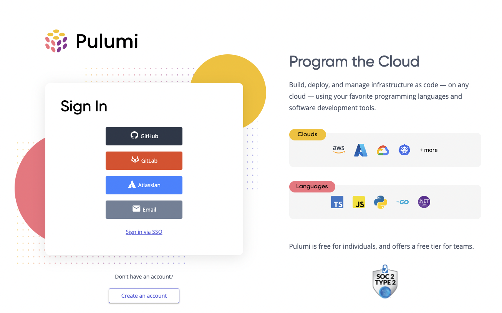
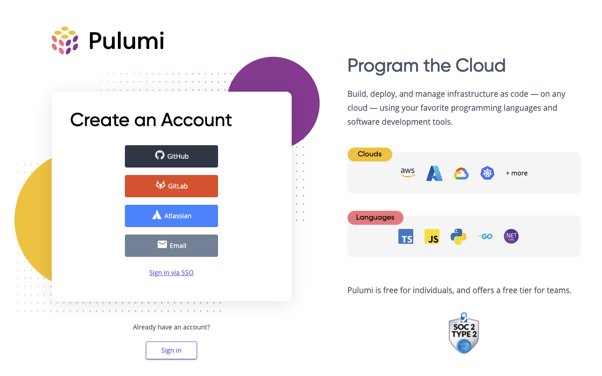
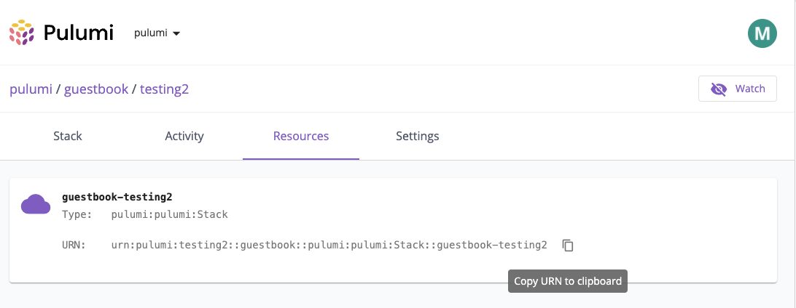

The team has been busy releasing new features and improvements in the last 3 weeks. Read on to learn about what's new in this release!

- Cloud Providers and Packages
  - [Helm Release for Kubernetes GA](#helm-release-for-kubernetes-ga)
- Pulumi CLI and core technologies
  - [Public preview of Update Plans](#public-preview-of-update-plans)
  - [Disable default provider](#disable-default-provider)
  - [`pulumi up --target` wildcard URN support](#pulumi-up---target-wildcard-urn-support)
  - [Default org considered when running any command with a stack name](#default-org-considered-when-running-any-command-with-a-stack-name)
- Pulumi Service
  - [Sign-up and sign-in experience revamp](#sign-up-and-sign-up-experience-revamp)
  - [Show resource URN on resource detail page](#show-resource-urn-on-resource-detail-page)

<!--more-->

## Cloud Providers and Packages

### Helm Release for Kubernetes GA

Back in September 2021 we announced public preview for the [Helm Release](https://www.pulumi.com/registry/packages/kubernetes/api-docs/helm/v3/release/) resource in Pulumi’s Kubernetes provider. Over the last few months, we have had a very encouraging uptake in usage and several meaningful discussions with users in the community that have helped shape improvements to this resource. Thanks to this collaboration, we have been able to make the Helm Release resource GA (generally available) in v3.15.0 of the Pulumi Kubernetes Provider and SDK, in all Pulumi supported languages. We are excited to offer yet another tool to Pulumi users to effectively manage their Kubernetes footprint.


Learn more in our [Helm release blog post]() and these GitHub issues:
- [Honor namespace specification for all resources installed by Helm Release](https://github.com/pulumi/pulumi-kubernetes/pull/1747)
- [Make values optional](https://github.com/pulumi/pulumi-kubernetes/pull/1761)
- [Make RepositoryOpts optional](https://github.com/pulumi/pulumi-kubernetes/pull/1806)
- [Support local charts](https://github.com/pulumi/pulumi-kubernetes/pull/1809)

## Pulumi CLI and core technologies

### Public preview of Update Plans

Pulumi’s previews are an important part of any workflow where you want to see the changes that will be made to your infrastructure before actually making the changes (with `pulumi up`). Previously, there were cases where the `pulumi up` operation would only do what was previewed; if the program, or your infrastructure changes between the preview and the update, the update may have taken additional changes to bring your infrastructure back in line with what’s defined in your program. We’ve heard from many of you that you need a strong guarantee about exactly which changes an update will make to your infrastructure, especially in critical and production environments.

As a result, we launched a public preview of Update Plans, a new Pulumi feature which guarantees that operations shown in `pulumi preview` will run on `pulumi up`. Update Plans also help catch any unexpected changes that might happen between when you preview a change and when you apply that change. Update Plans work by saving the results of a `pulumi preview` to a plan file, which enables you to restrict subsequent `pulumi up` operations to only the actions saved in the plan file. This helps you ensure that what you saw in the `pulumi preview` is what will actually happen when you run `pulumi up`.

Learn more in our [blog post on Update Plans]() and in this [Update Plans GitHub issue](https://github.com/pulumi/pulumi/issues/2318).


### Disable default provider

While default providers are enabled by default, you can now [disable default providers]() on a per stack basis. Disabling default
providers is a good idea if you want to ensure that your programs must be explicit about which provider they
will use. For example, to disable the `aws` provider, you can run:

```sh
$ pulumi config set --path 'pulumi:disable-default-providers[0]' aws
```

If you wanted to also disable the `kubernetes` default provider, as well as the `aws` default provider, you could run:

```sh
$ pulumi config set --path 'pulumi:disable-default-providers[1]' kubernetes
```

This adds a new entry to the list `pulumi:disable-default-providers`. To disable all default providers, use `*` as the package name:

```sh
$ pulumi config set --path 'pulumi:disable-default-providers[0]' '*'
```
Learn more in the [Disable Default Providers GitHub issue](https://github.com/pulumi/pulumi/issues/3383).

### `pulumi up --target` wildcard URN support

Users of the `--target` flag had requested the ability to use wildcards instead of manually specifying each targeted resource. As a result we now support wildcards for `pulumi up --target <urn>` and similar commands. Learn more in the [Wildcards support GitHub issue](https://github.com/pulumi/pulumi/issues/5870).

### Consider default org when running commands that accept stack names
Now that we have added the ability to take [advantage of a default org](https://github.com/pulumi/pulumi/pull/8352), we have added functionality to take into account where there are abilities to pass a stack name as part of a command, such as `pulumi up -s <stackname>` or as part of a `stack select` command. [Learn more in the GitHub issue](https://github.com/pulumi/pulumi/issues/8409).

## Pulumi Service & Pulumi.com

### Sign-up and sign-in experience revamp

We revamped our sign-in and sign-up process in the Pulumi Service. Our intentions were to make it easier to differentiate and toggle between the sign-in and sign-up experiences. As part of this work we also refreshed the design to align with our public website. Take a look! 

The new Pulumi Service sign-in page:



The new Pulumi Service create an account page:



### Show resource URN on resource detail page

We added the resource URN on the resource details page within the Pulumi Service. This enables users to easily find the URN for commands like `pulumi up --replace` or `--target`. Users can easily copy the resource URN to their clipboard by clicking on the copy icon.

The new resource details page that includes resource URN:

