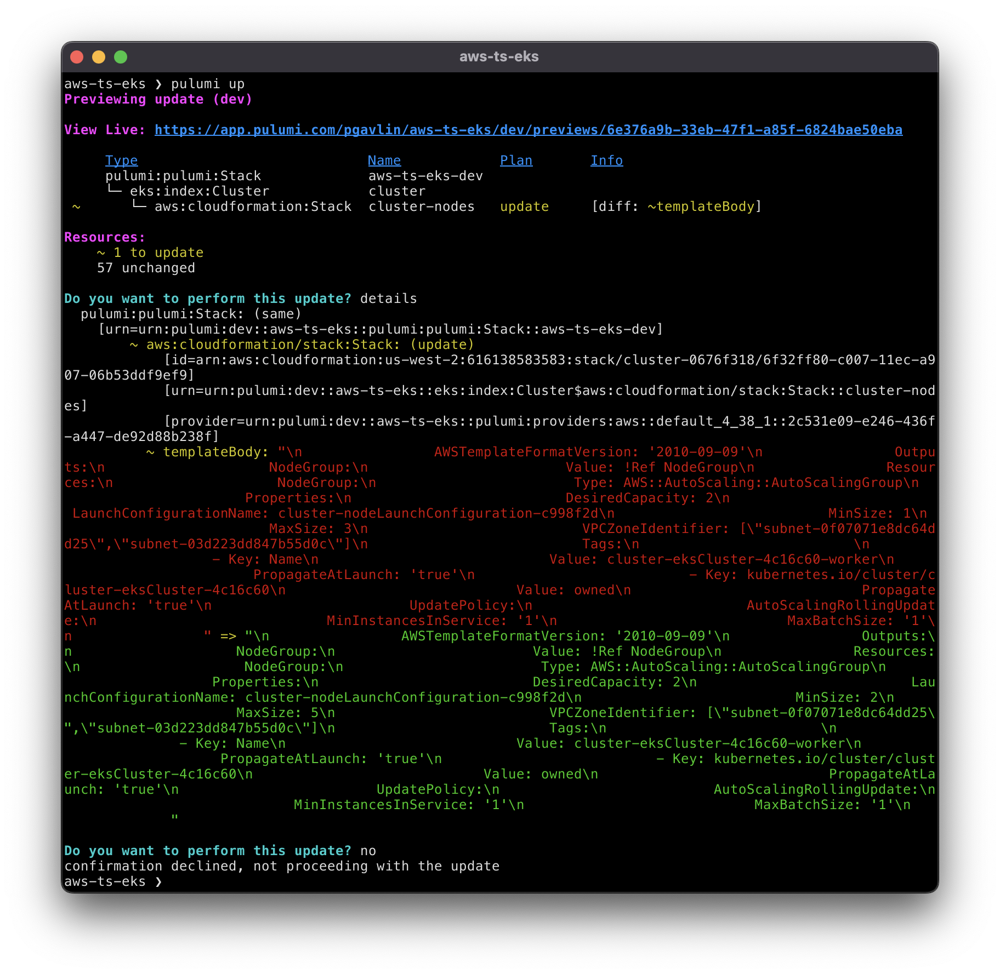
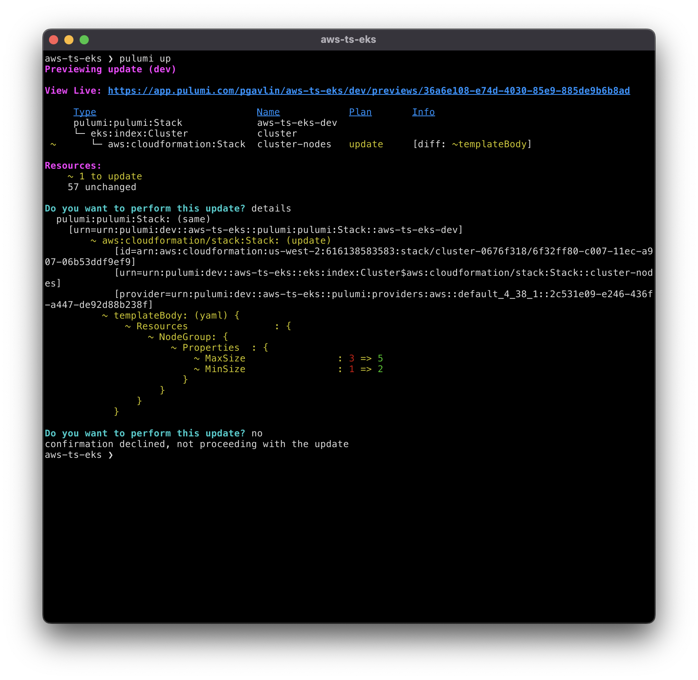
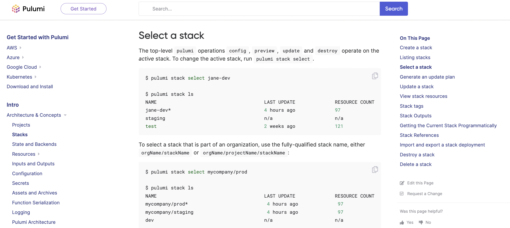

The team has been busy releasing new features and improvements in the last month. The latest Pulumi updates include our providers updates, install Pulumi using winget, stack unselect command, GitHub release private plugins, and more. Read on to learn about what's new in this release!

 <!--more-->
- Cloud Providers and Packages
  - [Pulumi AWS Provider v5.0.0](#pulumi-aws-provider-v5.0.0)
  - [Lambda Function URLs](#lambda-function-urls)
  - [New resources in our providers](#new-resources-in-our-providers)
- Pulumi CLI and core technologies
  - [Display richer diffs](#display-richer-diffs)
  - [Clear pending operations](#clear-pending-operations)
  - [List current users organizations](#list-current-users-organizations)
  - [Install Pulumi using Winget](#install-pulumi-using-winget)
  - [Pulumi stack unselect](#pulumi-stack-unselect)
  - [GitHub releases private plugins](#gitHub-releases-private-plugins)
  - [Speed up `pulumi stack --show-name`](#speed-up-pulumi-stack---show-name)
- Pulumi Service & Pulumi.com
  - [Docs search improvements](#docs-search-improvements)
<!--more-->

## Cloud Providers and Packages

### Pulumi AWS Provider v5.0.0

We are excited to announce v5.0.0 of the Pulumi AWS Classic provider. The AWS Classic provider is one of the most heavily used providers across the Pulumi ecosystem, and offers access to the full surface area of the upstream Terraform AWS Provider from within Pulumi projects in all supported Pulumi languages. The v5.0.0 release brings a substantial set of fixes and improvements to the provider, including a number of breaking changes as part of the major version release.

Read more in the [Pulumi AWS Provider v5.0.0 blog post](/blog/announcing-v5.0.0-of-the-pulumi-aws-provider). 

### Lambda function URLs

AWS Lambda functions are an incredibly easy and powerful way to stand up serverless capabilities which is why they are easily one of the most popular resources deployed by Pulumi users today. As of last week, Lambda Function URLs were made accessible via the Cloud Control API and therefore can be accessed in your Pulumi programs. End-users no longer need to set up an Amazon API Gateway to provide an HTTPS endpoint for their functions - further simplifying deployments.

You can learn more about Lambda Function URLs by reading the [Lambda URLs blog post]().

### New resources in our providers

We shipped new versions of the AWS Native provider and the [Azure Native provider](https://www.pulumi.com/registry/packages/azure-native) that added support for 140 new resources in the last month, 82 of those in the Azure Native provider.

## Pulumi CLI and core technologies

### Display richer diffs

In 3.29.1 we have made a handful of improvements to how diffs are presented in the Pulumi CLI. These changes will improve the CLI experience by making easier to see what changes are being made. 
Specifically, we have improved the following:

* [Show rich diffs for JSON/YAML objects/arrays](https://github.com/pulumi/pulumi/issues/5831)

  We now render the diff between the decoded JSON and YAML values rather than the diff between text values. This will make it a lot easier to see what has changed when managing resources that produce JSON or YAML strings. 

  Before 3.29.1 a preview would look as follows:
  
  Now the preview shows the YAML diff:
  

* [Render changes to text properties as diffs](https://github.com/pulumi/pulumi/issues/9136)

  Instead of simply rendering the old and new values for textual properties, we now present the diff between the old and new values. 

* [Retain `Secret` values](https://github.com/pulumi/pulumi/pull/9351)

  Instead of replacing Secret values with the text [secret], we now retain the Secret value and replace its element with the text [secret]. This allows the CLI's diff renderer to understand that the contents of the value is secret if necessary.

### Clear pending operations

We have made two changes to how pending operations are treated. The first change is that when there are pending operations, updates can be made but we will produce a warning to investigate the pending operations. This prevents users from ending up with live cloud resources that are not tracked by Pulumi (orphaned resources). The second change we made is now users can run `pulumi refresh` and clear pending operations. This adds an easy way to clean up pending operations that have been investigated and can be cleared.

Learn more in the [clear pending operations GitHub issue](https://github.com/pulumi/pulumi/issues/4265). 

### List current users organizations

Users can now see a list of their organizations using `pulumi whoami` and `pulumi about` to better inform and improve their CLI experience. Using the command `pulumi whoami –verbose` will now return the list of organizations the user is a member of. 

Learn more in the [list current orgs GitHub issue](https://github.com/pulumi/pulumi/issues/9181). 

### Install Pulumi using Winget

You can now install Pulumi using the [Winget](https://github.com/microsoft/winget-cli/) package manager. Windows users on Windows 11 and later can now use `winget install pulumi` to install Pulumi and `winget upgrade pulumi` to get the latest version.

Learn more in the [install Winget GitHub issue](https://github.com/pulumi/pulumi/issues/4676) and in the [Pulumi installation instructions](https://www.pulumi.com/docs/get-started/install/).

### Pulumi stack unselect

We have introduced the `pulumi stack unselect` command to remove a stack from the current workspace.  Users select stacks with `pulumi stack select [<stack>] [flags]` and can now easily deselect them if they need to. 

Learn more in the [stack unselect GitHub issue](https://github.com/pulumi/pulumi/issues/9070). 

### GitHub Releases private plugins

We now support downloading a plugin from private Pulumi GitHub releases. We only look at the GITHUB_TOKEN environment variable now and GITHUB_ACTOR and GITHUB_PERSONAL_ACCESS_TOKEN are no longer used. The token is sent via the Authorization header instead of Authentication (see documentation). 

Learn more in the [GitHub Releases private plugins pull request](https://github.com/pulumi/pulumi/pull/9185). 

### Speed up `pulumi stack --show-name`

Now when running `pulumi stack --show-name` we will skip loading the snapshot and instead just provide the stack name and then exit. This results in less latency to see the stack name.

Learn more in the [speed up show stack name GitHub issue](https://github.com/pulumi/pulumi/issues/9182). 

## Pulumi Service & Pulumi.com

### Docs search improvements

We updated the search experience of our [Docs]() to return more intuitive results as well as pinned the search bar on the top panel when users scroll through our Docs. 

