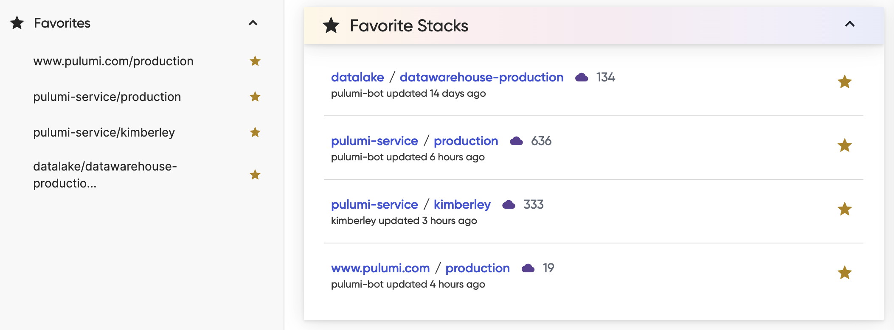

It has been an action packed July and August here at Pulumi! Below you will find a highlight list of what we have built across the engineering areas, including new resources support in our providers, new Automation API functionality, interactive options for `pulumi refresh` and much more.

<!--more-->

If you are curious to see all new functionality, learn more about CLI improvements in the [pulumi/pulumi repo changelog](https://github.com/pulumi/pulumi/blob/master/CHANGELOG.md) and Pulumi Service features in the [new features blogs](/blog/tag/features/).

- Cloud Providers and Packages
  - [New resources in our providers](#new-resources-in-our-providers)
  - [New functionality in Google Native v0.25.0](#new-functionality-in-google-native)
  - [Kubernetes Operator v1.8.0](#kubernetes-operator-v180)
- Pulumi CLI and core technologies
  - [Pulumi YAML improvements](#pulumi-yaml-improvements)
  - [Allow `pulumi refresh` to resolve pending creates](#allow-pulumi-refresh-to-resolve-pending-creates)
  - [Re-implementing `pulumi `watch](#reimplementing-pulumi-watch)
  - [Automation API Python parallel inline programs](#automation-api-python-parallel-inline-programs)
  - [getOrganizations from inside a stack](#getorganizations-from-inside-a-stack)
  - [Control logging and tracing within Automation API](#control-logging-and-tracing-within-automation-api)
- Pulumi Service & Pulumi.com
  - [Team Access Tokens](#team-access-tokens)
  - [Billing Managers](#billing-managers)
  - [New Pulumi Service console](#new-pulumi-service-console)
  - [Stack Favorites](#stack-favorites)
  - [Pulumi Service Provider improvements](#pulumi-service-provider-improvements)

## Cloud Providers and Packages

### New resources in our providers

We shipped new versions of the AWS Native provider, Google Native provider and the Azure Native provider that added support for 145 new resources in the last month. 83 of the new resources were for AWS Native, 42 for Azure Native, and 20 were added to Google Native.

### New functionality in Google Native v0.25.0

Google Native v0.25.0 is out and includes a series of improvements beyond expanded resource support, including retrieving Kubeconfig and server config from Kubernetes clusters.

Learn more in the [Google Native v0.25.0 release notes](https://github.com/pulumi/pulumi-google-native/releases/tag/v0.25.0).

### Kubernetes Operator v1.8.0

In the latest release of the [Pulumi Kubernetes Operator](/docs/guides/continuous-delivery/pulumi-kubernetes-operator/) we have added improvements to metrics collection and better branch detection in branch specifications.

Learn more in the [Kubernetes Operator v1.8.0 release notes](https://github.com/pulumi/pulumi-kubernetes-operator/releases/tag/v1.8.0).

## Pulumi CLI and core technologies

### Pulumi YAML improvements

In the last two months we have made a series of improvements to Pulumi YAML, going from v0.5.2 to v0.5.5. Two key improvements we have made are:

**Shorthand for Fn::Invoke**
Previously an invoke function in Pulumi YAML would look as follows:

```yaml
Fn::Invoke:
  Function: aws:ec2:getVpc
```

Now we have a shorthand:

```yaml
Fn::aws:ec2:getVpc: {}
```

**Setting default providers**
You can now set a default provider to make it easier to author programs that work at multiple levels of infrastructure. This works really well with the disable default providers feature.

```yaml
resources:
  eks:
    type: eks:Cluster
  k8sProvider:
    type: pulumi:pulumi:kubernetes
    defaultProvider: true
    properties:
      kubeconfig: ${eks.kubeconfig}
  # from this point on, all kubernetes resources will inherit the above provider
  #   options:
  #     provider: ${k8sProvider}
```

We also made a handful of improvements to `pulumi convert`. See the [v0.5.5 release notes](https://github.com/pulumi/pulumi-yaml/releases/tag/v0.5.5) for more details.

### Allow `pulumi refresh` to resolve pending creates

[`pulumi refresh`](/docs/reference/cli/pulumi_refresh) can be used to bring Pulumi state back inline with external state. If something is changed in the actual state and Pulumi is not made aware of it or if Pulumi is terminated mid-operation you could end up with pending operations. Now when running `pulumi refresh` interactively, it will provide you with new options to deal with the pending operations. These new interactive options are as follows:

- **import**: the flag `--import-pending-creates` has been added to allow scripting to resolve pending creates via `pulumi refresh`. It takes a list of URN IDs to be imported.
- **clear**: to assist with the use case of removing all pending creates, the flag `--clear-pending-creates` has been added.
- **skip**: the flag `--skip-pending-creates` has been added to disable this new behavior

Regardless of if these flags are passed, a refresh is still run. To learn more read the [Repairing State with Pulumi Refresh](/blog/repairing-state-with-pulumi-refresh/) blog post or the [merge request](https://github.com/pulumi/pulumi/pull/10394).

### Re-implementing `pulumi watch`

The `pulumi watch` command watches the working directory or specified paths for the current project and updates the active stack whenever the project changes and displays the logs along with update progress. Using `pulumi watch` cloud developers can speed up the rate of iteration and focus on their code and infrastructure, instead of on the mechanics of their deployments.

We have recently re-implemented `pulumi watch` to have cross platform compatibility (it works on Apple Silicon now!) and improved performance.

**See it in action**


Try it out today! See more information in the `pulumi watch` documentation, the [original launch blog post](/blog/pulumi-watch-mode-fast-inner-loop-development-for-cloud-infrastructure/) and the [merge request for the latest updates](https://github.com/pulumi/pulumi/pull/10213).

### Automation API Python parallel inline programs

Automation API now supports parallel execution of Python inline programs. Now users can run multiple Python Pulumi programs in parallel when they are using Automation API. `SETTINGS` values are now global and context aware, and `CONFIG`, `ROOT` and `_SECRET_KEYS` were ported to ContextVars to prevent state leak between parallel line Pulumi programs.

Learn more in the [SETTINGS attributes merge request](https://github.com/pulumi/pulumi/pull/10402) and [ContextVars merge request](https://github.com/pulumi/pulumi/pull/10472).

### getOrganizations from inside a stack

Users can now get the current Pulumi Organization name from inside a stack. `getStack`, in both the Python and NodeJS SDKs returns the stack name itself. Now using `getOrganization` users can get both the stack and the Organization it is in. The other Pulumi languages will add `getOrganization` support shortly.

Learn more in the [Add getOrganization merge request](https://github.com/pulumi/pulumi/pull/10504).

### Control logging and tracing within Automation API

We have improved [Pulumi Automation API](/docs/guides/automation-api/) functionality to permit finer control over logging by adding five additional options to the preview, up, refresh, and destroy operations in Automation API.

Enables Automation API to run with the equivalent of CLI arguments:

- `--logflow`
- `--verbose`
- `--logtostderr`
- `--tracing`
- `--debug`

Learn more in the [Add options to configure logging and tracing merge request](https://github.com/pulumi/pulumi/pull/10338).

### Use `pulumi destroy -s <stack>` outside a Pulumi project dir

You can now specify a stack when using [`pulumi destroy`](/docs/reference/cli/pulumi_destroy) while outside of the project directory.

Learn more in the [`pulumi destroy -s <stack>` GitHub issue](https://github.com/pulumi/pulumi/issues/2440).

## Pulumi Service & Pulumi.com

### Team Access Tokens

We launched Team Access Tokens, which allow Organization and Team Admins to create access tokens scoped to a Pulumi Team. Pulumi Service customers on the Enterprise and Business Critical editions can use [Pulumi Teams](https://www.pulumi.com/docs/intro/pulumi-cloud/teams) to set role-based access controls (RBAC) for stacks by enabling Organization administrators to assign a set of stack permissions to a group of users. Once you have Teams created you can use Team Access Tokens to generate a token scoped to that Team.

Learn more in the [Team Access Tokens blog post](/blog/team-access-tokens/) and the [Team Access Tokens documentation](/docs/intro/pulumi-cloud/team-access-tokens/).

### Billing Managers

The new Billing Manager role gives the user permissions to access and edit only billing information, with no read or write permissions for stacks. This role is for when you need someone in your Organization to manage billing operations but you do not want them to have any permissions beyond that. Billing Managers can only be invited or added to the Organization by Organization Admins. Once added, the only information a Billing Manager will see is metrics about the Organization and the Billing and Usage page.

Learn more about the permissions in the [Billing Manager blog post](/blog/billing-managers/) and the [Billing Manager documentation](/docs/intro/pulumi-cloud/billing-managers/).

### New Pulumi Service console

It’s been nearly four years since the Pulumi Service launched back in 2018. In these last four years, our customer base has grown significantly and as a result, the Service’s features and capabilities have grown with it. Over this time the look and feel of the Service has largely stayed the same, its time for a refresh!

We’re excited to launch a set of improvements to the overall user experience of the Pulumi Service. These updates include an update to the Dashboard as well as a new left navigation pane:

**Increased organizational insights on the Service Dashboard**


**Easier navigation around the Service with a new left navigation pane**


### Stack Favorites

Many Pulumi users have access to dozens of hundreds of stacks. But only a few of those stacks may require regular interaction. We’ve introduced a new Stack Favorites feature to let you flag the stacks that are most important. This way you can access those stacks from anywhere in the Service.

Your favorites list is your own. Even if you’re part of an organization, your favorites won’t be shared with anyone other than you. And you can have as many favorites as you like!

Look for the star icon next to any stack name and select it to start building your favorites list.



### Pulumi Service Provider improvements

The Pulumi Service Provider builds on top of the Pulumi Service REST API which is another feature available to our customers to programmatically configuring the Pulumi Service. At launch, the Pulumi Service Provider had resource support for Teams, Webhooks, StackTags and AccessTokens. We have recently also added support for [TeamStackPermissions](/docs/reference/cli/pulumi_destroy/), enabling users to add stacks to Teams and [Provider](/docs/reference/cli/pulumi_destroy/) to control Provider resources.

As always, please feel free to submit feature requests and bug reports to [Pulumi Service Provider GitHub Repo](https://github.com/pulumi/pulumi-pulumiservice/issues). We look forward to seeing what you build with the Pulumi Service Provider!

Until next time, happy building!
