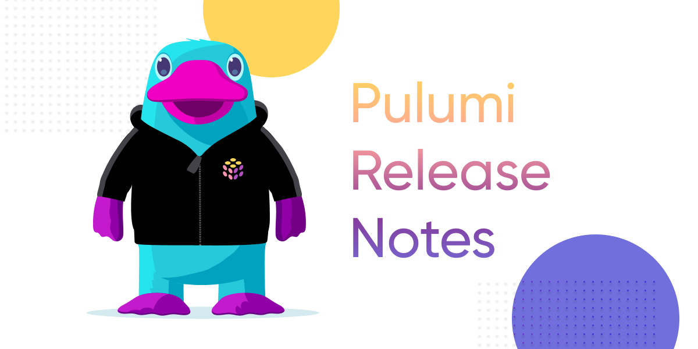

What you put here will appear on the index page. In most cases, you'll also want to add a Read More link after this paragraph though technically, that's optional. To do that, just add an HTML comment like the one below.

<!--more-->

<!-- * [AI](#ai)
  * [Resource Search - AI Assist](#resource-search---ai-assist)
  * [Pulumi Insights and AI in the CLI](#pulumi-insights-and-ai-in-the-cli)
* [Pulumi Cloud](#pulumi-cloud)
  * [Microsoft Teams Webhook Integration](#microsoft-teams-webhook-integration)
  * [Admin Organization Access Tokens in Pulumi Cloud](#admin-organization-access-tokens-in-pulumi-cloud)
  * [Restore Stacks](#restore-stacks)
  * [Dependent Stack Updates with Pulumi Deployments](#dependent-stack-updates-with-pulumi-deployments)
  * [Review Stacks](#review-stacks)
  * [Property Search](#property-search)
  * [Slack and Deployment Notifications](#slack-and-deployment-notifications)
* [Core](#core)
  * [Go Generics](#go-generics)
  * [Pulumi Convert](#pulumi-convert)
* [Providers and Packages](#providers-and-packages)
  * [AWS Classic 6.0](#aws-classic-60)
  * [Kubernetes 4.0](#kubernetes-40)
  * [Azure Native 2.0](#azure-native-20)
  * [OIDC Support for Azure](#oidc-support-for-azure)
  * [New provider resources](#new-provider-resources)
  * [New Community Providers](#new-community-providers)
* [Wrap Up](#wrap-up) -->

And then everything _after_ that comment will appear on the post page itself.

Either way, avoid using images or code samples [in the first 70 words](https://gohugo.io/content-management/summaries/#automatic-summary-splitting) of your post, as these may not render properly in summary contexts (e.g., on the blog home page or in social-media previews).

## Writing the Post

For help assembling the content of your post, see [BLOGGING.md](https://github.com/pulumi/pulumi-hugo/blob/master/BLOGGING.md). For general formatting guidelines, see the [Style Guide](https://github.com/pulumi/pulumi-hugo/blob/master/STYLE-GUIDE.md).

## Code Samples

```typescript
let bucket = new aws.s3.Bucket("stuff");
...
```

## Images



## Videos



Note the `?rel=0` param, which tells YouTube to suggest only videos from same channel.
