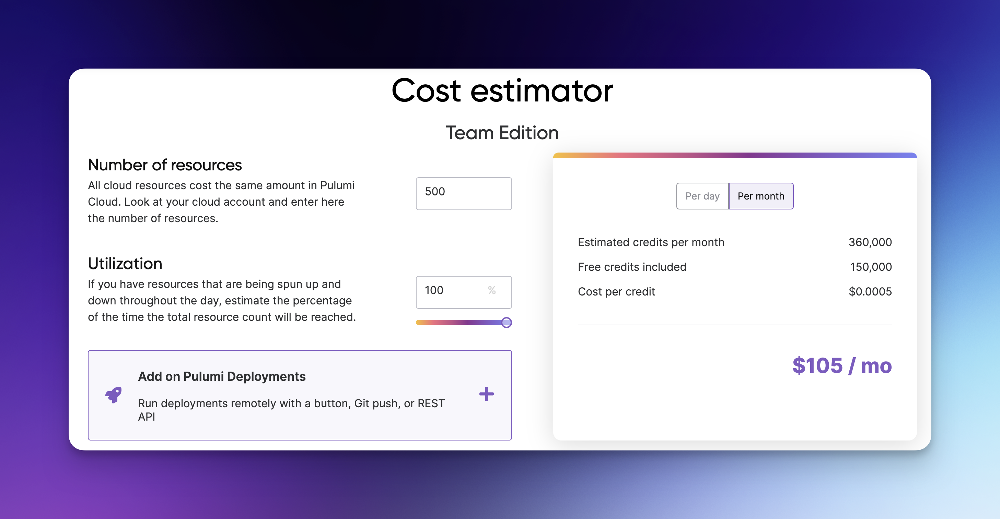
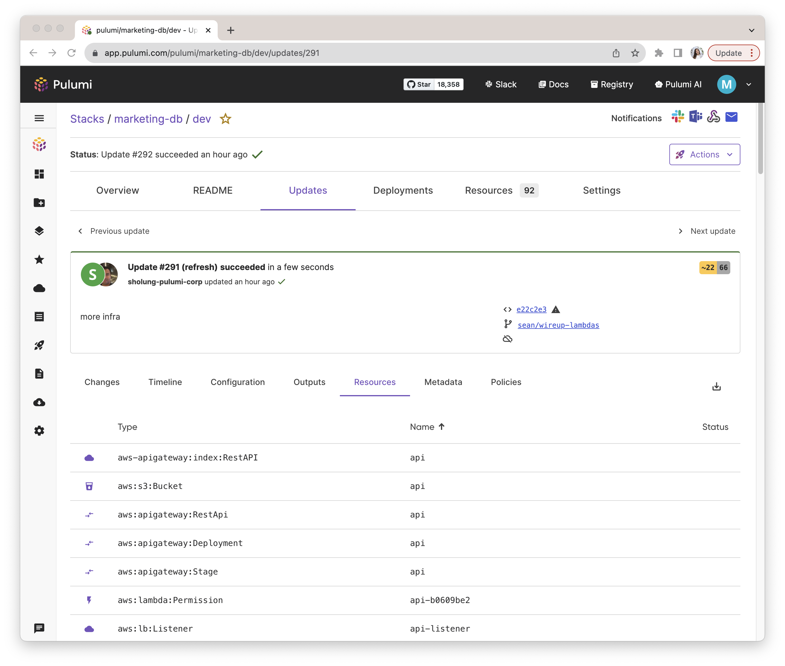
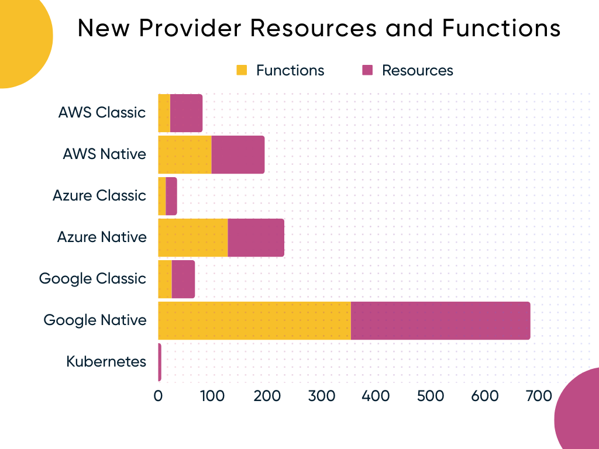

We've had a busy last few months at Pulumi. From shipping a brand new product offering, Pulumi ESC, to adding several major features in Pulumi Cloud and updates to various Pulumi providers - there is lots to catch up on. In addition to reading these release notes, check out the [pulumi/pulumi repo changelog](https://github.com/pulumi/pulumi/blob/master/CHANGELOG.md) to stay up to date with CLI enhancements after each CLI release. For Pulumi Cloud updates, follow the [new features blogs](/blog/tag/features) to stay updated on the latest feature releases. Let's walk through the major updates across Pulumi from the last few months!

<!--more-->

- [AI](#ai)
  - [Deploy with Pulumi within Pulumi AI](#deploy-with-pulumi-within-pulumi-ai)
  - [Pulumi AI coverage and performance](#pulumi-ai-coverage-and-performance)
- [Pulumi Cloud](#pulumi-cloud)
  - [Pulumi ESC Preview](#pulumi-esc-preview)
  - [Developer Portal Gallery](#developer-portal-gallery)
  - [Deployments GA](#deployments-ga)
  - [Customer Managed Agents](#customer-managed-agents)
  - [MFA in Pulumi Cloud](#mfa-in-pulumi-cloud)
  - [Pricing Calculator](#pricing-calculator)
  - [Historical Views](#historical-views)
- [Core](#core)
  - [Import Improvements](#import-improvements)
- [Providers and Packages](#providers-and-packages)
  - [AWSX now uses AWS 6.0](#awsx-now-uses-aws-60)
  - [Pulumi Google Cloud Classic 7.0](#pulumi-google-cloud-classic-70)
  - [AWS S3 Express One Zone Support](#aws-s3-express-one-zone-support)
  - [New Provider Resources](#new-provider-resources)
  - [New Community Providers](#new-community-providers)
- [Wrap up](#wrap-up)

## AI

### Deploy with Pulumi within Pulumi AI

Pulumi AI's new feature enables [deploying cloud infrastructure using AI prompts](/blog/pulumi-ai-new). Users can rapidly generate and deploy templates through natural language inputs in 'pulumi new' CLI command and new project wizard, significantly streamlining the cloud setup process. Additionally, you now have the option to deploy the Pulumi AI generated Pulumi programs from within [Pulumi AI]([/ai/](https://www.pulumi.com/ai)) and in the New Project Wizard in the Pulumi Cloud console.



### Pulumi AI coverage and performance

Pulumi AI can now write Pulumi programs for all 150 cloud providers in the [Pulumi registry](/registry/) - up from 20 cloud providers. Pulumi AI has also been updated to OpenAI's GPT-4 Turbo for enhanced performance along with fine tuning of our prompts to improve our AI's ability to write code.

## Pulumi Cloud

### Pulumi ESC Preview

[Pulumi Environment, Secrets and Configuration (ESC)](/docs/esc/) is our answer to the growing needs of our customers to manage secret sprawl and streamline config management. Pulumi ESC allows teams to store and aggregate secrets and configuration from various sources into a composable collection called an environment. You can dynamically generate [OIDC credentials](/docs/pulumi-cloud/oidc/aws/#pulumi-esc-1) from all three major cloud providers (AWS, Azure and GCP), and integrate with other [secrets managers](/docs/esc/get-started/retrieve-external-secrets/) like AWS Secrets Manager, Hashicorp Vault, Azure Vault and GCP Secret manager to pull secrets during runtime. Its hierarchical structure simplifies the composition and reuse of configurations, ensuring secure, auditable management and robust access control. [Get started](/docs/esc/get-started/) with Pulumi ESC

### Developer Portal Gallery 

We launched a new template gallery in the [New Project Wizard](/docs/pulumi-cloud/developer-portals/new-project-wizard), supercharging Platform teams to provision and distribute organization templates for their development teams to get up and running fast. Developers can generate Pulumi programs from these templates, commit and push code to GitHub and trigger deployment within the Pulumi Cloud console. The gallery supports three template types: Organization Templates for custom internal projects, Pulumi Templates authored by Pulumi to cover common architectural patterns and AI-Generated Templates created through Pulumi AI. For more information, check out the full [blog post](/blog/developer-portal-gallery/).



### Deployments GA

[Pulumi Deployments](/docs/pulumi-cloud/deployments) was made [generally available](/blog/deployments-ga) with new improvements such as support for [GitHub Enterprise](/docs/using-pulumi/continuous-delivery/github-app/#github-enterprise-server-support). Since launch, Pulumi Deployments has made infrastructure management at scale seamless for our customers, offering out of the box features such as [Review Stack](/docs/pulumi-cloud/deployments/review-stacks) and multiple deployment triggers.

### Customer Managed Agents

[Customer Managed Agents](/blog/customer-managed-deployment-agents-launch/) for Pulumi Deployments enable customers with hard security and compliance requirements to take advantage of the powerful capabilities of Pulumi Deployments. By self-hosting the agents, you can host them anywhere within your infrastructure on any hardware and environment in order to meet compliance requirements to keep cloud provider credentials within your private network.



### MFA in Pulumi Cloud

We now support [multi-factor authentication](/blog/multi-factor-auth-mfa-in-pulumi-cloud/) to prevent unauthorized access, ensuring robust security within your organization. Enable MFA by navigating to your account settings.

### Pricing Calculator

[Pulumi cost calculator](/pricing/#calculator) for Team Edition enables you to quickly estimate the cost of using Pulumi Cloud. Simply input the number of resources in all your cloud accounts and the percentage of time they will be running to quickly get the total cost per month with a break down of estimated credits, free credits and cost per credit. You can also use the calculator to estimate the cost of using Pulumi Deployments.

### Historical Views

The Pulumi Cloud stack update page now contains the historical resources in the stack and the historical stack outputs. Simply click on details on each Pulumi update to see the resource state and stack output at the time of the update. This history extends all the way back to the first update of the stack. See the [historical views blog post](/blog/update-page-improvements/) for more details.

## Core

### Import Improvements

We've made several improvements to the [`pulumi import`](/docs/using-pulumi/adopting-pulumi/import/#pulumi-import-command) command to make it easier to [bulk import](/docs/using-pulumi/adopting-pulumi/import/#bulk-import-operations) resources into complex programs and [components](/docs/concepts/resources/components/). You can now:

- Import one resource and then use that resource as the parent for another imported resource. Previously, parents could only refer to resources that already existed, meaning you would have had to do two imports.
- Specify that a resource is a component to be used as the parent of other imported resources via a new `component` property in the import file.
- Specify parents by name without having to have the parent URN in the `nameTable`.
- Specify the [`logicalName`](/docs/concepts/resources/names/#logicalname) of resources.
- Run `pulumi preview --import-file <file>` on a program to generate a placeholder import file for every resource that would be created as part of the program. The generated file will contain all the names, types, and URNs already filled in, with blank `id` fields that need to be filled in. This is useful when you already have the structure of the resources for your program and just need to fill in the IDs of existing resources.

Additionally, the import system no longer renames resources to try and make unique names and no longer errors just because two resources of different types have the same name. The rules for uniqueness now match what's valid when writing a Pulumi program. The import system will error if you try to import two resources that would end up with the same URN.

## Providers and Packages

### AWSX now uses AWS 6.0

We have launched [AWSx](https://www.pulumi.com/registry/packages/awsx/) 2.0, bringing all the benefits [AWS Classic 6.0](/blog/announcing-6-0-of-the-pulumi-aws-classic-provider/) to Pulumi Crosswalk for AWS (AWSx). The new versions offer several fixes and improvements, including support for the latest Terraform Plugin Framework, 56 new resources and 23 new functions for various AWS services.

### Pulumi Google Cloud Classic 7.0

We have updated the [Pulumi Google Cloud Classic Provider](registry/packages/gcp/) to reflect the latest developments from Google Cloud, including updates to existing resources and adding support for new resources, functions and input properties. One of the key update is the [fix](https://github.com/pulumi/pulumi-gcp/issues/722) for renaming of the Service Account resource for consistency and ease of use. We also made changes to align with [upstream changes](https://www.pulumi.com/blog/google-cloud-7-0/#:~:text=upstream%20documentation) to labels. Upgrading to this new version is straightforward. Check out our [blog post](/blog/google-cloud-7-0/) and [migration guide](/registry/packages/gcp/how-to-guides/7-0-migration/).

### AWS S3 Express One Zone Support

We [added support](/blog/amazon-s3-express-one-zone/) for [Amazon S3 Express One Zone](https://aws.amazon.com/s3/storage-classes/express-one-zone/), a new storage class offering up to 10X faster performance and reduced request costs by 50%. S3 Express One Zone is ideal for data-intensive applications such as AI/ML, HPC, etc. This update is part of our commitment to provide timely and effective support for the latest AWS offerings.

### New Provider Resources

We have added 641 functions and 662 resources across our most popular providers, along with many more throughout our ecosystem.

### New Community Providers

We welcome new providers to our registry! 

* [Pinecone](/registry/packages/pinecone/)
* [Talos Linux](/registry/packages/talos/)

## Wrap up

That's a wrap on our latest Pulumi release notes! With each new feature and improvement, from AI advancements to enhanced cloud deployment tools, we're excited to see how you leverage these updates. Your feedback is crucial in shaping our path forward, feel free to open issues in our [Pulumi Cloud requests repository](https://github.com/pulumi/pulumi-cloud-requests/issues/new/choose)  or in the [pulumi/pulumi repository](https://github.com/pulumi/pulumi) for CLI feedback. Stay connected for more updates, and here's to building a more efficient cloud future together!
