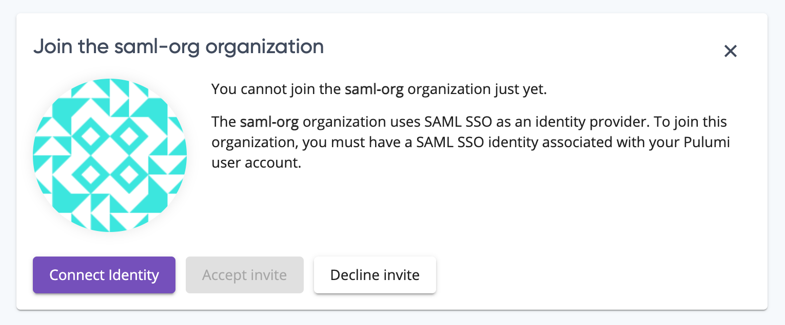

We regularly ship updates across the Pulumi ecosystem, with a release of the Pulumi CLI every two weeks, frequent releases of our cloud providers in the [Registry](), and regular updates to the Pulumi Service. You can read about most of those changes in the the `CHANGELOG.md` files in each open source repository. To highlight some of the most exciting releases—including, for the first time, updates to the Pulumi Service—we're trying something new: a regular release notes post for Pulumi release news, features, and updates. If you find it useful, or have ideas on how we could improve it, let us know [on Twitter](https://twitter.com/pulumicorp) or in the [Pulumi Community Slack](https://slack.pulumi.com)!

In this update:

- New and updated cloud providers
  - [Pulumi supports Amazon ECS Anywhere and Amazon App Runner]()
  - [Pulumi supports Sumo Logic]()
  - [100 new resources in the Azure Native provider]()
- Pulumi engine and core technologies
  - [Input parameters can now be marked as secret]()
  - [Pulumi Packages: schema documentation and enhancements]()
- Pulumi Service and Pulumi.com
  - [Easier acceptance of invites to organizations]()
  - [Self-Hosted Pulumi Service now supports Azure Services and Minio storage]()

<!--more-->

## New and updated cloud providers

### Pulumi supports Amazon ECS Anywhere and Amazon App Runner

Earlier this month, Amazon announced [ECS Anywhere](https://aws.amazon.com/blogs/containers/introducing-amazon-ecs-anywhere/), an extension of Amazon Elastic Container Service that allows you to deploy containers to almost any server, and [AWS App Runner](https://aws.amazon.com/blogs/containers/introducing-aws-app-runner/), a new fully-managed container application service. Pulumi had full same-day support for both new services.

Learn how to get started with [ECS Anywhere]() and [App Runner]().

### Pulumi supports Sumo Logic

The new Sumo Logic provider for Pulumi allows you to manage Sumo Logic's big data and analytics services with Pulumi infrastructure-as-code.



{}

```javascript
const sumologic = require("@pulumi/sumologic")

const folder = new sumologic.Folder("folder", {
  description: "A test folder",
  parentId: "<personal folder id>",
});
```

{}
{}

```typescript
import * as sumologic from "@pulumi/sumologic";

const folder = new sumologic.Folder("folder", {
  description: "A test folder",
  parentId: "<personal folder id>",
});

```

{}
{}

```python
import pulumi_sumologic as sumologic

folder = sumologic.Folder("folder",
                          description="A test folder",
                          parent_id="<personal folder id>")
```

{}
{}

```go
import (
	"github.com/pulumi/pulumi/sdk/v3/go/pulumi"
	"github.com/pulumi/pulumi-sumologic/sdk/go/sumologic"
)

func main() {
	pulumi.Run(func(ctx *pulumi.Context) error {
		_, err := sumologic.NewFolder(ctx, "folder", &sumologic.FolderArgs{
			Description: pulumi.String("A test folder"),
            ParentId:    pulumi.String("<personal folder id>"),
		})
		if err != nil {
			return err
		}

		return nil
	})
}
```

{}
{}

```csharp
using System.Collections.Generic;
using System.Threading.Tasks;
using Pulumi;
using Pulumi.SumoLogic;

class Program
{
    static Task Main() =>
        Deployment.Run(() => {
            var folder = new SumoLogic.Folder("folder", new SumoLogic.FolderArgs
            {
                Description = "A test folder",
                 ParentId = "<personal folder id>",
            });
        });
}
```

{}



Get started in the [SumoLogic provider docs]().

### 100 new resources in the Azure Native provider

We shipped 3 new versions of the Azure Native provider (1.10.0, 1.9.0, and 1.8.0) that collectively added 100 new resources that you can manage with the Azure Native provider. These new provider versions give you full access to the new resources and services announced at [Microsoft Build 2021](https://news.microsoft.com/build-2021-book-of-news/), including new analytics, machine learning, and security capabilities across the Azure platform.

[See the full list](https://github.com/pulumi/pulumi-azure-native/blob/v1.10.0/CHANGELOG.md)

## Pulumi CLI and core technologies

In this milestone, we shipped Pulumi versions [3.3.0](https://github.com/pulumi/pulumi/releases/tag/v3.3.0), [3.3.1](https://github.com/pulumi/pulumi/releases/tag/v3.3.1), and [3.4.0](https://github.com/pulumi/pulumi/releases/tag/v3.4.0). The full list of changes in each version is available in the linked changelog; read on to learn about some of the biggest changes.

### Input parameters can now be marked as secret

It's now possible to mark any input parameter as a secret, which can be helpful when you need to pass in secret data, like when creating a Kubernetes Secret resource. Pulumi will protect these input parameters by encrypting them in the state and obfuscating them in outputs.

Learn more at [pulumi/pulumi#7062](https://github.com/pulumi/pulumi/issues/7062)

### Pulumi Packages: schema documentation and enhancements

[Pulumi Packages](), released at [PulumiUP earlier this year]() enable cloud infrastructure resource provisioning to be defined once, in your language of choice, and made available to users in all Pulumi languages. A key part of Pulumi Packages is the Pulumi schema that defines each resource in a package.  We have now introduced new [documentation for Pulumi Package Schema]().

We've also updated the Pulumi Package schema to make it more powerful. For more complex Pulumi Package scenarios, you may want to be able to reference the types in one Pulumi Package from another Pulumi Package. Previously, this was only possible if you authored your Pulumi Package in Go; now, it's possible in all Pulumi Languages.

Learn more at [pulumi/pulumi#6777](https://github.com/pulumi/pulumi/issues/6777)

## Pulumi Service and Pulumi.com

### Easier acceptance of invites to organizations

Previously, you could accept an invitation to join an organization even if you didn't have the required identity provider (say, a SAML identity) associated with your Pulumi account. This left you unable to access the organization to which you just accepted an invite. Now, the Pulumi Service will prompt you to connect the required identity provider to your existing Pulumi account so you can successfully accept the invitation and join the organization.



### Self-Hosted Pulumi Service now supports Azure services and Minio storage

The [Self-Hosted Pulumi Service](), which brings the full power of the Pulumi Service into your own environment, can now be deployed in a few new ways:

- In Microsoft Azure, using [Azure Blob Storage](https://azure.microsoft.com/en-us/services/storage/blobs/) for state storage and [Azure Key Vault](https://azure.microsoft.com/en-us/services/key-vault/) for secret storage
- Using [Minio](https://min.io/) for state storage

Learn more about how to configure these options in the [Pulumi API setup guide]().
