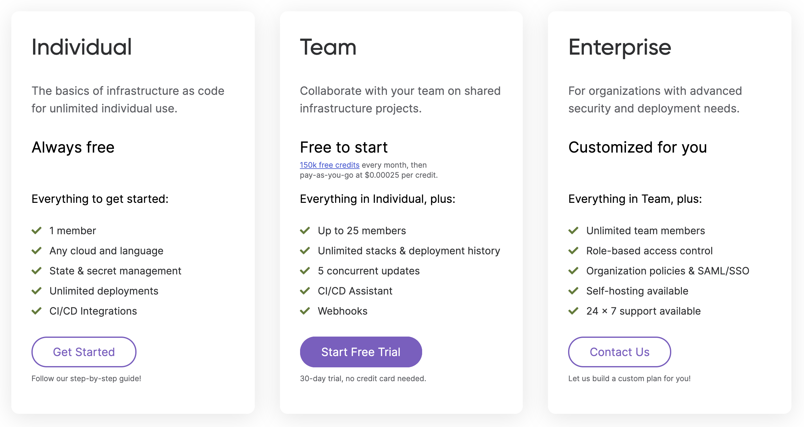

In this update:

- New and updated cloud providers
  - [Pulumi supports Confluent Cloud]()
  - [GitHub Actions guide in all languages]()
  - [Kubernetes: new `skipAwait` option]()
  - [10 new resources in the Azure Native provider]()
  - [Google Native provider adds support for enums and more]()
- Pulumi CLI and core technologies
  - [New `replaceOnChanges` resource option]()
  - [`pulumi watch` now supports a `--path` option]()
  - [Improved Python performance]()
- Pulumi Service and Pulumi.com
  - [New usage-based pricing for your whole team]()

<!--more-->

## New and updated cloud providers

### Pulumi supports Confluent Cloud

The new Confluent Cloud provider for Pulumi allows you to manage cloud-native Apache Kafka services with Pulumi infrastructure-as-code.



{}

```javascript
const ccloud = require("@pulumi/confluent")

const env = new ccloud.ConfluentEnvironment("ts-environment");
```

{}
{}

```typescript
import * as confluent from "@pulumi/confluent";

const env = new ccloud.ConfluentEnvironment("ts-environment");
```

{}
{}

```python
import pulumi_confluent as confluent

environment = ccloud.ConfluentEnvironment("py-env")
```

{}
{}

```go
package main

import (
  "github.com/pulumi/pulumi-confluent/sdk/go/confluent"
  "github.com/pulumi/pulumi/sdk/v3/go/pulumi"
)

func main() {
  pulumi.Run(func(ctx *pulumi.Context) error {

    env, err := confluent.NewConfluentEnvironment(ctx, "py-env", nil)
    if err != nil {
      return err
    }

    return nil
  })
}

```

{}
{}

```csharp
using System.Collections.Generic;
using System.Threading.Tasks;
using Pulumi;
using Pulumi.Confluent;

class Program
{
    static Task Main() =>
        Deployment.Run(() => {
            var environment = new CCloud.ConfluentEnvironment("csharp-env");
        });
}
```

{}



Get started in the [Confluent Cloud provider docs]().

### GitHub Actions guide in all languages

Previously, the GitHub Actions user guide only provided documentation for Node.js projects. We've now updated it to include all Pulumi languages.



{}

```yaml
name: Pulumi
on:
  - pull_request
jobs:
  preview:
    name: Preview
    runs-on: ubuntu-latest
    steps:
      - uses: actions/checkout@v2
      - uses: actions/setup-node@v2
        with:
          node-version: 14.x
      - name: Configure AWS Credentials
        uses: aws-actions/configure-aws-credentials@v1
        with:
          aws-access-key-id: ${{ secrets.AWS_ACCESS_KEY_ID }}
          aws-region: ${{ secrets.AWS_REGION }}
          aws-secret-access-key: ${{ secrets.AWS_SECRET_ACCESS_KEY }}
      - run: npm install
      - uses: pulumi/actions@v3
        with:
          command: preview
          stack-name: dev
        env:
          PULUMI_ACCESS_TOKEN: ${{ secrets.PULUMI_ACCESS_TOKEN }}
```

{}
{}

```yaml
name: Pulumi
on:
  - pull_request
jobs:
  preview:
    name: Preview
    runs-on: ubuntu-latest
    steps:
      - uses: actions/checkout@v2
      - uses: actions/setup-python@v2
        with:
          python-version: 3.6
      - name: Configure AWS Credentials
        uses: aws-actions/configure-aws-credentials@v1
        with:
          aws-access-key-id: ${{ secrets.AWS_ACCESS_KEY_ID }}
          aws-region: ${{ secrets.AWS_REGION }}
          aws-secret-access-key: ${{ secrets.AWS_SECRET_ACCESS_KEY }}
      - run: pip install -r requirements.txt
      - uses: pulumi/actions@v3
        with:
          command: preview
          stack-name: dev
        env:
          PULUMI_ACCESS_TOKEN: ${{ secrets.PULUMI_ACCESS_TOKEN }}
```

{}
{}

```yaml
name: Pulumi
on:
  - pull_request
jobs:
  preview:
    name: Preview
    runs-on: ubuntu-latest
    steps:
      - uses: actions/checkout@v2
      - uses: actions/setup-go@v1
        with:
          go-version: 1.17.x
      - name: Configure AWS Credentials
        uses: aws-actions/configure-aws-credentials@v1
        with:
          aws-access-key-id: ${{ secrets.AWS_ACCESS_KEY_ID }}
          aws-region: ${{ secrets.AWS_REGION }}
          aws-secret-access-key: ${{ secrets.AWS_SECRET_ACCESS_KEY }}
      - run: go mod download
      - uses: pulumi/actions@v3
        with:
          command: preview
          stack-name: dev
        env:
          PULUMI_ACCESS_TOKEN: ${{ secrets.PULUMI_ACCESS_TOKEN }}
```

{}
{}

```yaml
name: Pulumi
on:
  - pull_request
jobs:
  preview:
    name: Preview
    runs-on: ubuntu-latest
    steps:
      - uses: actions/checkout@v2
      - uses: actions/setup-dotnet@v1
        with:
          dotnet-version: 3.1.x
      - name: Configure AWS Credentials
        uses: aws-actions/configure-aws-credentials@v1
        with:
          aws-access-key-id: ${{ secrets.AWS_ACCESS_KEY_ID }}
          aws-region: ${{ secrets.AWS_REGION }}
          aws-secret-access-key: ${{ secrets.AWS_SECRET_ACCESS_KEY }}
      - uses: pulumi/actions@v3
        with:
          command: preview
          stack-name: dev
        env:
          PULUMI_ACCESS_TOKEN: ${{ secrets.PULUMI_ACCESS_TOKEN }}
```

{}



Learn more in the [GitHub Actions User Guide]()

### Kubernetes: new `skipAwait` option

For some Kubernetes use cases, including Helm charts, you may want to be able to turn off all await logic, so that you can use Kubernetes via Pulumi in a way that feels more similar to the default Kubernetes API and `kubectl` experience. Previously, you could achieve this by marking individual entities with a custom annotation to skip the await logic. Now, you can use the new `skipAwait` option on Helm charts and YAML components to turn off the await logic for those charts/components and all of their child resources. Please note that `skipAwait` changes some default Pulumi behaviors: outputs are not populated and incorrect deployments aren't identified. However, in cases where you don't need the result of the chart/component, you can speed up deployments using `skipAwait`.

Learn more at [pulumi/pulumi-kubernetes#1421](https://github.com/pulumi/pulumi-kubernetes/issues/1421)

### 10 new resources in the Azure Native provider

We shipped 5 new versions of the Azure Native provider (1.11.0 through 1.15.0) that collectively added 10 new resources that you can manage with the Azure Native provider, including Azure Arc data services and Azure Event Grid resources.

[See the full list](https://github.com/pulumi/pulumi-azure-native/blob/master/CHANGELOG.md#1150-2020-07-01)

### Google Native provider adds support for enums and more

The preview of the Google Native provider continues to evolve. We shipped 2 new versions of the Google Native provider (0.3.0 and 0.4.0) that include:

- Refined, shorter resource names that are easier to type and easier to find
- Enum support for all properties exposed as enums in the underlying Google Discovery Documents

[See the full list of updates](https://github.com/pulumi/pulumi-google-native/blob/master/CHANGELOG.md#040-2021-06-16)

## Pulumi CLI and core technologies

In this milestone, we shipped Pulumi versions [3.5.1](https://github.com/pulumi/pulumi/releases/tag/v3.5.1) and [3.6.0](https://github.com/pulumi/pulumi/releases/tag/v3.6.0). The full list of changes in each version is available in the linked changelog; read on to learn about some of the biggest changes.

### New `replaceOnChanges` resource option

Sometimes, you may want to force the replacement of a resource even if the changes you've made to that resource don't indicate that they require a replacement. One example is Kubernetes `CustomResourceDefinition`s: many CRDs can't be updated in place due to forward-incompatibilities, so you may need to force a replacement. Previously, you could do this by changing the physical name of the resource, but there are cases where it is important to keep the physical name the same.

You can use the new `replaceOnChange` resource option to force resource replacement when the specified properties are changed. This can be combined with the existing `deleteBeforeReplace` resource option to force a resource to be deleted before replacement. For example, you can specify that an AWS S3 Bucket resource be replaced every time its index document changes:

```typescript
const bucket = new aws.s3.Bucket("my-bucket", {
    website: {
        indexDocument: "index2.html",
    },
}, { replaceOnChanges: ["website.indexDocument"] });
```

Learn more at [pulumi/pulumi#7226](https://github.com/pulumi/pulumi/pull/7226)

### `pulumi watch` now supports a `--path` option

Previously, the `pulumi watch` command always watched the entire Pulumi project directory (recursively). This caused duplicate updates for developers working in monorepos or developers with application code and infrastructure code in the same directory. Now, you can add a `--path` option to the `pulumi watch` command and specify the exact paths to watch.

```shell
pulumi watch --path path/to/pulumi/code/
```

Learn more at [pulumi/pulumi#6620](https://github.com/pulumi/pulumi/issues/6620)

### Improved Python performance

We've improved the performance of common Pulumi commands like `up` and `preview` for Python programs by removing unnecessary logging and version checks.

Learn more at [pulumi/pulumi#7291](https://github.com/pulumi/pulumi/issues/7291) and [pulumi/pulumi#7292](https://github.com/pulumi/pulumi/issues/7292)

## Pulumi Service and Pulumi.com

### New usage-based pricing for your whole team

We launched Pulumi Team Edition, a new way for teams to adopt and use Pulumi and the Pulumi Service to collaborate on building, managing, and deploying cloud infrastructure as code. Pulumi Team Edition is priced based on the number of cloud resources under management, with a generous free tier to ensure that teams can get up and running with Pulumi Team Edition at no cost.



Learn more in the [pricing announcement blog post]()
