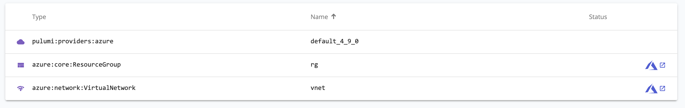

Summer is quickly flying by, and we've been hard at work with more new features and updates across the Pulumi ecosystem!

- New and updated cloud providers
  - [EKS Pulumi Package supports more options for managed node groups]()
  - [New resources in the Azure Native provider]()
- Pulumi CLI and core technologies
  - [Methods for Pulumi Component Packages]()
  - [`dependsOn` now works for Pulumi Component Packages, and more]()
  - [Aliases can now be used with providers]()
- Pulumi Service and Pulumi.com
  - [Azure Native resources now link to the Azure Portal]()

<!--more-->

## New and updated cloud providers

### EKS Pulumi Package supports more options for managed node groups

As the AWS team has improved the Elastic Kubernetes Service (EKS), they've added additional options, particularly for [managed node groups](https://aws.amazon.com/about-aws/whats-new/2021/05/amazon-eks-managed-node-groups-adds-support-kubernetes-node-taints/), that haven't been available in the EKS Pulumi Package. We've updated the package to add these missing options.

Learn more in these GitHub issues [1](https://github.com/pulumi/pulumi-eks/issues/612), [2](https://github.com/pulumi/pulumi-eks/issues/565), [3](https://github.com/pulumi/pulumi-eks/issues/583)

### New resources in the Azure Native provider

We shipped 2 new versions of the Azure Native provider (1.20.0 through 1.21.0) that collectively added 8 new resources that you can manage with the Azure Native provider, including core networking and IoT security resources.

[See the full list](https://github.com/pulumi/pulumi-azure-native/blob/master/CHANGELOG.md#1210-2021-08-12)

## Pulumi CLI and core technologies

In this milestone, we shipped Pulumi versions [3.9.0](https://github.com/pulumi/pulumi/releases/tag/v3.9.0) through [3.10.1](https://github.com/pulumi/pulumi/releases/tag/v3.10.1). The full list of changes in each version is available [in the changelog](https://github.com/pulumi/pulumi/releases); read on to learn about some of the biggest changes.

### Methods for Pulumi Component Packages

[Pulumi Components]() often have methods that provide additional functionality associated with an instance of a component. Previously, when [authoring a Pulumi Component Package](), you couldn't make a component's methods available in all languages. Now, with updates to the [Pulumi Packages schema]() and `Provider` interface, you can! We'll have a dedicated blog post out soon with more details on how to use methods in your Pulumi Component Package.

[Learn more in this GitHub issue](https://github.com/pulumi/pulumi/issues/7072)

### `dependsOn` now works for Pulumi Component Packages, and more

The [`dependsOn` option]() creates a list of explicit dependencies between resources, which can be useful when you need to explicity specify additional dependencies that Pulumi doesn’t know about but must still respect. Previously, `dependsOn` worked differently depending on the language your Pulumi code was written in or when referencing a component inside a Pulumi Component Package. Now, depending on a Pulumi Component Package's component will always wait on all of that component's children, regardless of language. Additionally, you can now pass `Input`s and `Output`s to `dependsOn`, which can be especially useful in Kubernetes and Helm workflows where you need to depend on the output of a resource created by a Helm chart.

To see this work in action, check out the [Staged App Rollout Gated by Prometheus Checks](https://github.com/pulumi/examples/tree/ca40203279f393c0c159dadcadc97c6007122997/kubernetes-ts-staged-rollout-with-prometheus) example, where we create a staged rollout (from 3-replica canary -> 10-replica staging) gated by confirming that the P90 response time reported by Prometheus is less than some amount. The relevant code is the last line of this snippet, which lets your Kubernetes deployment depend on a Prometheus resource:

```typescript
const p8sService = prometheus.getResource("v1/Service", "p8s-prometheus-server");
const p8sDeployment = prometheus.getResource(
    "extensions/v1beta1/Deployment",
    "p8s-prometheus-server",
);

const localPort = 9090;
const forwarderHandle = util.forwardPrometheusService(p8sService, p8sDeployment, {
    localPort,
});

// Canary ring. Replicate instrumented Pod 3 times.
const canary = new k8s.apps.v1beta1.Deployment(
    "canary-example-app",
    { spec: { replicas: 1, template: instrumentedPod } },
    { dependsOn: p8sDeployment },
);
```

[Learn more in this GitHub issue](https://github.com/pulumi/pulumi/issues/7542) and [this issue](https://github.com/pulumi/pulumi/issues/5642)

### Aliases can now be used with providers

Pulumi has historically enabled you to _alias_ resources, which can help with scenarios where you want to change a resource's name without causing a delete and replace of that resource. Now, you can also alias _providers_, which can make it easier to refactor stacks and code over time. In the example below, an AWS provider instance is created with the alias "newName":

```typescript
import * as aws from "@pulumi/aws";

const providerName = "newName";
const awsProvider = new aws.Provider(providerName, {
    region: "us-west-2",
}, { aliases: [{ name: "oldName" }]});

const bucket = new aws.s3.Bucket("my-bucket", {}, { provider: awsProvider });

export const bucketName = bucket.id;
```

[Learn more in this GitHub issue](https://github.com/pulumi/pulumi/issues/3979)

## Pulumi Service and Pulumi.com

### Azure Native resources now link to the Azure Portal

For popular cloud providers like Pulumi AWS and Pulumi Azure Classic, the Pulumi Service contains convenient links from the Resources tab directly to the resource's management page in the cloud provider console. Now, resources you manage using the Pulumi Azure Native Provider provide these convenient links to the Azure Portal.


