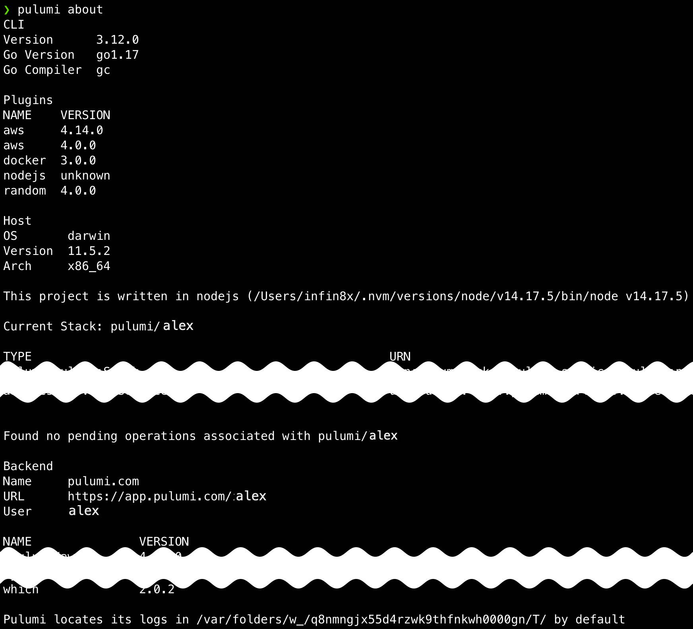
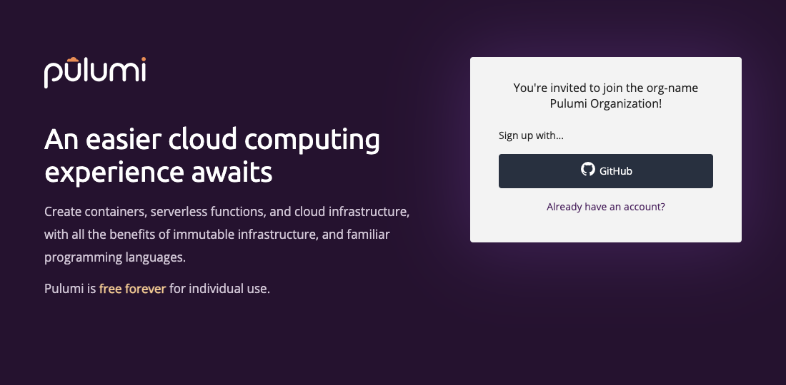

It's been a busy few weeks at Pulumi, including for some of our community contributors! Read on to see what's new.

- New and updated cloud providers
  - [New Helm Release resource for Kubernetes]()
  - [New providers: MinIO and Snowflake]()
  - [New resources in the Azure Native provider]()
- Pulumi CLI and core technologies
  - [New `pulumi about` command for easier troubleshooting]()
  - [`pulumi config set` hides secret values]()
  - [Dynamic providers in Python can now given a custom name]()
  - [Automation API in .NET can use plugin installation options `exact` and `server`]()
  - [Schema checker for Pulumi Packages]()
- Pulumi Service and Pulumi.com
  - [Organization invites now send you to the correct identity provider]()

<!--more-->

## New and updated cloud providers

### New Helm Release resource for Kubernetes

Pulumi's existing Helm `Chart` resource provides support for deploying Helm charts via templating the chart and deploying it as Pulumi resources.  This means that some features of Helm that are not availabe via Helm templating do not behave quite the same using the Pulumi Helm `Chart` resource as they do when deployed via the `helm` CLI itself - for example features like [Helm lifecycle hooks](https://helm.sh/docs/topics/charts_hooks/) and handling sub-charts and [dependencies](https://helm.sh/docs/topics/charts/#chart-dependencies). As Helm and its usage evolved over the years, Pulumi users using the `Chart` resource have noted that in many cases they would like a resource that provides the exact same behave as the `helm` CLI, but can be orchestrated as part of a Pulumi deployment.

The new [Helm `Release`]() resource provides Pulumi users more options to choose the right tool for their use-case. In contrast to the existing Helm `Chart` integration, which is implemented as a Component Resource that extracts the corresponding Kubernetes resources' manifests from the chart and installs them as if they were individually specified in the Pulumi user program, the new Helm `Release` resource uses the Helm SDK directly to perform the deployment, providing the exact same behavior as a corresponding `helm` CLI deployment.

You can get started with the Helm Release resource in versions [v3.7.0](https://github.com/pulumi/pulumi-kubernetes/releases/tag/v3.7.0) and higher of the Pulumi Kubernetes Provider and SDK in all Pulumi supported languages.For example, in the following snippet we  install Redis through a Helm Chart:



{}

```typescript
import * as random from "@pulumi/random";
import * as pulumi from "@pulumi/pulumi";
import * as k8s from "@pulumi/kubernetes";

// Create a password
const pass = new random.RandomPassword("pass", {length:10});
const redisPassword = pass.result;

const namespace = new k8s.core.v1.Namespace("redis-ns");

const release = new k8s.helm.v3.Release("redis-helm", {
    chart: "redis",
    repositoryOpts: {
        repo: "https://charts.bitnami.com/bitnami",
    },
    version: "13.0.0",
    namespace: namespace.metadata.name,
    // Values from Chart's parameters specified hierarchically,
    // see https://artifacthub.io/packages/helm/bitnami/redis/13.0.0#parameters for reference.
    values: {
        cluster: {
            enabled: true,
            slaveCount: 3,
        },
        metrics: {
            enabled: true,
            service: {
                annotations: {
                    "prometheus.io/port": "9127",
                }
            },
        },
        global: {
            redis: {
                password: redisPassword,
            }
        },
        rbac: {
            create: true,
        }
    },
    // By default Release resource will wait till all created resources
    // are available. Set this to true to skip waiting on resources being
    // available.
    skipAwait: false,
});


// We can lookup resources once the release is installed. The release's
// status field is set once the installation completes, so this, combined
// with `skipAwait: false` above, will wait to retrieve the Redis master
// ClusterIP till all resources in the Chart are available.
const srv = k8s.core.v1.Service.get("redis-master-svc",
    pulumi.interpolate`${release.status.namespace}/${release.status.name}-redis-master`);
export const redisMasterClusterIP = srv.spec.clusterIP;
```

{}

{}

```go
package main

import (
	"fmt"

	corev1 "github.com/pulumi/pulumi-kubernetes/sdk/v3/go/kubernetes/core/v1"
	"github.com/pulumi/pulumi-kubernetes/sdk/v3/go/kubernetes/helm/v3"
	"github.com/pulumi/pulumi-random/sdk/v4/go/random"
	"github.com/pulumi/pulumi/sdk/v3/go/pulumi"
)

func main() {
	pulumi.Run(func(ctx *pulumi.Context) error {

		namespace, err := corev1.NewNamespace(ctx, "redis-ns", nil)
		if err != nil {
			return err
		}

		redisPassword, err := random.NewRandomPassword(ctx, "pass", &random.RandomPasswordArgs{
			Length: pulumi.Int(10),
		})
		if err != nil {
			return err
		}

		rel, err := helm.NewRelease(ctx, "redis-helm", &helm.ReleaseArgs{
			Chart: pulumi.String("redis"),
			RepositoryOpts: helm.RepositoryOptsArgs{
				Repo: pulumi.String("https://charts.bitnami.com/bitnami"),
			},
			Version:   pulumi.String("13.0.0"),
			Namespace: namespace.Metadata.Name(),

            // Values from Chart's parameters specified hierarchically,
            // see https://artifacthub.io/packages/helm/bitnami/redis/13.0.0#parameters for reference.
			Values: pulumi.Map{
				"cluster": pulumi.Map{
					"enabled": pulumi.Bool(true),
				},
				"metrics": pulumi.Map{
					"enabled": pulumi.Bool(true),
					"service": pulumi.Map{
						"annotations": pulumi.StringMap{
							"prometheus.io/port": pulumi.String("9127"),
						},
						"type": pulumi.String("ClusterIP"),
					},
				},
				"global": pulumi.Map{
					"redis": pulumi.Map{
						"password": redisPassword.Result,
					},
				},
				"rbac": pulumi.BoolMap{
					"create": pulumi.Bool(true),
				},
			},

			// By default Release resource will wait till all created resources
			// are available. Set this to true to skip waiting on resources being
			// available.
			SkipAwait: pulumi.BoolPtr(false),
		})
		if err != nil {
			return err
		}

		// We can lookup resources once the release is installed. The release's
		// status field is set once the installation completes, so this, combined
		// with `skipAwait: pulumi.BoolPtr(false)` above, will wait to retrieve
        //  the Redis master ClusterIP till all resources in the Chart are available.
		svc := pulumi.All(rel.Status.Namespace(), rel.Status.Name()).
			ApplyT(func(r interface{}) (interface{}, error) {
				arr := r.([]interface{})
				namespace := arr[0].(*string)
				name := arr[1].(*string)
				svc, err := corev1.GetService(ctx,
					"redis-master-svc",
					pulumi.ID(fmt.Sprintf("%s/%s-redis-master", *namespace, *name)),
					nil,
				)
				if err != nil {
					return "", nil
				}
				return svc.Spec.ClusterIP(), nil
			})
		ctx.Export("redisMasterClusterIP", svc)

		return nil
	})
}

```

{}

{}

```python
import pulumi
from pulumi import Output
from pulumi_random.random_password import RandomPassword
from pulumi_kubernetes.core.v1 import Namespace, Service
from pulumi_kubernetes.helm.v3 import Release, ReleaseArgs, RepositoryOptsArgs

namespace = Namespace("redis-ns")

redis_password = RandomPassword("pass", length=10)

release_args = ReleaseArgs(
    chart="redis",
    repository_opts=RepositoryOptsArgs(
        repo="https://charts.bitnami.com/bitnami"
    ),
    version="13.0.0",
    namespace=namespace.metadata["name"],

    # Values from Chart's parameters specified hierarchically,
    # see https://artifacthub.io/packages/helm/bitnami/redis/13.0.0#parameters
    # for reference.
    values={
        "cluster": {
            "enabled": True,
            "slaveCount": 3,
        },
        "metrics": {
            "enabled": True,
            "service": {
                "annotations": {
                    "prometheus.io/port": "9127",
                }
            },
        },
        "global": {
            "redis": {
                "password": redis_password.result,
            }
        },
        "rbac": {
            "create": True,
        },
    },
    # By default Release resource will wait till all created resources
    # are available. Set this to true to skip waiting on resources being
    # available.
    skip_await=False)

release = Release("redis-helm", args=release_args)

# We can lookup resources once the release is installed. The release's
# status field is set once the installation completes, so this, combined
# with `skip_await=False` above, will wait to retrieve the Redis master
# ClusterIP till all resources in the Chart are available.
status = release.status
srv = Service.get("redis-master-svc",
                  Output.concat(status.namespace, "/", status.name, "-redis-master"))
pulumi.export("redisMasterClusterIP", srv.spec.cluster_ip)
```

{}

{}

```csharp
using Pulumi;
using System.Collections.Generic;
using Pulumi.Random;
using Pulumi.Kubernetes.Core.V1;
using Pulumi.Kubernetes.Types.Inputs.Helm.V3;
using Pulumi.Kubernetes.Helm.V3;

class MyStack : Stack
{
    public MyStack()
    {
        var ns = new Pulumi.Kubernetes.Core.V1.Namespace("redis-ns");
        var redisPassword = new RandomPassword("pass", new RandomPasswordArgs
        {
            Length = 10,
        });

        var releaseArgs = new ReleaseArgs
        {
            Chart = "redis",
            RepositoryOpts = new RepositoryOptsArgs
            {
                Repo = "https://charts.bitnami.com/bitnami",
            },
            Version = "13.0.0",
            Namespace = ns.Metadata.Apply(metadata => metadata.Name),
            // Values from Chart's parameters specified hierarchically,
            // see https://artifacthub.io/packages/helm/bitnami/redis/13.0.0#parameters
            // for reference.
            Values = new InputMap<object>
            {
                ["cluster"] = new Dictionary<string,object>
                {
                    ["enabled"] = true,
                    ["slaveCount"] = 3,
                },
                ["metrics"] = new Dictionary<string,object>
                {
                    ["enabled"] = true,
                    ["service"] = new Dictionary<string, object>
                    {
                        ["annotations"] = new Dictionary<string, string>
                        {
                            ["prometheus.io/port"] = "9127",
                        },
                    }
                },
                ["global"] = new Dictionary<string,object>
                {
                    ["redis"] = new Dictionary<string, object>
                    {
                        ["password"] = redisPassword.Result,
                    },
                },
                ["rbac"] = new Dictionary<string,object>
                {
                    ["create"] = true,
                }
            },
            // By default Release resource will wait till all created resources
            // are available. Set this to true to skip waiting on resources being
            // available.
            SkipAwait = false,
        };

        var release = new Release("redis-helm", releaseArgs);

        // We can lookup resources once the release is installed. The release's
        // status field is set once the installation completes, so this, combined
        // with `skip_await=False` above, will wait to retrieve the Redis master
        // ClusterIP till all resources in the Chart are available.
        var status = release.Status;
        var service = Service.Get("redist-master-svc", Output.All(status).Apply(
            s => $"{s[0].Namespace}/{s[0].Name}-redis-master"));
        this.RedisMasterClusterIP = service.Spec.Apply(spec => spec.ClusterIP);
    }

    [Output]
    public Output<string> RedisMasterClusterIP { get; set; }
}

```

{}



Learn more in the [announcement blog post]()

### New providers: MinIO and Snowflake

You can now use Pulumi's modern infrastructure-as-code solution to manage new resources! Our new provider for MinIO gives you access to the full range of high-performance, S3-compatible object storage offered by [MinIO](https://min.io). Likewise, our new provider for Snowflake lets you create and manage many of the data engineering, data lake, data warehouse, and other data resources in [Snowflake's](https://snowflake.com) data cloud.

Learn more in the [MinIO]() and [Snowflake]() provider docs

### New resources in the Azure Native provider

We shipped new versions of the Azure Native provider (1.22.0 through 1.28.0) that collectively added 15 new resources across services like SQL Server, Kusto, DocumentDB, and Power BI that you can now manage with the Azure Native provider.

[See the full list](https://github.com/pulumi/pulumi-azure-native/blob/master/CHANGELOG.md#1280-2021-09-13)

## Pulumi CLI and core technologies

In this milestone, we shipped Pulumi versions [3.10.2](https://github.com/pulumi/pulumi/releases/tag/v3.10.2) through [3.12.0](https://github.com/pulumi/pulumi/releases/tag/v3.12.0). The full list of changes in each version is available [in the changelog](https://github.com/pulumi/pulumi/releases); read on to learn about some of the biggest changes.

### New `pulumi about` command for easier troubleshooting

To make it easier to troubleshoot errors in the Pulumi CLI, we've added a new `pulumi about` command that collects useful information like the plugins you have installed, the OS and architecture you're running, the backend that's storing your state, your CLI version, and more.



[Learn more in this GitHub issue](https://github.com/pulumi/pulumi/issues/2715)

### `pulumi config set` hides secret values

Previously, setting a config value using `pulumi config set` would write the value to `stdout`, which could be undesirable if the config value was a secret. Now, config values that look like secrets will be hidden and the config key name will be written to `stdout` instead.

Thanks [@JasonWhall](https://github.com/JasonWhall) for contributing this change!

[Learn more in this GitHub PR](https://github.com/pulumi/pulumi/pull/7327)

### Dynamic providers in Python can now given a custom name

When building a dynamic provider, it can be useful to give the provider a name so that at runtime, you can identify which provider is actually making a change. Previously, it wasn't possible to do so in Python. Now, you can pass a `name` parameter to the dynamic provider's constructor:

```python
class CustomResource(
   Resource, module="custom-provider", name="CustomResource"
):
   ...
```

Thanks [@jancespivo](https://github.com/jancespivo) for contributing this change!

[Learn more in this GitHub issue](https://github.com/pulumi/pulumi/pull/7633)

### Automation API in .NET can use plugin installation options `exact` and `server`

When running Pulumi interactively, you can use the [`pulumi plugin install` command]() to manually install plugins required by your program, possibly from a server where you host your own plugins. You can now do the same task in the .NET Automation API:

```csharp
await workspace.InstallPluginAsync("myplugin", "v0.0.1", options: new PluginInstallOptions
{
    ServerUrl = "https://<custom-url>",
});
```

Thanks [@orionstudt](https://github.com/orionstudt) for contributing this change!

[Learn more in this GitHub PR](https://github.com/pulumi/pulumi/pull/7796)

### Schema checker for Pulumi Packages

When authoring a Pulumi Package, it can be helpful to validate that your [schema]() is correct. Now, you can validate your schema by running the [`pulumi schema check` command]().

[Learn more in this GitHub PR](https://github.com/pulumi/pulumi/pull/7865)

## Pulumi Service and Pulumi.com

### Organization invites now send you to the correct identity provider

Previously, when you invited a collaborator to your organization, that collaborator needed to know which identity provider (email, GitHub, GitLab, Bitbucket, or SAML SSO) that your organization uses in order to sign up correctly and get access to the organization. Now, any invites you send will direct your new collaborator to the correct identity provider automatically.


