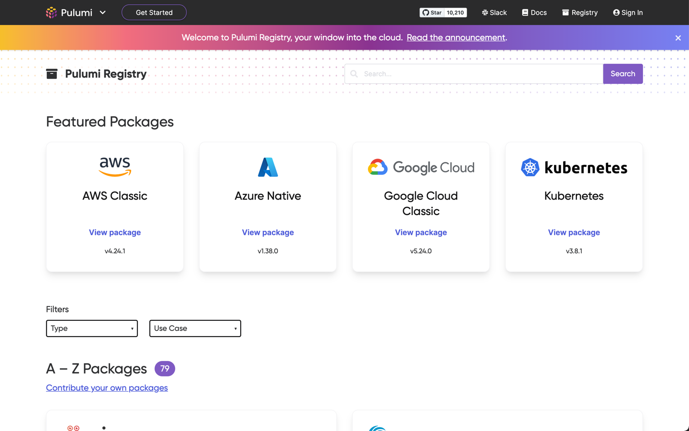

It's been an incredibly busy few weeks at Pulumi. We've met thousands of you at our second annual Cloud Engineering Summit, shipped major new releases like Pulumi Registry and Pulumi Kubernetes Operator 1.0 and continued to innovate on and improve the entire Pulumi Cloud Engineering Platform. [Get caught up on Cloud Engineering Summit]() to learn what's coming in cloud engineering, or read on for this month's news.

- [Cloud Engineering Summit]()
- Pulumi Registry, Pulumi Packages, & integrations
  - [Pulumi Registry: your window to the cloud]()
  - [Pulumi Kubernetes Operator 1.0]()
  - [New resources in the Azure Native provider]()
- Pulumi CLI and core technologies
  - [Resource methods for Pulumi Packages]()
  - [Automation API: delete, unprotect state in .NET]()
- Pulumi Service & Pulumi.com
  - [Automated audit log export]()

<!--more-->

## Cloud Engineering Summit

On October 20th, thousands of you joined us for our second annual Cloud Engineering Summit. We heard from industry leaders like Pulumi CEO Joe Duffy, Google's Kelsey Hightower, AWS' Emily Freeman, Microsoft's Adora Nwodo, and many more on topics from [modern reference architectures for Kubernetes]() to [migrating a monolith to cloud-native](). You can watch these and all Cloud Engineering Summit sessions on our website–make sure to catch any sessions you missed!

[Watch Cloud Engineering Summit sessions on-demand]()



## Pulumi Registry, Pulumi Packages, & integrations

### Pulumi Registry: your window to the cloud

As the Pulumi community has grown, we’ve [heard from many of you](https://github.com/pulumi/pulumi/issues/3297) that you needed a central hub where you could find all the cloud resources you can build with Pulumi. [Pulumi Registry]() is that place: a searchable collection of [Pulumi Packages]() published by Pulumi and our partners. With Pulumi Registry, you can easily find the package with the resources you need, install that package directly into your project, and start building. You can choose from Providers that give you full access to everything a cloud provider has to offer, or choose a Component that gets you started quickly with best practices and sensible defaults baked in.



[Visit Pulumi Registry]() or [read the announcement]().

### New Pulumi Components for AWS, Azure, and popular Helm charts

As part of the launch of Pulumi Registry, we've also created new Pulumi Components that can help you get started quickly with common cloud infrastructure, including:

- AWS services like API Gateway, VPC, Redshift, and Aurora
- Azure Container Registry
- Popular Helm charts including cert-manager, CoreDNS, and NGINX

Visit [Visit Pulumi Registry]() and filter to Components to get started.

### Pulumi Kubernetes Operator 1.0

The Pulumi Kubernetes Operator defines a Kubernetes Custom Resource called `pulumi.com/v1/Stack`, which represents a Pulumi [stack](). Using the Operator, you can specify the desired state of your cloud infrastructure using resources managed directly in your Kubernetes cluster, which trigger creation, update and deletion of the detailed cloud infrastructure you need. Get started with the [1.0 release](https://github.com/pulumi/pulumi-kubernetes-operator/releases/tag/v1.0.0) of the Pulumi Kubernetes Operator today!

This example Kubernetes resource uses the Pulumi Kubernetes Operator to deploy a Pulumi program which provisions cloud infrastructure to manage NGINX provided in the target Git repo and commit, and future updates to the commit or config settings will deploy updates to the infrastructure:

```yaml
apiVersion: pulumi.com/v1
kind: Stack
metadata:
  name: nginx-k8s-stack-production
spec:
  stack: acmecorp/nginx/production
  projectRepo: https://github.com/acmecorp/pulumi-nginx
  commit: 2b0889718d3e63feeb6079ccd5e4488d8601e353
```

[Read the 1.0 announcement for more info]()

### New resources in the AWS Native provider

We shipped a new version of the AWS Native provider (0.2.0) that added [19 new resources](https://github.com/pulumi/pulumi-aws-native/compare/v0.1.0...v0.2.0#diff-1ac835cc58d7899e9299c7570151c7b0d7732c78f1bd53fe25fd4189b72e168e) giving you access to resources like `AWS::ApiGateway::Authorizer`, `AWS::IAM::Role`, and `AWS::Lightsail::Instance`.

### New resources in the Azure Native provider

We shipped new versions of the Azure Native provider (1.35.0 through 1.42.0) that collectively added [31 new resources](https://github.com/pulumi/pulumi-azure-native/blob/master/CHANGELOG.md#1420-2021-10-25) giving you access to new Azure offerings like vSphere integration, Chaos engineering, and more.

## Pulumi CLI and core technologies

In this milestone, we shipped Pulumi versions [3.14.0](https://github.com/pulumi/pulumi/releases/tag/v3.14.0) through [3.16.0](https://github.com/pulumi/pulumi/releases/tag/v3.16.0). The full list of changes in each version is available in the [changelog](https://github.com/pulumi/pulumi/blob/master/CHANGELOG.md); read on to learn about some of the biggest changes.

### Resource methods for Pulumi Packages

When authoring component resources you want to publish in a [Pulumi Package](), it’s often useful to provide additional functionality through methods on the component. Resource methods are similar to functions, but instead of being exposed as top-level functions in a module, methods are exposed as methods on a resource class. This allows for a more object-oriented approach to exposing functionality: operations performed by a resource (that potentially use the resource’s state) can now be exposed as methods on the resource. Resource methods can be implemented once, in your language of choice, and made available to users in all Pulumi languages.

For example, the `Cluster` component in the [`eks`]() package has a [`getKubeconfig`](https://github.com/pulumi/pulumi-eks/blob/700d73e961976e58762cb9c723ad2fa838052f46/nodejs/eks/cluster.ts#L1482) method that can be used to generate a kubeconfig for authentication with the cluster that does not use the default AWS credential provider chain, but is instead scoped based on the passed-in arguments. With the new support for resource methods for Pulumi Packages, we can make this method available to all the Pulumi languages, which is exactly what we've done in pulumi-eks [v0.34.0](https://github.com/pulumi/pulumi-eks/releases/tag/v0.34.0).

Learn how to author your own methods in the [blog post]().

### Automation API: delete, unprotect state in .NET

In the Automation API in .NET, you can now use new `DeleteAsync`, `UnprotectAsync`, and `UnprotectAllAsync` methods to delete resources from a stack's state (like running `pulumi state delete`) or unprotect resources (like running `pulumi state unprotect`) so they can be deleted.

```csharp
await stack.State.DeleteAsync(resource.Urn);

await stack.State.UnprotectAsync(resource.Urn);
```

[Learn more in this GitHub PR](https://github.com/pulumi/pulumi/pull/8202)

## Pulumi Service & Pulumi.com

### Automated audit log export

Some larger companies manage their security risk using a Security Information and Event Management (SIEM) system to collect security information from all of the systems and SaaS products they use. To make it easier for you to bring Pulumi audit log events into such systems, you can now enable [automated export]() of your audit logs to an Amazon S3 bucket, which many SIEMs can read from automatically.

[Learn more in the docs]().
