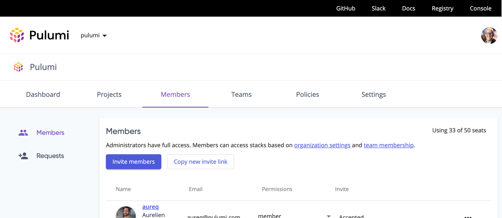

With the holiday season approaching, we've been focused on tidying up our products, delivering asks we've heard from you in GitHub and at conferences, and looking ahead to 2022! Read on to learn about what's new this release:

- Pulumi Registry, Pulumi Packages, & integrations
  - [Helm `Release` resource supports local charts]()
  - [New examples for the Kubernetes native provider]()
  - [New resources in the AWS Native provider]()
  - [New resources in the Azure Native provider]()
  - [Support for Kubernetes 1.23]()
- Pulumi CLI and core technologies
  - [Exclude protected resources from `pulumi destroy`]()
  - [Pulumi Package plugins can now be hosted on GitHub Releases]()
- Pulumi Service & Pulumi.com
  - [More ways to share invites to your organization]()
  - [Self-Hosted Pulumi Service can disable email sign-up and login]()

<!--more-->

## Pulumi Registry, Pulumi Packages, & integrations

### Helm `Release` resource supports local charts

When you're developing or using a Helm chart stored on your local machine, it can be helpful to use a Pulumi program to deploy and test it. Now, you can! The [`Release`]() resource's constructor now accepts paths to local Helm charts.

[Learn more in this GitHub issue](https://github.com/pulumi/pulumi-kubernetes/issues/1732)

### New examples for the Kubernetes native provider

We've added additional examples to our [native provider for Kubernetes]() to make it easier to get started with common resources. Jump into Pulumi Registry with the links below:

- [Deployment]()
- [StatefulSet]()
- [Job]()
- [Pod]()
- [Ingress]()
- [Service]() - shown below:



{}

```typescript
import * as pulumi from "@pulumi/pulumi";
import * as kubernetes from "@pulumi/kubernetes";

const my_service = new kubernetes.core.v1.Service("my_service", {
    spec: {
        selector: {
            app: "MyApp",
        },
        ports: [{
            protocol: "TCP",
            port: 80,
            targetPort: 9376,
        }],
    },
});
```

{}

{}

```python
import pulumi
import pulumi_kubernetes as kubernetes

my_service = kubernetes.core.v1.Service(
    "my_service",
    spec=kubernetes.core.v1.ServiceSpecArgs(
        selector={
            "app": "MyApp",
        },
        ports=[kubernetes.core.v1.ServicePortArgs(
            protocol="TCP",
            port=80,
            target_port=9376,
        )],
    ))
```

{}

{}

```csharp
using Pulumi;
using Kubernetes = Pulumi.Kubernetes;

class MyStack : Stack
{
    public MyStack()
    {
        var service = new Kubernetes.Core.V1.Service("my_service", new Kubernetes.Types.Inputs.Core.V1.ServiceArgs
        {
            Spec = new Kubernetes.Types.Inputs.Core.V1.ServiceSpecArgs
            {
                Selector = 
                {
                    { "app", "MyApp" },
                },
                Ports = 
                {
                    new Kubernetes.Types.Inputs.Core.V1.ServicePortArgs
                    {
                        Protocol = "TCP",
                        Port = 80,
                        TargetPort = 9376,
                    },
                },
            },
        });
    }
}
```

{}

{}

```go
package main

import (
	corev1 "github.com/pulumi/pulumi-kubernetes/sdk/v3/go/kubernetes/core/v1"
	metav1 "github.com/pulumi/pulumi-kubernetes/sdk/v3/go/kubernetes/meta/v1"
	"github.com/pulumi/pulumi/sdk/v3/go/pulumi"
)

func main() {
	pulumi.Run(func(ctx *pulumi.Context) error {
		_, err := corev1.NewService(ctx, "my_service", &corev1.ServiceArgs{
			Spec: &corev1.ServiceSpecArgs{
				Selector: pulumi.StringMap{
					"app": pulumi.String("MyApp"),
				},
				Ports: corev1.ServicePortArray{
					&corev1.ServicePortArgs{
						Protocol:   pulumi.String("TCP"),
						Port:       pulumi.Int(80),
						TargetPort: pulumi.Int(9376),
					},
				},
			},
		})
		if err != nil {
			return err
		}
		return nil
	})
}
```

{}

{}

### New resources in the AWS Native provider

We shipped new versions of the AWS Native provider (0.5.0 through 0.8.0) that added [30 new resources](https://github.com/pulumi/pulumi-aws-native/compare/v0.5.0...v0.8.0#diff-1ac835cc58d7899e9299c7570151c7b0d7732c78f1bd53fe25fd4189b72e168e) giving you access to new resources in feature areas like EC2, Evidently, Lex, and more.

### New resources in the Azure Native provider

We shipped new versions of the Azure Native provider (1.46.0 through 1.49.0) that collectively added [8 new resources](https://github.com/pulumi/pulumi-azure-native/blob/master/CHANGELOG.md#1450-2021-11-05).

{}
Azure Native version 1.47.0 fixes a security issue that could result in your Azure credentials being stored in your state in cleartext. Read the [description of the issue](https://github.com/pulumi/pulumi-azure-native/blob/master/CHANGELOG.md#1470-2021-11-19) to see if you're affected and how to remediate any cleartext secrets.

As a precaution, we recommend updating to the latest version of the Azure Native provider.
{}

### Support for Kubernetes 1.23

The Pulumi [Kubernetes native provider]() now supports the latest version of Kubernetes that was released on December 7th: version 1.23. See the [Kubernetes v1.23.0 changelog](https://github.com/kubernetes/kubernetes/blob/master/CHANGELOG/CHANGELOG-1.23.md) to learn about the new Kubernetes features and updates you can use via our Kubernetes native provider.

## Pulumi CLI and core technologies

In this milestone, we shipped Pulumi versions [3.17.1](https://github.com/pulumi/pulumi/releases/tag/v3.17.1) through [3.19.0](https://github.com/pulumi/pulumi/releases/tag/v3.19.0). The full list of changes in each version is available in the [changelog](https://github.com/pulumi/pulumi/blob/master/CHANGELOG.md); read on to learn about some of the biggest changes.

### Exclude protected resources from `pulumi destroy`

In some scenarios, you may want to retain certain resources even while destroying the rest of the resources in a stack. Previously, you had to do this by providing a list of every resource URN that you _did_ want to destroy to the `pulumi destroy` command. Now, you can use the `--exclude-protected` argument to destroy all unprotected resources.

[Learn more in this GitHub issue](https://github.com/pulumi/pulumi/issues/6539)

### Pulumi Package plugins can now be hosted on GitHub Releases

To [publish a Pulumi Package](), you need to publish the resource provided plugin that contains the implementation of your package. Previously, you couldn't use popular release services like GitHub Releases because the `pluginDownloadUrl` format in the Pulumi Packages [schema]() was too strict.

Now, you can construct a `pluginDownloadUrl` with placeholders for `${VERSION}`, `${OS}`, and/or `${ARCH}` (case-sensitive) and these values will be interpolated whenever the Pulumi CLI attempts to download a Pulumi Package's plugin.

[Learn more in this GitHub PR](https://github.com/pulumi/pulumi/pull/8507)

## Pulumi Service & Pulumi.com

### More ways to share invites to your organization

Previously, inviting new members to your Pulumi Service organization meant entering each of their email addresses and letting Pulumi send them an invitation email. Now, you can click or tap the "Copy new invite link" button on the Members page and get a one-time use link that you can send to your invitee however you like.



### Self-Hosted Pulumi Service can disable email sign-up and login

Once you've connected your Self-Hosted Pulumi Service instance with a directory–a SAML directory like Azure Active Directory or a source control directory like GitHub, GitLab, or Bitbucket–you may want to remove the ability for your users to sign in without using that directory. Now, you can by setting the `PULUMI_DISABLE_EMAIL_LOGIN` and `PULUMI_DISABLE_EMAIL_SIGNUP` environment variables to true.

See the [self-hosted setup guide]() for more information.
