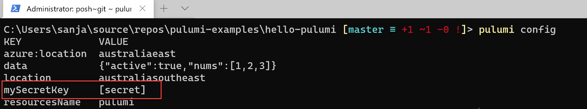
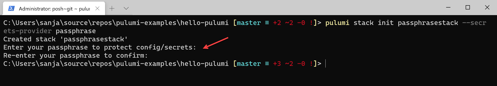
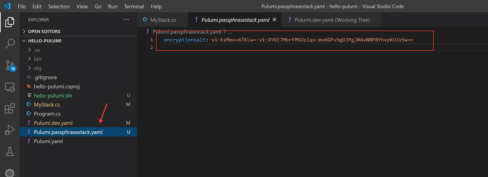
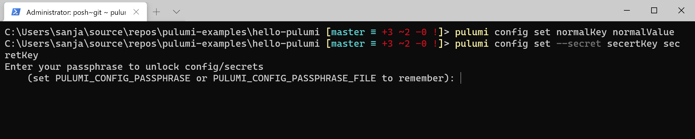
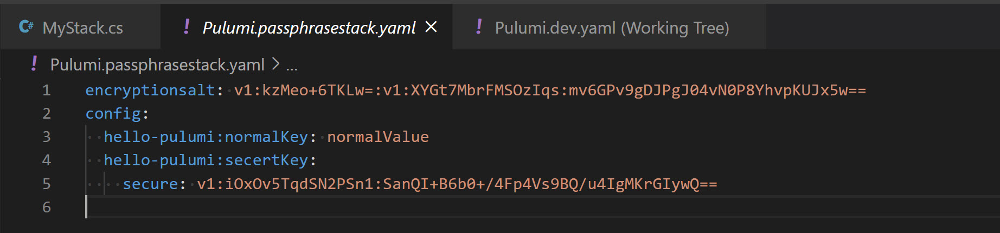
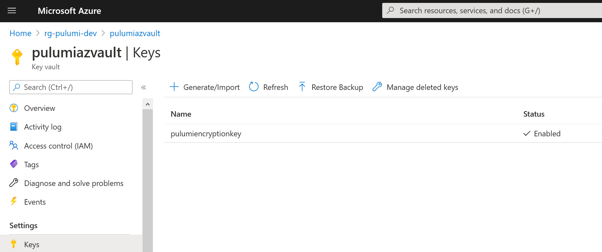

Pulumi community member [Sanjay Bhagia](https://www.sanjaybhagia.com/) explores using Pulumi to manage secrets.

<!--more-->

> We will build on the [Configuration Management](https://www.sanjaybhagia.com/pulumi-configuration-management) blog post that I wrote earlier so please have a look if you haven't done so already.

Having sensitive information such as Passwords, API Keys, Tokens, ConnectionStrings etc. is quite common for any application. However keeping them in your source code in plaintext is never a good idea, let alone checking it in your source control.

Pulumi's configuration system lets us add secrets to our configuration in a similar way we manage any other configuration. Pulumi offers multiple approaches to manage sensitive information and exposes a number of APIs and tools we can use to work with them seamlessly, so without further a do, let's explore how it all works.

## Handling Secrets

First off, let's see how can we set secrets in our configuration.

We use `pulumi config set` with `--secret` flag to set a secret

```sh
$ pulumi config set --secret mySecretKey mySecretValue
```

Check the config `pulumi config`

To retrieve the secrets programmatically, the use of `RequireSecrets` variant is recommended.

```csharp
Pulumi.Log.Info($"mySecretKey: {config.RequireSecret("mySecretKey")}");

```

see the value is masked


If we look at the `Pulumi.dev.yaml` file in VSCode, this is what we see:

```yaml
config:
  azure:location: australiaeast
  hello-pulumi:data:
    active: true
    nums:
    - 1
    - 2
    - 3
  hello-pulumi:location: australiasoutheast
  hello-pulumi:mySecretKey:
    secure: AAABAFybCK/w34qectPQHPWSoivUhG7uI5//y7Xqc/6Cczh3k3Yi35zvrk+U
  hello-pulumi:resourcesName: pulumi

```

Looking at this, what we see is that the configuration we set as a secret is not stored in plaintext, it is in fact encrypted. By default, Pulumi uses per-stack encryption key managed by the Pulumi Service to encrypt values.

However, this might not be desirable in situations where you want to manage the state by yourself by using any external storage like S3 bucket, Azure Blob storage. Or you simply don't want Pulumi to manage the keys and would prefer keeping that control and management with you. For such scenarios, Pulumi supports multiple providers for secrets management.

As of this writing, these are the supported providers:

- default
- passphrase
- awskms
- azurekeyvault
- gcpkms
- hashivault

We used `default` provider in our examples above. `passphrase` allows you to keep the encryption keys to yourself but still use Pulumi's backend service for state management OR you are self-managing the state storage (e.g., Azure Storage). The last option is where you are completely managing your own keys (bring your own key a.k.a BYOK)

### Using Passphrase

Let's create a new stack in our codebase that we used in the previous blogpost (grab the core [here](https://github.com/sanjaybhagia/pulumi-examples/tree/d035014aa852ff2d68a8958d5036037a5cf50ae4/hello-pulumi))

```shell
$ pulumi stack init passphrasestack --secrets-provider passphrase
```

or create a new project:

```shell
$ pulumi new azure-csharp --secrets-provider passphrase
```

It'll ask for the passphrase. This is the passphrase that Pulumi is going to use to encrypt the configuration system.


Looking at the project in VSCode, we can see a new file has been created.


Let's add two keys (one normal and one secret):

```sh
$ pulumi config set normalKey normalValue` `pulumi config set --secret secretKey secretValue
```



This is how our stack file looks like:


If you pay attention, the secure value in `Pulumi.passphrasestack.yaml` is different to what we had in `Pulumi.dev.yaml`

Notice, we need to enter the passphrase every time we are performing any operations. This can be avoided by setting `PULUMI_CONFIG_PASSPHRASE` in your environment variables (can be done on the local machine or in the CI system).

### Using Azure Key Vault for encryption

This would be a similar approach for any other cloud-based provider but we are looking at Azure Key Vault here. In order to use the Azure Key Vault for managing the encryption keys, the approach is same i.e., we set `--secret-provider` to Azure Key Vault via the CLI

```sh
$ pulumi stack init <name> --secrets-provider="<provider>://<provider-settings>"

e.g.,

```sh
$ pulumi stack init <name> --secrets-provider="azurekeyvault://<keyvaultname>.vault.azure.net/keys/<key name>"
```

Before we could do this, we need to create the Key Vault and a Key in the vault that we need.

### Create Azure Key Vault

```sh
$ az keyvault create --name pulumiazvault --resource-group rg-pulumi-dev --location australiasoutheast
```

### Create the Key in Vault

```sh
$ az keyvault key create --name pulumiencryptionkey --vault-name pulumiazvault
```

### Assign Access

When you create the vault and key from the CLI, a policy is created by default but it doesn't set 'encrypt' and 'decrypt' policy for us, so use this command to include that.

Extract Object Id of your account (you can pull this from Azure AD or run the command below to extract it. Use your account here.):

```sh
$ az ad user show --id <your account name>
```

Look up for ObjectId of your account:

```sh
$ az keyvault set-policy --name pulumiazvault --object-id <Object Id from above> --key-permissions encrypt decrypt get create delete list update import backup restore recover
```

_I prefer using Azure AD Application instead of any individual user account for such scenarios. In that case you will need the ObjectId of the application instead._

Now we have the key vault with a key that we will use for encryption along with the right access policy set.


### Set Environment Variables

You can set this if you want to use the credentials from the CLI (that you already have set up). `AZURE_KEYVAULT_AUTH_VIA_CLI=true`

Checkout [Azure Environment Authentication](https://docs.microsoft.com/en-us/azure/developer/go/azure-sdk-authorization#use-environment-based-authentication) if you wish to use other authentication mechanism such as Client Credentials, Username/Password etc.

_I prefer using Client Credentials since I'm using Azure AD Application approach._

### Create a new stack

I'm creating a new project for this scenario rather than using the previous one but you could very well create a new stack in the same project that uses Azure key Vault provider.

```sh
pulumi new azure-csharp --secrets-provider="azurekeyvault://pulumiazvault.vault.azure.net/keys/pulumiencryptionkey"
```

`Pulumi.dev.yaml` files looks like this after creating the new project. As you notice, we have the information about secrets provider and encryption key. From this point onward, Pulumi uses this information to encrypt the configuration system for us.

```yaml
secretsprovider: azurekeyvault://pulumiazvault.vault.azure.net/keys/pulumiencryptionkey
encryptedkey: N1JsSnFjWGpKUl9jY3U1SlRQd2J2WXd3TEw0XzQxeWExY2hTOEhtLTRKWkd3cTViblg3OWF4VHFTcDY4amo4RDc4RUxyT3poNC0tUEVSM0ppbUxfcUdiN1dOWm9Cb0VrNU5TODF6dUlMVEg3c2VVc1ItTVZfRjFBQWpmdGNiX29xYU1BdTN2d0NlMmtWUWFUWUc0NjNJMnh4eUNybzdJMzlXZHdXMVRpODh4TnZfdDM1R2pfdS1rS3VlQlh5cDI4OXZmMkxXaFFuNzNBckJaRU9vcnl5WmJPeUVXMHpJSzlIOEZXOG5WTnl6akFXYmxWYkkyYVB6c3BsUWpDOGw5OFRJNXFyV0JBSjAybHVkTE9UMGF6MllqSW4xbm9GVW1pODRsbVJZbEh6OThPLUdBemlhcWp4V1dKaE5vN0NDeEFZdFM2cXk3emozSDI0UHlGQllESTdR
config:
  azure:location: australiasoutheast
```

Rest of the things works the same as `default` or `passphrase` provider for encryption.

## Switching Encryption providers

You change the secrets provider of any of your stack anytime via this command.

```sh
pulumi stack change-secrets-provider "<secrets-provider>"
```

 It's pretty straightforward, once the provider is changed, Pulumi will use the new secrets provider to encrypt configuration and state files.

## Summary

Pulumi provides a robust mechanism for configuration management of your infrastructure. It provides support for handling secrets as well. You have the possibility to use external service providers for secrets management such as Azure Key Vault by using a familiar approach. The default option is secure and configurations and secrets are encrypted by the keys that Pulumi manages for us however we have the flexibility to take ownership of this and go to that extra mile for enhanced security or compliance reasons.

You can find the source code for this blog post [here](https://github.com/sanjaybhagia/pulumi-examples/tree/950d6b4889999be548a21cccb9945ad5f9cd20a0/pulumi-azvault).

***
_This article was originally posted at [https://www.sanjaybhagia.com/2021/01/26/pulumi-secrets-management](https://www.sanjaybhagia.com/2021/01/26/pulumi-secrets-management). Reposted here with permission._
