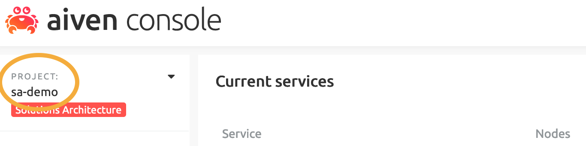
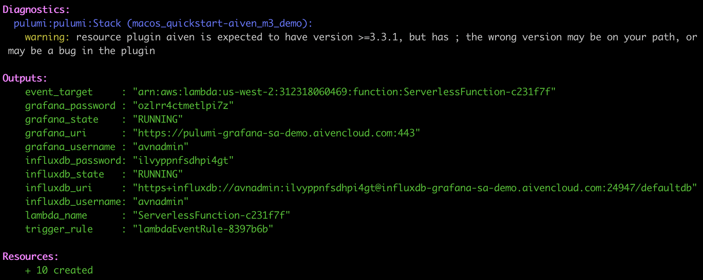
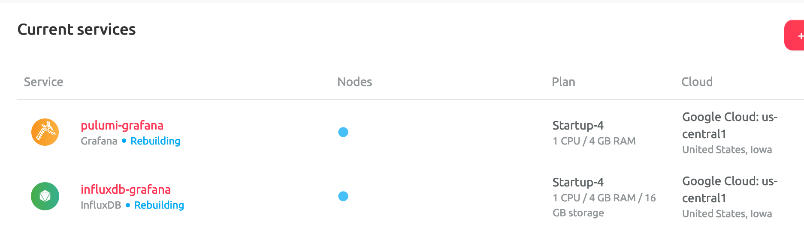
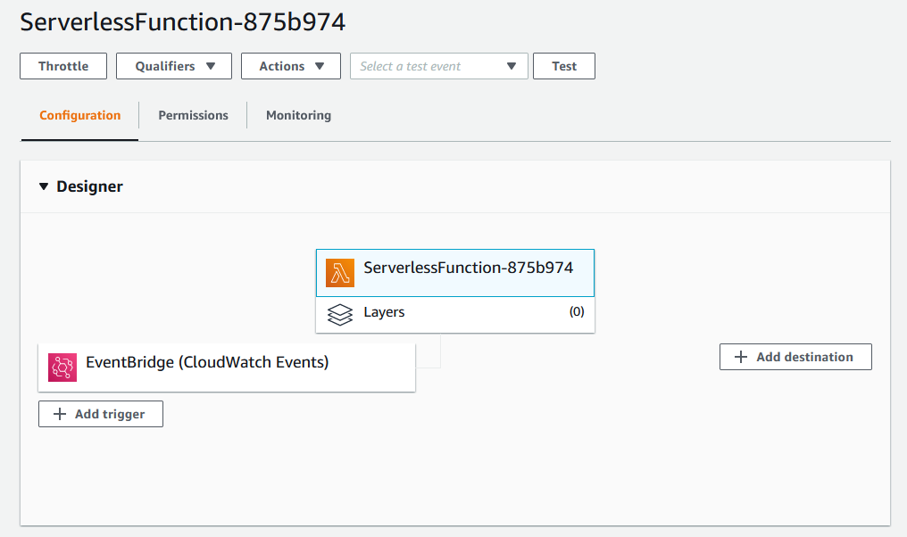
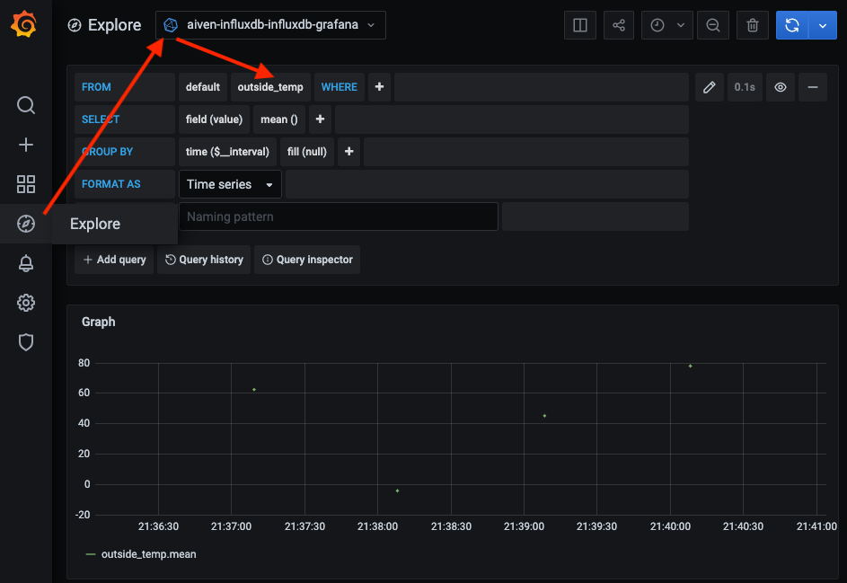
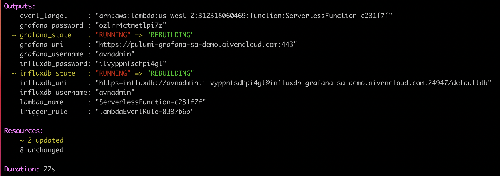
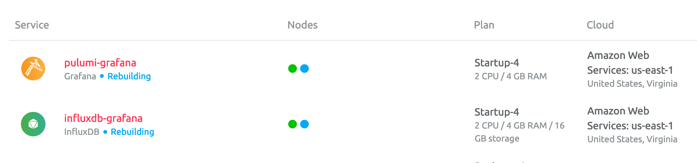

In this article, I’ll show how Pulumi can be used with Aiven’s services to create infrastructure that can be migrated from cloud to cloud with no downtime.

This tutorial will use Python, Pulumi, Grafana, and an AWS Lambda function to simulate recording temperature data in an InfluxDB database.

{}
Register for [Multicloud OSS Database Deployments With Zero Downtime - Pulumi and Aiven](https://www.pulumi.com/resources/multicloud-oss-database-deployments-with-aiven/) and learn how to build robust, multi-cloud applications using the language, open source database, and cloud of your choice.
{}

<!--more-->

## A quick introduction to Pulumi, Aiven, and InfluxDB

[Pulumi](https://www.pulumi.com/) enables you to create, deploy, and manage infrastructure on any cloud using your favorite languages. Aiven augments this language agnosticism by giving developers and operators the ability to be cloud-agnostic for a variety of popular databases such as MySQL, PostgreSQL, Cassandra, Redis, and more.

[Aiven](https://aiven.io/) offers a range of fully-managed open-source cloud database services. By using Aiven, you can accelerate application development on the open source data infrastructure and quickly deploy to public clouds (including AWS, GCP, and Azure).

[InfluxDB](https://github.com/influxdata/influxdb) is one of the most popular open source time-series databases for storing metrics and events. InfluxDB also has a number of client libraries in a [variety](https://docs.influxdata.com/influxdb/v1.8/tools/api_client_libraries/) of languages, including Python. Aiven makes this database available as a fully managed, single-tenant service in a variety of resource sizes.

I want to demonstrate how to migrate your services using Pulumi from one cloud to another with absolutely zero downtime in this tutorial. Data keeps streaming in the entire time, which you can visualize in [Grafana](https://grafana.com). This gives you an added security factor in fault situations and great flexibility in terms of migrating services for any reason.

## Demo outline

This demo will deploy the following infrastructure:

- Grafana instance on Aiven (hosted on GCP)
- InfluxDB database instance on Aiven (hosted on GCP)
- Service integration between InfluxDB and Grafana
- AWS Lambda Layer for the Python [requests](https://pypi.org/project/requests/) library
- AWS Lambda function and associated role
- AWS EventBridge trigger to execute the Lambda function every 60s

We will then migrate our services from a hybrid cloud (GCP + AWS) to a single cloud (AWS alone) with a single command and experience no downtime.

The lambda function code (located in the file lambda_code.py) is very basic. It only writes a randomly generated value (outside_temp) to InfluxDB using the InfluxDB Python Client library.

### Requirements

- Accounts for AWS, Pulumi & Aiven
- Python 3.7+
- AWS CLI 2.0+
- Pulumi 2.16+

### Cost estimate

This tutorial is about as cheap as they come; all you need is some time to perform all the steps.

- $0 for AWS Lambda charges
- [Free Pulumi trial account](https://app.pulumi.com/site/trial)
- Free credits for new Aiven users (less than $1/hr for existing customers)
- 20-minute time estimate

## Set up the environment

Your first step is to install Python. Follow the [directions on this page]() to install Python on your local system.

Next, get the Aiven examples by cloning this [repo](https://github.com/aiven/aiven-examples) to your local machine.

Run the setup script in the repo to activate the Python virtual environment and install the required dependencies:

```bash
$ cd aiven-examples/pulumi/influxdb_grafana_lambda
$ chmod +x setup.sh && ./setup.sh
```

### Set your Aiven API token using the Pulumi CLI:

```bash
$ pulumi config set aiven:apiToken XXXXXXXXXXXXXXXXXXXX --secret
```

{}
Note that you can [generate an API Token](https://console.aiven.io/profile/auth) on your profile page.
{}

### Install the Aiven and AWS plugins for Pulumi:

```bash
$ pulumi plugin install resource aws 3.22.0
$ pulumi plugin install resource aiven 3.3.2
```

- To find out the current version numbers, go to
[Pulumi changelog](https://github.com/pulumi/pulumi-aws/blob/master/CHANGELOG.md) or  [the Aiven changelog](https://github.com/pulumi/pulumi-aiven/blob/master/CHANGELOG.md).

Set your preferred cloud regions and Aiven project name (these defaults are used in the setup script):

```bash
$ pulumi config set aws:region <desired AWS region> Example: us-west-2
$ pulumi config set aiven_cloud_region <desired cloud - region> Example: google-us-central1
$ pulumi config set aiven_project <Aiven project> Example: sa-demo
```

Example: google-us-central1

```bash
$ pulumi config set aiven_project <Aiven project> Example: sa-demo
```

- Supported regions/clouds for each service are listed on the [pricing page]( https://aiven.io/pricing).
- Project names are on the top left corner of the Aiven console.



### Use Pulumi to create two services in Aiven

Now that you’re all set up, it’s time to create the services in the Aiven environment by using Pulumi. Issue the following commands to deploy the stack:

```bash
$ pulumi up
```

Select **Yes** to confirm the deployment.

After about 5 minutes or so, you should see that all of the resources have been created. The URLs and username/password combinations listed are needed to access the services. The `influxdb_uri` shown here is also added as an environment variable in the Lambda function so that the Python client can connect to InfluxDB.



### Aiven console

To see the new services, log into the [Aiven console](https://console.aiven.io/). The resources pulumi-influxdb and pulumi-grafana are displayed.



### AWS console

In the AWS console, the lambda function has also been created and will be executed by EventBridge every 60 seconds.



### Grafana

Now things get exciting: you can see the real-world (for certain values of real, in any case) data streaming in by opening Grafana.

Open up the `grafana_uri` (shown in the console output) and log in with the provided username and password.

Click on the Explore panel and search for the outside_temp value written by the lambda function every minute (triggered by EventBridge).



## Migrate your service from one region to another

Now that the services are running, it’s time to demonstrate the power of cloud services operating in multiple clouds: migrating to a different cloud without losing any incoming data and without any downtime. Let’s perform a zero-downtime migration between regions.

Start by changing your Aiven cloud region to a region in AWS (such as us-east-1). Then run the up command a second time.

```bash
$ pulumi config set aiven_cloud_region aws-us-east-1
$ pulumi up -y
```



The output shows that two resources have changed, and both Grafana and the InfluxDB service show as rebuilding. A quick check in the Aiven console shows that both services are indeed being migrated to AWS:



If we switch back to Grafana, you can see that outside_temp_value is still being written to InfluxDB even as we migrate to a different cloud!


## Clean up

After we do projects, we need to tidy up after ourselves. Use the following commands to tear down the provisioned resources:

```bash
pulumi destroy
pulumi stack rm <my-stack-name-here>
```

## Python code details

### Lambda function

The lambda function is quite simple: a JSON payload is created for our randomly generated temperature reading, which is then passed to the InfluxDBClient for writing to the provisioned InfluxDB database. The automatically assigned Aiven service URI is added as an environment variable to the lambda function by Pulumi.

```python
def lambda_handler(event, context):

   # Get the URL (including username and password) of the provisioned service instance
    uri = os.environ['SERVICE_URI']
    urllib3.disable_warnings(urllib3.exceptions.InsecureRequestWarning)
    client = InfluxDBClient.from_dsn(uri, timeout=1.0, ssl=True)

    # Write our sample data
    json_body = [
        {
            "measurement": "outside_temp",
            "fields": {"value": random.uniform(-30, 130)}
        }
    ]

    try:
        client.write_points(json_body)
        return True
    except:
        print('Failed to send metrics to influxdb')
        return False
```

### Lambda layer

Because this function depends on the influxdb-client-python library, a custom Lambda Layer is created and assigned to the function in the Pulumi script. Inside the layer, you will notice a python folder that allows Lambda to load the module automatically.

```text
lambda_layer
    └───python
        └───influxdb-client-python
```

### Aiven services

All of the Pulumi specific code resides in `__main__.py`. Even though creating Aiven services in Pulumi is very straightforward, I have created a wrapper function named create_service to make this even easier.

```python
grafana = create_service("pulumi-grafana", "startup-4", "grafana")
```

Simply pass in the [plan](https://aiven.io/pricing) name, service type (Grafana in this case)  and give your new service a name. The project name and cloud region are read in from the Pulumi config class.

Creating [service integrations](https://aiven.io/service-integrations) follows a similar paradigm:

```python
create_integration("pulumi-grafana-influxdb", "dashboard", influxdb, grafana)
```

When creating an integration, you have to specify the integration type and both the source and sink resource names. Here, we want to visualize our metrics in Grafana,which is an integration of type `dashboard`.

### Lambda function creation

Creating the Lambda function in AWS a tad more complicated, but this boils down to the methods below:

```python
lambda_func = create_lambda(influxdb)
create_lambda_trigger(lambda_func)
```

These methods initiate the following logic:

- Create an IAM role for the Lambda function
- Create the Lambda Layer, which includes our library dependencies
- Create the serverless function itself with environment variables, customer layer, and associated IAM policy
- Create the CloudWatch event rule to run the Lambda function every minute
- Sets the permissions of the function to allow it to be triggered by the CloudWatch event rule we just created
- Sets the EventBridge target to the Lambda function

## Wrapping up

In this article, I’ve demonstrated one way to deploy infrastructure as code in a manner that allows services to be migrated between clouds without any downtime. We also showed how InfluxDB could be used as an open source time-series backend for collecting temperature metrics.

This same approach can be utilized for any [Aiven’s](https://aiven.io/) services, including managed [Kafka](https://aiven.io/kafka) and [PostgreSQL](https://aiven.io/postgresql). Sign up for a [free 14-day trial](https://console.aiven.io/signup) and modify the lambda function to begin storing your own metrics data today.

> **About the Author**

> Trevor Kennedy is DataOps engineer who has spent 15+ years consulting in the public sector, telecommunications, financial services, insurance and energy industries. He has experience with all things data (data engineering, database development, data architecture, cloud migrations, and cloud architecture) on multiple platforms (on-premise, AWS, Azure and GCP) using both SQL, NoSQL & NewSQL technologies. Currently based in Austin, TX.
