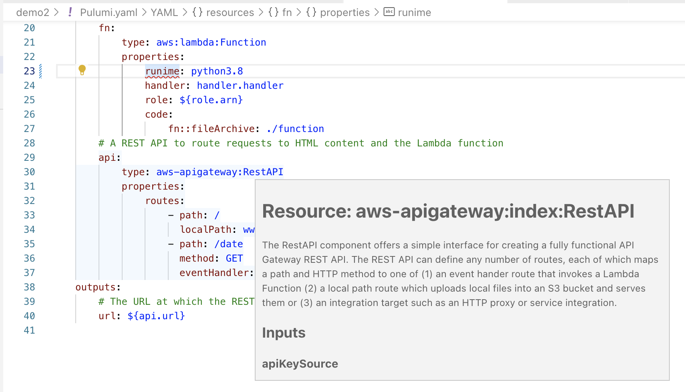
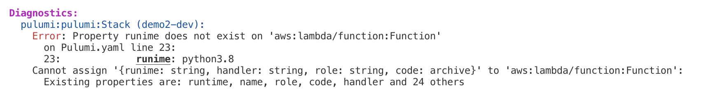

Earlier this year we launched support for [Pulumi YAML](https://www.pulumi.com/blog/pulumi-yaml/) as a new supported language for Pulumi’s Universal Infrastructure as Code platform.  Pulumi YAML offers a simple declarative interface to the full breadth of the Pulumi platform, ideal for smaller scale use cases and composition of higher level component building blocks.  And with support for `pulumi convert`, Pulumi YAML programs can be converted into a program in any other Pulumi language, ensuring you can easily scale up if and when needed.

Today, we’re excited to announce the **General Availability of Pulumi YAML** with the release of Pulumi YAML 1.0.

<!--more-->

GA includes many significant updates to the Pulumi YAML support introduced since the initial preview launch:

* __Pulumi YAML 1.0__:  The Pulumi YAML document format is now stable and will be kept backward compatible.
* __Full support for `pulumi convert`__:  Now supporting all Pulumi YAML features and all Pulumi languages.
* __IDE Support__:  IDE support for VS Code and Emacs, built on a Pulumi YAML LSP (Language Server Protocol) that can be used to light up improved tooling experience in any IDE.
* __Type Checking and Diagnostics__:  Significant improved error messages, and early validation of type-correctness, to provide a great developer experience.
* __Simplified function syntax__: A simpler function syntax to more easily invoke Pulumi Package Functions.
* __New `str` package__:  A new Pulumi Package with many string manipulation functions that can be used in Pulumi YAML and other Pulumi languages.
* __Pulumi Kubernetes Operator Inline `Program` Support__: Support for managing Pulumi cloud resources from directly within the Kubernetes resource model.

You can [get started with Pulumi YAML](https://www.pulumi.com/docs/languages-sdks/yaml/) today!

## Why Pulumi YAML?

Cloud teams love YAML and markup languages due to the simplicity and ease of getting started. At Pulumi we work with organizations every day that have reached the "late-stage YAML endgame" - hundreds of thousands of lines of markup that have been copy/pasted. Small config changes like upgrading cluster versions require hunting down dozens or hundreds of files. Cloud teams end up feeling hamstrung, spending all of their time in maintenance and unable to invest in infrastructure for new products.

That is why we introduced Pulumi YAML - a simple markup frontend with the power to grow up with your organization. Pulumi YAML is the only infrastructure markup language that supports `convert` - the ability to automatically translate into any Pulumi Programming language. When you feel that your infrastructure complexity is reaching the endgame, you can `pulumi convert` to translate your infrastructure in full fidelity into Java, Go, Python, Typescript, or C# in order to tame complexity, and use the power of programming languages to encapsulate, design, and componentize your infrastructure.

Adopting Pulumi up until the introduction of Pulumi YAML required operations teams to learn a programming language such as Python or Javascript. We are yet to see a team that is unsuccessful in this transition, but many have asked for a simple markup language that they could use as an on-ramp. This allows them to start with tools that they know, and incrementally adopt the Pulumi ecosystem of productivity tools including Automation API, Pulumi Deploy, Multi-Language Components, and Policy as Code.

Pulumi YAML is also a powerful interchange format for programmatic tools. Since YAML can be easily interpreted by machines, it is the perfect tool to support custom CLIs,  REST APIs and embedding within custom data formats.  For example, the Pulumi Kubernetes Operator now uses Pulumi YAML to embed Pulumi programs [within a `pulumi.com/v1/Program` CRD](#pulumi-kubernetes-operator-inline-program-support).

Critically, Pulumi YAML is designed to work with Pulumi’s [CrossCode](https://www.pulumi.com/crosscode/) technology. You can write a complex component in Go, TypeScript or Python, and expose a simple user interface in YAML - realizing both the power and encapsulation of programming languages with the simplicity of a familiar markup language.

## Pulumi YAML 1.0

Pulumi YAML offers a simple YAML document model for defining infrastructure using any of Pulumi’s more than 100 resource provider packages.

This includes 4 top level sections:

* __`resources`__:  A collection of resource definitions, each specifying a name, type, properties and options for a Pulumi resource definition.
* __`outputs`__:  A set of computed output values that will be available as Pulumi [stack outputs](https://www.pulumi.com/learn/building-with-pulumi/stack-outputs/).
* __`config`__:  The config that each instance of this project can set independent values for.
* __`variables`__:  Give names to complex values that might be needed in the program.

Here is an example Pulumi YAML document, from the [AWS Serverless Application template](https://www.pulumi.com/templates/serverless-application/aws/).

```yaml
name: serverlessapp
runtime: yaml
resources:
  role:
    type: aws:iam:Role
    properties:
      assumeRolePolicy:
        fn::toJSON:
          Version: 2012-10-17
          Statement:
            - Action: sts:AssumeRole
              Effect: Allow
              Principal:
                Service: lambda.amazonaws.com
      managedPolicyArns:
        - arn:aws:iam::aws:policy/service-role/AWSLambdaBasicExecutionRole
  fn:
    type: aws:lambda:Function
    properties:
      runtime: python3.9
      handler: handler.handler
      role: ${role.arn}
      code:
        fn::fileArchive: ./function
  api:
    type: aws-apigateway:RestAPI
    properties:
      routes:
      - path: /
        localPath: www
      - path: /date
        method: GET
        eventHandler: ${fn}
outputs:
  url: ${api.url}
```

Since preview, the `config` section has been introduced to replace the previous `configuration` section.  This change was made to enable a standard `config` section in `Pulumi.yaml` across all Pulumi languages, to enable the new [Project-level config](/blog/project-config-mvp).  This section has mostly the same set of features as the preview `configuration` section, but uses more consistent naming for the Pulumi programming model:

```yaml
config:
  numInstances:
    type: integer
    default: 3
  availabilityZones:
    type: array
    items:
      type: string
    default: [us-east-1-atl-1a, us-east-1-chi-1a]
```

## Full support for `pulumi convert`

An important goal for Pulumi YAML is to be a safe starting point for developing infrastructure, with the ability to smoothly scale up into any other Pulumi language if or when needed.  This ensures that using Pulumi YAML won’t limit how far you can scale up your infrastructure.  If you need features that Pulumi YAML doesn’t support (control flow, multiple files, component authoring, etc.), or if the complexity of your YAML grows beyond what you want to manage in YAML, just `pulumi convert` and keep going in another language.

Pulumi Convert now handles all Pulumi languages, and all features of Pulumi YAML.  For example, the original example program above can be converted to Python with:

```console
pulumi convert  --language python
```

This generates a Python program defining the exact same resources, along with all required dependencies.  A `pulumi up` on the new program will report no changes, and you can now continue evolving the cloud resources managed by the stack using the new language.

`pulumi convert` is also useful for creating examples in all Pulumi languages.  Authors of Pulumi Component Packages can write examples once in Pulumi YAML, and convert into other languages using `pulumi convert`.  This makes it possible to quickly support great documentation for all Pulumi languages when building and publishing a new component.

## IDE Support (Preview)

A critical value of using other Pulumi languages is the tight feedback loop developers get when working inside their IDE.  We wanted to bring as much of this benefit as possible to Pulumi YAML as well.

With the new Pulumi YAML LSP (Language Server Protocol), developers can install an extension in their favorite IDE which offers many important IDE features for Pulumi YAML programs.  Extensions for VS Code and Emacs are available now, and others will be released in the future.  These support the following features:

* __Error squiggles__:  Highlight invalid keywords and property names in Pulumi YAML documents.
* __Hover tips__:  Hover over types to see rich inline documentation.
* __Autocomplete__:  Get hints and autocomplete on property names.

You can see what error squiggles (for a simple type) and hover tips look like in VS Code in this example:



## Type Checking and Diagnostics

Good error messages make it significantly easier to quickly identify and fix issues in a Pulumi program.  Pulumi YAML now checks programs against the resource schema of the resources being created, and reports early errors with rich information about the location of the error and suggestions on potential fixes.

For example, the same typo from the screenshot above leads to this helpful diagnostic message:



## Simplified function syntax

Pulumi offers core support for functions defined in any Pulumi package, and Pulumi YAML programs can use these to be able to express everything available in the Pulumi package ecosystem.

It is now even easier to use these Pulumi functions via the `fn` intrinsics.  There are two classes of functions available in Pulumi YAML:

* __Built-in Functions__:  Functions like `fn::toJSON` and `fn::fromBase64` are built-in to Pulumi YAML, and enable common computations on values that come from configuration or other resource outputs.
* __Package Functions__:  Functions like `fn::azure-native:storage:listStorageAccountKeys` and `fn::oci:ObjectStorage:getNamespace` invoke a function from a Pulumi Package based on its package name, module and function name (`fn::<package-name>:<module-name>:<function-name>`).

## New `str` Package

The new [`str`] package in the Pulumi Registry offers a suite of string manipulation functions which can be used from Pulumi YAML, as well as in other Pulumi languages. Functions supported so far:

* __`str:replace`__: Replace occurrences of a substring with another substring.
* __`str:trimSuffix`__: Trim a suffix from a string.
* __`str:trimPrefix`__: Trim a prefix from a string.
* __`str:regexp:split`__: Split a string on a regex.
* __`str:regexp:replace`__: A regex based replace on a string.

These functions can all be invoked using the simple Package Functions syntax - for example, the following function call replaces `bar` with `buzz` in the given resource output:

```yaml
prop:
  fn::str:replace:
    string: ${res.out}
    old: bar
    new: buzz
```

## Pulumi Kubernetes Operator Inline `Program` Support

The Pulumi Kubernetes Operator recently added support for defining Pulumi resources directly inside Kubernetes YAML using a new [`pulumi.com/v1/Program` CRD](https://www.pulumi.com/blog/pulumi-kubernetes-new-2022/#define-pulumi-cloud-infrastructure-directly-in-the-kubernetes-resource-model).

This support builds uniquely on top of Pulumi YAML, to provide a natural way to describe a set of Pulumi resources inline inside Kubernetes YAML using the Pulumi YAML document format embedded within the `program` key of a `pulumi.com/v1/Program` resource.

This allows the Kubernetes resource model to be used to define and evolve any of the tens-of-thousands of cloud resources supported by the Pulumi package ecosystem, and with access to the full breadth of IaC capabilities that Pulumi offers.

```yaml
apiVersion: pulumi.com/v1
kind: Program
metadata:
  name: staticwebsite
program:
  resources:
    bucket:
      type: aws:s3:Bucket
      properties:
        website:
          indexDocument: index.html
    index.html:
      type: aws:s3:BucketObject
      properties:
        bucket: ${bucket.id}
        content: <h1>Hello, world!</h1>
        contentType: text/html
        acl: public-read
  outputs:
    url: http://${bucket.websiteEndpoint}
---
apiVersion: pulumi.com/v1
kind: Stack
metadata:
  name: staticwebsite
spec:
  stack: lukehoban/staticwebsite/test
  programRef:
    name: staticwebsite
  destroyOnFinalize: true
  config:
    aws:region: us-east-1
```

## Conclusion

The GA of Pulumi YAML marks a stable foundation for the simple, declarative YAML interface to the Pulumi ecosystem.  We’re excited to see YAML support expand the audiences who can jump in and use the best of the Pulumi ecosystem, ensuring that Pulumi offers a great experience for every Infrastructure as Code use case and user.

Check out these resources to get started with Pulumi YAML today:

* [Pulumi YAML Overview Docs](https://www.pulumi.com/docs/languages-sdks/yaml/)
* [Pulumi YAML Language Reference](https://www.pulumi.com/docs/languages-sdks/yaml/yaml-language-reference/)
* [Pulumi Templates](https://www.pulumi.com/templates/)
* [Pulumi Getting Started](https://www.pulumi.com/docs/quickstart/)
